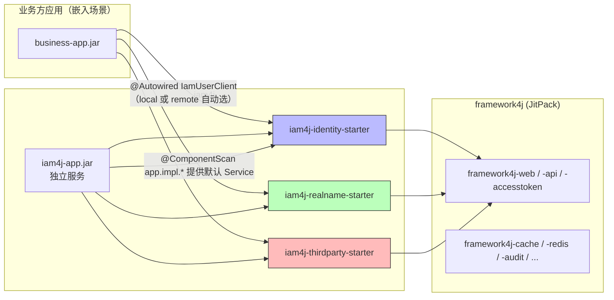
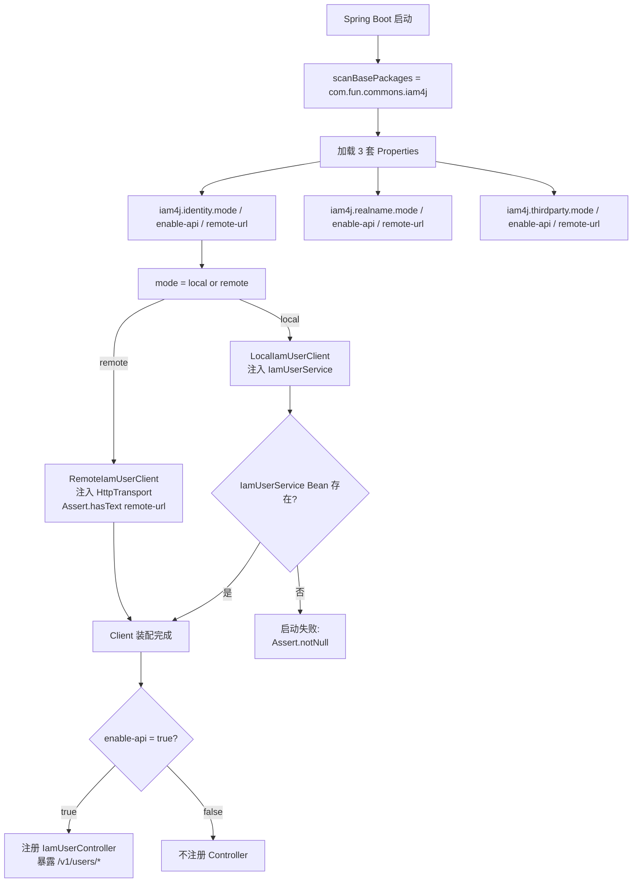

# iam4j 双模式技术方案（user-starter 模式）

> **项目**：iam4j — Identity & Access Management Suite
> **版本**：v1.0.0 · 2026-07-09
> **设计基线**：参考 [user-spring-boot-starter](./双模式技术方案.md) 通用模式，按本项目的 3 业务域（identity / realname / thirdparty）做镜像适配
>
> **配套文档**：
> - [iam4j项目技术方案-技术栈.md](./iam4j项目技术方案-技术栈.md) — 技术栈与 framework4j 替换
> - [iam4j-identity-业务设计.md](./iam4j-identity-业务设计.md) — IAM 业务边界
> - [iam4j-identity接口设计.md](./iam4j-identity接口设计.md) — 71 API 契约
> - [iam4j-identity数据库设计.md](./iam4j-identity数据库设计.md) — 24 张表
> - [iam4j-identity.sql](./iam4j-identity.sql) — DDL

---

## 修订历史

| 版本 | 日期 | 修改人 | 变更说明 |
|---|---|---|---|
| v2.0.0 | 2026-07-09 | 架构组 | **重大重写**：从「3 pattern + 22 模块」收敛到「user-starter 模式 + 7 模块」。采用 3 域 starter 模式 |
| v1.0.0 | 2026-07-09 | 架构组 | 初始版本（已被 v2.0.0 取代） |

---

## 一、方案目标

`iam4j` 同一份代码 / 同一套 jar 包，通过 **application.yml 两个开关** 适配两类典型场景：

| 场景 | iam4j.{domain}.mode | iam4j.{domain}.enable-api | 行为 |
|---|---|---|---|
| **业务方同进程嵌入** | `local`（默认） | `false` | 业务方 `@Autowired IamUserClient`，自动走本地 Java 方法调用，零 HTTP |
| **业务方跨进程调用** | `remote` | （无所谓） | 业务方同 client 接口，框架自动改用 HttpTransport 远程调用 iam4j 服务 |
| **独立部署（自己起 HTTP）** | `local` | `true` | 本项目 Controller 自动注册 `/v1/users/*` 路由，对外暴露 OpenAPI（异构客户端 Python/Go 可调） |

**核心承诺**：业务方只 inject **`IamUserClient` / `IamRealNameClient` / `IamPlatformClient`** 三种客户端接口，**不关心** local 还是 remote —— 由 yml 的 `mode` 决定。

---

## 二、设计原则

### 2.1 开闭原则 (OCP)
对扩展开放，对修改关闭。新增传输协议（gRPC / Dubbo）或本地存储介质（Redis / MongoDB）时，**无需修改**核心调用逻辑；只需替换 `HttpTransport` Bean 或实现新的 `IamUserService`。

### 2.2 依赖倒置原则 (DIP)
客户端核心业务逻辑依赖于抽象接口 `IamUserClient`，不依赖具体实现（`LocalIamUserClient` 或 `RemoteIamUserClient`）。业务方代码只依赖 `IamUserClient`，由 starter 决定实现类。

### 2.3 单一职责原则 (SRP)
- **Controller**（`@RestController`）：HTTP 路由
- **Transport**（`HttpTransport`）：传输抽象
- **Client**（`IamUserClient`）：门面接口 + Local/Remote 实现
- **Service**（`IamUserService`）：本地业务接口（业务方实现）

### 2.4 防御式编程
- `@Validated` + `@Pattern` 启动期强校验 `mode` 合法性
- `Assert.hasText(...)` 启动期断言 `remote-url` 非空（remote 模式）
- `@ConditionalOnMissingBean(IamUserService.class)` 启动期校验 local 模式有 Service 实现

---

## 三、模块拓扑

### 3.1 7 模块结构

```
iam4j/                                                ← reactor 根（parent pom，无业务代码）
├── iam4j-common/{model, util, constant}              ← 公共层
├── iam4j-identity-spring-boot-starter               ← 身份域 starter
│   ├── config/IamIdentityProperties              ← 模式配置（@Validated）
│   ├── client/IamUserClient                      ← 业务方唯一依赖接口
│   ├── client/impl/LocalIamUserClient            ← mode=local
│   ├── client/impl/RemoteIamUserClient           ← mode=remote
│   ├── service/IamUserService                     ← 业务方在 mode=local 时实现
│   ├── controller/IamUserController              ← @ConditionalOnProperty enable-api=true
│   ├── transport/HttpTransport + 默认实现           ← 可替换 RestTemplate/WebClient
│   └── autoconfigure/IamIdentityAutoConfiguration
├── iam4j-realname-spring-boot-starter              ← 实名域 starter（结构镜像）
├── iam4j-thirdparty-spring-boot-starter            ← 三方平台域 starter（结构镜像）
└── iam4j-app                                      ← 独立服务入口（standalone 部署）+ 默认 Service 实现
```

**核心设计**：每域一个 starter ≈ 12 文件，**单一职责、完全对称**。业务方按需引 starter，独立的 3 域各自演进。

### 3.2 依赖图



---

## 四、运行流程

### 4.1 启动装配流程



### 4.2 业务调用路径对比

```mermaid
graph LR
    subgraph local[mode=local + enable-api=false]
        BA[business code] -->|"@Autowired"| IC[IamUserClient]
        IC --> LC[LocalIamUserClient]
        LC --> US[IamUserService 业务方/默认实现]
        US --> DB[(业务方 DB / 我们的 24 表)]
    end

    subgraph remote[mode=remote + enable-api=false]
        BA2[business code] -->|"@Autowired"| IC2[IamUserClient]
        IC2 --> RC[RemoteIamUserClient]
        RC -->|"POST /v1/users"| HTTP[HttpTransport]
        HTTP -->|"+S2S JWT + Idempotency-Key"| iamRem[远程 iam4j 服务]
    end

    subgraph localAPI[mode=local + enable-api=true (独立服务)]
        BC3[browser/Python/Go] -->|"HTTPS"| Tom[本服务 Tomcat]
        Tom -->|"/v1/users/*"| IUCO[IamUserController]
        IUCO -->|"@Autowired"| IC3[IamUserClient]
        IC3 --> LC3[LocalIamUserClient]
        LC3 --> US3[IamUserService 默认实现（在 iam4j-app）]
        US3 --> DB3[(24 张 iami_* 表)]
    end
```

---

## 五、配置文件

### 5.1 文件分工

| 文件 | 用途 |
|---|---|
| `application.yml` | 跨模式不变的基线（profile + 公共 framework4j 配置） |
| `application-embedded.yml` | embedded profile 补充（`spring.main.web-application-type=none` 等） |
| `application-service.yml` | service profile 补充（`server.port`、Kniife4j 文档端点） |
| `application-{env}.yml` | 环境覆盖（Dev / Staging / Prod） |

### 5.2 application.yml 公共基线（节选）

```yaml
spring:
  datasource:
    url: jdbc:postgresql://${DB_HOST:localhost}:${DB_PORT:5432}/${DB_NAME:iam4j}
  flyway:
    enabled: true
    locations: classpath:db/migration

# 三域 starter 的核心配置（user-starter 模式核心开关）
iam4j:
  identity:
    mode: ${IAM4J_IDENTITY_MODE:local}              # local | remote
    enable-api: ${IAM4J_IDENTITY_ENABLE_API:true}    # true = 注册 Controller
    remote-url: ${IAM4J_IDENTITY_REMOTE_URL:}       # remote 模式必填
  realname:    { mode: local, enable-api: false, remote-url: ... }
  thirdparty:  { mode: local, enable-api: false, remote-url: ... }

# framework4j 配置（每个 starter 已自带；app 端补全）
framework4j:
  redis:        { enabled: true, ... }
  sensitive:    { enabled: true, encryption-key: ... }
  access-token: { enabled: true, secret-key: ..., hash-salt: ... }
  cache:        { enabled: true }
  audit:        { enabled: true }
  rate-limit:   { enabled: true }
  idempotency:  { enabled: true, ttl-seconds: 172800 }
```

### 5.3 关键属性映射表

| 属性 | 取值 | 行为 |
|---|---|---|
| `iam4j.{domain}.mode` | `local`（默认） | 创建 LocalIamXxxClient，注入 IamXxxService Bean |
| `iam4j.{domain}.mode` | `remote` | 创建 RemoteIamXxxClient，注入 HttpTransport；**`Assert.hasText(remote-url)`** 启动失败 if missing |
| `iam4j.{domain}.enable-api` | `false`（默认） | 不注册 IamXxxController，零 HTTP 路由 |
| `iam4j.{domain}.enable-api` | `true` | 注册 Controller，暴露 `{domain}` 路径下的所有 @RequestMapping |
| `iam4j.{domain}.remote-url` | URL | remote 模式必填 |
| `iam4j.{domain}.connect-timeout-ms` | int | HttpTransport 连接超时（默认 3000） |
| `iam4j.{domain}.read-timeout-ms` | int | HttpTransport 读取超时（默认 5000） |

---

## 六、代码样例

### 6.1 业务方嵌入（最常见）

**业务方 pom.xml**：
```xml
<dependency>
    <groupId>com.fun.commons.iam4j</groupId>
    <artifactId>iam4j-identity-spring-boot-starter</artifactId>
    <version>1.0.0</version>
</dependency>
<dependency>
    <groupId>com.fun.commons.iam4j</groupId>
    <artifactId>iam4j-realname-spring-boot-starter</artifactId>
    <version>1.0.0</version>
</dependency>
<!-- 不需要 thirdparty -->
```

**业务方 application.yml**：
```yaml
# 业务方自己的数据源
spring:
  datasource:
    url: jdbc:postgresql://localhost:5432/order_db

# IAM 三域全开 local + enable-api=false（不暴露 HTTP）
iam4j:
  identity: { mode: local, enable-api: false }
  realname: { mode: local, enable-api: false }
  thirdparty: { mode: local, enable-api: false }
```

**业务方代码**：
```java
@Service
public class OrderService {

    @Autowired
    private IamUserClient userClient;        // 只 inject 接口，框架自动选 Local/Remote
    
    public Order createOrder(String uid, OrderDto req) {
        // 一行调用，0 网络；底层走 LocalIamUserClient → IamUserService
        UserDto user = userClient.getById(uid);
        if (user == null) throw new UserNotFoundException(uid);
        // ...
    }
}
```

**业务方提供 `IamUserService` 实现（注入 starter 包装）**：
```java
@Service
public class MyIamUserServiceImpl implements IamUserService {
    @Autowired private UserJpaRepository repo;   // 业务方自有 JPA / 业务逻辑

    @Override
    public UserDto create(CreateUserRequest req) {
        return mapToDto(repo.save(toEntity(req)));
    }

    @Override
    public UserDto getById(String id) {
        return mapToDto(repo.findById(id).orElseThrow(...));
    }
}
```

**性能**：本地 Java 调用，0 网络跳数，单次 RT < 1ms。

### 6.2 业务方跨进程（Pattern remote）

**业务方 yml**：
```yaml
iam4j:
  identity: { mode: remote, enable-api: false, remote-url: http://iam4j-identity.svc.cluster.local:8080 }
  # 不引入其他两个 starter
```

**业务方代码不变** —— `userClient.getById(uid)` 内部自动走 `RemoteIamUserClient` → `HttpTransport.post(...)`。

**性能**：1 次跨进程 HTTP（~5-20ms），自动注入 framework4j-access-token JWT + Idempotency-Key。

### 6.3 独立服务（本项目自跑）

```bash
# 构建
mvn -pl iam4j-app -am package -DskipTests

# 启动
export IAM4J_IDENTITY_MODE=local
export IAM4J_IDENTITY_ENABLE_API=true
export DB_HOST=pg-cluster.internal
java -jar iam4j-app-1.0.0.jar
```

**默认行为**：
- `mode=local` + `enable-api=true` 触发 Controller 注册 → `/v1/users` POST/GET 路由可用
- `IamUserClient` 是 `LocalIamUserClient` → 调 `IamUserService` Bean → 调默认 `DefaultIamUserServiceImpl`
- 默认 Impl 在 `iam4j-app/src/.../app/impl/` 是占位 stub，下迭代替换为 MyBatis-Plus + iami_user 等表的真实实现

**启动期强校验**：
- `mode=remote` 但 `remote-url` 为空 → `Assert.hasText(...)` 立即失败
- `mode=local` 但 `IamUserService` Bean 不存在 → `Assert.notNull(...)` 立即失败
- `mode` 不是 `local|remote` → JSR-303 `@Pattern` 立即失败

### 6.4 异构客户端（Python/Go）

不需要任何代码层面的 client SDK。直接 HTTP 调我们暴露的 OpenAPI 路由：

```bash
curl -X POST http://iam4j-identity:8080/v1/users \
  -H "Authorization: Bearer <S2S JWT>" \
  -H "Idempotency-Key: $(uuidgen)" \
  -H "X-Service-Name: python-orders" \
  -H "Content-Type: application/json" \
  -d '{"nickname":"张三","phone":"13812345678"}'
```

**响应信封**：
```json
{
  "code": 0,
  "message": "success",
  "data": { "userId": "892310293123123", "status": "ACTIVE", ... },
  "error": null,
  "trace_id": "c0a8010116983728001",
  "timestamp": 1718660400000
}
```

---

## 七、自动装配条件矩阵

| Bean | @ConditionalOnProperty | 加载条件 |
|---|---|---|
| `IamIdentityProperties` | (always) | BindConfig |
| `IamUserService` | （业务方/默认 impl 提供） | mode=local 时必须有 |
| `LocalIamUserClient` | `iam4j.identity.mode=local` (default missing) | mode=local + UserService 存在 |
| `RemoteIamUserClient` | `iam4j.identity.mode=remote` | mode=remote + remote-url 强校验 |
| `HttpTransport` | (always) | RestTemplate 缺省，业务方可替换 |
| `IamUserController` | `iam4j.identity.enable-api=true` | 仅当 enable-api=true 时注册 |
| 同理 realname / thirdparty starter | 同上 | 同上 |

---

## 八、性能与权衡

| 维度 | local | remote（HTTP） | service（独立） |
|---|---|---|---|
| 网络跳数 | 0 | 1 | 视客户端位置 |
| 单次 RT | < 1 ms | 5-20 ms | 5-20 ms |
| 启动耗时 | 同 host | 同 host | +2-4 s（独立 Tomcat） |
| 内存占用 | 同 host | 同 host | +80-100 MB |
| 端口占用 | 0 | 0 | 8080 |
| jar 体积 | 业务方仅引所需 starter | 同 | 同 |

**取舍矩阵**：
- 最低延迟 / 最高吞吐 → **embedded local**（业务方同进程）
- 业务方单体服务集成 / 不想写 SDK → **service 独立**（Python/Go 都可用）
- 业务方微服务 + IAM 跨网络隔离 → **remote**
- 升级 IAM 不影响业务方 → **service 独立**

---

## 九、踩坑清单

### 9.1 ❌ 反模式

| # | 反模式 | 为何错 |
|---|---|---|
| 1 | 在 `application-local.yml` 设 `web-application-type=none` | 业务方 host 自身需要 web 决定 |
| 2 | 业务方在 `@Autowired IamUserClient` 上同时猜 Local/Remote | 抽象已做，无须猜 |
| 3 | 业务方绕过 IamUserClient 直接注入 IamUserService | 破坏 DIP，业务方失去 mode 切换能力 |
| 4 | mode=remote 但 `remote-url` 留空 | 启动期会 `Assert.hasText` 报错；不要依赖运行时延迟报错 |
| 5 | 给 starter 加 `@SpringBootApplication` | starter 是 library 不是 runnable |
| 6 | 业务方自定义 Transport Bean 不设置 `connect-timeout-ms` | 默认 3s/5s 仍生效；但业务方应明确 |

### 9.2 ✅ 应该做的事

| # | 规则 |
|---|---|
| 1 | 三域分别 startup 各自的 starter，避免一次性引入整个 IAM |
| 2 | 在 application.yml 用 `${IAM4J_*_REMOTE_URL}` 占位符，让环境变量注入 |
| 3 | mode=remote 时先在 staging 验证 Network Access：DNS / Service Mesh / Firewall |
| 4 | 异构客户端（Python/Go）走 service 模式 + OpenAPI，不引我们的 starter |
| 5 | 业务方提供 `IamUserService` 时优先 `@Transactional`，不要在 starter 里管理事务 |

---

## 十、版本演进

| 版本 | 计划 |
|---|---|
| **v1.0**（当前） | 7 模块骨架 + 3 starter + 默认 Service 占位 |
| **v1.1** | 替换占位 Service 为 MyBatis-Plus + iami_* 24 表真实实现；填充 71 API Client 方法 |
| **v1.2** | framework4j-accesstoken 强制启用（接认证服务 S2S） |
| **v2.0** | framework4j-accesstoken / rate-limit / audit / sql-tracing 全部 path-patterns 接管 |
| **v2.1** | HttpTransport 替换为 WebClient + 响应式 |

---

**文档结束。**

> **配套阅读**：[iam4j项目技术方案-技术栈.md](./iam4j项目技术方案-技术栈.md) §2.11 framework4j 替换映射 — 本文档中所有 framework4j 模块的来源与坐标。
