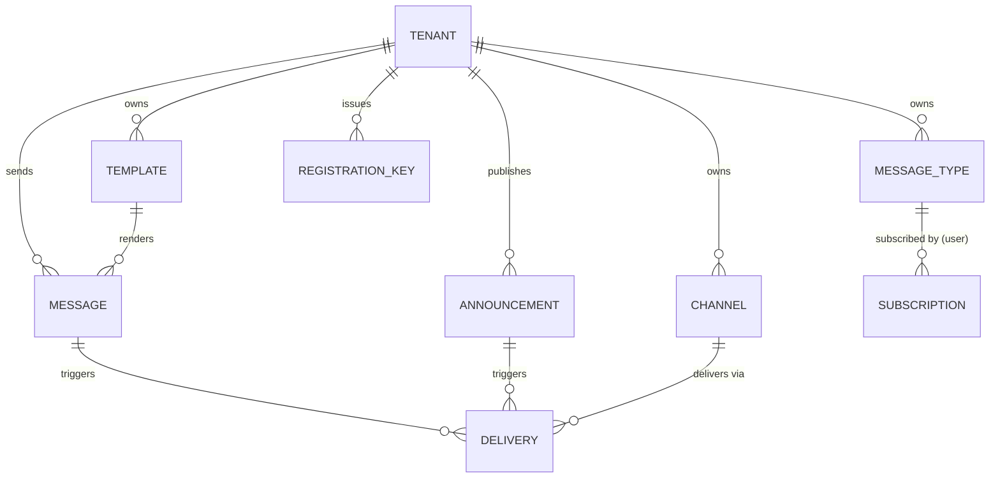

# notification4j 接口设计文档（API Design Doc）

> **文档状态**：草稿（待评审）
> **编写依据**：mc-doc-api《接口设计文档编写规范 v1.0》+ mc-api-spec v1.7（信封/错误码/分页工程规则）
> **配套文档**：《产品设计文档（PRD）》《数据库设计文档（DBD）》《中间件中台租户设计》
> **契约维护**：本文档定稿后录入 Apifox（项目结构按 §4 模块划分），开发以在线契约为准

---

## 1. 基础信息

### 1.1 项目信息表

| 项 | 值 |
|---|---|
| 项目名称 | notification4j 消息通知微中台 |
| 项目代号 | NFY-V1.0 |
| 文档状态 | 草稿 |
| 创建日期 | 2026-09-16 |
| 架构师 | justin |
| 后端 Lead | justin |
| 前端 Lead | justin |
| API Owner | justin |
| 契约维护人 | justin（Apifox，待录入） |

### 1.2 修订历史

| 版本号 | 修订日期 | 修订类型 | 修订内容摘要 | 修订人 | 审核 / 批准人 |
|---|---|---|---|---|---|
| V1.2.2 | 2026-09-18 | 变更 | 验收回归修复轮（P0×3+P1+P2×3，台账见 docs/test/report/2026-09-18-01/统一测试报告.md §八）。**签名面出厂语义变更（D-1）**：app 出厂 `framework4j.signature.path-patterns=[]`——SPA 与 S2S 共用 `/nfy/api/v1/runtime/**` 路径，强制签名使嵌入面（浏览器端无租户 secret 可签）全拒 10101；出厂摘除强制面，`enabled:true` 与密钥解析基础设施保留，S2S 需要防重放时自行加回 pattern（示例见 app yml 注释）。**签名密钥解析修复（D-2）**：`NfyAutoConfiguration` 补 `@AutoConfigureBefore(SignatureAutoConfiguration)` 并移除 `nfyTenantSecretProvider` 的 `@ConditionalOnMissingBean`——修前 fwk4j InMemory 兜底抢先注册、本项目 Bean 让位，正确签名的调用也全拒 10200；修后真实租户签名调用端到端打通，新增 NfySignatureFaceTest 防回归（enabled+patterns 下未签名 10101 / 真实租户签名 code=0 双钉）。**渠道使能修复（ND-L5-01）**：EMAIL patch 豁免 lastVerifyAt 前置+熔断态显式重启用清零（IM 分支不变），引擎投递成功置 last_verify_at——EMAIL verify 10604 与 patch 10610 的死锁解除，纯 API 外发闭环恢复。出厂 druid `filters: stat,slf4j`（D-3，wall 不兼容 PG SKIP LOCKED 拦死引擎）与 redisson-spring-boot-starter 排除（D-4） | justin | 验收回归修复轮 |
| V1.2.1 | 2026-09-17 | 变更 | V1.2 第二特性：订阅免打扰时段 quiet_hours（编码第 20 步，§5.8 详述）。SUB-002 items[] 每行可选 `quiet_hours{start,end}`（HH:mm、start≠end、成对出现才算启用，违者 10100；缺省/`{}`=未启用，全量替换语义下缺省即重置未启用，DB 列已存在零迁移）；SUB-001 items[] 启用行原样回显（未启用行不返回该字段，缺省口径向后兼容）。语义=Courier quiet hours 口径「**推迟发送非丢弃**」：订阅矩阵展开时静默窗内外发投递 `next_retry_at` 置窗结束时刻（跨午夜两段判定：窗前段→当日 end、窗后段→次日 end），窗结束由引擎按 `next_retry_at<=now` 自动发出；URGENT（全量渠道路径不经订阅矩阵）与 INAPP（落库即达不走投递）天然豁免并有 IT 验证；模板参数名文档化 \w 限制 | justin | V1.2 编码第 20 步 |
| V1.2.0 | 2026-09-17 | 变更 | V1.2 第一特性：消息撤回 API-MSG-009 由演进预留转正式契约（§5.5.2 详述+§4.2 清单 #51；§7 演进预留同步移除）。语义：属主校验 10400 防探测（跨租户/不存在/非数字 id 同码同文案）/SENT→CANCELLED 状态机（已撤幂等成功）/级联拦截 PENDING 投递（CAS 前置防引擎竞态，已 SENDING/SUCCESS 不追回）/用户侧列表·详情·未读数不可见/biz_no 幂等记录不动且 send-results 保持返回 | justin | V1.2 编码第 19 步 |
| V1.0.14 | 2026-09-17 | 变更 | 编码第 16 步（收官）：TPL-001/002/003 模板域实现并有 IT 覆盖（租户内 code 唯一 10401 删后可重建/{{param}} 渲染+缺参 10603 携参数名/channel_content 分渠道覆盖渲染）→ **附录 A 矩阵：✅50/50 全契约实现** | justin | 编码第 16 步 |
| V1.0.13 | 2026-09-17 | 变更 | 编码第 15 步（V1.1 提前落地）：MSG-002 批量发送（立即返回 job_id/poll_url，后台每批 1000 人逐批事务，Redis 状态机 TTL 48h）+ JOB-001 Job 轮询（RUNNING/DONE/PARTIAL/FAILED+failed_items≤100）并有 IT 覆盖 → 附录 A 矩阵：✅41/50、🔜3 项（TPL×3） | justin | 编码第 15 步 |
| V1.0.12 | 2026-09-17 | 变更 | 编码第 14 步：查询补全 6 项实现并有 IT 覆盖（MSG-003 send-results 含投递列表/MSG-005 详情返回即置已读/MSG-008 最近 N 条铃铛下拉/DICT-001 字典下发/STAT-001 租户概览/PST-001 平台跨租户概览含 dead_tenants top20）→ **附录 A 矩阵：✅45/50（V1.0 范围全部完成）+ 🔜5 项 V1.1 契约预留** | justin | 编码第 14 步 |
| V1.0.11 | 2026-09-17 | 变更 | 编码第 13 步：注册码闭环实现并有 IT 覆盖（PRK-001 签发一次性显示+列表脱敏+preset 预绑；OPEN-001 开放域无鉴权注册+DB 单语句原子扣减 10608 同码防探测+consumed_tenant_id 回填；新租户端到端换 token/发消息验证）→ 附录 A 矩阵：✅39/50、⬜6 项。实现要点：开放域需加入 access-token exclude-path-patterns；自助租户 email 必须为 null（空串计入 IS NOT NULL 唯一谓词） | justin | 编码第 13 步 |
| V1.0.10 | 2026-09-17 | 变更 | 编码第 12 步：PTE-001~004 租户生命周期实现并有 IT 覆盖（创建明文密钥一次+email 唯一 10401/详情 email 脱敏+三组配置/PATCH privileges/config/oem 参数化 jsonb 写/reset-secret 旧密钥宽限 24h 内双有效实测/状态机 ACTIVE⇄SUSPENDED→CLOSED 终态+SUSPEND 后换 token 401）→ 附录 A 矩阵：✅37/50、⬜8 项 | justin | 编码第 12 步 |
| V1.0.9 | 2026-09-17 | 变更 | 编码第 11 步：SEC-001 签名密钥实现并有 IT 覆盖（GET 脱敏状态/POST 轮换进 prev 宽限、新密钥即时换 token 认证链路验证）→ 附录 A 矩阵更新：✅33/50、⬜12 项。实现要点：加密列轮换必须走实体 typeHandler（wrapper 直写绕过加密存明文）；Map+jsonb 字段借 MP NOT_NULL 策略从 update SET 剔除 | justin | 编码第 11 步 |
| V1.0.8 | 2026-09-17 | 变更 | 编码第 10 步：ACH-001~003 公共渠道管理面实现并有 IT 覆盖（注册 SSRF 同构/验证业务码/删除逻辑删；与用户渠道 scope 隔离；公告引用经外发展开过滤兜底）→ 附录 A 矩阵更新：✅32/50、⬜13 项 | justin | 编码第 10 步 |
| V1.0.7 | 2026-09-17 | 变更 | 编码收官盘点：新增附录 A 实现状态矩阵（✅29/50、🔜V1.1 5 项、⬜待实现 16 项及排期建议）；新增 8a 平台域（PTE-005/PAN-001~004）、8b NotifyClient 双模式门面（nfy.runtime.client-enabled）；平台端点鉴权口径钉死=@PlatformDomain+@RequiresToken(TENANT)（合成 token tenant_id=0） | justin | 编码第 9 步收尾 |
| V1.0.6 | 2026-09-17 | 变更 | 编码第 3~6 步已知边界登记（评审 P2：防契约漂移）：① MSG-001 `delivery_planned` 已接线投递计划（真实行数，引擎第 6b 步消费）；② MSG-007 `unconfirmed_count` 已并入公告确认数，§5.3 Redis 缓存/水位线延后（查询带 LIMIT 100 兜底）；③ MSG-004 `keyword` 筛选未实现（前端本地过滤）；④ MSG-003 send-results 未实现，10401 文案为「业务号重复，幂等拒绝」；⑤ CHN/SUB 幂等键以 UNIQUE 约束为真闸，Idempotency-Key 拦截已配 path-patterns；⑥ CHN-003 EMAIL 验证暂返 10604（SMTP 适配器第 6 步）；⑦ CHN-005 订阅剔除为同步实现；⑧ 校验口径：@Valid→HTTP 200+10100（fwk4j PARAM_ERROR）；⑨ AAN-003 10611 口径改为「未失效已发布 ≤20」（未来生效占名额），并发双发布软限竞态登记；AAN-001 channel_ids ≤20 且不校验存在性（外发时过滤）；外发任务=PENDING 投递行，实际发送引擎第 6b 步；⑩ need_confirm=0 公告 confirm 不拦截（幂等建回执）；⑪ 平台公告面 PAN-001~004 未实现（runtime 的 tenant_id=0 分支已生效）；⑫ updated_at 由 V1.0.1 迁移触发器自动维护 | justin | 编码第 3~6 步评审 |
| V1.0.5 | 2026-09-17 | 变更 | 编码第 2 步对齐（IT 实测）：auth 错误码改 401/429（停用同码防探测，删 10203/10204 登记）；DomainGuard=HTTP 403+信封 code=403；expires_in 字符串化；换 token 无独立限流声明；失败尝试审计列为已知缺口 | justin | 编码第 2 步评审 |
| V1.0.3 | 2026-09-16 | 变更 | 第 4 轮终审联动修订：10401 括注补「不同 Key」分支；CHN-003 补免 Header 标注；未读数性能预算补口径引用；PTE-004 动作枚举统一 | justin | 评审会（第 4 轮终审） |
| V1.0.2 | 2026-09-16 | 变更 | 第 3 轮修复：补 AAN-002/PTE-002/PST-001 详述（PTE-002 含 privileges/config/oem 安全 schema）；Idempotency-Key 豁免清单；SUB-002 强制集改类型语义（类型→≥1 实例，无该类型豁免）；URGENT=全部 ENABLED 注册渠道；平台公告 channel_ids 置空；PRK 信任分级说明；keyword 改包含匹配 | justin | 评审会（第 3 轮） |
| V1.0.1 | 2026-09-16 | 变更 | 评审第 1 轮修复：102xx 复位对齐全局规范 v1.6（凭据 10203/停用 10204/型别 10207 登记）；HMAC 改按租户开关（ADR-0008）；平台域路径/响应一律 open_id；补 JOB-001/DICT-001/SEC-001/PTE-005/PAN-002/PAN-003/PAN-004；10602/10607 归位 101xx；接口计数 50（复审第 2 轮补平台公告 publish 端点） | justin | 评审会（第 1、2 轮） |
| V1.0.0 | 2026-09-16 | 新建 | 初始化：三域接口、错误码 106xx 登记 | justin | 待评审 |

---

## 2. 总体说明

### 2.1 协议与域名

| 项 | 值 |
|---|---|
| 协议 | HTTPS（生产强制）/ HTTP（内网） |
| 域名 | `https://nfy.{env}.example.com`（占位，按部署定） |
| 编码 | UTF-8 / `application/json; charset=utf-8` |
| 路径前缀 | 三域隔离（见 §2.2），全部含 `/v1/` 版本段 |
| 调用方式 | ① OpenAPI 直连 ② Java Starter `NotifyClient`（local/remote 双模式，见《双模式技术方案》）③ 异构语言 curl/HTTP |

### 2.2 接口三域（《中间件中台租户设计》§4）

| 域 | 前缀 | 鉴权 | 用途 |
|---|---|---|---|
| 平台域 | `/nfy/platform/api/v1/*` | 平台密钥换 **PLATFORM** 型 token | 租户 CRUD、密钥重置、注册码签发、平台公告、跨租户统计 |
| 租户域-管理面 | `/nfy/api/v1/admin/*` | **TENANT** 型 JWT | 类型/公告/公共渠道/模板管理、投递与统计查询 |
| 租户域-运行面 | `/nfy/api/v1/runtime/*` | **TENANT** 型 JWT（发送面可叠加 HMAC 签名） | 发消息、用户消息中心、用户渠道、订阅偏好 |
| 开放域 | `/nfy/open/api/v1/*` | 无（IP 限流 + 审计） | 凭注册码自助注册（唯一写操作） |

**铁律**：token 型别硬隔离——PLATFORM token 打租户域 / TENANT token 打平台域 → `10207 令牌类型不匹配`；runtime 面用户数据必须带 `X-User-Id`（§2.4）。

**HTTP 语义闭环**：102xx/103xx 认证授权失败一律 **HTTP 200 + 信封 code**（token 缺失/过期/无效由 fwk4j 拦截器在应用层发信封）；**例外**：DomainGuard 型别隔离（`@TenantDomain`/`@PlatformDomain`，ADR-0007）返回 **HTTP 403 + 框架信封 code=403**（编码第 2 步 IT 实测钉死）；其余 401/403 留给网关/路由层，见 §6.1。

### 2.3 换取 AccessToken（client_credentials）

```http
POST /nfy/api/v1/auth/token
Content-Type: application/x-www-form-urlencoded

grant_type=client_credentials&client_id={租户OpenID}&client_secret={租户密钥明文}
```

```json
{ "code": 0, "message": "操作成功",
  "data": { "access_token": "eyJhbGciOi...", "token_type": "Bearer", "expires_in": "28800" },
  "error": null, "trace_id": "c0a8010116983728001", "timestamp": 1787700000000 }
```

> `expires_in` 为**字符串秒数**（fwk4j-web 信封数值字符串化策略，编码第 2 步 IT 实测）；续期=到期前 5min 用密钥重新换。

- JWT claims：`sub/type(TENANT|PLATFORM)/iss/tenant_id/iat/exp/jti`；**user_id 不进 JWT**；`client_id` 传租户 **OpenID**（内部雪花 id 不出网）；
- 默认 8h，上限 12h；M2M 无 refresh_token（密钥即长期凭据，到期重新换）；
- 错误码（**编码第 2 步实测对齐 framework4j-tenant**）：`401` 凭据错误（client_id/secret 无效**或租户非 ACTIVE**——停用与凭据错同码同文案，防探测）；`429` 认证失败次数过多已锁定（5 次锁 15min，成功清零，维度=client_id）。无 Retry-After 头；失败尝试审计为已知缺口（随 admin 域落 @Auditable 补）。

### 2.4 通用 Header

| Header | 方向 | 必填 | 说明 |
|---|---|---|---|
| Authorization | 请求 | 是（除 auth/token 与 open 域） | `Bearer <access_token>` |
| X-User-Id | 请求 | runtime 用户面必填 | 终端用户标识，字符串 ≤64，**透传不鉴权**（《租户设计》§5.4） |
| Idempotency-Key | 请求 | 创建类写操作必填 | UUID v4，服务端保留 48h；同 key 同 body 返回首次结果，同 key 不同 body → `10501`。**豁免清单**：纯状态标记类写操作天然幂等、免 Header——MSG-006 read、ANN-002 read、ANN-003 confirm、CHN-004 启停（各详述已标注）；CHN-003 verify（重发验证消息无副作用差异） |
| X-Trace-Id | 请求+响应 | 否（响应必返） | 不传则服务端生成；body `trace_id` 双通道 |
| X-Access-Key / X-Timestamp / X-Nonce / X-Signature | 请求 | 签名开启的租户必填 | HMAC-SHA256 签名防重放（fwk4j-signature）。**按租户开关**（`privileges.signature`，ADR-0008）：未开启=不校验；开启后密钥未注册=全拒（安全默认）、已注册=强制校验；四态错误码 `10302`+error 子类型（SIGNATURE_MISSING/EXPIRED/REPLAYED/INVALID）；密钥注册/轮换走 API-SEC-001。**出厂默认口径（V1.2.2/D-1）**：app 出厂 `framework4j.signature.path-patterns=[]`（SPA 与 S2S 共用 `/nfy/api/v1/runtime/**` 路径，嵌入面无租户 secret 可签）——即出厂**不强制**任何路径签名；`enabled:true` 与密钥解析基础设施保留（NfyTenantSecretProvider + NfySignatureFaceTest 防回归），S2S 需要防重放时自行加回 pattern（示例见 app yml 注释） |
| Retry-After | 响应 | 限流时必返 | 重试等待秒数 |

### 2.5 响应信封（6 字段，业务异常统一 HTTP 200）

成功：
```json
{ "code": 0, "message": "success", "data": { "id": "892310293123123" },
  "error": null, "trace_id": "c0a8010116983728001", "timestamp": 1787700000000 }
```
失败：
```json
{ "code": 10102, "message": "请求参数错误", "data": null,
  "error": [ { "field": "target", "code": "FORMAT_INVALID", "message": "Webhook 地址非法", "value": "http://x" } ],
  "trace_id": "c0a8010116983728001", "timestamp": 1787700000000 }
```

**全局约定**：ID/雪花一律 String；金额不出现（本域无金额）；字段 snake_case；URL 资源段 kebab-case 复数；失败时 `data=null`（唯一例外 10700 部分成功）。

### 2.6 限流（fwk4j-rate-limit，Lua 滑窗）

| 维度 | 默认阈值（可配） | 响应 |
|---|---|---|
| 租户级 · runtime 发送 | 100 QPS / 租户 | `10500` + `Retry-After` |
| 租户级 · 其余 runtime/admin | 300 QPS / 租户 | 同上 |
| 用户级 · 消息中心读接口 | 60 QPS / (租户+用户) | 同上 |
| IP 级 · 开放域注册 | 10 次/小时 / IP | 同上 |
| 换 token | 无独立限流（**评审修订**：框架白名单豁免；仅防爆破锁 5 次锁 15min 兜底，成功调用量无上限——后续需要时自建 per-client_id 计数） | `429` 信封（锁定） |

> **出厂配置口径（以 app yml 为准）**：`default-limit: 100` + `default-window: 1m`（即 **100 次/分钟**，Lua 滑窗）+ `default-scope: APP`（按 tenant_id），path-patterns 覆盖 `/nfy/api/v1/runtime/**`、assets 与 `/nfy/open/**`；`/nfy/api/v1/auth/token` 白名单豁免。上表 300/60/10 等分档为设计目标阈值，出厂未单列（admin 面不在 path-patterns 内），按需配置。

### 2.7 分页选型

| 场景 | 模式 | 请求参数 | 响应字段 |
|---|---|---|---|
| 用户侧 Feed（我的消息/公告/最近消息） | **Cursor** | `cursor` + `limit`（≤50，默认 20） | `list/next_cursor/has_more/summary`（无 total；cursor 为 Keyset `created_at,id` 的 base64 编码） |
| 管理面列表（消息/公告/投递/渠道/类型/模板） | **Offset** | `page` + `page_size`（≤100，默认 20） | `list/total/page/page_size/has_more/summary` |

> `limit` 与 `page_size` 禁止混用；投递记录等深翻页场景禁 OFFSET>10000（前端限制页深）。

---

## 3. 资源建模



| 资源 | 标识 | 归属 | 关键动作 |
|---|---|---|---|
| Tenant 租户 | **open_id（对外唯一暴露）** / id（内部雪花，不出网） | 平台 | 创建/启停/重置密钥/发注册码 |
| Message 消息 | message_id / biz_no | 租户 | 发送/查询结果/用户阅读 |
| Announcement 公告 | announcement_id | 平台/租户 | 发布/下线/用户确认 |
| Channel 渠道 | channel_id | 租户/用户 | 注册/验证/启停/删除 |
| Subscription 订阅 | (user, type_code) | 用户 | 查询矩阵/全量保存 |
| MessageType 类型 | type_code | 租户 | CRUD/启停 |
| Template 模板 | template_id / template_code | 租户 | CRUD/预览（V1.1） |
| Delivery 投递 | delivery_id | 系统 | 查询/人工重投 |
| Job 异步任务 | job_id | 系统 | 批量发送轮询（V1.1） |

> 终端用户（user）**不是本中台资源**——`X-User-Id` 字符串透传，不建档、无 CRUD（《租户设计》§2）。

**URL 设计说明（评审留痕）**：
1. 发送结果查询用独立子资源 `/runtime/send-results/{biz_no}` 而非 `messages/{biz_no}`——后者与 `messages/{message_id}` 模式冲突（评审第 1 轮决策）；
2. `messages/unread-count`、`messages/recent`、`messages/read` 三个字面量子路径与 `{message_id}` 同命名空间，依赖框架字面量优先匹配；**保证条件：message_id 为雪花数字字符串**，永不取字面量值；
3. `GET messages/{message_id}` 详情**有副作用**（置已读）：非严格安全语义，响应必带 `Cache-Control: no-store` 防预取/缓存误置读；接受该取舍（阅读即详情的产品语义）。

---

## 4. 接口清单

> 各表「模块」列以节标题（runtime/admin/platform/open）表达；编号全局唯一，废弃标 deprecated 不删号。

### 4.1 认证与开放域

| # | 编号 | URL | Method | 用途 | 鉴权 | 关联 PRD |
|---|---|---|---|---|---|---|
| 1 | API-AUTH-001 | /nfy/api/v1/auth/token | POST | 换 AccessToken | 凭据本身 | F-OPS-001 |
| 2 | API-OPEN-001 | /nfy/open/api/v1/tenants/register | POST | 凭注册码自助注册租户 | 无（IP 限流） | F-OPS-001 |

### 4.2 租户域 · runtime（用户面 + 发送面）

| # | 编号 | URL | Method | 用途 | 鉴权 | 关联 PRD |
|---|---|---|---|---|---|---|
| 3 | API-MSG-001 | /nfy/api/v1/runtime/messages | POST | 发送定向消息 | T+S可选 | F-MSG-001 |
| 4 | API-MSG-002 | /nfy/api/v1/runtime/messages/batch | POST | 批量发送（V1.1，异步 Job） | T+S可选 | F-MSG-001 |
| 5 | API-MSG-003 | /nfy/api/v1/runtime/send-results/{biz_no} | GET | 按业务号查发送结果与投递 | T | F-MSG-001 |
| 6 | API-MSG-004 | /nfy/api/v1/runtime/messages | GET | 我的消息列表（Cursor） | T+U | F-MSG-003 |
| 7 | API-MSG-005 | /nfy/api/v1/runtime/messages/{message_id} | GET | 消息详情（返回即置已读） | T+U | F-MSG-003 |
| 8 | API-MSG-006 | /nfy/api/v1/runtime/messages/read | POST | 标记已读（ids / all） | T+U | F-MSG-003 |
| 9 | API-MSG-007 | /nfy/api/v1/runtime/messages/unread-count | GET | 未读数（含公告未确认） | T+U | F-MSG-002 |
| 10 | API-MSG-008 | /nfy/api/v1/runtime/messages/recent | GET | 最近 N 条（铃铛下拉） | T+U | F-MSG-002 |
| 11 | API-ANN-001 | /nfy/api/v1/runtime/announcements | GET | 生效公告列表（平台+本租户） | T+U | F-ANN-002 |
| 12 | API-ANN-002 | /nfy/api/v1/runtime/announcements/{announcement_id}/read | POST | 公告标记阅读 | T+U | F-ANN-002 |
| 13 | API-ANN-003 | /nfy/api/v1/runtime/announcements/{announcement_id}/confirm | POST | 公告确认（我知道了） | T+U | F-ANN-002 |
| 14 | API-CHN-001 | /nfy/api/v1/runtime/channels | GET | 我的渠道列表 | T+U | F-CHN-001 |
| 15 | API-CHN-002 | /nfy/api/v1/runtime/channels | POST | 注册渠道 | T+U | F-CHN-001 |
| 16 | API-CHN-003 | /nfy/api/v1/runtime/channels/{channel_id}/verify | POST | 发送验证消息 | T+U | F-CHN-001 |
| 17 | API-CHN-004 | /nfy/api/v1/runtime/channels/{channel_id} | PATCH | 改名/启停 | T+U | F-CHN-001 |
| 18 | API-CHN-005 | /nfy/api/v1/runtime/channels/{channel_id} | DELETE | 删除渠道（逻辑删） | T+U | F-CHN-001 |
| 19 | API-SUB-001 | /nfy/api/v1/runtime/subscriptions | GET | 我的订阅矩阵 | T+U | F-SUB-001 |
| 20 | API-SUB-002 | /nfy/api/v1/runtime/subscriptions | PUT | 全量保存订阅矩阵 | T+U | F-SUB-001 |
| 21 | API-JOB-001 | /nfy/api/v1/runtime/jobs/{job_id} | GET | 异步 Job 轮询（V1.1 随 MSG-002） | T | F-MSG-001 |
| 22 | API-DICT-001 | /nfy/api/v1/runtime/dictionaries | GET | 字典下发（等级/渠道类型/状态，前端禁硬编码） | T | PRD §4.3 |
| 51 | API-MSG-009 | /nfy/api/v1/runtime/messages/{message_id}/cancel | POST | 消息撤回（V1.2） | T | F-MSG-001 |

> 鉴权列：`T`=TENANT token；`U`=必带 X-User-Id；`S可选`=HMAC 签名按租户开关（privileges.signature，见 §2.4）。

### 4.3 租户域 · admin（管理面）

| # | 编号 | URL | Method | 用途 | 鉴权 | 关联 PRD |
|---|---|---|---|---|---|---|
| 23 | API-TYP-001 | /nfy/api/v1/admin/types | GET/POST | 类型列表/创建（mandatory 字段租户域不可设，见 PTE-005） | T | F-TYP-001 |
| 24 | API-TYP-002 | /nfy/api/v1/admin/types/{type_id} | PATCH | 修改/停用（停用走 PATCH status，无 DELETE 端点） | T | F-TYP-001 |
| 25 | API-AAN-001 | /nfy/api/v1/admin/announcements | GET/POST | 租户公告列表/创建 | T | F-ANN-001 |
| 26 | API-AAN-002 | /nfy/api/v1/admin/announcements/{announcement_id} | GET/PATCH | 详情/修改（草稿态） | T | F-ANN-001 |
| 27 | API-AAN-003 | /nfy/api/v1/admin/announcements/{announcement_id}/publish | POST | 发布 | T | F-ANN-001 |
| 28 | API-AAN-004 | /nfy/api/v1/admin/announcements/{announcement_id}/offline | POST | 下线（撤回） | T | F-ANN-001 |
| 29 | API-AAN-005 | /nfy/api/v1/admin/announcements/{announcement_id}/stats | GET | 已读/确认统计 | T | F-ANN-001 |
| 30 | API-ACH-001 | /nfy/api/v1/admin/channels | GET/POST | 公共渠道列表/注册 | T | F-CHN-002 |
| 31 | API-ACH-002 | /nfy/api/v1/admin/channels/{channel_id} | PATCH/DELETE | 修改/删除 | T | F-CHN-002 |
| 32 | API-ACH-003 | /nfy/api/v1/admin/channels/{channel_id}/verify | POST | 验证 | T | F-CHN-002 |
| 33 | API-TPL-001 | /nfy/api/v1/admin/templates | GET/POST | 模板列表/创建（V1.1） | T | F-TPL-001 |
| 34 | API-TPL-002 | /nfy/api/v1/admin/templates/{template_id} | GET/PATCH/DELETE | 详情/修改/停用（V1.1） | T | F-TPL-001 |
| 35 | API-TPL-003 | /nfy/api/v1/admin/templates/preview | POST | 模板渲染预览（V1.1） | T | F-TPL-001 |
| 36 | API-DLV-001 | /nfy/api/v1/admin/deliveries | GET | 投递记录查询（Offset） | T | F-DLV-001 |
| 37 | API-DLV-002 | /nfy/api/v1/admin/deliveries/{delivery_id}/retry | POST | 人工重投（DEAD） | T | F-DLV-001 |
| 38 | API-STAT-001 | /nfy/api/v1/admin/stats/overview | GET | 发送/投递/已读概览 | T | F-DLV-001 |
| 39 | API-SEC-001 | /nfy/api/v1/admin/signature-key | GET/POST | 签名密钥查询（脱敏）/注册/轮换 | T | PRD §4.1 |

### 4.4 平台域

| # | 编号 | URL | Method | 用途 | 鉴权 | 关联 PRD |
|---|---|---|---|---|---|---|
| 40 | API-PTE-001 | /nfy/platform/api/v1/tenants | GET/POST | 租户列表/创建（明文密钥仅此一次返回） | P | F-OPS-001 |
| 41 | API-PTE-002 | /nfy/platform/api/v1/tenants/{tenant_open_id} | GET/PATCH | 详情/配置（privileges/config/oem） | P | F-OPS-001 |
| 42 | API-PTE-003 | /nfy/platform/api/v1/tenants/{tenant_open_id}/reset-secret | POST | 重置密钥（撤销存量会话） | P | F-OPS-001 |
| 43 | API-PTE-004 | /nfy/platform/api/v1/tenants/{tenant_open_id}/status | POST | 停用/恢复/注销（SUSPEND/RESUME/CLOSE） | P | F-OPS-001 |
| 44 | API-PRK-001 | /nfy/platform/api/v1/registration-keys | GET/POST | 注册码列表/签发（次数/有效期/预绑配置档） | P | F-OPS-001 |
| 45 | API-PAN-001 | /nfy/platform/api/v1/announcements | GET/POST | 平台公告列表/创建 | P | F-ANN-001 |
| 46 | API-PAN-002 | /nfy/platform/api/v1/announcements/{announcement_id} | GET/PATCH | 详情/修改（草稿态） | P | F-ANN-001 |
| 47 | API-PAN-003 | /nfy/platform/api/v1/announcements/{announcement_id}/offline | POST | 平台公告下线 | P | F-ANN-001 |
| 48 | API-PAN-004 | /nfy/platform/api/v1/announcements/{announcement_id}/publish | POST | 平台公告发布（DRAFT→PUBLISHED） | P | F-ANN-001 |
| 49 | API-PTE-005 | /nfy/platform/api/v1/tenants/{tenant_open_id}/type-mandatory | POST | 设置类型强制订阅（mandatory 唯一入口） | P | F-TYP-001 |
| 50 | API-PST-001 | /nfy/platform/api/v1/stats/overview | GET | 跨租户概览 | P | F-OPS-001 |

> 共 51 项（auth 1 / open 1 / runtime 21 / admin 17 / platform 11）；其中 V1.1 标注 5 项（API-MSG-002、API-JOB-001、API-TPL-001/002/003）、V1.2 标注 1 项（API-MSG-009 消息撤回）。平台域路径参数一律 `tenant_open_id`（OpenID），内部雪花 id 不出网。

---

## 5. 单接口详述

> 核心接口全要素详述（URL/Method/参数/请求体/响应体/错误码/示例/性能预算）；管理面 CRUD 走 §5.9 简式详述。`P`=平台域、`T/U/S` 见 §4.2 注。

### 5.1 API-AUTH-001 换 AccessToken

见 §2.3。错误码（实测）：`401` 凭据错误（含停用，防探测同码）；`429` 连续失败锁定。性能预算：P99 ≤ 100ms。

### 5.2 API-MSG-001 发送定向消息

- **URL**：`POST /nfy/api/v1/runtime/messages`
- **鉴权**：TENANT token（可叠加 HMAC 签名）
- **幂等**：`Idempotency-Key`（48h）+ 服务端 `UNIQUE(tenant_id, biz_no)` 真闸

#### 请求 Body

| 字段 | 类型 | 必填 | 校验 | 说明 |
|---|---|---|---|---|
| biz_no | String | 否 | ≤64 | 业务号（幂等键）；缺省服务端生成并在响应返回 |
| type_code | String | 是 | 本租户已启用类型 | 消息类型 |
| level | String | 否 | 枚举，默认 NORMAL | NORMAL/IMPORTANT/URGENT |
| user_ids | String[] | 是 | 1~1000，单个 ≤64 | 接收人（X-User-Id 体系） |
| title | String | 条件必填 | 1~100 | 直发时必填 |
| content | String | 条件必填 | 1~2000，markdown 子集 | 直发时必填 |
| link_url | String | 否 | http(s) ≤500 | 跳转链接 |
| template_code | String | 条件必填 | 存在且 ENABLED | 模板发送（V1.1）时与 title/content 二选一 |
| params | Object | 否 | 匹配模板占位符 | 模板参数 |
| channels_override | String[] | 否 | 渠道类型枚举 | 发送级强制渠道（少用；缺省按订阅偏好） |

#### 请求示例

```json
{
  "biz_no": "order-pay-20260916-0001",
  "type_code": "ORDER",
  "level": "IMPORTANT",
  "user_ids": ["u_9f8e7d", "u_2a3b4c"],
  "title": "订单支付成功",
  "content": "您的订单 **OD123** 已支付成功，金额 256.80 元。",
  "link_url": "https://app.example.com/orders/OD123"
}
```

#### 响应 Body（成功）

| 字段 | 类型 | 说明 |
|---|---|---|
| data.message_id | String | 消息 id（雪花 String） |
| data.biz_no | String | 业务号（回显/生成的） |
| data.receiver_count | integer | 接收人数 |
| data.inapp_saved | boolean | 站内信已落库（true 即发送成功；外发异步） |
| data.delivery_planned | integer | 计划外发任务数（按订阅匹配） |

```json
{ "code": 0, "message": "success",
  "data": { "message_id": "892310293123129", "biz_no": "order-pay-20260916-0001",
            "receiver_count": 2, "inapp_saved": true, "delivery_planned": 3 },
  "error": null, "trace_id": "c0a8010116983728001", "timestamp": 1787700000000 }
```

#### 错误码（高频）

| code | 场景 | message |
|---|---|---|
| 10101 | user_ids 为空 | "接收人列表不能为空" |
| 10601 | type_code 不存在/停用 | "消息类型不存在或已停用" |
| 10102 | user_ids >1000（零 DB 判定的参数校验，归 101xx） | "接收人数量超限(单次≤1000)" |
| 10603 | 模板参数缺失（V1.1） | "模板参数缺失:{name}" |
| 10501 | 同 Idempotency-Key 不同 body | "请勿重复提交" |
| 10401 | biz_no 重复（无 Idempotency-Key 或 Key 不同时撞唯一闸；同号+同 Key 返回首次结果） | "业务号重复，首次发送结果请查询 send-results" |

#### 性能预算
P99 ≤ 500ms（站内落库+扇出即返回，外发异步）；客户端超时 30s。
**批量同步豁免论证**：发送为单聚合写（一条 message + 批量 INSERT recipient），外发已异步，≤1000 接收人可控；>1000 必须走 API-MSG-002 异步 Job（mc-api-spec N>100 规则）。

### 5.3 API-MSG-007 未读数

- **URL**：`GET /nfy/api/v1/runtime/messages/unread-count`
- **鉴权**：T + U

#### 查询参数
无（用户取自 `X-User-Id`）。

#### 响应 Body

| 字段 | 类型 | 说明 |
|---|---|---|
| data.unread_count | integer | 定向消息未读数 |
| data.unconfirmed_count | integer | 需确认且未确认的生效公告数 |
| data.total | integer | 角标值 = unread + unconfirmed |

```json
{ "code": 0, "message": "success",
  "data": { "unread_count": 12, "unconfirmed_count": 1, "total": 13 },
  "error": null, "trace_id": "c0a8010116983728001", "timestamp": 1787700000000 }
```

#### 性能预算
P99 ≤ 200ms（Redis 缓存：定向消息未读数写时失效+miss 回填；公告未确认数随缓存值携带的**公告水位线**比对，公告发布/下线/过期即重算，避免广播事件不可枚举用户的失效难题；实现口径见 SAD §5.6/ADR-0005）。

### 5.4 API-MSG-004 我的消息列表（Cursor）

- **URL**：`GET /nfy/api/v1/runtime/messages`
- **鉴权**：T + U

#### 查询参数

| 参数 | 类型 | 必填 | 说明 |
|---|---|---|---|
| type_code | String | 否 | 类型筛选 |
| level | String | 否 | 等级筛选 |
| read_status | String | 否 | UNREAD/READ |
| keyword | String | 否 | 标题关键词（≤50，**包含匹配**——在当前用户消息子集内过滤，行数千级可控） |
| cursor | String | 否 | 上一页 next_cursor；首页不传 |
| limit | integer | 否 | ≤50，默认 20 |

#### 响应 Body

| 字段 | 类型 | 说明 |
|---|---|---|
| data.list[].message_id | String | 消息 id |
| data.list[].type_code / level / title | - | 列表展示字段 |
| data.list[].read_status | String | UNREAD/READ |
| data.list[].created_at | integer | 毫秒时间戳 |
| data.next_cursor | String | 下一页游标（has_more=false 时为 null） |
| data.has_more | boolean | 是否还有 |

```json
{ "code": 0, "message": "success",
  "data": { "list": [
      { "message_id": "892310293123129", "type_code": "ORDER", "level": "IMPORTANT",
        "title": "订单支付成功", "read_status": "UNREAD", "created_at": 1787700000000 }
    ], "next_cursor": "eyJjIjoxNzg3NzAwMDAwMDAwLCJpIjo4OTIzfQ", "has_more": true },
  "error": null, "trace_id": "c0a8010116983728001", "timestamp": 1787700000000 }
```

#### 性能预算
P99 ≤ 500ms（idx_user_time Keyset）；空列表返回 `list: []` 不报错。

### 5.5 API-MSG-005 消息详情 / API-MSG-006 标记已读

**API-MSG-005** `GET /nfy/api/v1/runtime/messages/{message_id}`（T+U）：返回 title/content/link_url/level/type_code/read_status/created_at；**副作用=置已读**（幂等；响应带 `Cache-Control: no-store`，设计说明见 §3）。错误：`10400` 消息不存在或不属于该用户（不区分，防探测）。

**API-MSG-006** `POST /nfy/api/v1/runtime/messages/read`（T+U，幂等天然成立）：

| 字段 | 类型 | 必填 | 说明 |
|---|---|---|---|
| message_ids | String[] | 条件 | ≤100（同步阈值内）；与 all 二选一 |
| all | boolean | 条件 | true=全部已读（可选叠加 type_code 限定；分批更新） |

响应 `data.read_count`（实际置读条数）。性能预算 P99 ≤ 500ms（all 场景分批更新 + 未读缓存失效）。

### 5.5.1 API-MSG-003 按业务号查发送结果（全要素）

- **URL**：`GET /nfy/api/v1/runtime/send-results/{biz_no}`
- **鉴权**：T（发送方查询，不需 X-User-Id）

#### 响应 Body

| 字段 | 类型 | 说明 |
|---|---|---|
| data.message_id / biz_no / type_code / level / title | - | 消息主档 |
| data.receiver_count | integer | 接收人数 |
| data.delivery_summary[] | array | 按渠道聚合：`{channel_type, total, success, failed, dead}` |
| data.deliveries[] | array | 投递明细**截断前 100 条**（按 created_at 倒序）：`{delivery_id, userid, channel_type, status, retry_count, error_message, sent_at}`；更多走 admin 域 API-DLV-001 分页 |

错误码：`10400` biz_no 不存在。性能预算 P99 ≤ 300ms。

### 5.5.2 API-MSG-009 消息撤回（V1.2）

- **URL**：`POST /nfy/api/v1/runtime/messages/{message_id}/cancel`
- **鉴权**：T（发送方业务系统行为，不需 X-User-Id；幂等免 Idempotency-Key）

#### 路径参数

| 字段 | 类型 | 说明 |
|---|---|---|
| message_id | String | 消息 id（雪花数字串；响应侧 Long 一律字符串化，§2.5） |

#### 响应 Body（成功）

| 字段 | 类型 | 说明 |
|---|---|---|
| data.message_id | String | 被撤回消息 id |
| data.status | String | 恒 `CANCELLED` |
| data.cancelled_deliveries | integer | 本次被拦截的外发投递数（nfya_delivery PENDING→CANCELLED 行数；重复撤回=0） |

#### 语义说明

1. **属主校验（防探测）**：消息不存在、`message.tenant_id` ≠ 当前租户、message_id 非数字（解析失败）三种情形一律返回 `10400`「消息不存在或无权访问」——同码同文案，不暴露资源存在性（§6.3）。
2. **状态机**：`SENT → CANCELLED`，条件 UPDATE 带 `status='SENT'` 前置（并发撤回仅一方生效）；已 CANCELLED 再撤**幂等成功**（code=0，`cancelled_deliveries=0`）。nfya_message.status 建表即预留该枚举（数据库设计文档 §242），无迁移。
3. **级联外发拦截**：撤回成功时，该消息在 nfya_delivery 中 `status='PENDING'` 的投递单语句 CAS 置 `CANCELLED`（**必须带 `status='PENDING'` 前置条件**，防与外发引擎 claim（→SENDING）/结果回写（→SUCCESS）竞态）；已 SENDING/SUCCESS 的投递**不追回**（at-least-once 语义，已在线上的消息不撤回）。
4. **用户侧可见性**：撤回后 MSG-004 列表、MSG-008 最近 N 条不再返回该消息；MSG-005 详情返回 `10400`（同不存在口径）；MSG-007 未读数不再计入撤回消息（读侧查询统一过滤 `status != 'CANCELLED'`，过滤在后端）。
5. **biz_no 幂等协同**：撤回不触碰 (tenant_id, biz_no) 幂等记录——同 biz_no 重发仍 `10401`；MSG-003 send-results **保持返回**撤回消息（`status=CANCELLED`，CANCELLED 投递可见、SUCCESS 投递保持 SUCCESS），运营排查口径不变。

#### 错误码

| code | 场景 | message |
|---|---|---|
| 10400 | 消息不存在 / 跨租户 / message_id 非数字（三情形同码同文案） | "消息不存在或无权访问" |

#### 性能预算

P99 ≤ 300ms（两条条件 UPDATE：message 主键 + delivery 走 idx_nfya_delivery_source (tenant_id, source_type, source_id) 定位后按 status='PENDING' 前置过滤）。

### 5.6 API-ANN-001 生效公告列表 / API-ANN-003 公告确认

**API-ANN-001** `GET /nfy/api/v1/runtime/announcements`（T+U，Cursor 同 §5.4）：返回平台公告（tenant_id=0）+ 本租户生效公告合并，按 published_at 倒序；每项含 `need_confirm`、`my_status`（NONE/READ/CONFIRMED）。

**API-ANN-003** `POST /nfy/api/v1/runtime/announcements/{announcement_id}/confirm`（T+U，幂等 `UNIQUE(tenant_id, announcement_id, userid)` 兜底）：响应 `data.confirmed: true`；重复确认返回首次结果。错误：`10400` 公告不存在/未生效；`10402` 公告已失效。

### 5.7 API-CHN-002 注册渠道（核心交互）

- **URL**：`POST /nfy/api/v1/runtime/channels`
- **鉴权**：T + U；幂等：`Idempotency-Key` + `UNIQUE(tenant_id, userid, channel_type, target)`

#### 请求 Body

| 字段 | 类型 | 必填 | 校验 | 说明 |
|---|---|---|---|---|
| channel_type | String | 是 | 枚举 | DINGTALK/WECOM/FEISHU/EMAIL |
| name | String | 是 | 1~30 | 渠道名称（如「运维报警群」） |
| target | String | 条件必填 | 见下 | IM 类=webhook URL；EMAIL=邮箱地址 |
| secret | String | 否 | ≤128 | 加签密钥（钉钉/飞书建议） |
| keyword | String | 否 | ≤20 | 机器人自定义关键词 |

**target 校验（SSRF 防线）**：必须 https；IM 类域名白名单 `oapi.dingtalk.com` / `qyapi.weixin.qq.com` / `open.feishu.cn` / `*.feishu.cn`；DNS 解析禁内网段；EMAIL 走邮箱格式校验。

#### 请求示例

```json
{ "channel_type": "DINGTALK", "name": "SRE 报警群",
  "target": "https://oapi.dingtalk.com/robot/send?access_token=abcd1234",
  "secret": "SECxxxxxxxx", "keyword": "通知" }
```

#### 响应 Body（成功）

| 字段 | 类型 | 说明 |
|---|---|---|
| data.channel_id | String | 渠道 id |
| data.status | String | PENDING（待验证） |
| data.verify_tip | String | "请调用 verify 接口发送验证消息" |

#### 错误码（高频）

| code | 场景 | message |
|---|---|---|
| 10609 | 域名非白名单/内网地址 | "Webhook 地址非法或非官方域名" |
| 10401 | 同 target 重复注册 | "该渠道已存在" |
| 10605 | 同类型渠道 ≥5 个 | "同类型渠道数量超限(≤5)" |

#### 性能预算
P99 ≤ 300ms（仅落库，不发验证消息——验证是独立接口，避免同步外呼拖慢注册）。

**API-CHN-003 验证** `POST .../channels/{channel_id}/verify`（T+U，天然幂等免 Idempotency-Key）：同步调渠道适配器发验证消息；**成功判定 = HTTP 2xx 且渠道业务码成功**（钉钉/企微 `errcode=0`、飞书 `code=0`、SMTP 2xx——业务失败如关键词不匹配/加签错误/机器人被移出群时 HTTP 仍为 200，仅看状态码会把不可用渠道置 ENABLED）；成功→`data.status: ENABLED` 且 `last_verify_at` 更新；失败→`10604`「渠道验证失败:{渠道返回摘要}」。超时 5s，P99 ≤ 6s（含外呼）。

### 5.8 API-SUB-001 / API-SUB-002 订阅矩阵

**API-SUB-001** `GET /nfy/api/v1/runtime/subscriptions`（T+U）响应：

| 字段 | 说明 |
|---|---|
| data.types[] | 本租户已启用类型：`{type_code, name, description, mandatory, default_channels}` |
| data.available_channels[] | 用户已 ENABLED 渠道：`{channel_id, channel_type, name}` + 恒有 `{"channel_id":"INAPP"}` |
| data.items[] | 已配置订阅：`{type_code, channel_ids[, quiet_hours]}`（无记录的类型按 default_channels 展示，前端标注「默认」；启用的 `quiet_hours` 原样回显，未启用行**不返回该字段**——缺省=未启用，向后兼容旧客户端） |

**API-SUB-001** 补充说明：`data.types[].default_channels` 的元素是**渠道类型**枚举（INAPP/DINGTALK/...），而 `items[].channel_ids` 的元素是**渠道实例 ID**（"INAPP" 哨兵 + nfya_channel.id）——强制集校验按「类型→实例」匹配（见下）。

**API-SUB-002** `PUT /nfy/api/v1/runtime/subscriptions`（T+U，全量替换语义）：

```json
{ "items": [
    { "type_code": "ORDER", "channel_ids": ["INAPP", "8712634987123"], "quiet_hours": { "start": "22:00", "end": "08:00" } },
    { "type_code": "SECURITY", "channel_ids": ["INAPP"] } ] }
```

- 校验：每行 `channel_ids` ≥1（空渠道 → `10101`）；**强制集校验（类型语义）**：`mandatory=1` 的类型，其 `default_channels` 中每个渠道类型，用户须保留 ≥1 个该类型的 ENABLED 实例（关闭某类型的最后一个实例 → `10606`）；用户无该类型注册渠道时该项**豁免**（INAPP 锁定兜底）；channel_id 必须属于该用户且 ENABLED（`10400`）；
- 幂等：PUT 全量幂等，last-write-wins（单用户自改订阅无并发场景，不引入乐观锁）；防重=前端置灰；
- 响应 `data.saved_count`；
- **URGENT 语义**（服务端发送引擎强制）：INAPP 恒投 + 该用户**全部 ENABLED 注册渠道**（无视矩阵勾选）；前端在订阅页展示该文案。

**quiet_hours 免打扰时段**（V1.2 第 20 步落地；`items[]` 每行可选，DB 列 `nfya_subscription.quiet_hours` jsonb 已存在零迁移）：

| 项 | 契约 |
|---|---|
| 格式 | `{ "start": "HH:mm", "end": "HH:mm" }`（24 小时制，正则 `^([01]\d\|2[0-3]):[0-5]\d$`；如 `{"start":"22:00","end":"08:00"}`，**跨午夜窗允许**） |
| 启用口径 | start/end **成对出现才算启用**：只给其一 → `10100`「免打扰 start 与 end 必须成对提供」；格式非法（如 `25:00`/`abc`）→ `10100`「免打扰时间格式须为 HH:mm」；`start=end` → `10100`「免打扰开始与结束时间不能相同」（空窗无意义）；缺省或 `{}` = 未启用 |
| 替换语义 | PUT 全量替换下，已启用行再次提交时缺省 `quiet_hours` 即**重置为未启用 `{}`**（last-write-wins，无「只改渠道不动免打扰」的隐式保留） |
| 回显 | SUB-001 启用行 `items[].quiet_hours` 原样返回；未启用行不返回该字段（缺省=未启用，兼容不关心免打扰的既有消费方） |
| 语义 | 免打扰=**推迟发送非丢弃**（Courier quiet hours 口径，非丢弃非屏蔽）：发送展开订阅矩阵时，当前时刻处于该订阅静默窗 → 该订阅生成的 nfya_delivery 外发行 `next_retry_at` = 窗结束时刻（窗前段如 01:00 → 当日 end；窗后段如 23:00 → 次日 end；系统默认时区），窗结束由外发引擎按 `next_retry_at<=now` 扫描自然发出，投递不消失 |
| 天然豁免 | ① **URGENT 完全忽略免打扰**——走全量 ENABLED 渠道路径不经订阅矩阵；② **INAPP 不受免打扰影响**——站内信落库即达，不产投递行（免打扰只针对外发渠道的「打扰」语义） |
| 实现注 | `DeliveryPlanService` 展开统一判定（MSG-001/002 send + ANNOUNCEMENT 订阅者外发），`DeliveryEngine` 零改动；脏数据 fail-open（解析失败按未启用即时投递并告警） |

### 5.9 其余接口简式详述

> CRUD 共性：Offset/Cursor 分页按 §2.7；写操作 Idempotency-Key；字段校验同 PRD 字段表；统一错误码 §6。完整 schema 以 Apifox 契约为准。

#### 5.9.1 runtime 简表

| 编号 | 要点（请求关键字段 → 响应关键字段） | 专属错误码 |
|---|---|---|
| API-MSG-002 | 批量发送（V1.1）：body 同 MSG-001 但 user_ids ≤100000 → `{job_id, poll_url}` 异步 Job | 同 MSG-001 |
| API-JOB-001 | Job 轮询（V1.1）→ `{job_id, status(RUNNING/DONE/PARTIAL/FAILED), total, finished, failed_items[]≤100}` | 10400 |
| API-MSG-008 | `?limit≤10` → 最近 N 条（字段同 MSG-004 列表项） | - |
| API-ANN-002 | 公告标记阅读（幂等，uk 兜底）→ `{read:true}` | 10400 公告不存在/未生效 |
| API-CHN-001 | 我的渠道列表 → `list[{channel_id, channel_type, name, target(脱敏), status, fail_count, last_verify_at}]` | - |
| API-CHN-004 | `{name?, status?}` 改名/启停；DISABLED→ENABLED 须先 verify；熔断渠道启用被拒提示 | 10610 渠道已熔断 |
| API-CHN-005 | 逻辑删除；异步从订阅剔除（回落 INAPP 规则见 PRD F-SUB-001） | 10400 |
| API-DICT-001 | → `{levels[], channel_types[], read_status[], delivery_status[], ...}`（字典枚举全量，含文案） | - |

#### 5.9.2 管理面与平台域简表

| 编号 | 要点（请求关键字段 → 响应关键字段） | 专属错误码 |
|---|---|---|
| API-TYP-001 POST | `{type_code, name, description, default_level, default_channels[]}` → `{type_id}`；type_code 租户内唯一；**mandatory 租户域不可设**（提交即忽略，响应不回显） | 10401 类型编码重复 |
| API-TYP-002 PATCH | 可改 name/description/default_*/status；DISABLED 后发送拒收（10601）；内置类型不可停用 | 10402 内置类型不可停用 |
| API-AAN-001 POST | `{title, content, level, effective_at, expire_at, need_confirm, link_url, channel_ids[], biz_no}` → `{announcement_id, status:"DRAFT"}`；同租户同时生效公告 ≤20 条 | 10102 生效窗口非法 / 10611 生效公告超限 |
| API-AAN-002 | `{}` GET 详情（全字段）→ 草稿/PUBLISHED 主档；PATCH 限 DRAFT 态（title/content/level/时间窗/need_confirm/link_url/channel_ids） | 10402 非 DRAFT 态不可修改 |
| API-PTE-002 | GET → `{open_id, name, email(脱敏), status, privileges, config, oem, created_at}`；PATCH body 三组：`privileges{"signature":bool,"delivery":{"email":bool,...}}`（安全开关，变更即时生效并审计）、`config{"retentionDays":int,"alert_user_ids":[],"mail":{...}}`（参数，mail.password AES-GCM）、`oem{"theme","title","logo","hosts":[]}`（hosts 即 frame-ancestors/postMessage 白名单，**新增 host 触发嵌入安全边界变更，须二次确认**） | 10102 参数非法 |
| API-PST-001 | → `{tenant_count, active_tenants, today_messages, today_deliveries, deliver_success_rate, dead_count, dead_tenants[]≤20}` | - |
| API-PRK-001 POST 补充 | body 另可传 `preset`（预绑配置档）——L1/L2/L3 信任分级是**发码前的运营决策**（《租户设计》§6.2：L1 不发码直发平台密钥、L2 注册码、L3 走通道 A），不需契约字段，分级语义由 preset 档位承载 | - |
| API-AAN-003 publish | 草稿→发布；生成外发任务=勾选公共渠道+订阅 ANNOUNCEMENT 站外渠道的用户渠道 | 10402 非草稿态 |
| API-AAN-004 offline | 立即下线；用户侧不可见，回执随保留期级联清理 | 10402 已下线/已过期 |
| API-AAN-005 stats | → `{read_count, confirm_count, confirms:[{userid, confirm_at}]（confirm_at 类型 OffsetDateTime）}` | - |
| API-ACH-001/002/003 | 同用户渠道（§5.7），差异：body 无 userid（scope=TENANT） | 同 §5.7 |
| API-TPL-001/002/003 | `{template_code, name, type_code, title_tpl, content_tpl, channel_content{}}`；preview 传 params 返回渲染结果；渲染占位符 `{{param}}` 参数名仅支持 `[A-Za-z0-9_]`（正则 `\w` 口径），中文等非 \w 参数名不渲染、原样保留 | 10603 参数缺失 |
| API-DLV-001 | 筛选 `biz_no/userid/channel_type/status/created_after/created_before`（Offset）→ delivery 全字段（target 脱敏） | - |
| API-DLV-002 retry | 仅 DEAD 可重投 → `{status:"PENDING"}` | 10402 非 DEAD 状态 |
| API-STAT-001 | → `{today_sent, today_delivered, deliver_success_rate, read_rate_7d, channel_count}` | - |
| API-SEC-001 | GET 查询签名密钥状态（脱敏）/POST 注册或轮换 `{secret}`；开启签名（privileges.signature=true）后未注册=runtime 写面全拒 | - |
| API-PTE-001 POST | `{name, email, privileges{}, config{}, oem{}}` → `{open_id, tenant_secret}`（明文仅此一次；**不返回内部 id**） | 10401 邮箱重复 |
| API-PTE-003 reset-secret | → `{tenant_secret}`（新明文一次）；旧密钥进 prev 宽限 24h；撤销全部存量会话 | - |
| API-PTE-004 status | `{action:"SUSPEND"/"RESUME"/"CLOSE"}`；CLOSE 需冷静期且无未投递任务 | 10402 状态机非法迁移 |
| API-PTE-005 | `{type_code, mandatory:0/1}` → 设置该租户类型的强制订阅标记（mandatory 唯一设置入口） | 10400 类型不存在 |
| API-PRK-001 POST | `{max_uses, expire_hours, preset{privileges,config}}` → `{registration_key}`（一次性显示；码落 nfyp_registration_key 表，Redis 原子扣减） | - |
| API-OPEN-001 | `{registration_key, name}` → `{open_id, tenant_secret}`（原子扣减次数；不返回内部 id） | 10608 注册码无效/用尽/过期 |
| API-PAN-001/002/003/004 | 平台公告：同租户公告（AAN 同构）+ scope=PLATFORM（tenant_id=0）；**channel_ids 置空禁用**（平台域无渠道资源，站外仅走用户订阅路径）；PATCH 限草稿态；publish/offline 子资源齐备 | 同公告 |

---

## 6. 错误码体系

### 6.1 分层与分段

应用层业务异常统一 **HTTP 200 + 信封 code**；路由/网关层（401/403/404/405/413/502/503/504）无信封原始返回。错误码 5 位分段（mc-api-spec v1.7 §7 对齐全局规范 v1.6 §7.6，逐码复位）：

| 段 | 本项目使用 |
|---|---|
| 101xx | 10100 通用参数 / 10101 必填缺失 / 10102 格式或数值非法（含数量超限、时间窗口非法等零 DB 判定） |
| 102xx | 10200 未带 token / 10201 token 已过期 / 10202 token 无效 / **10207 令牌类型不匹配**（登记占用；auth 端点凭据错误实为信封 401、锁定 429，见 §2.3 实测注） |
| 103xx | 10300 权限不足 / 10301 越权访问他租户数据（防探测时优先 10400）/ 10302 签名校验失败（+error 子类型 SIGNATURE_MISSING/EXPIRED/REPLAYED/INVALID） |
| 104xx | 10400 不存在 / 10401 唯一冲突 / 10402 状态冲突 |
| 105xx | 10500 限流（Retry-After）/ 10501 重复提交 / 10502 降级（外发队列积压熔断） |
| **106xx 业务自定义（本项目登记，§6.2）** | 10601~10611（跳号见表） |
| 107xx | 10700 部分成功（V1.1 批量发送/批量操作预留） |
| 109xx | 10900 内部错误 / 10901 三方渠道超时 |

### 6.2 106xx 业务自定义登记表

| code | 语义 | message 模板 | 来源接口 |
|---|---|---|---|
| 10601 | 消息类型不存在或已停用 | "消息类型不存在或已停用" | MSG-001 |
| ~~10602~~ | （已归位 10102——零 DB 判定的数量超限） | - | - |
| 10603 | 模板参数缺失 | "模板参数缺失:{name}" | MSG-001/TPL-003 |
| 10604 | 渠道验证失败 | "渠道验证失败:{摘要}" | CHN-003/ACH-003 |
| 10605 | 同类型渠道数量超限 | "同类型渠道数量超限(≤5)" | CHN-002 |
| 10606 | 强制类型渠道集被关闭 | "强制类型的指定渠道不可关闭" | SUB-002 |
| ~~10607~~ | （已归位 10102——生效窗口非法属参数校验） | - | - |
| 10608 | 注册码无效/用尽/过期 | "注册码无效或已失效" | OPEN-001 |
| 10609 | Webhook 非白名单/内网地址（SSRF） | "Webhook 地址非法或非官方域名" | CHN-002 |
| 10610 | 渠道已熔断自动停用 | "渠道连续失败已自动停用，请重新验证" | CHN-004（启用被拒）/熔断自动触发（发送引擎） |
| 10611 | 同时生效公告超限 | "同时生效公告不可超过20条，请先下线旧公告" | AAN-001/PAN-001 |

> 另登记扩展：`10207` 令牌类型不匹配（102xx 认证段空位占用，见 §6.1）；`10700` 为 V1.1 批量操作预留。零 DB 即可判定的校验一律归 101xx（mc-api-spec v1.6 §7.3），106xx 仅承载强业务语义。

### 6.3 防探测约定

查询他人资源时 `10400` 与 `10301` 优先返回 `10400`（不暴露资源存在性）；auth 凭据错误统一信封 `401` 不区分 client_id/secret/停用态（编码第 2 步实测）。

---

## 7. 版本与兼容性

| 规则 | 约定 |
|---|---|
| URL 版本 | `/v1/`；不兼容变更升 `/v2/`，v1 在 v2 发布后至少保留两个大版本周期 |
| 兼容变更 | 加可选请求字段 / 加响应字段：直接加，同步 Apifox 与本文档修订历史 |
| 不兼容变更 | 删字段/改类型/改语义：先 `deprecated` 标注 + 公告 → 观察流量为 0 持续 30 天 → 下版本删 |
| 废弃响应头 | 废弃接口必带 `Deprecation: true` + `Sunset: <HTTP-date>` + `Link: <继任接口>` |
| 契约同步 | 本文档与 Apifox 一一对应（P0#8）；变更必须双向更新 |
| 枚举演进 | 渠道类型/状态枚举只增不改不删（《租户设计》§1.0 演进规则） |

**演进预留（不在 v1 契约内）**：V1.2 短信渠道（channel_type 追加 `SMS`，受离线环境约束尚未落地，见交付总结）。原 V1.1 预留的批量发送 Job（MSG-002/JOB-001）与模板三接口（TPL-001~003）已于 V1.0.13/14 提前落地转正；消息撤回已于 V1.2 转正式契约 **API-MSG-009**（§5.5.2）。

---

## 附录 A：实现状态矩阵（V1.2.2 校准，含 V1.2 API-MSG-009）——✅ 51/51 全契约实现

> 对照 §4 接口清单逐项盘点；✅=已实现并有 IT 覆盖；🔜=V1.1 契约预留；⬜=V1.0 范围待实现。

| 域 | 已实现 ✅ | V1.1 🔜 | 待实现 ⬜ |
|---|---|---|---|
| auth | AUTH-001 换 token | - | - |
| open | OPEN-001 注册码注册 | - | - |
| runtime（用户面+发送面） | MSG-001/002/003/004/005/006/007/008/009、ANN-001/002/003、CHN-001~005、SUB-001/002、DICT-001、JOB-001（21 项） | - | - |
| admin（管理面） | TYP-001/002、AAN-001~005、DLV-001/002、ACH-001/002/003、SEC-001、STAT-001、TPL-001/002/003（17 项） | - | - |
| platform（平台域） | PAN-001~004、PTE-001~005、PRK-001、PST-001（11 项） | - | - |
| **合计** | **51/51** | **0** | **0** |

**实现载体**：auth/开放域鉴权=framework4j-tenant（TenantAuthEndpoint）；runtime/admin/platform 控制器与外发引擎=`notification-spring-boot-starter`（`nfy.runtime.enable-api` / `nfy.runtime.engine.enabled` / `nfy.runtime.client-enabled` 三开关独立控制）；业务方门面=`NotifyClient`（local/remote 双模式）；前端消息中心=五页+铃铛（iframe postMessage 握手，投递页为 V1.2 新增）。

**待实现项排期建议**：PTE-001~004/PRK-001/OPEN-001（租户生命周期闭环）→ MSG-003/005/008、DICT-001、STAT-001/PST-001（查询补全）。

---

> 治理 2026-09-18：api-spec.md 一致性修复 7 处（路径重构对齐/数字校准/契约口径），详见 docs/README.md

---

**文档结束。**
