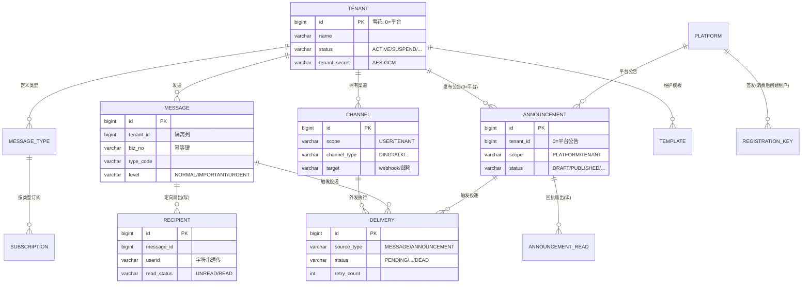

# notification4j 数据库设计说明书（DBD）

> **文档状态**：草稿（待评审）
> **编写依据**：mc-doc-dbd《数据库设计说明书编写规范 v1.0》+ mc-database-spec（PostgreSQL 开发规范）
> **配套文档**：《产品设计文档（PRD）》《中间件中台租户设计》《开发原则》
> **参考实现**：benefit4j `backend/schema.sql`（UBM V1.2.1 快照）——本文档沿用其分层前缀与字段风格

---

## 1. 基础信息

### 1.1 项目信息表

| 项 | 值 |
|---|---|
| 项目名称 | notification4j 消息通知微中台 |
| 项目代号 | NFY-V1.0 |
| 文档状态 | 草稿 |
| 创建日期 | 2026-09-16 |
| 数据库 | PostgreSQL 16+ |
| 架构师 | justin |
| 后端 Lead | justin |
| DBA | justin |
| 数据负责人 | justin |

### 1.2 修订历史

| 版本号 | 修订日期 | 修订类型 | 修订内容摘要 | 修订人 | 审核 / 批准人 |
|---|---|---|---|---|---|
| V1.0.4 | 2026-09-16 | 变更 | 编码第 1 步回校：迁移落盘 starter 模块（V1.0.0__init_nfy_schema.sql）；nfya_tenant 补契约列 description/tenant_secret_prev_at（TenantEntity 契约，TCK 守护）；email 改可空 + uk 谓词改 `email IS NOT NULL`（TCK 契约）；表 12 audit 改由迁移脚本创建（fwk4j-audit 不建表，实测） | justin | 编码第 1 步评审 |
| V1.0.3 | 2026-09-16 | 变更 | 第 4 轮终审联动修订：§5.1 ext 兜底行回表体并逐表列名；§5.2/§4.3 GIN 口径同步收窄；§9.2 渠道类型行拆回三列；索引计数统一不含主键口径（recipient 3/delivery 6）；§6.1 三行分区维护措辞精确化；起步磁盘 8→10GB；DDL 头注升 V1.0.2；§8.1 脚本标注待生成 | justin | 评审会（第 4 轮终审） |
| V1.0.2 | 2026-09-16 | 变更 | 第 3 轮修复：分区清理改双机制（行级删 READ + >365d 分区 DROP）；nfya_message 纳入分区预案；补 reaper SENDING 索引；JSONB GIN 口径收窄（亿级写表 ext 不建）；open_id 派生说明；V1.1 Job 无表说明；Flyway 措辞改「待实施任务生成」；audit 容量补行 | justin | 评审会（第 3 轮） |
| V1.0.1 | 2026-09-16 | 变更 | 评审第 1 轮修复：delivery 补幂等唯一闸；next_retry_at 改 NOT NULL 默认 now；补 nfyp_registration_key 表；容量公式重算；订阅去 version 列；secret 加宽 259（DDL 同步随实施任务落脚本） | justin | 评审会（第 1、2 轮） |
| V1.0.0 | 2026-09-16 | 新建 | 初始化 12 张表（10 业务表 + 注册码 + 审计表），Flyway 脚本 `V1.0.0__init_nfy_schema.sql` | justin | 待评审 |

---

## 2. 设计目标与约束

### 2.1 设计目标

| 维度 | 目标 |
|---|---|
| 业务 | 支撑 PRD 全部功能：定向站内消息（fanout-on-write）+ 公告广播（fanout-on-read）+ 用户/公共渠道 + 订阅偏好 + 外发投递留痕 |
| 性能 | 未读数 P99 ≤ 200ms（部分索引 + Redis 缓存）；消息列表 Keyset 分页 P99 ≤ 500ms；外发扫描走 KB 级部分索引 |
| 一致性 | 幂等真闸在 DB：`UNIQUE(tenant_id, biz_no)`、`UNIQUE(tenant_id, message_id, userid)` 等；禁外键，应用层保证 |

### 2.2 设计约束

| 约束 | 来源 |
|---|---|
| 租户隔离：`tenant_id` 全部业务表第一等公民列，唯一键一律 `tenant_id` 打头 | 《中间件中台租户设计》§3.2 |
| **豁免条款**：全局唯一雪花列（如 announcement_id）的**统计型查询**索引可豁免 tenant_id 打头（如公告回执按公告统计需跨租户聚合读者），须在索引清单注明 | 评审第 1 轮增补 |
| 平台身份用合成租户 `tenant_id = 0`（平台公告） | 《中间件中台租户设计》§5.3 |
| 终端用户标识是**字符串** `userid varchar(68)`，透传不建档，**禁止**用 bigint user_id | benefit4j 惯例（《租户设计》§9：userid 与 user_id 是两个概念） |
| 表/字段风格沿用 benefit4j schema.sql：`ext jsonb DEFAULT '{}'`、varchar(68/132/259/516)、`create_by/update_by`、部分唯一索引 | 代码库既成事实 |
| 中台不掌握用户全集 → 广播类必须 fanout-on-read（公告 + 回执表），定向类 fanout-on-write（接收人表） | PRD §2.5 |

### 2.3 设计原则

1. **禁外键 / 禁触发器 / 禁存储过程 / 禁 SELECT \***（mc-database-spec 铁律）；**已登记例外**：`V1.0.1__updated_at_triggers.sql` 为 11 张业务表建 `updated_at` BEFORE UPDATE 触发器（评审第 5 步 P1-4：MyBatis-Plus 无 MetaObjectHandler，updateById 会把旧 updated_at 写回致时间戳冻结；DB 触发器全表兜底、对 ORM 零侵入）；
2. 字段尽量 `NOT NULL + DEFAULT`；状态/类型用 varchar 大写英文值，禁 ENUM、禁数字编码；
3. JSONB 列按查询路径建 GIN（ext/params/channel_ids/channel_content 等参与过滤的列；privileges/config/oem/quiet_hours/default_channels/preset 无过滤路径不建，见 §5.1）；本域**无标签系统**（int[]/intarray 不适用）、**无金额字段**（numeric 不适用）；
4. 大表靠「保留期清理 + 分区预案」控制体量，V1.0 不引入分库分表；
5. 表名/字段名 ≤ 32 字符（最长表名 `nfya_message_recipient`/`nfya_announcement_read` 均 22 字符，达标）。

### 2.4 命名规约（沿用 benefit4j 分层前缀）

| 前缀 | 层 | 说明 |
|---|---|---|
| `nfya_*` | 应用/产品层（app） | 全部业务表（对齐 benefit4j `ubma_*`） |
| `nfyp_*` | 平台层（platform） | 注册码表、审计表（对齐 benefit4j `ubmp_*`），审计表由 framework4j-audit 自动建表 |

> benefit4j 的 `ubmp_benefit_tmpl_*`（平台级模板层）本域暂不设对应物：消息模板是租户级（`nfya_template` 带 tenant_id）；平台全局模板为后续预留，不动现有结构。

---

## 3. 概念模型（ER 图）

### 3.1 核心实体关系图



### 3.2 关系列表（文档化，DDL 中禁真外键）

| 子表 | 字段 | 父表 | 字段 | 基数 | 删除策略 |
|---|---|---|---|---|---|
| nfya_message | tenant_id | nfya_tenant | id | N:1 | 应用层校验；租户注销走状态机不删行 |
| nfya_message | type_code | nfya_message_type | type_code | N:1 | 应用层校验类型已启用 |
| nfya_message_recipient | message_id | nfya_message | id | N:1 | 跟随主表保留期清理 |
| nfya_announcement | tenant_id | nfya_tenant | id | N:1 | 0=平台合成租户，不校验 |
| nfya_announcement_read | announcement_id | nfya_announcement | id | N:1 | 公告到期清理时应用层级联清回执 |
| nfya_channel | tenant_id | nfya_tenant | id | N:1 | 逻辑删除 |
| nfya_subscription | (tenant_id,type_code) | nfya_message_type | (tenant_id,type_code) | N:1 | 类型停用不影响存量 |
| nfya_subscription | channel_ids 元素 | nfya_channel | id | N:M | JSONB 引用，发送时过滤 DISABLED/已删 |
| nfya_delivery | channel_id | nfya_channel | id | N:1 | 快照 target，渠道删除不影响留痕 |
| nfya_delivery | source_id | nfya_message / nfya_announcement | id | N:1 | source_type 区分父表 |
| nfya_template | type_code | nfya_message_type | type_code | N:1 | 应用层校验 |
| nfyp_registration_key | consumed_tenant_id | nfya_tenant | id | 1:0..1 | 消费创建租户后回填 |

---

## 4. 逻辑与物理设计

### 4.1 表清单（全局）

| # | 表名 | 类型 | 用途 | 估算行数（稳态） | 主键 | 关键索引 | 模块 |
|---|---|---|---|---|---|---|---|
| 1 | `nfya_tenant` | 实体表 | 租户主表（id 即 tenant_id） | 数百 | id | uk_email(部分) / GIN ext | 租户 |
| 2 | `nfya_message_type` | 配置表 | 消息类型（租户自定义+内置） | 数千 | id | uk_tenant_type_code | 消息 |
| 3 | `nfya_message` | 事务表 | 定向消息主表 | 起步 ~73 万 / 峰值 1095 万 | id | uk_tenant_biz_no / idx_tenant_time | 消息 |
| 4 | `nfya_message_recipient` | 关系表 | 接收人+已读状态（fanout-on-write） | 起步 ~868 万 / 峰值 1.95 亿（→分区） | id | uk_tenant_msg_user / idx_user_time / 未读部分索引 | 消息 |
| 5 | `nfya_announcement` | 事务表 | 公告（平台/租户广播） | 数千 | id | idx_tenant_status_expire | 公告 |
| 6 | `nfya_announcement_read` | 日志表 | 公告已读/确认回执 | ~100 万（公告条数×读者覆盖率口径） | id | uk_tenant_ann_user | 公告 |
| 7 | `nfya_channel` | 实体表 | 渠道（用户/公共，IM webhook/邮件/短信） | 数万 | id | uk_tenant_user_type_target / idx_scope_type | 渠道 |
| 8 | `nfya_subscription` | 配置表 | 订阅偏好（用户×类型×渠道矩阵） | ~25 万 | id | uk_tenant_user_type / GIN channel_ids | 订阅 |
| 9 | `nfya_template` | 配置表 | 消息模板（V1.1） | 数千 | id | uk_tenant_template_code | 模板 |
| 10 | `nfya_delivery` | 日志表 | 外发投递记录（状态机+重试） | 起步 ~144 万 / 峰值 3150 万（→分区） | id | uk_source 幂等闸 / 待投递部分索引 / idx_tenant_time | 外发 |
| 11 | `nfyp_registration_key` | 配置表 | 注册码（平台签发，次数/有效期/预绑配置档） | 数百 | id | uk_code | 租户 |
| 12 | `nfyp_audit_log` | 日志表 | 审计（hash chain） | 百万级/年 | bigserial id | idx_actor_time / uk_hash | 审计 |

> 估算口径见 §7.2；「稳态」= 保留期清理后的在线行数。

### 4.2 单表字段说明

#### 表 1：nfya_tenant（租户主表）

**类型**：实体表 · **用途**：接入应用系统本体，全库唯一没有 tenant_id 的表 · **估算行数**：数百

| 字段名 | 类型 | 必填 | 默认值 | 业务说明 | 字典 / 枚举 | 敏感 |
|---|---|---|---|---|---|---|
| id | bigint | 是 | 雪花 | 主键，**即 tenant_id**；0=平台合成租户。**对外标识 open_id**：fwk4j-id 由雪花 id 派生的 12 字符混淆外显（Base62+校验位），**不落库、可反解**（API 路径 `{tenant_open_id}` 经反解寻址）；CLOSED 后 id 永不复用即 OpenID 防重用 | - | - |
| name | varchar(68) | 是 | - | 租户名 | - | - |
| description | varchar(516) | 是 | '' | 租户描述（**framework4j-tenant TenantEntity 契约列**，缺列 MP 查询即炸） | - | - |
| email | varchar(132) | 否 | NULL | 联系邮箱（无验证流程）；TCK 契约唯一索引谓词为 `email IS NOT NULL`，应用层空串转 NULL | - | 脱敏输出 |
| channel | varchar(20) | 是 | 'OPS' | 来源通道 | OPS 运营创建 / SELF 自助注册 | - |
| status | varchar(20) | 是 | 'ACTIVE' | 生命周期状态机 | PENDING/SANDBOX/ACTIVE/SUSPEND/CLOSED | - |
| tenant_secret | varchar(132) | 是 | - | 租户密钥（换 token 用） | - | **AES-256-GCM 加密** |
| tenant_secret_prev | varchar(132) | 是 | '' | 轮换宽限期旧密钥（默认 24h 双版本可换 token） | - | **AES-256-GCM 加密** |
| tenant_secret_prev_at | timestamptz | 否 | NULL | 旧密钥宽限期起点（**TenantEntity 契约列**，懒校验过期） | - | - |
| privileges | jsonb | 是 | '{}' | 权限类：功能开关 `{"sms":false}` | - | - |
| config | jsonb | 是 | '{}' | 配置类：参数默认值 `{"retentionDays":180}` | - | - |
| oem | jsonb | 是 | '{}' | OEM 类：`{"theme":"dark","title":"","hosts":[]}` | - | - |
| ext | jsonb | 是 | '{}' | 预留扩展 | - | - |
| created_at / updated_at | timestamptz | 是 | now() | 创建/更新时间 | - | - |
| create_by / update_by | varchar(68) | 是 | '' | 创建/更新操作者 | - | - |
| is_deleted | smallint | 是 | 0 | 逻辑删除（CLOSED 软删保留行，OpenID 防重用） | - | - |

**表级约束**：`uk_nfya_tenant_email (email) WHERE (is_deleted = 0 AND email IS NOT NULL)`（TCK 契约谓词形态）
**与 ubma_tenant 差异**：按《中间件中台租户设计》§3.1 增补 `email/channel/privileges/config/oem/tenant_secret_prev`；列集以 framework4j-tenant `TenantEntity` 冻结契约为准（`description`/`tenant_secret_prev_at` 为契约列），由 framework4j-tenant-tck `tenantTable_structure` 测试守护。

#### 表 2：nfya_message_type（消息类型）

**类型**：配置表 · **用途**：租户自定义消息类型 + 内置类型，订阅/模板/统计的维度 · **估算行数**：数千

| 字段名 | 类型 | 必填 | 默认值 | 业务说明 | 字典 / 枚举 | 敏感 |
|---|---|---|---|---|---|---|
| id | bigint | 是 | 雪花 | 主键 | - | - |
| tenant_id | bigint | 是 | - | 归属租户 | - | - |
| type_code | varchar(36) | 是 | - | 类型编码（字母数字下划线） | 内置 SYSTEM / ANNOUNCEMENT | - |
| name | varchar(68) | 是 | - | 显示名（订阅矩阵行标题） | - | - |
| description | varchar(516) | 是 | '' | 类型说明（订阅页展示） | - | - |
| default_level | varchar(20) | 是 | 'NORMAL' | 默认等级（发送未指定时） | NORMAL/IMPORTANT/URGENT | - |
| default_channels | jsonb | 是 | '["INAPP"]' | 用户无订阅记录时的默认渠道类型集；**`mandatory=1` 时本字段即订阅矩阵的强制渠道集**（用户不可关） | 元素=渠道类型枚举 | - |
| mandatory | smallint | 是 | 0 | 强制订阅（**仅平台域可设**，租户域接口忽略/拒绝该字段） | 0/1 | - |
| built_in | smallint | 是 | 0 | 内置类型：1=不可删 | 0/1 | - |
| status | varchar(20) | 是 | 'ENABLED' | 启用状态（停用后发送 API 拒收） | ENABLED/DISABLED | - |
| ext / created_at / updated_at / create_by / update_by / is_deleted | - | - | - | 通用字段，同表 1 | - | - |

**表级约束**：`uk_nfya_message_type_tenant_code (tenant_id, type_code) WHERE (is_deleted = 0)`

#### 表 3：nfya_message（消息主表）

**类型**：事务表 · **用途**：定向消息（发给指定用户列表），fanout-on-write 的写侧 · **估算行数**：起步 ~73 万 / 峰值 1095 万

| 字段名 | 类型 | 必填 | 默认值 | 业务说明 | 字典 / 枚举 | 敏感 |
|---|---|---|---|---|---|---|
| id | bigint | 是 | 雪花 | 主键 | - | - |
| tenant_id | bigint | 是 | - | 归属租户（幂等命名空间） | - | - |
| biz_no | varchar(68) | 是 | - | 业务号（幂等键；调用方缺省时服务端生成 UUID） | - | - |
| type_code | varchar(36) | 是 | - | 消息类型（→ nfya_message_type） | - | - |
| level | varchar(20) | 是 | 'NORMAL' | 消息等级 | NORMAL/IMPORTANT/URGENT | - |
| title | varchar(132) | 是 | - | 标题 | - | - |
| content | text | 是 | - | 内容（markdown 子集，渲染白名单） | - | - |
| link_url | varchar(516) | 是 | '' | 跳转链接（http/https） | - | - |
| template_id | bigint | 是 | 0 | 引用模板（0=未用模板，直发 title/content） | - | - |
| params | jsonb | 是 | '{}' | 模板渲染参数 | - | - |
| receiver_count | integer | 是 | 0 | 接收人数（冗余，免去 count recipient） | - | - |
| status | varchar(20) | 是 | 'SENT' | 消息状态（撤回为 V1.2） | SENT/CANCELLED | - |
| sender | varchar(68) | 是 | '' | 发送方标识：`API` / `CONSOLE:{operator}` | - | - |
| ext / created_at / updated_at / create_by / update_by / is_deleted | - | - | - | 通用字段 | - | - |

**表级约束**：`uk_nfya_message_tenant_biz_no (tenant_id, biz_no) WHERE (is_deleted = 0)` —— 幂等真闸，对齐 benefit4j `uk_ubma_subscribe_tenant_id_external_order_id` 模式。
**保留期**：主表跟随接收明细上限 365 天（清理任务先清 recipient 再清无主 message；管理面已读统计随清理截止，见 §7.1）。

#### 表 4：nfya_message_recipient（消息接收记录）

**类型**：关系表 · **用途**：定向消息的接收人 + 已读状态（消息中心的读侧主表，全库最大表） · **估算行数**：起步 ~868 万 / 峰值 1.95 亿（§6 分区预案）

| 字段名 | 类型 | 必填 | 默认值 | 业务说明 | 字典 / 枚举 | 敏感 |
|---|---|---|---|---|---|---|
| id | bigint | 是 | 雪花 | 主键 | - | - |
| tenant_id | bigint | 是 | - | 归属租户 | - | - |
| message_id | bigint | 是 | - | 消息 id（→ nfya_message） | - | - |
| userid | varchar(68) | 是 | - | 接收人（X-User-Id 字符串透传，**非** bigint） | - | - |
| read_status | varchar(20) | 是 | 'UNREAD' | 已读状态 | UNREAD/READ | - |
| read_at | timestamptz | 否 | - | 阅读时间 | - | - |
| ext / created_at / updated_at / create_by / update_by / is_deleted | - | - | - | 通用字段（updated_at 随已读变更） | - | - |

**表级约束**：`uk_nfya_recipient_msg_user (tenant_id, message_id, userid) WHERE (is_deleted = 0)` —— 防重复扇出。
**关键索引**：
- `idx_nfya_recipient_user_time (tenant_id, userid, created_at DESC, id DESC)` —— 「我的消息」Keyset 分页主索引，选择性高；
- `idx_nfya_recipient_unread (tenant_id, userid) WHERE (read_status = 'UNREAD' AND is_deleted = 0)` —— 未读数/未读列表**部分索引**（未读占比通常 <20%，索引小、命中快）。

#### 表 5：nfya_announcement（公告）

**类型**：事务表 · **用途**：平台公告（tenant_id=0，全租户可见）+ 租户公告，fanout-on-read 的写侧 · **估算行数**：数千

| 字段名 | 类型 | 必填 | 默认值 | 业务说明 | 字典 / 枚举 | 敏感 |
|---|---|---|---|---|---|---|
| id | bigint | 是 | 雪花 | 主键 | - | - |
| tenant_id | bigint | 是 | - | 归属租户；**平台公告=0**（合成租户） | - | - |
| biz_no | varchar(68) | 是 | '' | 业务号（控制台创建时生成 UUID 填入），幂等闸 | - | - |
| scope | varchar(20) | 是 | 'TENANT' | 公告范围 | PLATFORM/TENANT | - |
| title | varchar(132) | 是 | - | 标题 | - | - |
| content | text | 是 | - | 内容（markdown 子集） | - | - |
| level | varchar(20) | 是 | 'IMPORTANT' | 等级（公告默认重要） | NORMAL/IMPORTANT/URGENT | - |
| need_confirm | smallint | 是 | 0 | 需确认：1=计入未读数直至用户点「我知道了」 | 0/1 | - |
| link_url | varchar(516) | 是 | '' | 跳转链接 | - | - |
| channel_ids | jsonb | 是 | '[]' | 发布时外发的公共渠道 id 列表（→ nfya_channel，scope=TENANT） | - | - |
| status | varchar(20) | 是 | 'DRAFT' | 生命周期 | DRAFT/PUBLISHED/OFFLINE/EXPIRED | - |
| effective_at | timestamptz | 是 | - | 生效时间 | - | - |
| expire_at | timestamptz | 是 | - | 失效时间（定时任务置 EXPIRED） | - | - |
| published_at | timestamptz | 否 | - | 发布时间 | - | - |
| confirm_count | integer | 是 | 0 | 已确认人数（冗余计数，确认时 +1） | - | - |
| ext / created_at / updated_at / create_by / update_by / is_deleted | - | - | - | 通用字段 | - | - |

**关键索引**：`idx_nfya_ann_runtime (tenant_id, status, expire_at)` —— 运行时查询 `tenant_id IN (0, :tid) AND status='PUBLISHED' AND now() BETWEEN effective_at AND expire_at`，tenant_id 等值打头选择性高。
**表级约束**：`uk_nfya_ann_tenant_biz_no (tenant_id, biz_no) WHERE (is_deleted = 0 AND biz_no <> '')` —— 公告创建幂等闸（控制台双击/超窗重试防重复发布），与 message 幂等设计对等。

#### 表 6：nfya_announcement_read（公告回执）

**类型**：日志表 · **用途**：公告已读/确认回执（fanout-on-read 的读侧，未确认数=生效公告-回执） · **估算行数**：~100 万（公告条数×读者覆盖率口径）

| 字段名 | 类型 | 必填 | 默认值 | 业务说明 | 字典 / 枚举 | 敏感 |
|---|---|---|---|---|---|---|
| id | bigint | 是 | 雪花 | 主键 | - | - |
| tenant_id | bigint | 是 | - | **读者**所属租户（平台公告读者各属其租户） | - | - |
| announcement_id | bigint | 是 | - | 公告 id | - | - |
| userid | varchar(68) | 是 | - | 读者 | - | - |
| read_at | timestamptz | 是 | now() | 首次阅读时间 | - | - |
| confirm_at | timestamptz | 否 | - | 确认时间（need_confirm=1 时点「我知道了」） | - | - |
| ext / created_at / updated_at / create_by / update_by / is_deleted | - | - | - | 通用字段（确认时更新 confirm_at/updated_at） | - | - |

**表级约束**：`uk_nfya_ann_read_user (tenant_id, announcement_id, userid) WHERE (is_deleted = 0)` —— 确认幂等。

#### 表 7：nfya_channel（渠道）

**类型**：实体表 · **用途**：用户自注册渠道 + 租户公共渠道（IM 群 webhook/邮箱/短信） · **估算行数**：数万

| 字段名 | 类型 | 必填 | 默认值 | 业务说明 | 字典 / 枚举 | 敏感 |
|---|---|---|---|---|---|---|
| id | bigint | 是 | 雪花 | 主键 | - | - |
| tenant_id | bigint | 是 | - | 归属租户 | - | - |
| scope | varchar(20) | 是 | 'USER' | 渠道归属 | USER 用户渠道 / TENANT 公共渠道 | - |
| userid | varchar(68) | 是 | '' | 归属用户（scope=USER 时有值，TENANT 为 ''） | - | - |
| channel_type | varchar(20) | 是 | - | 渠道类型 | DINGTALK/WECOM/FEISHU/EMAIL/SMS(V1.2) | - |
| name | varchar(68) | 是 | - | 渠道名称（用户起，如「运维报警群」） | - | - |
| target | varchar(516) | 是 | - | 投递目标：webhook URL / 邮箱 / 手机号 | - | **脱敏输出**（webhook token 段、邮箱） |
| secret | varchar(259) | 是 | '' | 加签密钥（钉钉/飞书）或 SMTP 授权码（≤128 明文，加密膨胀后适配 259） | - | **AES-256-GCM 加密** |
| keyword | varchar(68) | 是 | '' | 自定义关键词（机器人安全设置之一） | - | - |
| status | varchar(20) | 是 | 'PENDING' | 渠道状态机 | PENDING/ENABLED/DISABLED | - |
| fail_count | integer | 是 | 0 | 连续投递失败次数（≥5 自动熔断 DISABLED） | - | - |
| last_verify_at | timestamptz | 否 | - | 最近验证通过时间 | - | - |
| ext / created_at / updated_at / create_by / update_by / is_deleted | - | - | - | 通用字段 | - | - |

**表级约束**：`uk_nfya_channel_target (tenant_id, userid, channel_type, md5(target)) WHERE (is_deleted = 0)` —— 同一用户同类型同 target 防重复注册（target 长 516，md5 表达式避免唯一索引项臃肿）；公共渠道 userid='' 天然兼容。

#### 表 8：nfya_subscription（订阅偏好）

**类型**：配置表 · **用途**：用户 × 消息类型 × 渠道集合（订阅矩阵的落库形态） · **估算行数**：~25 万

| 字段名 | 类型 | 必填 | 默认值 | 业务说明 | 字典 / 枚举 | 敏感 |
|---|---|---|---|---|---|---|
| id | bigint | 是 | 雪花 | 主键 | - | - |
| tenant_id | bigint | 是 | - | 归属租户 | - | - |
| userid | varchar(68) | 是 | - | 归属用户 | - | - |
| type_code | varchar(36) | 是 | - | 消息类型 | - | - |
| channel_ids | jsonb | 是 | '[]' | 选中的接收渠道：`["INAPP", "8712634..."]`（INAPP=站内信哨兵值，其余为 nfya_channel.id 字符串） | 元素非空，至少 1 个 | - |
| quiet_hours | jsonb | 是 | '{}' | 免打扰时段 `{"start":"22:00","end":"08:00"}`（V1.2 预留） | - | - |
| ext / created_at / updated_at / create_by / update_by / is_deleted | - | - | - | 通用字段 | - | - |

**表级约束**：`uk_nfya_subscription_user_type (tenant_id, userid, type_code) WHERE (is_deleted = 0)`
**说明**：无记录=按类型 `default_channels` 默认策略；每行 channel_ids 至少 1 个元素（INAPP 锁定天然满足，应用层校验）；保存为 PUT 全量 last-write-wins（单用户自改订阅无并发场景，不引入乐观锁）；渠道删除/熔断时由应用层异步剔除失效渠道 id，行变空回落 `["INAPP"]`。

#### 表 9：nfya_template（消息模板，V1.1）

**类型**：配置表 · **用途**：标题/内容模板 + `{var}` 占位符，按类型绑定 · **估算行数**：数千

| 字段名 | 类型 | 必填 | 默认值 | 业务说明 | 字典 / 枚举 | 敏感 |
|---|---|---|---|---|---|---|
| id | bigint | 是 | 雪花 | 主键 | - | - |
| tenant_id | bigint | 是 | - | 归属租户 | - | - |
| template_code | varchar(68) | 是 | - | 模板编码（调用方按 code 引用） | - | - |
| name | varchar(68) | 是 | - | 模板名称 | - | - |
| type_code | varchar(36) | 是 | - | 绑定消息类型 | - | - |
| title_tpl | varchar(259) | 是 | - | 标题模板（`{var}` 占位符） | - | - |
| content_tpl | text | 是 | - | 通用内容模板 | - | - |
| channel_content | jsonb | 是 | '{}' | 渠道文案变体 `{"DINGTALK":"### md..."}`，缺省用通用模板 | key=渠道类型 | - |
| status | varchar(20) | 是 | 'ENABLED' | 状态 | ENABLED/DISABLED | - |
| ext / created_at / updated_at / create_by / update_by / is_deleted | - | - | - | 通用字段 | - | - |

**表级约束**：`uk_nfya_template_code (tenant_id, template_code) WHERE (is_deleted = 0)`

#### 表 10：nfya_delivery（外发投递记录）

**类型**：日志表 · **用途**：消息/公告 × 渠道的外发执行留痕（状态机+重试+链路追踪） · **估算行数**：起步 ~144 万 / 峰值 3150 万（§6 分区预案）

| 字段名 | 类型 | 必填 | 默认值 | 业务说明 | 字典 / 枚举 | 敏感 |
|---|---|---|---|---|---|---|
| id | bigint | 是 | 雪花 | 主键 | - | - |
| tenant_id | bigint | 是 | - | 归属租户 | - | - |
| source_type | varchar(20) | 是 | - | 来源类型 | MESSAGE/ANNOUNCEMENT | - |
| source_id | bigint | 是 | - | 来源 id（message/announcement） | - | - |
| userid | varchar(68) | 是 | '' | 定向接收人（公共渠道外发为 ''） | - | - |
| channel_id | bigint | 是 | - | 渠道 id（快照，渠道删除不影响留痕） | - | - |
| channel_type | varchar(20) | 是 | - | 渠道类型冗余（免 JOIN） | 同表 7 | - |
| target | varchar(516) | 是 | '' | 投递目标快照 | - | **脱敏存储**（webhook token 段打码） |
| title | varchar(132) | 是 | '' | 标题快照（死信排查用） | - | - |
| status | varchar(20) | 是 | 'PENDING' | 投递状态机 | PENDING/SENDING/SUCCESS/FAILED/DEAD | - |
| retry_count | integer | 是 | 0 | 已重试次数（≤3，退避 1/5/15min） | - | - |
| next_retry_at | timestamptz | 是 | now() | 下次可投递时间（**扫描字段**：新行默认 now 即可被扫描；FAILED 重试时置退避时间；SENDING 超 10min 由 reaper 回收） | - | - |
| error_message | varchar(516) | 是 | '' | 最近失败原因 | - | - |
| trace_id | varchar(68) | 是 | '' | 全链路追踪 id | - | - |
| sent_at | timestamptz | 否 | - | 投递成功时间 | - | - |
| ext / created_at / updated_at / create_by / update_by / is_deleted | - | - | - | 通用字段 | - | - |

**表级约束**：`uk_nfya_delivery_source (tenant_id, source_type, source_id, userid, channel_id) WHERE (is_deleted = 0)` —— 投递幂等真闸（防扇出/重投产生重复投递行；公共渠道外发 userid='' 天然归并一扇出一行）。
**关键索引**：`idx_nfya_delivery_pending (next_retry_at) WHERE (status IN ('PENDING','FAILED'))` —— 外发引擎扫描**部分索引**（status 已在谓词中故移出索引列；待投递占比极低，索引 KB 级）。

#### 表 11：nfyp_registration_key（注册码）

**类型**：配置表 · **用途**：平台签发的租户自助注册凭证（《租户设计》§6.2 通道 B），平台层资源故无 tenant_id（消费后回填） · **估算行数**：数百

| 字段名 | 类型 | 必填 | 默认值 | 业务说明 | 字典 / 枚举 | 敏感 |
|---|---|---|---|---|---|---|
| id | bigint | 是 | 雪花 | 主键 | - | - |
| code | varchar(68) | 是 | - | 注册码（生成即高强度随机，仅签发响应显一次完整值） | - | **脱敏输出** |
| max_uses | integer | 是 | 1 | 可用次数（默认一次性） | - | - |
| used_count | integer | 是 | 0 | 已用次数（Redis 原子扣减，本列异步回刷留痕） | - | - |
| preset | jsonb | 是 | '{}' | 预绑配置档 `{"privileges":{...},"config":{...}}`，注册成功注入租户 | - | - |
| status | varchar(20) | 是 | 'ACTIVE' | 码状态 | ACTIVE/EXHAUSTED/EXPIRED/REVOKED | - |
| expire_at | timestamptz | 是 | - | 有效期（默认签发后 24h） | - | - |
| consumed_tenant_id | bigint | 是 | 0 | 消费产生的租户 id（0=未消费/仍有剩余次数） | - | - |
| issue_by | varchar(68) | 是 | '' | 签发人（平台域操作者） | - | - |
| ext / created_at / updated_at / create_by / update_by / is_deleted | - | - | - | 通用字段 | - | - |

**表级约束**：`uk_nfyp_reg_key_code (code) WHERE (is_deleted = 0)`
**配套**：Redis key `nfy:regkey:{code}` 存剩余次数，注册时 Lua 原子扣减（判负回滚），防并发重放薅码；发码/用码/吊销全审计（nfyp_audit_log）。

#### 表 12：nfyp_audit_log（审计日志）

**类型**：日志表 · **说明**：framework4j-audit v1.5.1 的 `JdbcAuditSink` 仅做 append-only INSERT **不建表**（评审编码第 1 步实测），故本表由迁移脚本 `V1.0.0__init_nfy_schema.sql` 创建（结构与 benefit4j `ubmp_audit_log` 同源：action/target_type/target_id/actor/result/args_json/ip/user_agent/trace_id/timestamp/prev_hash/hash，`uk hash` 防篡改链）。

### 4.3 物理类型选择

| 业务含义 | PG 类型 | 说明 |
|---|---|---|
| 主键 ID | bigint（雪花，fwk4j-id） | 禁 UUID；审计表沿用框架 bigserial |
| 状态 / 类型 / 等级 | varchar(20/36) + 大写英文值 | 禁 ENUM、禁数字编码 |
| 终端用户标识 | varchar(68) `userid` | **禁 bigint**——字符串透传（benefit4j 惯例） |
| 密钥 / hash | varchar(132) | AES-GCM 密文 base64 |
| 长内容 | text（仅 content/content_tpl） | 短文本一律 varchar(n) |
| 时间 | timestamptz | 禁 timestamp（无时区） |
| 布尔 | smallint 0/1 | need_confirm/mandatory/built_in |
| 动态扩展 | jsonb + GIN（按查询路径，§2.3） | ext/params/channel_ids 等 |

---

## 5. 索引方案

### 5.1 索引清单

| 表 | 索引名 | 字段 | 类型 | 命中场景 | 估算选择性 | 备注 |
|---|---|---|---|---|---|---|
| nfya_tenant | uk_nfya_tenant_email | email | 部分唯一 B-Tree | 租户查重 | 100% | `WHERE is_deleted=0 AND email IS NOT NULL`（email 列可空，应用层空串转 NULL） |
| nfya_tenant | idx_nfya_tenant_ext | ext | GIN | 扩展属性查询 | 低 | 铁律 6 |
| nfya_message_type | uk_nfya_message_type_tenant_code | (tenant_id, type_code) | 部分唯一 B-Tree | 发送校验类型 | 100% | - |
| nfya_message_type | idx_nfya_message_type_tenant | tenant_id | B-Tree | 类型列表 | 高 | - |
| nfya_message | uk_nfya_message_tenant_biz_no | (tenant_id, biz_no) | 部分唯一 B-Tree | **幂等闸**、按业务号查结果 | 100% | - |
| nfya_message | idx_nfya_message_tenant_time | (tenant_id, created_at DESC, id DESC) | 复合 B-Tree | 管理面消息列表（含游标列供序） | 高 | - |
| nfya_message | idx_nfya_message_params | params | GIN | 模板参数检索 | 低 | 铁律 6 |
| nfya_message_recipient | uk_nfya_recipient_msg_user | (tenant_id, message_id, userid) | 部分唯一 B-Tree | 防重复扇出；兼供按消息查接收明细（左前缀） | 100% | - |
| nfya_message_recipient | idx_nfya_recipient_user_time | (tenant_id, userid, created_at DESC, id DESC) | 复合 B-Tree | **「我的消息」Keyset 分页** | 高 | 等值→排序，含游标列 |
| nfya_message_recipient | idx_nfya_recipient_unread | (tenant_id, userid) | **部分** B-Tree | **未读数 / 未读列表** | 高 | `WHERE read_status='UNREAD' AND is_deleted=0` |
| nfya_announcement | uk_nfya_ann_tenant_biz_no | (tenant_id, biz_no) | 部分唯一 B-Tree | 公告创建幂等闸 | 100% | `AND biz_no<>''` |
| nfya_announcement | idx_nfya_ann_runtime | (tenant_id, status, expire_at) | 复合 B-Tree | 运行时生效公告（IN (0,:tid)） | 高 | - |
| nfya_announcement | idx_nfya_ann_tenant_time | (tenant_id, created_at DESC, id DESC) | B-Tree | 管理面公告列表 | 高 | 含游标列 |
| nfya_announcement | idx_nfya_ann_channels | channel_ids | GIN | 渠道删除时反查引用公告（低频） | 低 | 铁律 6 |
| nfya_announcement_read | uk_nfya_ann_read_user | (tenant_id, announcement_id, userid) | 部分唯一 B-Tree | 确认幂等、我的公告状态 | 100% | - |
| nfya_announcement_read | idx_nfya_ann_read_ann | announcement_id | B-Tree | 公告已读/确认统计（跨租户聚合读者） | 中 | **豁免条款**：全局唯一雪花列统计查询（§2.2） |
| nfya_channel | uk_nfya_channel_target | (tenant_id, userid, channel_type, md5(target)) | 部分唯一 B-Tree（表达式） | 防重复注册（target 长 516，md5 防索引项超宽） | 100% | - |
| nfya_channel | idx_nfya_channel_user | (tenant_id, userid, status) | B-Tree | 我的渠道列表、订阅页可用渠道 | 高 | - |
| nfya_channel | idx_nfya_channel_scope_type | (tenant_id, scope, channel_type, status) | B-Tree | 公共渠道查找（公告外发/类型默认） | 高 | - |
| nfya_subscription | uk_nfya_subscription_user_type | (tenant_id, userid, type_code) | 部分唯一 B-Tree | 订阅保存/查询 | 100% | - |
| nfya_subscription | idx_nfya_subscription_channels | channel_ids | GIN | 按渠道反查订阅（渠道删除清理） | 中 | 铁律 6 |
| nfya_template | uk_nfya_template_code | (tenant_id, template_code) | 部分唯一 B-Tree | 模板引用 | 100% | - |
| nfya_template | idx_nfya_template_tenant_type | (tenant_id, type_code) | B-Tree | 按类型查模板 | 高 | - |
| nfya_template | idx_nfya_template_content | channel_content | GIN | 渠道文案变体检索（低频） | 低 | 铁律 6 |
| nfya_delivery | uk_nfya_delivery_source | (tenant_id, source_type, source_id, userid, channel_id) | 部分唯一 B-Tree | **投递幂等真闸**（防重复扇出/重投） | 100% | - |
| nfya_delivery | idx_nfya_delivery_pending | (next_retry_at) | **部分** B-Tree | **外发引擎扫描待投递**（`next_retry_at<=now()` 有序扫描） | 高 | `WHERE status IN ('PENDING','FAILED')` |
| nfya_delivery | idx_nfya_delivery_tenant_time | (tenant_id, created_at DESC, id DESC) | B-Tree | 投递记录列表 | 高 | 含游标列 |
| nfya_delivery | idx_nfya_delivery_source | (tenant_id, source_type, source_id) | B-Tree | 按消息查投递结果 | 高 | - |
| nfya_delivery | idx_nfya_delivery_user | (tenant_id, userid, created_at) | B-Tree | 用户维度投递排查 | 中 | - |
| nfya_delivery | idx_nfya_delivery_sending | (updated_at) | **部分** B-Tree | **reaper 回收扫描**（SENDING>10min；在飞行行数≈百级，KB 级） | 高 | `WHERE status='SENDING'` |
| nfyp_registration_key | uk_nfyp_reg_key_code | code | 部分唯一 B-Tree | 注册码校验 | 100% | - |
| 九表 ext（tenant/message_type/message/announcement/announcement_read/channel/subscription/template/regkey） | idx_*_ext | ext | GIN | 扩展属性查询 | 低 | **recipient/delivery 两张亿级写表的 ext 不建 GIN**（无命中场景，纯写放大）；message.params/template.channel_content 场景偏弱，实施时按真实查询复核 |

> 按 `biz_no` 筛选投递记录（API-DLV-001）：delivery 无 biz_no 冗余列，走 `idx_nfya_delivery_source` → JOIN nfya_message 取 biz_no（管理面低频查询，可接受）。
> **V1.1 异步 Job 不建独立表**：job 状态由 nfya_message(+recipient) 聚合推导（job_id=message_id，finished/failed 由 recipient/delivery 统计），契约见接口文档 API-JOB-001。

> 单表二级索引计数（不含主键）：recipient 3、delivery 6、channel 3、其余 ≤4——上限 8 均达标，控制写入放大。

### 5.2 索引设计原则（本项目实例化）

1. 复合索引字段序 = 等值（tenant_id/userid）→ 排序（created_at DESC, id DESC）；Keyset 分页禁 OFFSET>10000；
2. 高频小集合用**部分索引**：未读（read_status='UNREAD'）、待投递（PENDING/FAILED）——索引体积降一个数量级；
3. 唯一约束一律部分唯一 `WHERE (is_deleted = 0)`（benefit4j 既定模式）；
4. JSONB 按**查询路径**建 GIN（§2.3 口径：ext/params/channel_ids/channel_content 等参与过滤的列；亿级写表 ext 不建），channel_ids 额外承担「渠道删除反查订阅」职责。

### 5.3 反模式（禁）

| 反模式 | 替代 |
|---|---|
| 「我的消息」OFFSET 深分页 | Keyset（last_created_at + last_id） |
| 未读数 `count(*)` 全表 | 部分索引 + Redis 缓存（写时失效 + 公告水位线比对，见 SAD §5.6） |
| 公告未确认数逐个查 | 生效公告集 `LEFT JOIN` 回执表一次算 |
| webhook 明文展示 / delivery.target 明文 | 应用层脱敏 + 快照打码 |
| 大表精确 count(*) | pg_class.reltuples 估算 |

---

## 6. 分区与分库分表

### 6.1 分区方案（预案，达阈值启用）

V1.0 两张潜在大表均**单表上线**，靠保留期清理控制稳态（§7.1）；触发以下任一条件即启用分区（已含 DDL 预案，变更走 §8 流程）：

| 表 | 触发阈值 | 策略 | 分区键 | 粒度 | 维护 |
|---|---|---|---|---|---|
| nfya_message_recipient | **1500 万行**（≈起步稳态 868 万的 1.7 倍，预留增长余量） | RANGE | created_at | 月 | pg_partman；**双机制清理**：历史分区内（READ 行位于 180~365 天区间）低峰分批行级删除 READ>180 天行；整分区 DROP 仅对 >365 天分区（届时仅剩 UNREAD 行=按保留期本应清除，与 §7.1 口径一致） |
| nfya_delivery | **1500 万行** | RANGE | created_at | 月 | pg_partman；单一机制：>90 天分区整 DROP（无行级删除） |
| nfya_message | **1500 万行**（峰值稳态 1095 万，超 1000 万铁律线，纳入预案） | RANGE | created_at | 月 | 无主主档（接收明细已清）>365 天分区整 DROP；未分区期随 recipient 级联清理 |

**分区预案 DDL（recipient 示例，届时按此执行）**：

```sql
CREATE TABLE nfya_message_recipient (
    id bigint NOT NULL,
    tenant_id bigint NOT NULL,
    -- ... 其余字段同 §4.2 表 4 ...
    created_at timestamptz NOT NULL DEFAULT CURRENT_TIMESTAMP,
    PRIMARY KEY (id, created_at)          -- 分区键必须入主键
) PARTITION BY RANGE (created_at);

CREATE TABLE nfya_message_recipient_2026_10 PARTITION OF nfya_message_recipient
    FOR VALUES FROM ('2026-10-01') TO ('2026-11-01');
-- 保留期内各月分区同构；uk 需改为 (tenant_id, message_id, userid, created_at)
```

> 注意点：分区后唯一约束必须包含分区键——扇出防重改由「应用层 Redis SETNX（fwk4j-idempotency）+ 分区内唯一」双保险，变更评审时专项确认。

### 6.2 分库分表（不启用）

触发条件（任一，届时架构评审）：单库磁盘 > 500GB / 单表 > 1 亿且分区不可解 / QPS 持续 > 5000。预案分片键 = `tenant_id`（哈希，2 的幂分片），契约层不变（《租户设计》§1.0 规模假设）。

---

## 7. 数据安全 / 容量 / 性能

### 7.1 数据安全与保留期

| 维度 | 措施 | 涉及字段/表 |
|---|---|---|
| 加密存储 | AES-256-GCM（fwk4j-sensitive TypeHandler），密钥走 KMS/env | nfya_tenant.tenant_secret(+_prev)、nfya_channel.secret |
| 脱敏输出 | webhook URL token 段 `••••`、邮箱 `a***@x.com`（后端脱敏，禁前端截取） | nfya_channel.target、nfya_delivery.target（**脱敏后再落快照**）、nfya_tenant.email |
| 内容安全 | markdown 白名单渲染，禁原始 HTML（防 XSS） | nfya_message.content、nfya_announcement.content |
| 逻辑删除 | is_deleted 全业务表 | - |
| 审计 | 平台域/管理面写操作 @Auditable → nfyp_audit_log（append-only + hash chain） | - |
| 保留期（定时清理任务） | recipient：READ 180 天 / UNREAD 365 天；message 主表跟随上限 365 天（先清 recipient 再清无主主档）；delivery：90 天；announcement：EXPIRED/OFFLINE 后 1 年，**应用层级联清理回执**（announcement_read 随公告同周期）；audit：1 年 | 清理执行：按 id 区间 + LIMIT 分批循环（低峰窗口）；分区启用后改 DROP PARTITION |
| RLS | 本域非资金/账本类，**不启用** PG RLS；隔离靠应用层收口 + 越权集成测试（《租户设计》§8#2 适用范围） | - |
| 备份 | 全量日备 + WAL 增量，RPO ≤ 5min | - |

### 7.2 容量估算

**业务假设**：起步 = 10 租户 × 200 消息/天/租户 × 平均 20 接收人，外发率 30%×1.3 渠道；峰值 = 30 租户 × 1000 消息/天 × 30 接收人。
**稳态公式**（评审第 1 轮修正）：`日新增 × (READ 占比 0.8 × 180 天 + UNREAD 占比 0.2 × 365 天)` ≈ 日新增 × 217 天（recipient）；message 主表按 365 天；delivery 按 90 天。

| 表 | 单行均大小 | 日新增（起步） | 年总量（起步） | 稳态（清理后） | 稳态磁盘（含索引×1.5） |
|---|---|---|---|---|---|
| nfya_message | 1.5 KB | 2,000 | 73 万 | 73 万 | ~1.6 GB |
| nfya_message_recipient | 0.3 KB | 40,000 | 1,460 万 | ~868 万 | ~3.9 GB |
| nfya_delivery | 0.5 KB | 16,000 | 580 万 | ~144 万 | ~1.1 GB |
| nfya_announcement(+read) | 公告 1.6 KB / 回执 0.3 KB | <100 | <5 万；回执 ~100 万 | <100 万 | ~0.5 GB（混合口径） |
| nfya_subscription | 0.3 KB | ~700 | 25 万 | ~25 万 | <0.1 GB |
| nfya_channel | 0.5 KB | ~30 | 1 万 | ~1 万 | <0.1 GB |
| 其余（tenant/type/template/regkey） | - | - | 万级 | 万级 | <0.1 GB |
| nfyp_audit_log | 0.6 KB | ~1 万 | ~300 万 | ~300 万（保留 1 年） | ~2.7 GB |

**总磁盘预测**：起步年 **~10 GB**（表格合计 10.1，含 audit 2.7GB）；峰值年（recipient 1.95 亿 ≈88GB + delivery 3150 万 ≈24GB + message 1095 万 ≈24GB + audit ≈3GB）≈ **~140 GB**（届时已按月分区，§6.1 双机制清理高效）。audit 与消息量非同比增长（保留 1 年封顶），峰值沿用起步年估算已偏保守。建议生产单库 200GB 规格（140/200=70%，已达扩容线，须监控告警）或将保留期下调（如 UNREAD 180 天）削峰。

### 7.3 性能预算

| 指标 | 目标 | 手段 / 监控 |
|---|---|---|
| 未读数查询 P99 | ≤ 5ms（DB 层） | 部分索引；应用层 Redis 缓存后接口 P99 ≤ 200ms |
| 「我的消息」列表 P99 | ≤ 50ms | idx_user_time Keyset 分页 |
| 消息发送（主表+扇出写）P99 | ≤ 300ms（单批 ≤1000 接收人） | 批量 INSERT；>1000 走 V1.1 批量异步 |
| 外发扫描 P99 | ≤ 20ms | 部分索引 idx_delivery_pending |
| 单 SQL P99 | ≤ 10ms（除批量写） | pg_stat_statements |
| 慢 SQL 比例 | < 1%（>100ms） | 慢日志 + fwk4j-sql-tracing |
| 索引命中率 | ≥ 99% | pg_stat_user_indexes |
| SQL 规约 | 全链路 `/*traceid=*/` 注释、禁 SELECT *、参数占位符 | mc-database-spec 场景二 |

---

## 8. 数据迁移与变更管理

### 8.1 版本管理（Flyway）

本项目**启用 Flyway**（benefit4j 未启用、手动执行迁移为其历史债，本项目不继承）：

```
backend/notification-spring-boot-starter/src/main/resources/db/migration/
├── V1.0.0__init_nfy_schema.sql             -- 本文档 §9.1 全量 DDL（12 张表全建，含 nfyp_audit_log；starter 模块承载，app 合并 classpath 可见）
└── V1.0.1__updated_at_triggers.sql         -- updated_at BEFORE UPDATE 触发器（评审第 5 步 P1-4，见 §2.3 例外登记）
```

> 现存 `backend/schema.sql` 是 benefit4j 拷贝快照（ubm_*），实施任务第一步即**删除替换**为本设计的初始化脚本快照（schema.sql 保留为整库重建用，与迁移脚本同源生成）。

### 8.2 变更流程

提出变更 → DBA 评估（锁级别/数据量/回滚）→ 迁移脚本 + 回滚脚本 → 灰度验证 → 低峰执行 → 更新本文档修订历史（含脚本编号）。严禁：生产直执行 DDL、删已上线字段（先 deprecated）、跳过回滚脚本。

### 8.3 在线 DDL 三步法

recipient/delivery 超 1000 万行后的结构变更：建新表 → 双写 → 回填校验 → 切读 → 下老表。加普通字段/索引直接迁移脚本（PG `CREATE INDEX CONCURRENTLY`）。

### 8.4 回滚策略

| 变更类型 | 回滚方式 |
|---|---|
| 加字段 | DROP COLUMN |
| 加索引 | DROP INDEX（CONCURRENTLY 创建失败不锁表） |
| 启用分区 | 数据回灌单表（预案内预演） |
| 删字段 | 不可回滚——必须先 deprecated 双写一个版本 |

---

## 9. 附录

### 9.1 完整 DDL（V1.0，与 Flyway `V1.0.0__init_nfy_schema.sql` 一一对应，另见 `V1.0.1__updated_at_triggers.sql`）

```sql
-- =============================================================================
-- NFY (Notification Middle-platform) Database Schema  — V1.0.0
-- 内容: nfya_* 业务表 10 张 + nfyp_registration_key + nfyp_audit_log（audit 表随本脚本创建——
--       framework4j-audit JdbcAuditSink 仅 append-only 写入不建表，编码第 1 步实测）
-- 规约: 无外键/无触发器/无存储过程; 参与查询过滤的 JSONB 列建 GIN; 唯一约束部分唯一(is_deleted=0)
-- 契约: nfya_tenant 列集须与 framework4j-tenant TenantEntity 冻结契约一致
--       (description/tenant_secret_prev_at 为契约列, 缺列将使任何 MP 查询报 column not exist)
-- =============================================================================

-- 1. nfya_tenant 租户主表
CREATE TABLE nfya_tenant (
    id bigint NOT NULL,
    name varchar(68) NOT NULL,
    description varchar(516) NOT NULL DEFAULT '',
    email varchar(132) NULL,
    channel varchar(20) NOT NULL DEFAULT 'OPS',
    status varchar(20) NOT NULL DEFAULT 'ACTIVE',
    tenant_secret varchar(132) NOT NULL,
    tenant_secret_prev varchar(132) NOT NULL DEFAULT '',
    tenant_secret_prev_at timestamptz,
    privileges jsonb NOT NULL DEFAULT '{}'::jsonb,
    config jsonb NOT NULL DEFAULT '{}'::jsonb,
    oem jsonb NOT NULL DEFAULT '{}'::jsonb,
    ext jsonb NOT NULL DEFAULT '{}'::jsonb,
    created_at timestamptz NOT NULL DEFAULT CURRENT_TIMESTAMP,
    updated_at timestamptz NOT NULL DEFAULT CURRENT_TIMESTAMP,
    create_by varchar(68) NOT NULL DEFAULT '',
    update_by varchar(68) NOT NULL DEFAULT '',
    is_deleted smallint NOT NULL DEFAULT 0,
    PRIMARY KEY (id)
);
CREATE INDEX idx_nfya_tenant_ext ON nfya_tenant USING gin (ext);
CREATE UNIQUE INDEX uk_nfya_tenant_email ON nfya_tenant (email) WHERE (is_deleted = 0 AND email IS NOT NULL);

-- 2. nfya_message_type 消息类型
CREATE TABLE nfya_message_type (
    id bigint NOT NULL,
    tenant_id bigint NOT NULL,
    type_code varchar(36) NOT NULL,
    name varchar(68) NOT NULL,
    description varchar(516) NOT NULL DEFAULT '',
    default_level varchar(20) NOT NULL DEFAULT 'NORMAL',
    default_channels jsonb NOT NULL DEFAULT '["INAPP"]'::jsonb,
    mandatory smallint NOT NULL DEFAULT 0,
    built_in smallint NOT NULL DEFAULT 0,
    status varchar(20) NOT NULL DEFAULT 'ENABLED',
    ext jsonb NOT NULL DEFAULT '{}'::jsonb,
    created_at timestamptz NOT NULL DEFAULT CURRENT_TIMESTAMP,
    updated_at timestamptz NOT NULL DEFAULT CURRENT_TIMESTAMP,
    create_by varchar(68) NOT NULL DEFAULT '',
    update_by varchar(68) NOT NULL DEFAULT '',
    is_deleted smallint NOT NULL DEFAULT 0,
    PRIMARY KEY (id)
);
CREATE INDEX idx_nfya_message_type_tenant ON nfya_message_type (tenant_id);
CREATE INDEX idx_nfya_message_type_ext ON nfya_message_type USING gin (ext);
CREATE UNIQUE INDEX uk_nfya_message_type_tenant_code ON nfya_message_type (tenant_id, type_code) WHERE (is_deleted = 0);

-- 3. nfya_message 消息主表
CREATE TABLE nfya_message (
    id bigint NOT NULL,
    tenant_id bigint NOT NULL,
    biz_no varchar(68) NOT NULL,
    type_code varchar(36) NOT NULL,
    level varchar(20) NOT NULL DEFAULT 'NORMAL',
    title varchar(132) NOT NULL,
    content text NOT NULL,
    link_url varchar(516) NOT NULL DEFAULT '',
    template_id bigint NOT NULL DEFAULT 0,
    params jsonb NOT NULL DEFAULT '{}'::jsonb,
    receiver_count integer NOT NULL DEFAULT 0,
    status varchar(20) NOT NULL DEFAULT 'SENT',
    sender varchar(68) NOT NULL DEFAULT '',
    ext jsonb NOT NULL DEFAULT '{}'::jsonb,
    created_at timestamptz NOT NULL DEFAULT CURRENT_TIMESTAMP,
    updated_at timestamptz NOT NULL DEFAULT CURRENT_TIMESTAMP,
    create_by varchar(68) NOT NULL DEFAULT '',
    update_by varchar(68) NOT NULL DEFAULT '',
    is_deleted smallint NOT NULL DEFAULT 0,
    PRIMARY KEY (id)
);
CREATE INDEX idx_nfya_message_tenant_time ON nfya_message (tenant_id, created_at DESC, id DESC);
CREATE INDEX idx_nfya_message_params ON nfya_message USING gin (params);
CREATE INDEX idx_nfya_message_ext ON nfya_message USING gin (ext);
CREATE UNIQUE INDEX uk_nfya_message_tenant_biz_no ON nfya_message (tenant_id, biz_no) WHERE (is_deleted = 0);

-- 4. nfya_message_recipient 消息接收记录
CREATE TABLE nfya_message_recipient (
    id bigint NOT NULL,
    tenant_id bigint NOT NULL,
    message_id bigint NOT NULL,
    userid varchar(68) NOT NULL,
    read_status varchar(20) NOT NULL DEFAULT 'UNREAD',
    read_at timestamptz,
    ext jsonb NOT NULL DEFAULT '{}'::jsonb,
    created_at timestamptz NOT NULL DEFAULT CURRENT_TIMESTAMP,
    updated_at timestamptz NOT NULL DEFAULT CURRENT_TIMESTAMP,
    create_by varchar(68) NOT NULL DEFAULT '',
    update_by varchar(68) NOT NULL DEFAULT '',
    is_deleted smallint NOT NULL DEFAULT 0,
    PRIMARY KEY (id)
);
CREATE INDEX idx_nfya_recipient_user_time ON nfya_message_recipient (tenant_id, userid, created_at DESC, id DESC);
CREATE INDEX idx_nfya_recipient_unread ON nfya_message_recipient (tenant_id, userid) WHERE (read_status = 'UNREAD' AND is_deleted = 0);
CREATE UNIQUE INDEX uk_nfya_recipient_msg_user ON nfya_message_recipient (tenant_id, message_id, userid) WHERE (is_deleted = 0);

-- 5. nfya_announcement 公告
CREATE TABLE nfya_announcement (
    id bigint NOT NULL,
    tenant_id bigint NOT NULL,
    biz_no varchar(68) NOT NULL DEFAULT '',
    scope varchar(20) NOT NULL DEFAULT 'TENANT',
    title varchar(132) NOT NULL,
    content text NOT NULL,
    level varchar(20) NOT NULL DEFAULT 'IMPORTANT',
    need_confirm smallint NOT NULL DEFAULT 0,
    link_url varchar(516) NOT NULL DEFAULT '',
    channel_ids jsonb NOT NULL DEFAULT '[]'::jsonb,
    status varchar(20) NOT NULL DEFAULT 'DRAFT',
    effective_at timestamptz NOT NULL,
    expire_at timestamptz NOT NULL,
    published_at timestamptz,
    confirm_count integer NOT NULL DEFAULT 0,
    ext jsonb NOT NULL DEFAULT '{}'::jsonb,
    created_at timestamptz NOT NULL DEFAULT CURRENT_TIMESTAMP,
    updated_at timestamptz NOT NULL DEFAULT CURRENT_TIMESTAMP,
    create_by varchar(68) NOT NULL DEFAULT '',
    update_by varchar(68) NOT NULL DEFAULT '',
    is_deleted smallint NOT NULL DEFAULT 0,
    PRIMARY KEY (id)
);
CREATE INDEX idx_nfya_ann_runtime ON nfya_announcement (tenant_id, status, expire_at);
CREATE INDEX idx_nfya_ann_tenant_time ON nfya_announcement (tenant_id, created_at DESC, id DESC);
CREATE INDEX idx_nfya_ann_channels ON nfya_announcement USING gin (channel_ids);
CREATE INDEX idx_nfya_ann_ext ON nfya_announcement USING gin (ext);
CREATE UNIQUE INDEX uk_nfya_ann_tenant_biz_no ON nfya_announcement (tenant_id, biz_no) WHERE (is_deleted = 0 AND biz_no <> '');

-- 6. nfya_announcement_read 公告回执
CREATE TABLE nfya_announcement_read (
    id bigint NOT NULL,
    tenant_id bigint NOT NULL,
    announcement_id bigint NOT NULL,
    userid varchar(68) NOT NULL,
    read_at timestamptz NOT NULL DEFAULT CURRENT_TIMESTAMP,
    confirm_at timestamptz,
    ext jsonb NOT NULL DEFAULT '{}'::jsonb,
    created_at timestamptz NOT NULL DEFAULT CURRENT_TIMESTAMP,
    updated_at timestamptz NOT NULL DEFAULT CURRENT_TIMESTAMP,
    create_by varchar(68) NOT NULL DEFAULT '',
    update_by varchar(68) NOT NULL DEFAULT '',
    is_deleted smallint NOT NULL DEFAULT 0,
    PRIMARY KEY (id)
);
CREATE INDEX idx_nfya_ann_read_ann ON nfya_announcement_read (announcement_id);
CREATE INDEX idx_nfya_ann_read_ext ON nfya_announcement_read USING gin (ext);
CREATE UNIQUE INDEX uk_nfya_ann_read_user ON nfya_announcement_read (tenant_id, announcement_id, userid) WHERE (is_deleted = 0);

-- 7. nfya_channel 渠道
CREATE TABLE nfya_channel (
    id bigint NOT NULL,
    tenant_id bigint NOT NULL,
    scope varchar(20) NOT NULL DEFAULT 'USER',
    userid varchar(68) NOT NULL DEFAULT '',
    channel_type varchar(20) NOT NULL,
    name varchar(68) NOT NULL,
    target varchar(516) NOT NULL,
    secret varchar(259) NOT NULL DEFAULT '',
    keyword varchar(68) NOT NULL DEFAULT '',
    status varchar(20) NOT NULL DEFAULT 'PENDING',
    fail_count integer NOT NULL DEFAULT 0,
    last_verify_at timestamptz,
    ext jsonb NOT NULL DEFAULT '{}'::jsonb,
    created_at timestamptz NOT NULL DEFAULT CURRENT_TIMESTAMP,
    updated_at timestamptz NOT NULL DEFAULT CURRENT_TIMESTAMP,
    create_by varchar(68) NOT NULL DEFAULT '',
    update_by varchar(68) NOT NULL DEFAULT '',
    is_deleted smallint NOT NULL DEFAULT 0,
    PRIMARY KEY (id)
);
CREATE INDEX idx_nfya_channel_user ON nfya_channel (tenant_id, userid, status);
CREATE INDEX idx_nfya_channel_scope_type ON nfya_channel (tenant_id, scope, channel_type, status);
CREATE INDEX idx_nfya_channel_ext ON nfya_channel USING gin (ext);
CREATE UNIQUE INDEX uk_nfya_channel_target ON nfya_channel (tenant_id, userid, channel_type, md5(target)) WHERE (is_deleted = 0);

-- 8. nfya_subscription 订阅偏好
CREATE TABLE nfya_subscription (
    id bigint NOT NULL,
    tenant_id bigint NOT NULL,
    userid varchar(68) NOT NULL,
    type_code varchar(36) NOT NULL,
    channel_ids jsonb NOT NULL DEFAULT '[]'::jsonb,
    quiet_hours jsonb NOT NULL DEFAULT '{}'::jsonb,
    ext jsonb NOT NULL DEFAULT '{}'::jsonb,
    created_at timestamptz NOT NULL DEFAULT CURRENT_TIMESTAMP,
    updated_at timestamptz NOT NULL DEFAULT CURRENT_TIMESTAMP,
    create_by varchar(68) NOT NULL DEFAULT '',
    update_by varchar(68) NOT NULL DEFAULT '',
    is_deleted smallint NOT NULL DEFAULT 0,
    PRIMARY KEY (id)
);
CREATE INDEX idx_nfya_subscription_channels ON nfya_subscription USING gin (channel_ids);
CREATE INDEX idx_nfya_subscription_ext ON nfya_subscription USING gin (ext);
CREATE UNIQUE INDEX uk_nfya_subscription_user_type ON nfya_subscription (tenant_id, userid, type_code) WHERE (is_deleted = 0);

-- 9. nfya_template 消息模板(V1.1 启用, 表先建)
CREATE TABLE nfya_template (
    id bigint NOT NULL,
    tenant_id bigint NOT NULL,
    template_code varchar(68) NOT NULL,
    name varchar(68) NOT NULL,
    type_code varchar(36) NOT NULL,
    title_tpl varchar(259) NOT NULL,
    content_tpl text NOT NULL,
    channel_content jsonb NOT NULL DEFAULT '{}'::jsonb,
    status varchar(20) NOT NULL DEFAULT 'ENABLED',
    ext jsonb NOT NULL DEFAULT '{}'::jsonb,
    created_at timestamptz NOT NULL DEFAULT CURRENT_TIMESTAMP,
    updated_at timestamptz NOT NULL DEFAULT CURRENT_TIMESTAMP,
    create_by varchar(68) NOT NULL DEFAULT '',
    update_by varchar(68) NOT NULL DEFAULT '',
    is_deleted smallint NOT NULL DEFAULT 0,
    PRIMARY KEY (id)
);
CREATE INDEX idx_nfya_template_tenant_type ON nfya_template (tenant_id, type_code);
CREATE INDEX idx_nfya_template_content ON nfya_template USING gin (channel_content);
CREATE INDEX idx_nfya_template_ext ON nfya_template USING gin (ext);
CREATE UNIQUE INDEX uk_nfya_template_code ON nfya_template (tenant_id, template_code) WHERE (is_deleted = 0);

-- 10. nfya_delivery 外发投递记录
CREATE TABLE nfya_delivery (
    id bigint NOT NULL,
    tenant_id bigint NOT NULL,
    source_type varchar(20) NOT NULL,
    source_id bigint NOT NULL,
    userid varchar(68) NOT NULL DEFAULT '',
    channel_id bigint NOT NULL,
    channel_type varchar(20) NOT NULL,
    target varchar(516) NOT NULL DEFAULT '',
    title varchar(132) NOT NULL DEFAULT '',
    status varchar(20) NOT NULL DEFAULT 'PENDING',
    retry_count integer NOT NULL DEFAULT 0,
    next_retry_at timestamptz NOT NULL DEFAULT CURRENT_TIMESTAMP,
    error_message varchar(516) NOT NULL DEFAULT '',
    trace_id varchar(68) NOT NULL DEFAULT '',
    sent_at timestamptz,
    ext jsonb NOT NULL DEFAULT '{}'::jsonb,
    created_at timestamptz NOT NULL DEFAULT CURRENT_TIMESTAMP,
    updated_at timestamptz NOT NULL DEFAULT CURRENT_TIMESTAMP,
    create_by varchar(68) NOT NULL DEFAULT '',
    update_by varchar(68) NOT NULL DEFAULT '',
    is_deleted smallint NOT NULL DEFAULT 0,
    PRIMARY KEY (id)
);
CREATE INDEX idx_nfya_delivery_pending ON nfya_delivery (next_retry_at) WHERE (status IN ('PENDING','FAILED'));
CREATE INDEX idx_nfya_delivery_sending ON nfya_delivery (updated_at) WHERE (status = 'SENDING');
CREATE INDEX idx_nfya_delivery_tenant_time ON nfya_delivery (tenant_id, created_at DESC, id DESC);
CREATE INDEX idx_nfya_delivery_source ON nfya_delivery (tenant_id, source_type, source_id);
CREATE INDEX idx_nfya_delivery_user ON nfya_delivery (tenant_id, userid, created_at);
CREATE UNIQUE INDEX uk_nfya_delivery_source ON nfya_delivery (tenant_id, source_type, source_id, userid, channel_id) WHERE (is_deleted = 0);

-- 11. nfyp_registration_key 注册码(平台层资源, 无 tenant_id; 消费后回填)
CREATE TABLE nfyp_registration_key (
    id bigint NOT NULL,
    code varchar(68) NOT NULL,
    max_uses integer NOT NULL DEFAULT 1,
    used_count integer NOT NULL DEFAULT 0,
    preset jsonb NOT NULL DEFAULT '{}'::jsonb,
    status varchar(20) NOT NULL DEFAULT 'ACTIVE',
    expire_at timestamptz NOT NULL,
    consumed_tenant_id bigint NOT NULL DEFAULT 0,
    issue_by varchar(68) NOT NULL DEFAULT '',
    ext jsonb NOT NULL DEFAULT '{}'::jsonb,
    created_at timestamptz NOT NULL DEFAULT CURRENT_TIMESTAMP,
    updated_at timestamptz NOT NULL DEFAULT CURRENT_TIMESTAMP,
    create_by varchar(68) NOT NULL DEFAULT '',
    update_by varchar(68) NOT NULL DEFAULT '',
    is_deleted smallint NOT NULL DEFAULT 0,
    PRIMARY KEY (id)
);
CREATE INDEX idx_nfyp_reg_key_ext ON nfyp_registration_key USING gin (ext);
CREATE UNIQUE INDEX uk_nfyp_reg_key_code ON nfyp_registration_key (code) WHERE (is_deleted = 0);

-- 12. nfyp_audit_log 审计日志(framework4j-audit JdbcAuditSink append-only 写入; 结构与 benefit4j ubmp_audit_log 同源)
CREATE TABLE nfyp_audit_log (
    id bigserial NOT NULL,
    action varchar(68) NOT NULL,
    target_type varchar(68) NOT NULL,
    target_id varchar(68),
    actor varchar(68),
    result varchar(20) NOT NULL,
    error_message text,
    args_json text,
    result_json text,
    ip varchar(49),
    user_agent varchar(259),
    trace_id varchar(68),
    timestamp timestamptz NOT NULL,
    prev_hash varchar(132) NOT NULL,
    hash varchar(132) NOT NULL,
    PRIMARY KEY (id)
);
CREATE INDEX idx_nfyp_audit_actor_time ON nfyp_audit_log USING btree (actor, "timestamp" DESC);
CREATE INDEX idx_nfyp_audit_target ON nfyp_audit_log USING btree (target_type, target_id);
CREATE INDEX idx_nfyp_audit_time ON nfyp_audit_log USING btree ("timestamp" DESC);
CREATE UNIQUE INDEX uk_nfyp_audit_log_hash ON nfyp_audit_log USING btree (hash);
```

### 9.2 字典码表

| 字典 | 值 | 用于 |
|---|---|---|
| 租户状态 | PENDING/SANDBOX/ACTIVE/SUSPEND/CLOSED | nfya_tenant.status |
| 租户来源 | OPS/SELF | nfya_tenant.channel |
| 消息等级 | NORMAL/IMPORTANT/URGENT | message.level、announcement.level、type.default_level |
| 渠道类型 | DINGTALK/WECOM/FEISHU/EMAIL/SMS | channel.channel_type、delivery.channel_type（INAPP 为订阅/默认渠道集哨兵值，非两列取值） |
| 渠道/公告归属 | USER/TENANT（公告为 PLATFORM/TENANT） | channel.scope、announcement.scope |
| 渠道状态 | PENDING/ENABLED/DISABLED | channel.status |
| 消息已读 | UNREAD/READ | recipient.read_status |
| 公告状态 | DRAFT/PUBLISHED/OFFLINE/EXPIRED | announcement.status |
| 投递状态 | PENDING/SENDING/SUCCESS/FAILED/DEAD | delivery.status |
| 投递来源 | MESSAGE/ANNOUNCEMENT | delivery.source_type |
| 注册码状态 | ACTIVE/EXHAUSTED/EXPIRED/REVOKED | nfyp_registration_key.status |
| 消息状态 | SENT/CANCELLED（V1.2 启用） | message.status |
| 启用状态 | ENABLED/DISABLED | type.status、template.status |

### 9.3 引用文档

- 《产品设计文档（PRD）》docs/requirements/prd.md（功能与分期来源）
- 《接口设计文档》docs/api/api-spec.md（契约错误码与字段口径来源）
- 《中间件中台租户设计》v2.1（租户主表/合成租户/userid 语义）
- 《开发原则》（framework4j 优先、四方对齐）
- mc-database-spec《PostgreSQL 开发规范 v1.2》《表分类与命名规范》
- mc-doc-dbd《数据库设计说明书编写规范 v1.0》
- benefit4j `backend/schema.sql`（UBM V1.2.1，字段风格与部分唯一索引模式来源）

---

> 治理 2026-09-18：database-design.md 一致性修复 9 处（迁移脚本对齐/契约列与唯一谓词/审计表 DDL/触发器例外登记），详见 docs/README.md

---

**文档结束。**
