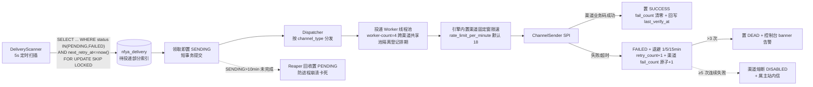
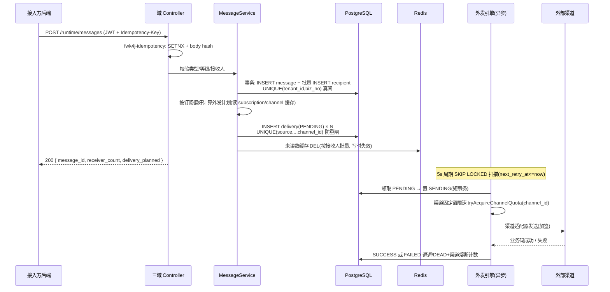
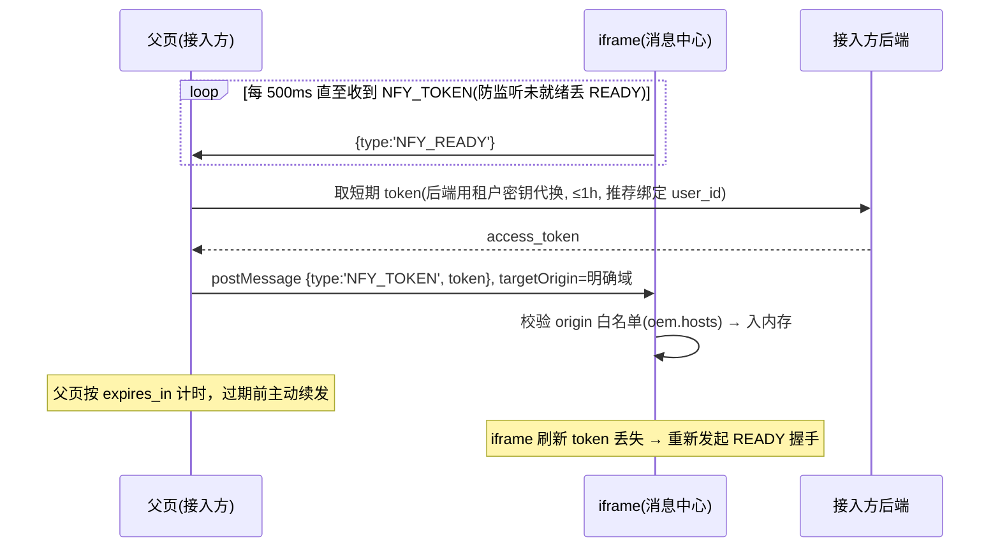
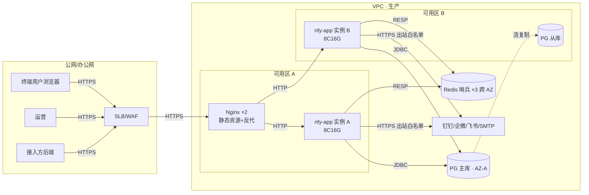

# notification4j 技术方案文档（系统架构设计说明书 SAD）

> **文档状态**：草稿（待评审）
> **编写依据**：mc-doc-arch《系统架构设计说明书编写规范 v1.0》
> **配套文档**：《产品设计文档（PRD）》《数据库设计文档（DBD）》《接口设计文档》《中间件中台租户设计》《双模式技术方案》《开发原则》
> **一句话**：同一份代码经 yml 两个开关支持「业务方嵌入 / 跨进程调用 / 独立部署」三形态的多租户消息通知中台；站内信同步落库、站外渠道异步外发、消息中心 iframe 微前端嵌入。

---

## 1. 基础信息

### 1.1 项目信息表

| 项 | 值 |
|---|---|
| 项目名称 | notification4j 消息通知微中台 |
| 项目代号 | NFY-V1.0 |
| 文档状态 | 草稿 |
| 创建日期 | 2026-09-16 |
| 架构师 | justin |
| Tech Lead | justin |
| 前端 / 后端 Lead | justin |
| SRE | justin |
| 安全 | justin |

### 1.2 修订历史

| 版本号 | 修订日期 | 修订类型 | 修订内容摘要 | 修订人 | 审核 / 批准人 |
|---|---|---|---|---|---|
| V1.0.3 | 2026-09-16 | 变更 | 第 4 轮终审联动修订：§5.8/§5.9 引擎路径统一 notification4j-common/engine（含 DeliveryStore port 装配说明）；限速双档说明（75% 默认降概率/50% 硬保证）；起步磁盘 8→10GB；错别字 | justin | 评审会（第 4 轮终审） |
| V1.0.2 | 2026-09-16 | 变更 | 第 3 轮修复：EMAIL 入 V1.0 范围（§2.3/§8.3）；型别隔离改 10207 信封语义；引擎（含 sender）下沉 common 使矩阵 row2 可装配、补 local/true/false 行；未读数水位线升级（含平台公告+TTL+事务后失效）；固定窗口限速 75% 阈值吸收边界突刺；熔断统一按 FAILED 计数；容量 ~140GB 含 audit | justin | 评审会（第 3 轮） |
| V1.0.1 | 2026-09-16 | 变更 | 评审第 1 轮修复：补嵌入形态全组合矩阵与能力边界；出站限速改 fwk4j-rate-limit 集中式；签名按租户开关（ADR-0008）；ADR-0001~0008 落盘 docs/design/adr/；引擎循环语义闭环（SENDING reaper/at-least-once）；增设 notification4j-common | justin | 评审会（第 1、2 轮） |
| V1.0.0 | 2026-09-16 | 新建 | 初始化：C4 架构、外发引擎、双模式装配、ADR-0001~0007 | justin | 待评审 |

---

## 2. 上下文与目标

### 2.1 业务背景

集团内各应用系统重复建设消息通知能力（站内信/已读/铃铛/站外 webhook 各写一套）。notification4j 以多租户中台形态提供统一「站内消息 + 公告 + 站外渠道通知」能力，与 benefit4j（权益中台）同构：同一套租户设计、双模式方案、framework4j 底座。详见 PRD §2。

### 2.2 干系人

| 角色 | 关切 |
|---|---|
| 接入方（租户系统） | 0.5 天接入：starter 一个 client + iframe 一段标签 |
| 终端用户 | 消息铃铛/列表/公告；自注册钉钉/企微/飞书/邮件渠道；按类型订阅 |
| 平台运营 | 租户接入、平台公告、跨租户统计、审计 |
| 架构组 | 不重复建设（framework4j 优先）、复用 benefit4j 底座、文档/代码/测试/规范四方对齐 |

### 2.3 范围

| In Scope（V1.0） | Out of Scope |
|---|---|
| 定向站内消息、平台/租户公告、三 IM webhook 渠道 + 邮件 SMTP 渠道、订阅偏好、外发投递状态机、嵌入消息中心、租户接入全套 | App 厂商通道推送、工作流编排、A/B 测试、digest、语音、微信系、短信（V1.2 分期，PRD §5.1） |

### 2.4 质量目标（量化）

| 维度 | 目标 |
|---|---|
| 可用性 | SLA 99.9%（消息非交易链路）；RTO ≤ 30min；RPO ≤ 5min |
| 性能 | 发送 API P99 ≤ 500ms；未读数 P99 ≤ 200ms；消息列表 P99 ≤ 500ms；外发引擎扫描周期 ≤ 5s |
| 容量 | 起步 10 租户 × 200 消息/天 × 20 接收人；峰值设计 30 租户 × 1000 消息/天 × 30 接收人（DBD §7.2） |
| 安全 | 《中间件中台租户设计》§8 十三项全过 + webhook SSRF 白名单 |
| 可维护 | framework4j 能力零自建（《开发原则》§1.1）；单步交付 ≤1000 行（§5.1） |

---

## 3. 架构原则与约束

| # | 原则 | 落地约束 |
|---|---|---|
| P1 | **framework4j 优先，禁止重复建设** | §5.8 映射表逐项落地；缺口走《开发原则》§1.2 两条出路并留 ADR |
| P2 | **复用 benefit4j 底座改造，不重写** | 已复制的 backend/frontend 为改造基线；业务模型（权益域）替换为消息域，技术件（租户/认证/嵌入/控制台）原样沿用 |
| P3 | **租户隔离红线** | tenant_id 只从 token claim 取；查询 Service 层单点收口；每新查询路径补越权集成测试 |
| P4 | **同步落库、异步外发** | 发送 API 只写站内信+投递计划即返回；外发引擎异步消费，渠道故障不影响主链路 |
| P5 | **渠道适配器 SPI（OCP）** | 新增渠道 = 新增一个 `ChannelSender` 实现 + 配置，核心引擎零修改 |
| P6 | **无状态服务** | 会话/缓存/队列状态全在 Redis/PG，多实例水平扩展；外发扫描用 PG `SKIP LOCKED` 竞争，天然多实例安全 |
| P7 | **配置驱动双模式** | `nfy.runtime.mode` / `nfy.runtime.enable-api` 两开关切三形态（《双模式技术方案》） |

---

## 4. 总体架构（C4）

### 4.1 L1 上下文图

```mermaid
graph LR
    subgraph Consumers[接入方（租户）]
        APP[应用系统后端<br/>Java Starter / HTTP]
        WEB[应用系统前端页面<br/>嵌入 iframe 消息中心]
    end
    subgraph NFY[notification4j 中台]
        CORE[nfy-app 独立服务<br/>Spring Boot 3 / JDK 21]
        CONSOLE[管理控制台 + 嵌入消息中心<br/>Vue 3 SPA]
    end
    USER[终端用户] -->|浏览/已读/配置渠道订阅| WEB
    WEB -->|HTTPS + postMessage 握手| CONSOLE
    APP -->|HTTPS 发送消息/公告| CORE
    OPS[平台运营] -->|HTTPS 平台控制台| CONSOLE
    CONSOLE -->|同源 HTTPS API| CORE
    CORE -->|HTTPS 外发| IM[钉钉/企微/飞书 群机器人]
    CORE -->|SMTP| MAIL[邮件服务]
    CORE -.V1.2.-> SMS[短信云 API]
```

### 4.2 L2 容器图

```mermaid
graph LR
    subgraph Edge[接入层]
        NG[Nginx / 网关<br/>TLS 终止 + 静态资源]
    end
    subgraph SVC[notification4j]
        API[nfy-app<br/>Spring Boot 3 / JDK 21<br/>三域 Controller + 业务服务]
        ENGINE[外发引擎<br/>nfy-app 内嵌调度<br/>线程池隔离 + 限速 + 重试]
        FE[Vue 3 SPA<br/>嵌入消息中心 /nfy/tenant/{app,page}/*]
    end
    subgraph DATA[数据层]
        PG[(PostgreSQL 16 主从<br/>nfya_* 10 表)]
        RD[(Redis 7<br/>会话/缓存/限流/幂等/未读数)]
    end
    NG -->|静态资源 HTTP| FE
    NG -->|/nfy/** 反向代理 HTTP| API
    API -->|JDBC| PG
    API -->|RESP| RD
    API -.内嵌调用.-> ENGINE
    ENGINE -->|JDBC| PG
    ENGINE -->|RESP 集中限速/锁| RD
    ENGINE -->|HTTPS 出站| EXT[外部渠道<br/>钉钉/企微/飞书/SMTP]
```

> 外发引擎 V1.0 **内嵌**于 nfy-app（同一进程独立线程池，P6 无状态）；流量上来可拆独立 worker 部署单元，代码零改动（ADR-0003）。

### 4.3 L3 外发引擎组件图



> **语义声明**：at-least-once（reaper 回收或崩溃重投可能致渠道侧重复，可接受）；成功判定=渠道业务码（钉钉/企微 errcode=0、飞书 code=0、SMTP 2xx）；两类计数器分离——投递行 `retry_count`（单任务重试）vs 渠道 `fail_count`（熔断）。**V1.0 实装口径**：投递线程为跨渠道共享池（`worker-count=4`，按渠道类型独立线程池登记为排期项）；渠道限速为引擎内置单机内存固定窗（`rate_limit_per_minute` 默认 18=钉钉/企微 20/min 的 90%，0=关）——多实例合计超限为已登记边界，fwk4j-rate-limit Redis 集中式为演进项。

---

## 5. 关键模块详述

### 5.1 Maven 模块拓扑（镜像 benefit4j 现有 backend 结构）

```
notification4j/backend/
├── notification-spring-boot-starter/     ← 业务方唯一依赖（对应 benefit4j-starter）
│   ├── properties/NfyProperties          ← 前缀 nfy.runtime：mode/enable-api/remote-url/超时/engine
│   ├── client/NotifyClient               ← 门面接口：send/announce/unreadCount/listMessages
│   ├── client/LocalNotifyClient          ← mode=local，直连本地服务
│   ├── client/RemoteNotifyClient         ← mode=remote，HttpTransport + JWT + Idempotency-Key
│   ├── service/                          ← 业务服务（message/announcement/channel/subscription/delivery…）
│   ├── engine/                           ← ★ 外发引擎落位于此（scanner/claim/ChannelSender SPI + 渠道实现；ADR-0009：common 下沉延后）
│   ├── controller/                       ← 三域控制器（enable-api 开关）
│   ├── transport/HttpTransport           ← RestTemplate 缺省，可替换
│   └── autoconfigure/NfyAutoConfiguration
├── notification4j-client-starter/        ← 纯远程接入裁剪版（remote-only：NotifyClient + HMAC 签名，无数据面）
├── notification4j-app/                   ← 独立服务入口（对应 benefit4j-app）
│   └── resources/application.yml         ← 出厂装配（API/引擎/静态页三开）
└── notification4j-it/                    ← 集成测试（Testcontainers，越权/幂等/外发全链路）
```

> **与《双模式技术方案》7 模块的对应**：单业务域（N=1）下 3 个域 starter 收敛为 1 个；app/it 不变。**notification4j-common 未建（实际拓扑以代码为准）**：引擎 V1.0 落在 starter `fun.commons.notification4j.engine` 包，common 下沉延后至 V1.1（触发条件与搬运方案见 ADR-0009；本节与 §5.8/§5.9 中 common 表述均以该 ADR 为准）。模块收敛偏离已记录于 ADR-0001。

**装配条件矩阵**（《双模式技术方案》§7 实例化）：

| Bean | 条件 |
|---|---|
| LocalNotifyClient | `nfy.runtime.mode=local`（默认）+ 本地服务存在，缺失启动即失败 |
| RemoteNotifyClient | `mode=remote` + `Assert.hasText(remote-url)` |
| 三域 Controller | `nfy.runtime.enable-api=true`（**默认值分侧**：nfy-app 默认 true；starter 侧默认 false，防嵌入方进程意外暴露 HTTP 面） |
| 外发引擎 | `nfy.runtime.engine.enabled=true`（nfy-app 默认开；嵌入形态默认关） |

**mode × enable-api × engine 全组合能力矩阵**（评审第 1 轮增补，堵「local 嵌入能力空洞」）：

| mode | enable-api | engine | 形态 | 能力边界 |
|---|---|---|---|---|
| local | false | false | 业务方同库嵌入（默认实现，数据源指中台库） | 全能力（站内+外发由中心 app 引擎消费共享库 delivery）；嵌入方不跑引擎 |
| local | false | true | 业务方同库嵌入且自跑引擎（引擎在 common，可装配） | 全能力（多进程 SKIP LOCKED 竞争安全）；仅推荐无中心 app 的过渡部署 |
| local | true | false | 嵌入方暴露 API 供 iframe 调用、外发由中心 app 引擎消费 | 全能力（无中心 app 时嵌入消息中心的唯一读 API 形态） |
| local | true | true | 独立部署（nfy-app 出厂形态） | 全能力 + OpenAPI |
| local（自实现 NfyService） | — | — | 三开关**不适用**（自实现绕过默认实现） | **仅站内信能力**：外发无消费者、平台公告（tenant_id=0）不可见、iframe 消息中心出数不一致——文档明文声明，自实现须自担 |
| remote | 任意 | false | 跨进程调用 | 全能力（引擎在服务端 nfy-app） |
| remote | 任意 | true | **非法组合**（远端模式本地无库可消费） | 启动 fail-fast：`Assert` 校验 mode=remote 时 engine.enabled 必须 false |

### 5.2 双模式调用（业务方视角）

```java
@Service
public class OrderService {
    @Autowired private NotifyClient notifyClient;      // 不感知 local/remote

    public void onOrderPaid(String uid, Order o) {
        notifyClient.send(SendMessageRequest.builder()
            .bizNo("order-pay-" + o.getId())             // 幂等键
            .typeCode("ORDER").level(Level.IMPORTANT)
            .userIds(List.of(uid))
            .title("订单支付成功")
            .content("您的订单 **" + o.getOrderNo() + "** 已支付成功。")
            .linkUrl("https://app.example.com/orders/" + o.getOrderNo())
            .build());
    }
}
```

### 5.3 认证与三域（《中间件中台租户设计》落地）

| 要点 | 方案 |
|---|---|
| 换 token | `POST /nfy/api/v1/auth/token` client_credentials，8h，claims 含 `type/tenant_id/iss/jti` |
| 型别硬隔离 | **方案 A（独立型别）**：PLATFORM/TENANT 两类 token，拦截器互打 `10207`（HTTP 200 + 信封，应用层拦截；裸 401 仅网关层，ADR-0007）——新系统一步到位，不继承 benefit4j 方案 B 的历史包袱 |
| 平台身份 | 平台密钥走环境变量，合成租户 `tenant_id=0`；平台公告即 tenant_id=0 的公告行 |
| 用户标识 | `X-User-Id` 请求头透传字符串 → 落库 `userid varchar(68)`；必填、不鉴权、不进 JWT |
| 签名防重放 | runtime 发送面 HMAC（fwk4j-signature）**按租户开关**（`privileges.signature`，ADR-0008）：未开启=不校验；开启后密钥未注册=全拒（对齐《租户设计》安全默认）、已注册=强制校验（四态错误码，常量时间比较）；密钥注册/轮换走 admin 域 API-SEC-001。**出厂默认（V1.2.2/D-1）**：`framework4j.signature.path-patterns=[]`——SPA 与 S2S 共用 runtime 路径、嵌入面无 secret 可签，出厂不强制签名；基础设施（密钥解析 `NfyTenantSecretProvider`、`NfySignatureFaceTest` 防回归）保留，S2S 需要时自行加回 pattern（app yml 注释有示例） |
| 密钥体系 | tenant_secret AES-256-GCM（fwk4j-sensitive）；reset 撤销存量会话（按 fwk4j 会话 key 结构删除）；prev 双版本宽限 24h |

### 5.4 发送主链路时序



**关键决策**：外发计划**计算在发送同步段**（读订阅缓存，P99 影响 <10ms），**执行在异步段**——发送方可通过 `send-results/{biz_no}` 立即看到计划数与后续状态，链路全留痕。

### 5.5 渠道适配器 SPI

```java
public interface ChannelSender {
    ChannelType supports();                       // DINGTALK/WECOM/FEISHU/EMAIL
    SendResult send(ChannelSnapshot channel, MessagePayload payload);
    default void validate(ChannelSnapshot c) { ... }  // 注册/验证时复用
}
```

**三 IM 协议差异收敛表**（适配器内部消化，业务层无感知）：

| 差异点 | 钉钉 | 企微 | 飞书 |
|---|---|---|---|
| 消息类型字段 | `msgtype` | `msgtype` | `msg_type`（嵌套 content） |
| 加签 | HMAC-SHA256 拼 URL `&timestamp&sign` | 不支持（靠关键词/IP） | 签名放 body |
| 限速 | 20 条/min/机器人 | 20 条/min/机器人 | 可配（默认 50/min） |
| markdown | ✅ | ✅ | 卡片子集（降级纯文本+链接） |

**限速实现（V1.0 实装）**：按渠道实例固定窗限速——引擎内置单机内存窗 `tryAcquireChannelQuota(channel_id)`（窗=1 分钟，`nfy.runtime.engine.rate-limit-per-minute` 默认 **18**=钉钉/企微 20/min 的 90%，0=关；超限投递归还 PENDING 延后再投，不计失败重试）。**已登记边界**：V1.0 为单机内存窗，多实例部署时合计可超机器人限额（与评审第 1 轮「弃用本地限速」的结论冲突，作为已知取舍登记）；切 fwk4j-rate-limit Redis 集中式（多实例合计不超限额）为演进项。群机器人限额按机器人算，同群多渠道共用时由用户自担（文档提示）。
**邮件渠道（V1.0）**：SMTP 账号平台级配置（`spring.mail.*` 走环境变量/配置中心），租户可经 `nfya_tenant.config.mail` 覆盖（host/port/username/password，password AES-GCM）；验证=发真实测试邮件，SMTP 2xx 判定。
**熔断**：以**每次投递失败（置 FAILED）**为触发原子计数（`UPDATE nfya_channel SET fail_count = fail_count + 1 ...`，成功清零）——不等 DEAD（按死信计会拖慢熔断约 4 倍，评审第 3 轮统一口径，§4.3 图 CB 边挂在 FAILED 节点）；`fail_count≥5` → DISABLED + 给属主站内信。**重新启用（V1.2.2/ND-L5-01 起分型）**：IM（钉钉/企微/飞书）仍须先验证（`last_verify_at` 非空）+ 未熔断；**EMAIL 豁免已验证前置**——PENDING 可直启（首次投递时校验兜底），熔断态显式重启用即视为重新验证（置 ENABLED 同时 fail_count 归 0）；且**引擎投递成功回写 `last_verify_at` + fail_count 清零**（EMAIL verify 恒 10604「首次投递时校验」的死锁由此解除）。状态机见 PRD §2.7。注意区分两个计数器：投递行 `retry_count`（单任务重试次数）与渠道 `fail_count`（连续失败熔断计数）。

### 5.6 读侧设计

| 场景 | 方案 |
|---|---|
| 未读数 | Redis `nfy:unread:{tenant_id}:{userid}`（仅 L2，**关闭 Caffeine L1**，防多实例陈旧窗口；**TTL 1h 兜底**）；**写时失效**（扇出/已读/确认时 DEL——注意在 **DB 事务提交后**失效，防 miss 回填读到旧值）；公告维度不可按用户枚举失效，缓存值携带**公告水位线** = `max(updated_at) over tenant_id IN (0,:tid)` 公告（**含平台公告**；发布/下线/定时任务置 EXPIRED 均变更 updated_at 自动覆盖），读取时重算比对、不一致即重算；时间驱动变化（effective_at 定时到点生效）由 TTL 兜底（定时公告允许分钟级延迟）；弃用增量计数（DB 提交后 N 个 INCR 非原子，漂移不可修复，评审第 1 轮决策） |
| 我的消息列表 | Cursor=base64(Keyset `created_at,id`)；索引 `(tenant_id, userid, created_at DESC, id DESC)` |
| 生效公告 | `tenant_id IN (0, :tid) AND status='PUBLISHED' AND now() IN [effective,expire)`；my_status 用回执表 `LEFT JOIN`（uk 索引覆盖） |
| 公告未确认数 | 生效且 need_confirm 公告集 − 回执 confirm 集，一次 SQL 算出（公告量级千级，回执 uk 索引支撑，可行） |

### 5.7 嵌入前端（微前端）

**形态**：Vue 3 SPA 单代码库四入口（复用 benefit4j frontend 骨架）：

| 入口 | 路由 | 用途 |
|---|---|---|
| 租户完整壳 | `/nfy/tenant/app/{messages,announcements,channels,subscriptions,deliveries}` | 完整消息中心（五页，投递页为 V1.2 新增） |
| 租户单页 | `/nfy/tenant/page/bell` | iframe 嵌铃铛（V1.0 交付的唯一单页；完整五页走 app 壳） |

> 实际路由以 `frontend/src/router/index.ts` 为准：平台壳/单页（`/nfy/platform/{app,page}/*`）未随本仓 SPA 交付（平台治理走 API；benefit4j 裁剪残留已归档 legacy/）。

**postMessage 握手**（推荐级，生产默认）：



**OEM 白标**：`?brand=&mode=&language=`（白名单校验防注入）→ 优先级 query > postMessage > oem(host 匹配) > 内置默认；嵌入态只写内存不污染 localStorage；`frame-ancestors` 按租户 `oem.hosts` 下发。

### 5.8 framework4j 能力映射落地表（《开发原则》§1.1 逐行）

| 需求 | 模块 | 本项目用途 |
|---|---|---|
| 认证/JWT/踢人 | fwk4j-accesstoken | 双型别 token、会话管理、reset 撤会话 |
| 信封/错误码 | fwk4j-api + fwk4j-web | ApiResponse 6 字段、ApiCode、全局异常 |
| 签名防重放 | fwk4j-signature | runtime 发送面 HMAC |
| 限流 | fwk4j-rate-limit | 接口面限流（yml path-patterns：runtime/assets/open，出厂 100 次/分钟/租户）；**外发渠道限速 V1.0 为引擎内置单机固定窗**（rate_limit_per_minute=18，见 §5.5），fwk4j 集中式为演进项 |
| 缓存 | fwk4j-cache | 订阅矩阵、类型/渠道配置（Caffeine+Redis 二级）；**未读数仅 Redis L2**（关闭 L1，§5.6/ADR-0005） |
| 幂等 | fwk4j-idempotency | 全部写接口 Idempotency-Key 48h |
| 审计 | fwk4j-audit | 平台域+admin 面写操作 → nfyp_audit_log（hash chain） |
| 脱敏/加密 | fwk4j-sensitive | tenant_secret、channel.secret AES-GCM；webhook/邮箱脱敏 |
| 分布式 ID | fwk4j-id | 全表雪花主键；tenant OpenID 混淆外显 |
| 时间/SQL 追踪 | fwk4j-datetime / fwk4j-sql-tracing | OffsetDateTime 序列化；SQL 注 trace_id |
| 多数据源/Redis | fwk4j-datasource / fwk4j-redis | 预留（V1.0 单库单 Redis） |

> 缺口处理：外发引擎的「DB 队列 + SKIP LOCKED 调度」framework4j 无对应模块——按 §1.2 路径 1 自建，**实际落位 `notification-spring-boot-starter` 的 `fun.commons.notification4j.engine` 包**（`notification4j-common/engine` 下沉延后至 V1.1，见 ADR-0009；DB 访问经 Mapper 直接实现），已留 ADR-0003 与 issue（演进为 MQ 时替换）。

### 5.9 自建件清单（全部经确认留痕）

| 自建件 | 原因 | 位置 | ADR |
|---|---|---|---|
| 外发调度引擎 | fwk4j 无任务队列模块 | notification-spring-boot-starter `engine` 包（ADR-0009：common 下沉延后） | ADR-0003 |
| 渠道适配器实现（含 SPI 接口） | 业务域特有 | notification-spring-boot-starter `engine` 包（同上） | ADR-0004 |
| 未读数缓存维护逻辑 | 业务规则 | notification-spring-boot-starter（service 层 + Redis） | ADR-0005 |

---

## 6. 部署与运维架构

### 6.1 部署图



| 维度 | 方案 |
|---|---|
| 实例 | nfy-app ×2（双 AZ 无状态）；外发引擎随实例跑（SKIP LOCKED 竞争，多实例天然互斥） |
| 环境 | dev / staging / prod 三套；`application-{env}.yml` 覆盖 |
| 安全域 | PG/Redis 仅内网；出站仅渠道域名白名单（SSRF 纵深） |
| 嵌入方 | 任意宿主经公网 HTTPS 访问静态资源与 API；CORS 按租户域配置 |

### 6.2 关键配置（application.yml 节选）

```yaml
nfy:
  runtime:                                  # 实际配置前缀（NfyProperties @ConfigurationProperties(prefix="nfy.runtime")）
    mode: local                             # local|remote
    enable-api: true                        # ★ 本默认仅属 nfy-app；starter 侧默认 false（嵌入方进程不暴露 HTTP 面）
    remote-url: ${NFY_REMOTE_URL:}
    engine:
      enabled: true
      scan-interval-ms: 5000
      batch-size: 50
      reaper-interval-ms: 60000
      sending-stale-ms: 600000              # SENDING>10min 回收
      backoff-seconds: "60,300,900"         # 退避 1/5/15min
      rate-limit-per-minute: 18             # 渠道固定窗限速（20/min 的 90%）；0=关
      worker-count: 4                       # 投递线程（跨渠道共享池）
framework4j:
  access-token: { enabled: true, secret-key: ${JWT_SECRET}, ... }
  signature:   { enabled: true, path-patterns: [] }   # V1.2.2/D-1 出厂不强制签名，S2S 自行加回 pattern
  idempotency: { enabled: true, ttl-seconds: 172800 }
  rate-limit:  { enabled: true }
  audit:       { enabled: true }
spring:
  flyway: { enabled: true, locations: classpath:db/migration }
```

---

## 7. 非功能性保障

### 7.1 高可用与灾备

| 项 | 方案 |
|---|---|
| 服务无状态 | 多实例 + 健康检查；会话/缓存/队列全外置 |
| DB | PG 主从跨 AZ，RDS HA/Patroni 自动切换；全量日备 + WAL，RPO ≤ 5min |
| Redis | 哨兵 ×3；未读数等缓存可重建（DB 回填），非单点 |
| 外发引擎 | SKIP LOCKED 竞争消费，实例宕机任务由存活实例接续；PENDING 任务持久在库，重启不丢 |
| 降级 | 渠道故障只影响该渠道投递（熔断+重试）；Redis 故障时未读数降级直查 DB（部分索引兜底）；外发积压超阈值 → `10502` 降级新外发登记为延迟批次 |

### 7.2 容量规划

> 前提声明：磁盘估算**依赖保留期清理任务**（recipient READ 180 天/UNREAD 365 天、delivery 90 天、公告 1 年，见 DBD §7.1）；清理任务未上线前不得上量。

| 资源 | 起步（年） | 峰值（3 年） | 扩容阈值 | 方式 |
|---|---|---|---|---|
| nfy-app | 2 × 8C16G | 4 实例 | CPU 70% | 水平加实例 |
| PG | ~10 GB / QPS <500 | ~140 GB / QPS 3000（与 DBD §7.2 同口径含 audit；200GB 规格下达 70% 扩容线，须监控告警） | 磁盘 70% / 慢 SQL >1% / 单表 1500 万行 | 分区预案（DBD §6，**一期预案随量启用**）→ 读写分离 |
| Redis | 4 GB | 16 GB | 内存 70% | 扩分片 |
| 外发投递量 | 1.6 万/天 | 35 万/天（90 万扇出 ×30% 外发率 ×1.3 渠道，与 DBD §7.2 同口径） | 积压 >5min | 拆独立 worker 部署（ADR-0003 演进） |

### 7.3 安全（映射《租户设计》§8 十三项 + 本域特有）

十三项全量继承（隔离收口/双型别/密钥管理/签名/限流/防爆破/幂等/审计/SQL 参数化/sessionStorage/RLS 不适用说明/注册码防线/注销链路；其中第 5 项签名按 ADR-0008 落地为「租户开关化 + 开启后未注册=全拒」，语义不弱化）；本域追加：

| # | 项 | 方案 |
|---|---|---|
| 14 | webhook SSRF | https + 域名白名单 + DNS 解析禁内网 + 出站防火墙白名单（纵深四层） |
| 15 | 内容 XSS | markdown 白名单渲染（禁 HTML 注入），链接仅 http/https |
| 16 | 渠道凭据 | secret AES-GCM；target 展示/快照脱敏 |
| 17 | 嵌入安全 | frame-ancestors 白名单、postMessage origin 校验、token 内存持有 |

### 7.4 可观测

| 层 | 内容 |
|---|---|
| Metrics（Micrometer→Prometheus） | `nfy_send_total{type,level}` / `nfy_delivery_total{channel,status}` / `nfy_delivery_duration{channel}` / `nfy_delivery_backlog` / `nfy_channel_circuit_total` |
| Tracing | 全链路 trace_id（信封/Header/SQL 注释/投递记录四贯通） |
| Logging | 结构化 JSON；发送/投递/验证/熔断必落业务日志 |
| 告警 | 投递成功率 5min <95%；DEAD 增量 >0；渠道熔断；外发积压 >5min；未读数缓存命中率 <90% |

---

## 8. 风险、权衡与演进路径

### 8.1 ADR 清单

> 全部已落盘 `docs/design/adr/`（adr-0001-base-on-benefit4j ~ adr-0011-quiet-hours-plan-defer，共 11 篇；含上下文/备选/决策/后果四要素，mc-doc-arch 场景三模板），状态随评审结论流转 proposed → accepted。

| # | 决策 | 备选（被否原因） | 状态 |
|---|---|---|---|
| ADR-0001 | 底座复用 benefit4j 工程改造，不引入 yudao/JeecgBoot/austin 整体；模块按单域收敛为 common/starter/app/it | 全家桶租户模型不兼容，改造 >50%（PRD §2.3.5 T1） | accepted |
| ADR-0002 | 消息双模型：定向 fanout-on-write + 公告 fanout-on-read；公告外发=公共渠道勾选+订阅用户渠道双生效 | 全量 fanout-on-write（中台无用户全集，广播写放大不可控）；公告仅公共渠道（订阅矩阵公告行失效，模型不自洽） | accepted |
| ADR-0003 | 外发引擎 V1.0 = DB 队列 + SKIP LOCKED + 线程池 + reaper，不引 MQ | Kafka/RocketMQ（运维重、量级未到；austin 栈过重）；框架无此模块走《开发原则》§1.2 自建留痕 | accepted |
| ADR-0004 | 渠道接入 = SPI 适配器自研（参照 group-robot/HertzBeat），SMS 引 Sms4J（V1.2）；出站限速用 fwk4j-rate-limit 编程式集中式 | 引入 austin handler 层（拖入其全栈）；Guava 本地限速（多实例超机器人限额）；短信自研（重复造轮子） | accepted |
| ADR-0005 | 未读数 = Redis 写时失效+回填 + 公告水位线；V1.0 轮询 30s + URGENT postMessage，不采用 WebSocket/SSE（V2.0 演进） | 增量计数（非原子漂移不可修复）；WebSocket（嵌入 iframe 跨域连接管理复杂，90% 场景 30s 轮询可接受） | accepted |
| ADR-0006 | 嵌入形态 = iframe 四入口 + postMessage（READY 重发/刷新重握手），不做 npm 组件包/Web Component | npm 包（强耦合宿主技术栈与发版节奏，白标/鉴权复杂） | accepted |
| ADR-0007 | token 型别方案 A 独立型别（PLATFORM/TENANT），不继承 benefit4j 方案 B | 方案 B 单型别+零值校验（新系统无历史包袱，A 一步到位） | accepted |
| ADR-0008 | HMAC 签名按租户开关（privileges.signature）：未开启不校验；开启后未注册=全拒、已注册强制校验+四态错误码 | 全量 fail-closed（接入摩擦大）；fail-open（违反《租户设计》冻结契约安全默认） | accepted |
| ADR-0009 | V1.0 不建 common 模块，引擎留 starter；出现第二个引擎消费者或 starter 依赖负担时再纯搬运 | 提前分模块（单消费者，只有成本没有收益） | accepted |
| ADR-0010 | 消息撤回竞态安全语义：永不追回已线上投递（仅 PENDING 条件 UPDATE 拦截）；SENT 条件前置幂等；biz_no 幂等记录不解除 | 强取消 SENDING（需渠道侧撤回协议，过度设计）；撤回解除 biz_no 幂等（语义混乱） | accepted |
| ADR-0011 | 免打扰=计划期 next_retry_at 推至窗结束（引擎零改动，复用重试调度字段）；URGENT/INAPP 天然豁免；脏数据 fail-open | 引擎扫描时 join 订阅判定（热点路径复杂化）；SKIPPED 丢弃（违反「推迟非丢弃」语义）；claim 后二次延迟（占 SENDING 槽触发 reaper） | accepted |

### 8.2 技术债与演进触发条件

| 债/演进点 | 触发条件 | 演进方向 |
|---|---|---|
| DB 队列外发 | 日外发 >50 万 或 积压常态 >5min | 拆独立 worker + 引 RocketMQ/Kafka，delivery 表仅留痕 |
| 轮询未读数 | 用户侧实时性投诉 / URGENT 强提醒需求 | SSE（iframe 内 EventSource）或 postMessage 主动推送 |
| 单表 recipient/delivery | 单表 >1500 万行（**一期预案**，非 V2.0 排期项） | DBD §6 按月 RANGE 分区（预案已备，阈值与容量公式闭环） |
| 短信渠道 | V1.2 | 引 Sms4J 依赖，新增 SmsChannelSender |
| 微信系（服务号/小程序） | 业务方明确需求 | 引 wx-java，走 ADR 评审 |
| 注册码/注销链路 | benefit4j 侧已验证后 | 同步其落地经验（《租户设计》§9 待落地项） |

### 8.3 演进路径

```
V1.0（MVP）           V1.1                V1.2             V2.0
站内信+公告        →  模板+批量Job     →  短信+免打扰   →  SSE 实时/外发 MQ 化
三IM渠道+邮件+订阅     JS SDK/DEAD邮件告警  +撤回            分区启用（按量）
嵌入消息中心
```

---

## 9. 引用文档

- 《产品设计文档（PRD）》docs/requirements/prd.md /《数据库设计文档（DBD）》docs/design/database-design.md /《接口设计文档》docs/api/api-spec.md /《嵌入集成指南》docs/operations/integration-guide.md /《交付总结》docs/release/delivery-summary.md
- 《中间件中台租户设计》v2.1（docs/governance/middleware-tenant-design.md）/《双模式技术方案》v2.0.1（docs/governance/dual-mode-starter-pattern.md）/《开发原则》（docs/governance/dev-principles.md）
- mc-doc-arch / mc-java-spec / mc-api-spec / mc-cache / mc-monitor / mc-perf / mc-java-security / mc-web-security 规范

---

> 治理 2026-09-18：system-design.md 一致性修复 19 处（路径重构对齐/引擎实装口径/出厂签名口径/契约与路由校准），详见 docs/README.md

---

**文档结束。**
