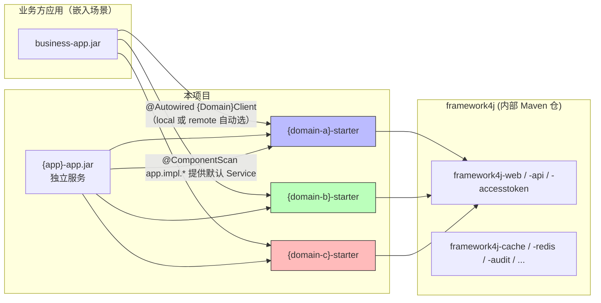
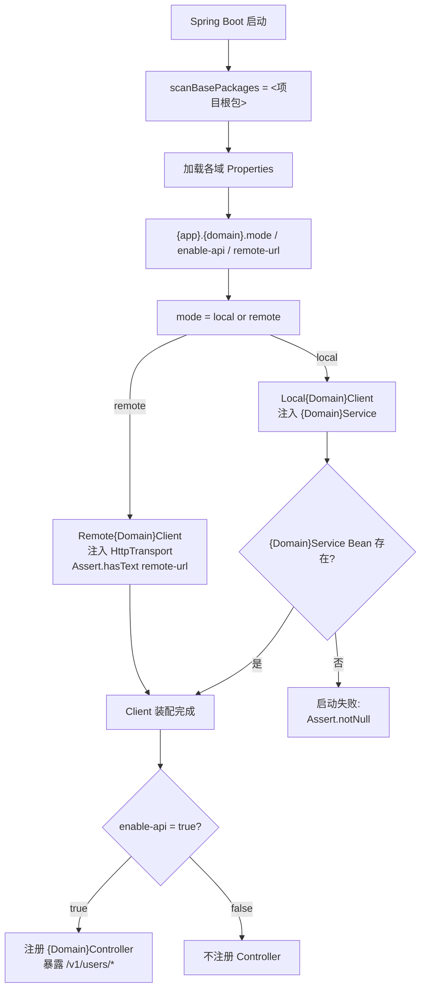
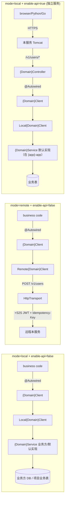

# 双模式技术方案（user-starter 模式 · 通用版）

> **适用**：需要把一组业务能力做成 Spring Boot Starter，同时支持「业务方同进程嵌入 / 跨进程调用 / 独立部署」三种形态的工程
> **版本**：v2.0.1 · 2026-09-16（通用化改写，基线 v2.0.0 · 2026-07-09）
> **模式基线**：参考 user-spring-boot-starter 通用模式，按本项目的 N 个业务域做镜像适配
>
> **记号约定**：`{app}` = 项目/配置前缀占位；`{domain-a/b/c}` = 业务域占位；`{Domain}` = 对应域的类名前缀。
> 下文示例域用 identity / realname / thirdparty（域 A/B/C），示例实体用 User——实际替换为你的业务域与实体。
>
> **配套文档**（按项目实际提供）：技术栈说明 / 各业务域业务设计 / 接口设计 / 数据库设计 / DDL

---

## 修订历史

| 版本 | 日期 | 修改人 | 变更说明 |
|---|---|---|---|
| v2.0.1 | 2026-09-16 | 架构组 | **通用化改写**：去除项目专名，模块/类/配置改为占位符表述（`{app}` / `{domain}` / `{Domain}`）；identity/realname/thirdparty 降为示例域 |
| v2.0.0 | 2026-07-09 | 架构组 | **重大重写**：从「3 pattern + 22 模块」收敛到「user-starter 模式 + 7 模块」。采用 3 域 starter 模式 |
| v1.0.0 | 2026-07-09 | 架构组 | 初始版本（已被 v2.0.0 取代） |

---

## 一、方案目标

同一份代码 / 同一套 jar 包，通过 **application.yml 两个开关** 适配两类典型场景：

| 场景 | {app}.{domain}.mode | {app}.{domain}.enable-api | 行为 |
|---|---|---|---|
| **业务方同进程嵌入** | `local`（默认） | `false` | 业务方 `@Autowired {Domain}Client`，自动走本地 Java 方法调用，零 HTTP |
| **业务方跨进程调用** | `remote` | （无所谓） | 业务方同 client 接口，框架自动改用 HttpTransport 远程调用本服务 |
| **独立部署（自己起 HTTP）** | `local` | `true` | 本项目 Controller 自动注册 `/v1/users/*` 路由，对外暴露 OpenAPI（异构客户端 Python/Go 可调） |

**核心承诺**：业务方只 inject **各域的 `{Domain}Client` 接口**（示例：identity 域的 `UserClient`），**不关心** local 还是 remote —— 由 yml 的 `mode` 决定。

---

## 二、设计原则

### 2.1 开闭原则 (OCP)
对扩展开放，对修改关闭。新增传输协议（gRPC / Dubbo）或本地存储介质（Redis / MongoDB）时，**无需修改**核心调用逻辑；只需替换 `HttpTransport` Bean 或实现新的 `{Domain}Service`。

### 2.2 依赖倒置原则 (DIP)
客户端核心业务逻辑依赖于抽象接口 `{Domain}Client`，不依赖具体实现（`Local{Domain}Client` 或 `Remote{Domain}Client`）。业务方代码只依赖 `{Domain}Client`，由 starter 决定实现类。

### 2.3 单一职责原则 (SRP)
- **Controller**（`@RestController`）：HTTP 路由
- **Transport**（`HttpTransport`）：传输抽象
- **Client**（`{Domain}Client`）：门面接口 + Local/Remote 实现
- **Service**（`{Domain}Service`）：本地业务接口（业务方实现）

### 2.4 防御式编程
- `@Validated` + `@Pattern` 启动期强校验 `mode` 合法性
- `Assert.hasText(...)` 启动期断言 `remote-url` 非空（remote 模式）
- `@ConditionalOnMissingBean({Domain}Service.class)` 启动期校验 local 模式有 Service 实现

---

## 三、模块拓扑

### 3.1 7 模块结构

```
{app}/                                                ← reactor 根（parent pom，无业务代码）
├── {app}-common/{model, util, constant}              ← 公共层
├── {domain-a}-spring-boot-starter                    ← 业务域 A starter（示例：identity）
│   ├── config/{Domain}Properties                     ← 模式配置（@Validated）
│   ├── client/{Domain}Client                         ← 业务方唯一依赖接口
│   ├── client/impl/Local{Domain}Client               ← mode=local
│   ├── client/impl/Remote{Domain}Client              ← mode=remote
│   ├── service/{Domain}Service                       ← 业务方在 mode=local 时实现
│   ├── controller/{Domain}Controller                 ← @ConditionalOnProperty enable-api=true
│   ├── transport/HttpTransport + 默认实现             ← 可替换 RestTemplate/WebClient
│   └── autoconfigure/{Domain}AutoConfiguration
├── {domain-b}-spring-boot-starter                    ← 业务域 B starter（结构镜像）
├── {domain-c}-spring-boot-starter                    ← 业务域 C starter（结构镜像）
└── {app}-app                                         ← 独立服务入口（standalone 部署）+ 默认 Service 实现
```

**核心设计**：每域一个 starter ≈ 12 文件，**单一职责、完全对称**。业务方按需引 starter，独立的各域各自演进。

### 3.2 依赖图



---

## 四、运行流程

### 4.1 启动装配流程



### 4.2 业务调用路径对比



---

## 五、配置文件

### 5.1 文件分工

| 文件 | 用途 |
|---|---|
| `application.yml` | 跨模式不变的基线（profile + 公共 framework4j 配置） |
| `application-embedded.yml` | embedded profile 补充（`spring.main.web-application-type=none` 等） |
| `application-service.yml` | service profile 补充（`server.port`、Knife4j 文档端点） |
| `application-{env}.yml` | 环境覆盖（Dev / Staging / Prod） |

### 5.2 application.yml 公共基线（节选）

```yaml
spring:
  datasource:
    url: jdbc:postgresql://${DB_HOST:localhost}:${DB_PORT:5432}/${DB_NAME:appdb}
  flyway:
    enabled: true
    locations: classpath:db/migration

# 各域 starter 的核心配置（user-starter 模式核心开关；{app} = 项目配置前缀，域名=示例域）
{app}:
  identity:
    mode: ${APP_IDENTITY_MODE:local}              # local | remote
    enable-api: ${APP_IDENTITY_ENABLE_API:true}    # true = 注册 Controller
    remote-url: ${APP_IDENTITY_REMOTE_URL:}        # remote 模式必填
  realname:    { mode: local, enable-api: false, remote-url: ... }
  thirdparty:  { mode: local, enable-api: false, remote-url: ... }

# framework4j 配置（每个 starter 已自带；app 端补全）
framework4j:
  redis:        { enabled: true, ... }
  sensitive:    { enabled: true, encryption-key: ... }
  access-token: { enabled: true, secret-key: ..., hash-salt: ... }
  cache:        { enabled: true }
  audit:        { enabled: true }
  rate-limit:   { enabled: true }
  idempotency:  { enabled: true, ttl-seconds: 172800 }
```

### 5.3 关键属性映射表

| 属性 | 取值 | 行为 |
|---|---|---|
| `{app}.{domain}.mode` | `local`（默认） | 创建 `Local{Domain}Client`，注入 `{Domain}Service` Bean |
| `{app}.{domain}.mode` | `remote` | 创建 `Remote{Domain}Client`，注入 HttpTransport；**`Assert.hasText(remote-url)`** 启动失败 if missing |
| `{app}.{domain}.enable-api` | `false`（默认） | 不注册 `{Domain}Controller`，零 HTTP 路由 |
| `{app}.{domain}.enable-api` | `true` | 注册 Controller，暴露 `{domain}` 路径下的所有 @RequestMapping |
| `{app}.{domain}.remote-url` | URL | remote 模式必填 |
| `{app}.{domain}.connect-timeout-ms` | int | HttpTransport 连接超时（默认 3000） |
| `{app}.{domain}.read-timeout-ms` | int | HttpTransport 读取超时（默认 5000） |

---

## 六、代码样例

### 6.1 业务方嵌入（最常见）

**业务方 pom.xml**：
```xml
<dependency>
    <groupId>/* 项目 groupId */</groupId>
    <artifactId>{domain-a}-spring-boot-starter</artifactId>
    <version>1.0.0</version>
</dependency>
<dependency>
    <groupId>/* 项目 groupId */</groupId>
    <artifactId>{domain-b}-spring-boot-starter</artifactId>
    <version>1.0.0</version>
</dependency>
<!-- 不需要 {domain-c} 就不引 -->
```

**业务方 application.yml**：
```yaml
# 业务方自己的数据源
spring:
  datasource:
    url: jdbc:postgresql://localhost:5432/order_db

# 示例：三域全开 local + enable-api=false（不暴露 HTTP）
{app}:
  identity: { mode: local, enable-api: false }
  realname: { mode: local, enable-api: false }
  thirdparty: { mode: local, enable-api: false }
```

**业务方代码**：
```java
@Service
public class OrderService {

    @Autowired
    private UserClient userClient;           // 只 inject 接口，框架自动选 Local/Remote

    public Order createOrder(String uid, OrderDto req) {
        // 一行调用，0 网络；底层走 LocalUserClient → UserService
        UserDto user = userClient.getById(uid);
        if (user == null) throw new UserNotFoundException(uid);
        // ...
    }
}
```

**业务方提供 `UserService` 实现（注入 starter 包装）**：
```java
@Service
public class MyUserServiceImpl implements UserService {
    @Autowired private UserJpaRepository repo;   // 业务方自有 JPA / 业务逻辑

    @Override
    public UserDto create(CreateUserRequest req) {
        return mapToDto(repo.save(toEntity(req)));
    }

    @Override
    public UserDto getById(String id) {
        return mapToDto(repo.findById(id).orElseThrow(...));
    }
}
```

**性能**：本地 Java 调用，0 网络跳数，单次 RT < 1ms。

### 6.2 业务方跨进程（remote 模式）

**业务方 yml**：
```yaml
{app}:
  identity: { mode: remote, enable-api: false, remote-url: http://{domain-a}.svc.cluster.local:8080 }
  # 不需要其他域就不引对应 starter
```

**业务方代码不变** —— `userClient.getById(uid)` 内部自动走 `RemoteUserClient` → `HttpTransport.post(...)`。

**性能**：1 次跨进程 HTTP（~5-20ms），自动注入 framework4j-access-token JWT + Idempotency-Key。

### 6.3 独立服务（本项目自跑）

```bash
# 构建
mvn -pl {app}-app -am package -DskipTests

# 启动
export APP_IDENTITY_MODE=local
export APP_IDENTITY_ENABLE_API=true
export DB_HOST=pg-cluster.internal
java -jar {app}-app-1.0.0.jar
```

**默认行为**：
- `mode=local` + `enable-api=true` 触发 Controller 注册 → `/v1/users` POST/GET 路由可用
- `UserClient` 是 `LocalUserClient` → 调 `UserService` Bean → 调默认 `DefaultUserServiceImpl`
- 默认 Impl 在 `{app}-app/src/.../app/impl/` 是占位 stub，下迭代替换为 MyBatis-Plus + 业务表的真实实现

**启动期强校验**：
- `mode=remote` 但 `remote-url` 为空 → `Assert.hasText(...)` 立即失败
- `mode=local` 但 `{Domain}Service` Bean 不存在 → `Assert.notNull(...)` 立即失败
- `mode` 不是 `local|remote` → JSR-303 `@Pattern` 立即失败

### 6.4 异构客户端（Python/Go）

不需要任何代码层面的 client SDK。直接 HTTP 调我们暴露的 OpenAPI 路由：

```bash
curl -X POST http://{domain-a}:8080/v1/users \
  -H "Authorization: Bearer <S2S JWT>" \
  -H "Idempotency-Key: $(uuidgen)" \
  -H "X-Service-Name: python-orders" \
  -H "Content-Type: application/json" \
  -d '{"nickname":"张三","phone":"13812345678"}'
```

**响应信封**：
```json
{
  "code": 0,
  "message": "success",
  "data": { "user_id": "892310293123123", "status": "ACTIVE", "...": "..." },
  "error": null,
  "trace_id": "c0a8010116983728001",
  "timestamp": 1718660400000
}
```

---

## 七、自动装配条件矩阵

| Bean | @ConditionalOnProperty | 加载条件 |
|---|---|---|
| `{Domain}Properties` | (always) | BindConfig |
| `{Domain}Service` | （业务方/默认 impl 提供） | mode=local 时必须有 |
| `Local{Domain}Client` | `{app}.{domain}.mode=local` (default missing) | mode=local + Service 存在 |
| `Remote{Domain}Client` | `{app}.{domain}.mode=remote` | mode=remote + remote-url 强校验 |
| `HttpTransport` | (always) | RestTemplate 缺省，业务方可替换 |
| `{Domain}Controller` | `{app}.{domain}.enable-api=true` | 仅当 enable-api=true 时注册 |
| 同理其他域 starter | 同上 | 同上 |

---

## 八、性能与权衡

| 维度 | local | remote（HTTP） | service（独立） |
|---|---|---|---|
| 网络跳数 | 0 | 1 | 视客户端位置 |
| 单次 RT | < 1 ms | 5-20 ms | 5-20 ms |
| 启动耗时 | 同 host | 同 host | +2-4 s（独立 Tomcat） |
| 内存占用 | 同 host | 同 host | +80-100 MB |
| 端口占用 | 0 | 0 | 8080 |
| jar 体积 | 业务方仅引所需 starter | 同 | 同 |

**取舍矩阵**：
- 最低延迟 / 最高吞吐 → **embedded local**（业务方同进程）
- 业务方单体服务集成 / 不想写 SDK → **service 独立**（Python/Go 都可用）
- 业务方微服务 + 能力包跨网络隔离 → **remote**
- 升级能力包不影响业务方 → **service 独立**

---

## 九、踩坑清单

### 9.1 ❌ 反模式

| # | 反模式 | 为何错 |
|---|---|---|
| 1 | 在 `application-local.yml` 设 `web-application-type=none` | 业务方 host 自身需要 web 与否由其自己决定 |
| 2 | 业务方在 `@Autowired {Domain}Client` 上同时猜 Local/Remote | 抽象已做，无须猜 |
| 3 | 业务方绕过 `{Domain}Client` 直接注入 `{Domain}Service` | 破坏 DIP，业务方失去 mode 切换能力 |
| 4 | mode=remote 但 `remote-url` 留空 | 启动期会 `Assert.hasText` 报错；不要依赖运行时延迟报错 |
| 5 | 给 starter 加 `@SpringBootApplication` | starter 是 library 不是 runnable |
| 6 | 业务方自定义 Transport Bean 不设置 `connect-timeout-ms` | 默认 3s/5s 仍生效；但业务方应明确 |

### 9.2 ✅ 应该做的事

| # | 规则 |
|---|---|
| 1 | 各域分别引各自的 starter，避免一次性引入整个能力包 |
| 2 | 在 application.yml 用 `${APP_*}` 占位符，让环境变量注入 |
| 3 | mode=remote 时先在 staging 验证网络可达：DNS / Service Mesh / Firewall |
| 4 | 异构客户端（Python/Go）走 service 模式 + OpenAPI，不引我们的 starter |
| 5 | 业务方提供 `{Domain}Service` 时优先 `@Transactional`，不要在 starter 里管理事务 |

---

## 十、版本演进

| 版本 | 计划 |
|---|---|
| **v1.0**（当前） | 7 模块骨架 + 各域 starter + 默认 Service 占位 |
| **v1.1** | 替换占位 Service 为 MyBatis-Plus + 业务表真实实现；填充各域全量 Client 方法 |
| **v1.2** | framework4j-accesstoken 强制启用（接认证服务 S2S） |
| **v2.0** | framework4j-accesstoken / rate-limit / audit / sql-tracing 全部 path-patterns 接管 |
| **v2.1** | HttpTransport 替换为 WebClient + 响应式 |

---

**文档结束。**

> **落地映射**：将本文 `{app}` / `{domain}` / `{Domain}` 占位符替换为项目实际前缀、域名与类名前缀即可实施；配套的 framework4j 模块来源与坐标见项目技术栈说明文档。
