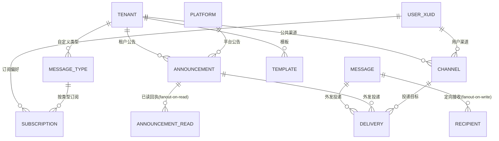
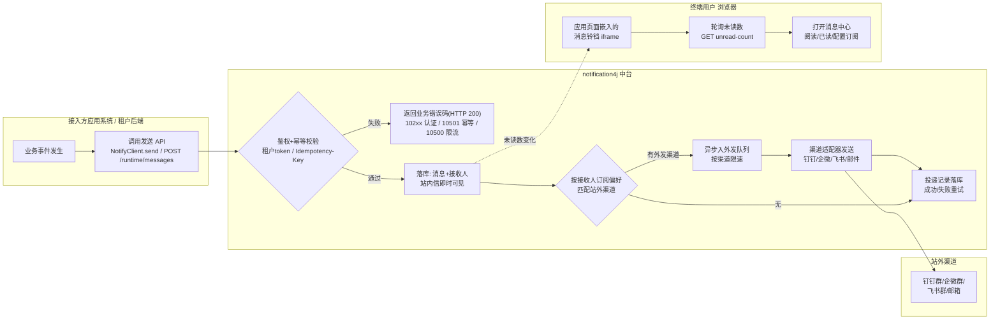
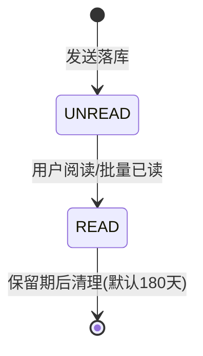
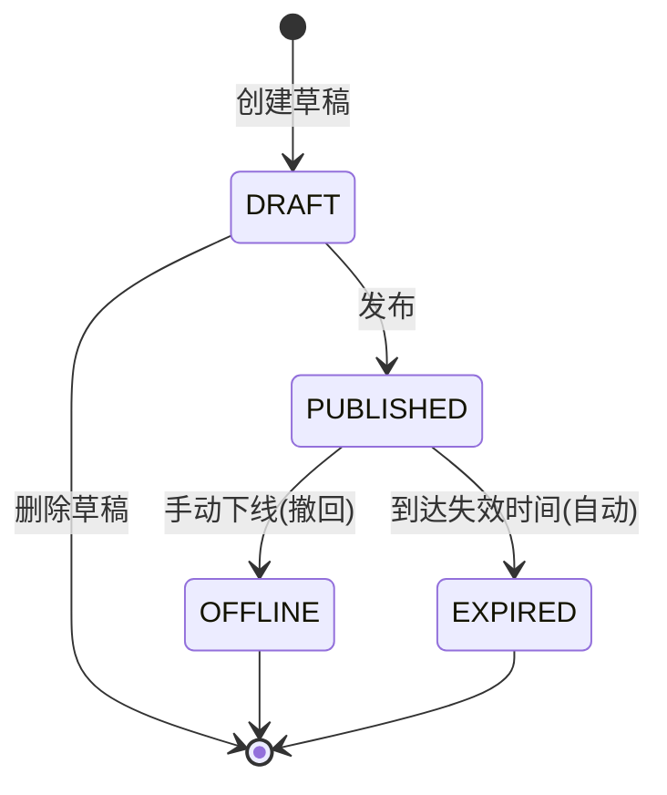
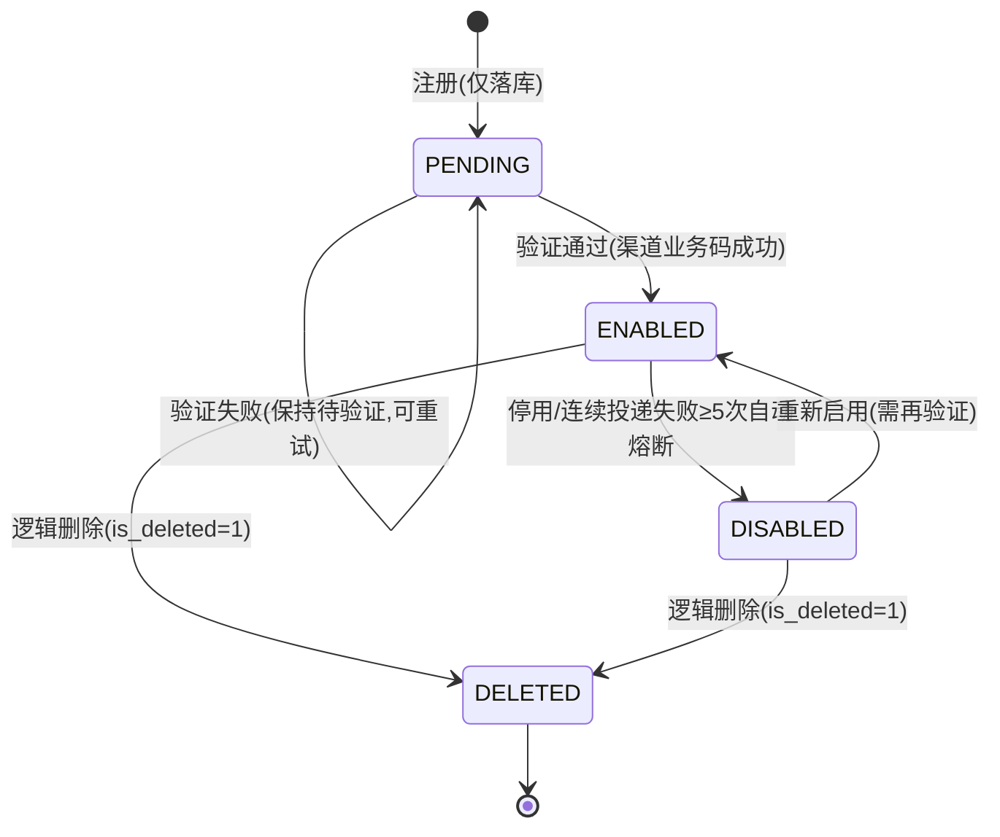
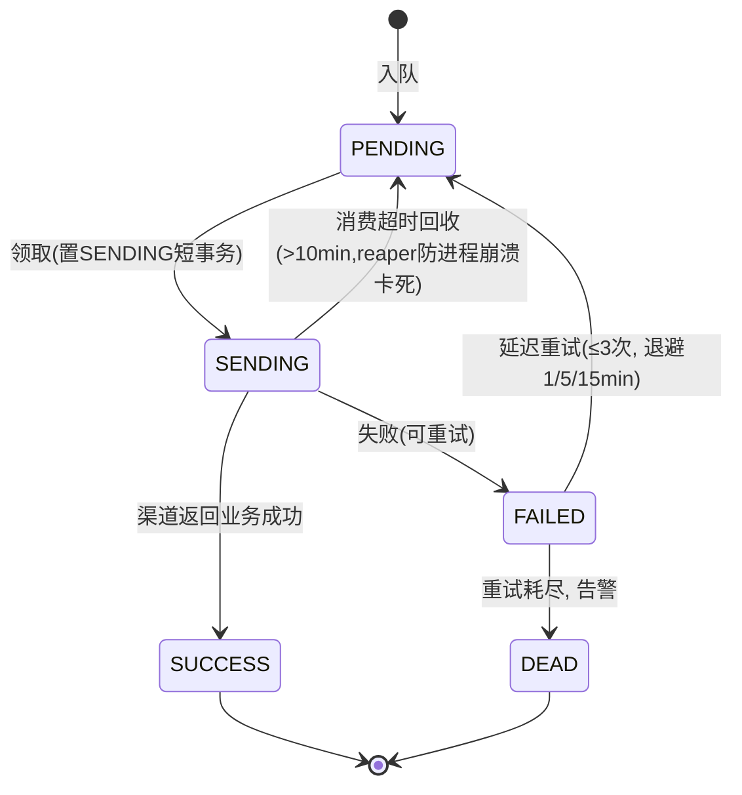

# notification4j 产品设计文档（PRD）

> **文档状态**：草稿（待评审）
> **编写依据**：mc-doc-prd《PRD 编写规范 v1.0》
> **配套文档**：《开发原则》《中间件中台租户设计》《双模式技术方案》
> **简码约定**：`nfy`（notify），路径前缀 `/nfy/*`，表前缀 `nfya_*`（应用层）/ `nfyp_*`（平台层，对齐 benefit4j `ubma_/ubmp_` 分层惯例）

---

## 1. 基础信息

### 1.1 项目信息表

| 项 | 值 |
|---|---|
| 项目名称 | notification4j 消息通知微中台 |
| 项目代号 | NFY-V1.0 |
| 文档状态 | 草稿 |
| 创建日期 | 2026-09-16 |
| 产品负责人（PM） | justin |
| 技术负责人（Lead） | justin |
| 前端负责人（Vue） | justin |
| 后端负责人（Java） | justin |
| 测试负责人（QA） | justin |
| 交互 / UI 设计 | 复用 benefit4j 控制台 UI 体系 |

### 1.2 修订历史

| 版本号 | 修订日期 | 修订类型 | 修订内容摘要 | 修订人 | 审核 / 批准人 |
|---|---|---|---|---|---|
| V1.0.3 | 2026-09-16 | 变更 | 第 4 轮终审联动修订：免打扰 P2→V1.2 补漏（§2.2.6）；F-ANN 字段表补 link_url；F-SUB 补 URGENT 文案要求 | justin | 评审会（第 4 轮终审） |
| V1.0.2 | 2026-09-16 | 变更 | 第 3 轮修复：URGENT 渠道集定死（全部 ENABLED 注册渠道）；biz_no 幂等口径统一；平台公告 channel_ids 置空；泳道图/§4.1 HTTP 语义对齐（10207 非 401）；未读水位线含平台公告+TTL 兜底；渠道状态机补验证失败/删除终态；免打扰 P2→V1.2；keyword 改包含匹配 | justin | 评审会（第 3 轮） |
| V1.0.1 | 2026-09-16 | 变更 | 评审第 1 轮修复：公告外发=公共渠道+用户订阅双生效；订阅兜底（INAPP 锁定/失效剔除回落/URGENT 恒投）；F-TYP 补字段表；投递状态机补 SENDING 回收；未读数公告水位线；错误码对齐接口文档；EMAIL 提前至 V1.0；补发布回滚预案。第 2 轮：平台公告接口拆行、mandatory 忽略语义、F-DLV 补 stats 行、表名勘误 | justin | 评审会（第 1、2 轮） |
| V1.0.0 | 2026-09-16 | 新建 | 初始化：竞品调研（7 家厂商 + 3 个 Java 开源项目）、功能需求、分期范围 | justin | 待评审 |

---

## 2. 导言与业务模型

### 2.1 项目背景

#### 痛点描述

集团内每个应用系统（权益、钱包、网关、IAM 等）都在各自重复建设「消息通知」能力：

- 各系统各自实现站内信表、已读/未读逻辑、铃铛角标，**体验不一致、数据不通**；
- 站外触达（钉钉群、企微群、邮件、短信）每个系统各接一遍，webhook 散落在配置里，**无统一管理、无投递记录、失败无人知晓**；
- 用户想在「应用 A 告警」和「应用 B 账单提醒」之间配置不同的接收方式，**没有任何系统支持按类型的订阅偏好**；
- 新系统接入通知能力平均要 1~2 周自研，且质量参差。

#### 产品定位

**notification4j 是通用的应用系统消息通知微中台**：以多租户模式对外提供「站内消息 + 公告 + 站外渠道通知」的统一能力。应用系统（租户）通过 **OpenAPI / Java Starter** 一个接口发消息，终端用户通过**嵌入式微前端消息中心**查看与管理通知，站外渠道（钉钉/企微/飞书/邮件/短信）由用户**自助注册、自助订阅**。

技术上与 benefit4j（权益中台）同构：同一套《中间件中台租户设计》（三域接口、租户隔离、X-User-Id 透传）、同一套《双模式技术方案》（local/remote/独立部署三形态）、同一套 framework4j 技术底座。

#### 业务价值

| 指标 | 当前 | 目标（V1.0 上线后 3 个月） |
|---|---|---|
| 新系统接入通知能力耗时 | 1~2 周自研 | ≤ 0.5 天（引 starter + 嵌 iframe） |
| 站外通知投递可观测性 | 无投递记录 | 100% 投递留痕，成功率可查询 |
| 通知重复建设 | 每系统一套 | 0 套（全部接入中台） |
| 用户消息触达率 | 站内信单一渠道 | 用户自选渠道，紧急消息多渠道触达 |

**北极星指标**：接入应用数 × 周人均消息阅读量（中台被真实使用的证明）。
**二级指标**：站内信 7 日已读率、站外渠道投递成功率、用户渠道注册渗透率、嵌入消息中心接入应用数。

### 2.2 大厂与专业厂家方案调研（7 家）

> 调研时点 2026-09。结论先行：**「类型×渠道订阅矩阵 + 强制渠道 + 用户自注册 webhook 渠道 + 嵌入式消息中心」**是覆盖 90% 场景的最小集；工作流编排、A/B 测试、App 厂商通道合并推送属于过度设计，明确不做（见 §5.3）。

#### 2.2.1 阿里云消息中心 —— 云控制台消息中心标杆

- **消息形态**：站内信（默认开启不可关）、待办（审批类）、产品公告；
- **订阅管理（基本接收管理）**：按消息类型勾选接收渠道（短信/邮件/站内信），可为渠道设**接收数量上限**、设多个**消息接收人**、按**黑白名单关键词**过滤；
- **渠道分级提醒**：语音电话用于「生产故障告警」等强提醒场景；**机器人接收**支持钉钉/企业微信/飞书/Slack/Webhook，定位团队协同（ChatOps）；
- **强制策略**：账户费用类通知**不允许修改**接收方式——重要消息不可被用户关掉。

**借鉴**：① 消息类型 × 渠道的订阅矩阵是产品标配；② 重要类型要有「强制渠道」策略；③ 群机器人是一等公民渠道。
**不借鉴**：语音电话（P2 外）、黑白名单关键词过滤（复杂、低频）。

#### 2.2.2 腾讯云消息中心 —— 订阅管理与免打扰

- **订阅管理**：支持站内信/邮件/短信/微信/企业微信/语音六种渠道；提供**基础编辑 / 高级编辑 / 批量编辑**三种配置模式；
- **底线约束**：每个产品的订阅**至少保留一个渠道 + 至少一位接收人**；欠费、产品到期/回收类通知**强制站内信 + 短信**；
- **消息免打扰**：可设免打扰时间段，但欠费/到期类消息**不适用免打扰**；
- **子用户订阅**：主账号可为子用户配置订阅（管理面与接收面分离）。

**借鉴**：①「至少一个渠道」校验；② 强制订阅类型白名单；③ 免打扰时段（V1.2 落地）。
**不借鉴**：三种编辑模式（只保留「按类型逐个配置」一种）、微信渠道。

#### 2.2.3 个推 / 极光推送 —— 专业推送厂商的通道思想

- **多通道聚合**：聚合 APNs/FCM/华为/小米/OPPO/vivo/荣耀/魅族等系统级通道 + 自有长连接通道，**智能通道选择**（在线走长连接、离线走厂商通道补推）；
- **定向能力**：标签 / 别名 / RegistrationID / 分组群推，多条件组合；
- **离线消息**：离线保留时长与条数可配，上线后补投；
- **运营能力**：A/B 测试、到达率/点击率统计、模板化推送。

**借鉴**：①「渠道适配器 SPI + 智能路由/降级」的架构思想——我们的站外渠道（钉钉/企微/飞书/邮件/短信）同样按适配器隔离、互不影响；② 投递结果统计（到达/点击）是刚需；③ 失败重试与离线补投。
**不借鉴**：App 系统级推送通道本身（那是 App 厂商通道的活，本中台的「推送」到 IM 群/邮箱/短信为止）、A/B 测试。

#### 2.2.4 钉钉 / 企业微信 / 飞书 群机器人 —— 站外渠道的接入现实

- **接入形态**：一个 webhook URL 即一个渠道（钉钉 `oapi.dingtalk.com/robot/send?access_token=xxx`；企微 `qyapi.weixin.qq.com/cgi-bin/webhook/send?key=xxx`；飞书 `open.feishu.cn/open-apis/bot/v2/hook/xxx`）；
- **消息类型**：三家均支持 text / markdown；钉钉、企微另有图文/卡片，飞书以消息卡片为主（markdown 为子集）；
- **安全设置**：自定义关键词 / 加签（钉钉 HMAC-SHA256 拼 URL，飞书签名放 body，企微不支持加签）/ IP 白名单；
- **频率限制**：钉钉、企微均约 **20 条/分钟/机器人**，超限限流。

**借鉴**：① 用户自注册 webhook 渠道的**极简接入**正是本平台核心交互；② 渠道配置必须保存「加签 secret、关键词」等安全参数；③ 外发必须按渠道限速（每渠道独立限速器）。
**工程含义**：三平台协议差异（`msgtype` vs `msg_type`、签名位置不同）必须收敛在渠道适配器内，业务层无感知。

#### 2.2.5 Novu —— 开源通知基础设施的产品抽象

- **核心抽象**：Workflow（投递编排）× Channel（in-app/email/SMS/push/chat 五渠道统一）× Subscriber × Topic（分组定向）；
- **Inbox 组件**：提供 React/JS 端的**可嵌入站内信收件箱组件**，一行代码接入，是「消息中心组件化」的标杆；
- **Preferences**：订阅者偏好产品化（按 workflow × channel 开关）；
- **生态**：60+ provider 集成，多语言服务端 SDK。

**借鉴**：① Inbox 组件化思路——我们对应「iframe 微前端消息中心」（更契合多租户白标）；② Preferences 产品形态；③ Topic≈我们的「消息类型」定向。
**不借鉴**：Workflow 可视化编排引擎（重，90% 场景一个「按订阅偏好分发」规则就够）。

#### 2.2.6 Knock / Courier —— SaaS 通知编排的取舍参考

- **Knock**：batching/digest（时间窗内合并通知）、in-app feed、preference center、定时与 quiet hours；
- **Courier**：渠道路由策略（瀑布式/最优渠道路由）、quiet hours/delivery window、可视化模板设计器。

**借鉴**：① preference center 的 UX（类型分组 + 渠道开关矩阵）；② quiet hours（V1.2 落地）。
**不借鉴**：digest 合并、瀑布式渠道路由、可视化模板设计器（用变量占位模板即可）。

#### 2.2.7 OneSignal —— 触达运营的边界确认

segmentation / 定时 / 智能发送时间 / A/B 测试 / journey，属营销触达域。**确认边界：本中台不做营销自动化与旅程编排**，营销类需求由业务方自行封装在「消息类型 + 模板」之上。

#### 2.2.8 能力对比矩阵与裁剪结论

| 能力 | 阿里云 | 腾讯云 | 个推/极光 | IM 机器人 | Novu | Knock/Courier | **本中台** |
|---|---|---|---|---|---|---|---|
| 站内信收件箱 | ✅ | ✅ | ➖ | ➖ | ✅(SDK) | ✅ | **✅ V1.0** |
| 公告/广播 | ✅ | ✅ | ✅ | ➖ | ✅(Topic) | ✅(Broadcast) | **✅ V1.0** |
| 类型×渠道订阅矩阵 | ✅ | ✅ | ➖ | ➖ | ✅ | ✅ | **✅ V1.0** |
| 用户自注册 IM 群 webhook | ✅(账号级) | ➖ | ➖ | (渠道本身) | ➖ | ➖ | **✅ 用户级 V1.0** |
| 邮件/短信渠道 | ✅ | ✅ | ➖ | ➖ | ✅ | ✅ | **✅ 邮件 V1.0（平台级 SMTP）/ 短信 V1.2** |
| 强制渠道（重要消息不可关） | ✅ | ✅ | ➖ | ➖ | ➖ | ➖ | **✅ V1.0** |
| 免打扰时段 | ➖ | ✅ | ✅ | ➖ | ✅ | ✅ | **V1.2** |
| 嵌入消息中心组件 | ➖ | ➖ | ➖ | ➖ | ✅ | ✅ | **✅ iframe 微前端 V1.0** |
| 多租户白标 | ➖ | ➖ | ➖ | ➖ | ➖ | ✅ | **✅ V1.0（核心差异）** |
| App 厂商通道合并推送 | ➖ | ➖ | ✅(核心) | ➖ | ➖ | ➖ | ❌ 不做 |
| 工作流编排引擎 | ➖ | ➖ | ➖ | ➖ | ✅(核心) | ✅(核心) | ❌ 不做 |
| Digest 合并摘要 | ➖ | ➖ | ➖ | ➖ | ✅ | ✅ | ❌ 不做 |
| A/B 测试/营销旅程 | ➖ | ➖ | ✅ | ➖ | ➖ | ✅ | ❌ 不做 |

**本中台的差异化定位**（大厂消息中心做不到的）：① **多租户中台**——一份部署服务 N 个应用系统，数据/配置/OEM 全隔离；② **终端用户级**的 IM 群 webhook 渠道自注册（阿里云是云账号级）；③ **微前端嵌入**消息中心，接入方 0 前端工作量；④ 与 framework4j 技术底座、benefit4j 同构租户体系无缝复用。

### 2.3 Java 开源项目调研与二开选型（TOP3）

> 结论先行：**不整体引入任何开源项目**，采用「benefit4j 底座（已复制）+ 分模块参考移植」的二开策略。三个 TOP 项目均不具备「多租户 + 三域接口 + 嵌入微前端」的中台形态，整体引入的改造成本 > 重写 50%（《开发原则》§2 阈值）。

#### 2.3.1 austin（消息推送平台）★8k+ —— 外发引擎蓝本

- **是什么**：Java3y 开源的专业消息推送平台，统一接口下发【邮件/短信/微信服务号/微信小程序/企业微信（机器人+应用消息）/钉钉（机器人+工作通知）/飞书/安卓 Push】；
- **架构**：`austin-api`（接入）→ MQ → `austin-handler`（各渠道 Handler 发送），另有 stream(Flink)/datahouse/admin/cron 模块；
- **亮点**：渠道 Handler 隔离互不影响、消息去重（文案/频次）、夜间屏蔽、定时下发、全链路追踪（按用户/模板/消息维度）、短信多渠道流量配比、动态模板占位符；
- **与本项目的差距**：无多租户（单企业）、无站内信收件箱、无嵌入前端、技术栈重（Kafka/Flink/Apollo/xxl-job）、定位教学与单体企业；
- **复用方式**：**参考移植渠道 Handler 层**（钉钉/企微/飞书机器人适配代码、加签实现、邮件发送）与「去重/屏蔽/链路追踪」设计；不引入其 Kafka/Flink 栈，异步外发用轻量队列实现。

#### 2.3.2 ruoyi-vue-pro / yudao ★30k+ —— 站内信/公告/短信邮件模型蓝本

- **是什么**：国内最流行的 Java 快速开发平台，`yudao-module-system` 内置完整消息体系：**站内信**（模板+消息，表带 `tenant_id` 租户隔离）、**通知公告**（WebSocket 实时推送）、**短信**（渠道+模板+日志，对接阿里/腾讯/华为/七牛云）、**邮件**（SMTP 账号+模板+日志）；
- **亮点**：四大模块统一「**模板 + 渠道 + 日志**」范式；模板 `{key}` 占位符渲染；短信 5 家供应商抽象；先写日志再异步发送（Spring Event + @Async）；
- **与本项目的差距**：全家桶平台（消息是子模块，非独立中台）、无 IM 群机器人渠道（钉钉/企微/飞书）、无订阅偏好矩阵、无外发投递状态机、租户模型与本方案《中间件中台租户设计》不兼容；
- **复用方式**：**参考其表设计与「模板+渠道+日志」范式**（站内信/公告/邮件/短信四模块），短信渠道适配代码可移植。

#### 2.3.3 JeecgBoot ★40k+ —— 公告/消息中心产品形态参考

- **是什么**：低代码平台，系统通告（SysAnnouncement）支持全员通告/指定用户、已读/未读、优先级弹窗，消息中心支持邮件/短信/钉钉/微信模板消息扩展 Handler；
- **亮点**：「公告 + 已读回执 + 弹窗强提醒」产品形态最完整；消息 Handler 扩展机制简单；
- **与本项目的差距**：低代码包袱重、多租户弱、渠道少、无中台化接口设计；
- **复用方式**：**仅参考公告产品形态**（强提醒弹窗、已读统计交互），不移植代码。

#### 2.3.4 组件级复用清单（SDK 直接依赖）

| 组件 | 用途 | 说明 |
|---|---|---|
| Sms4J | 短信渠道（V1.2） | 国产短信聚合 SDK，覆盖阿里/腾讯/华为等，引依赖即用 |
| group-robot（ymlluo） | 钉钉/企微/飞书机器人 | 链式语法、多平台同时发送；体量小，也可参照自研适配器 |
| HertzBeat 通知模块 | 参考 | 多 IM 渠道适配器实现参考（钉钉/企微/飞书/邮件/webhook） |

#### 2.3.5 二开技术路线决策（待评审 ADR）

| # | 决策 | 理由 | 备选（被否原因） |
|---|---|---|---|
| T1 | **底座 = 已复制的 benefit4j 工程**（租户/认证/控制台/嵌入四入口/双模式 starter 全套） | 与《中间件中台租户设计》《双模式技术方案》100% 对齐，生产验证过 | 引入 yudao/JeecgBoot 全家桶（租户模型不兼容，改造 >50%） |
| T2 | **外发引擎参考 austin 渠道 Handler 架构，轻量实现**（Spring 线程池队列 + framework4j，不引 Kafka/Flink） | 覆盖 90% 场景的渠道隔离/重试/链路追踪；部署轻 | 整体引入 austin（技术栈过重、无租户） |
| T3 | **站内信/公告/邮件/短信模型参考 yudao「模板+渠道+日志」范式** | 范式简洁、久经生产验证 | 照搬 austin 数据模型（偏教学、无外发状态机分离） |
| T4 | **公告产品形态参考 JeecgBoot**（强提醒/已读统计） | 交互成熟 | 自造交互（无谓创新） |
| T5 | 三 IM 机器人适配器自研（参照 group-robot/HertzBeat），SMS 引 Sms4J | 适配器代码量小、协议稳定；SMS 聚合 SDK 成熟 | 全自研短信适配（重复造轮子） |

> 按《开发原则》§2.4，以上决策与任何「参考工程原样复用（adapter/）」均需在 `docs/design/adr/` 留决策记录。

### 2.4 用户角色与权限定义

> 本中台是 M2B 租户模型，**无终端用户会话**（《中间件中台租户设计》）：终端用户身份以 `X-User-Id` 请求头透传，不建档、不鉴权；权限边界永远且仅是 `tenant_id`。

| 角色名称 | 角色 Code | 业务职责 | 关联菜单 / 页面 | 敏感操作权限 |
|---|---|---|---|---|
| 平台运营 | `ROLE_PLATFORM` | 租户接入管理、平台公告、全局模板、跨租户统计 | 平台控制台全部 | 租户停用 / 密钥重置 / 平台公告发布 / 注册码签发 |
| 租户管理员 | `ROLE_TENANT_ADMIN` | 本租户消息类型/公告/公共渠道/模板管理、发送统计 | 租户控制台管理面 | 租户公告发布 / 公共渠道增删 / 类型停用 |
| 终端用户 | `ROLE_END_USER` | 查看自己的消息与公告、注册自己的站外渠道、配置订阅偏好 | 嵌入消息中心（消息/公告/渠道/订阅/投递 5 页） | 无（仅操作自己 `X-User-Id` 名下数据） |
| 接入系统 | `ROLE_INTEGRATOR` | 通过 OpenAPI / Starter 发消息、发公告、查投递 | 无 UI（API 调用方） | 消息发送（runtime 面，可叠加 HMAC 签名） |

### 2.5 核心概念模型

| 概念 | 说明 | 关键设计 |
|---|---|---|
| 租户 Tenant | 接入的应用系统，隔离边界 | 复用《中间件中台租户设计》`nfya_tenant` |
| 消息 Message | **定向**站内消息（发给指定用户/批量用户） | fanout-on-write：发送即落接收人行 |
| 公告 Announcement | **广播**消息（平台→全部租户 / 租户→全部用户） | fanout-on-read：不预写接收人，按已读回执表计算未读；中台不掌握用户全集，广播只能这样。**平台公告 tenant_id=0**（合成平台租户），runtime 查询以 `tenant_id IN (0, :当前租户)` 豁免收口过滤——该豁免写进查询收口层规约并补越权测试用例 |
| 消息类型 MessageType | 租户自定义（如 `ORDER`/`SECURITY`/`MARKETING`）+ 内置 `SYSTEM`/`ANNOUNCEMENT` | 订阅偏好、模板、统计均按类型；`mandatory=1` 时其 `default_channels` 即**强制渠道集**（用户不可关） |
| 消息等级 Level | `NORMAL` 普通 / `IMPORTANT` 重要 / `URGENT` 紧急 | URGENT：**INAPP 恒投 + 该用户全部 ENABLED 注册渠道（完全无视订阅矩阵勾选）**，忽略免打扰；订阅页有文案「紧急消息将通过您的全部可用渠道发送」；IMPORTANT 视觉强调 |
| 渠道 Channel | `INAPP` 站内信（**锁定必有，不可开**）+ `DINGTALK`/`WECOM`/`FEISHU`/`EMAIL` + `SMS`（V1.2） | 分**用户渠道**（用户自注册）与**租户公共渠道**（如运维群机器人，用于公告/广播外发） |
| 订阅偏好 Subscription | 用户 × 消息类型 × 渠道集合；「至少一个渠道」校验（INAPP 锁定天然满足）；强制类型强制集不可关；**渠道删除/熔断时自动从订阅剔除，行变空自动回落 INAPP 并站内信通知用户** | 对齐阿里云/腾讯云订阅管理形态；公告类型的站外渠道订阅对公告外发生效（见 F-ANN-001） |
| 模板 Template | 标题/内容 + `{var}` 占位符，按类型绑定 | yudao「模板+渠道+日志」范式 |
| 投递 Delivery | 消息/公告 × 渠道的外发记录（状态机+重试） | 全链路可观测的根基 |

### 2.6 全局业务流程图（泳道图）

### 2.7 状态机

**消息接收状态（站内信）**

**公告生命周期**

**渠道状态**

> 删除是独立标志位（is_deleted），不设状态枚举值；DELETED 为终态（订阅联动剔除回落 INAPP，见 F-SUB-001）。

**外发投递状态**

> 语义声明：**at-least-once**——崩溃回收可能导致渠道侧重复投递，可接受（IM 群多一条消息优于丢消息）；渠道返回以业务码判定成功（钉钉/企微 `errcode=0`、飞书 `code=0`，SMTP 2xx），非仅 HTTP 200。

---

## 3. 功能需求详述

### 3.1 F-MSG-001 消息发送（OpenAPI / Starter）

#### 1. 入口与路由
- 接入方后端调用：`POST /nfy/api/v1/runtime/messages`（租户域 runtime 面）或 `NotifyClient.send(req)`（starter）
- 权限：租户 AccessToken（TENANT 型 JWT），runtime 面可叠加 HMAC 签名

#### 2. 原型参考
无 UI。调用样例见接口需求。

#### 3. 交互要素
- 发送模式：`user_ids`（指定用户列表，单次 ≤1000）——**全员广播一律走公告（F-ANN），消息不开放广播**，模型最简；标签/分组定向为后续预留，V1.x 不实现；
- 支持 `biz_no`（租户业务号）幂等：`UNIQUE(tenant_id, biz_no)` 是真闸——同号 + 同 Idempotency-Key → 返回首次结果；同号 + 无 Key（或不同 Key）→ `10401` 业务号重复，提示查 send-results；
- 支持引用模板：`template_code + params` 或直接 `title/content`（二选一）；
- 支持 `channels_override`（发送级强制渠道类型集，少用）：缺省按订阅偏好计算外发；
- **批量同步豁免论证**（mc-api-spec N>100 异步规则的豁免）：发送是单聚合写（一条消息 + 批量 INSERT 接收人），外发已异步，≤1000 接收人同步返回可控（P99 ≤500ms）；>1000 走 V1.1 批量接口异步 Job。

#### 4. 字段校验表

| 字段 | 元素 | 必填 | 校验规则 | 异常提示 | 后端字段 | 字典 |
|---|---|---|---|---|---|---|
| 业务号 | body | 否 | ≤64 字符，租户内唯一 | "业务号重复" | `biz_no VARCHAR(68)` | - |
| 消息类型 | body | 是 | 必须是本租户已启用类型 | "消息类型不存在或已停用" | `type_code VARCHAR(36)` | TYPE_* |
| 等级 | body | 否 | 枚举值，默认 NORMAL | "等级非法" | `level VARCHAR(20)` | NORMAL/IMPORTANT/URGENT |
| 接收人 | body | 是 | 1~1000 个，单 ID ≤64 字符 | "接收人列表为空或超限" | `user_ids JSON` | - |
| 标题 | body | 条件必填 | 1~100 字符（直发时必填） | "标题为空或超长" | `title VARCHAR(132)` | - |
| 内容 | body | 条件必填 | 1~2000 字符（markdown 子集） | "内容为空或超长" | `content TEXT` | - |
| 跳转链接 | body | 否 | http(s) URL ≤500 | "链接格式非法" | `link_url VARCHAR(516)` | - |
| 模板编码 | body | 条件必填 | 存在且 ENABLED（与标题/内容二选一，V1.1） | "模板不存在" | `template_code VARCHAR(68)` | - |
| 模板参数 | body | 否 | 与模板占位符匹配 | "模板参数缺失:{name}" | `params JSONB` | - |
| 强制渠道 | body | 否 | 渠道类型枚举 | "渠道类型非法" | `channels_override JSONB` | 渠道类型 |

#### 5. 边界逻辑
- **防重**：前端无；后端 `Idempotency-Key` + `UNIQUE(tenant_id, biz_no)` 双闸；同 key 不同 body → `10501`；
- **大批量**：>1000 接收人走批量接口（V1.1 异步 Job），V1.0 超量报 `10102`；
- **接收人有效性**：不校验用户是否存在（用户体系归租户，中台只透传存储）；
- **外发匹配**：发送时按每个接收人的订阅偏好计算外发渠道集合，无偏好记录则按类型默认策略（站内信 + 类型默认外发渠道）。

#### 6. 接口需求

| # | URL | Method | 用途 | 关键字段 |
|---|---|---|---|---|
| 1 | /nfy/api/v1/runtime/messages | POST | 发送定向消息 | biz_no, type_code, level, user_ids, title, content / template_code+params, link_url, channels_override |
| 2 | /nfy/api/v1/runtime/messages/batch | POST | 批量发送（V1.1，异步 Job） | 同上，user_ids ≤ 100000 分批 fanout |
| 3 | /nfy/api/v1/runtime/send-results/{biz_no} | GET | 按业务号查发送结果与投递状态 | biz_no |

契约维护：Apifox（待录入）。

### 3.2 F-MSG-002 嵌入式消息铃铛与未读数

#### 1. 入口与路由
- 接入方页面嵌入：`<iframe src="{nfy-host}/nfy/tenant/page/bell?brand=xx&mode=dark">`，尺寸 48×48 起
- 路由：`/nfy/tenant/page/bell`（单页壳，无导航）
- 权限：嵌入认证（§F-EMB-001 postMessage 握手），token 由租户后端代换

#### 2. 原型参考
Novu Inbox 组件 / 阿里云控制台右上角铃铛：铃铛图标 + 未读数角标（99+ 封顶），点击展开最近 5 条下拉 +「查看全部」跳完整消息中心。

#### 3. 交互要素
- 未读数轮询：30s 一次（页面不可见时暂停）；URGENT 消息到达时通过 postMessage 通知父页（V1.0 即支持；SSE 实时推送为 V2.0 演进）；
- 未读数 = 定向消息未读数 + 生效中未确认公告数（需确认型）；
- 组件拆分：`BellIcon.vue` / `RecentDropdown.vue`。

#### 4. 字段校验表
无用户输入。

#### 5. 边界逻辑
- 未读数接口必须缓存（Redis，`tenant_id+userid` 为 key），P99 ≤ 200ms；
- **缓存策略**（与公告 fanout-on-read 模型对齐）：定向消息未读数**写时失效**（发送扇出/已读/确认时 DEL，miss 查库回填）；公告维度用**公告水位线**——水位线 = `max(updated_at) over tenant_id IN (0,:当前租户)` 的公告（含平台公告；发布/下线/定时任务置 EXPIRED 均会变更 updated_at），缓存值携带水位线，读取时重算比对、不一致即重算；时间驱动变化（effective_at 定时到点）由 **TTL 1h** 兜底（定时公告允许分钟级延迟）；
- token 过期 → iframe 内静默展示「重新加载」占位，不打断父页；
- 角标数字 >99 显示 `99+`。

#### 6. 接口需求

| # | URL | Method | 用途 | 关键字段 |
|---|---|---|---|---|
| 1 | /nfy/api/v1/runtime/messages/unread-count | GET | 未读数（含公告未确认数） | X-User-Id |
| 2 | /nfy/api/v1/runtime/messages/recent | GET | 最近 N 条（默认 5） | X-User-Id, limit |

### 3.3 F-MSG-003 消息列表与详情（站内信）

#### 1. 入口与路由
- 路由：`/nfy/tenant/app/messages`（完整壳）/ `/nfy/tenant/page/messages`（单页壳，供 iframe）
- 权限：嵌入认证 + `X-User-Id`

#### 2. 原型参考
阿里云消息中心站内信列表：左侧类型筛选，右侧列表（未读加粗+等级色标），详情抽屉。

#### 3. 交互要素
- 筛选：类型 / 等级 / 已读状态 / 时间范围；搜索标题关键词（**包含匹配**，在当前用户消息集内过滤——单用户行数千级，子集内包含匹配成本可控，不违反禁全模糊铁律）；
- 操作：单条已读、全部已读、查看详情（自动置已读）、跳转 `link_url`（新窗口）；
- 组件拆分：`MessageList.vue` / `MessageDetailDrawer.vue` / `MessageFilterBar.vue`。

#### 4. 字段校验表
列表查询参数：`type_code`（字典）、`level`（字典）、`read_status`（UNREAD/READ）、`keyword`（≤50）、分页参数。

#### 5. 边界逻辑
- **分页**：Cursor 游标分页（`cursor+limit`，默认 20 条/页，`created_at DESC`；游标为 Keyset 编码，天然免疫深翻页）；
- **防重**：已读操作天然幂等（重复置 READ 无副作用）；
- **空态**：无消息展示插画占位「暂无消息」；
- **清理**：已读消息保留 180 天（可配），未读保留 365 天，到期物理清理。

#### 6. 接口需求

| # | URL | Method | 用途 | 关键字段 |
|---|---|---|---|---|
| 1 | /nfy/api/v1/runtime/messages | GET | 我的消息列表（分页+筛选） | X-User-Id, type_code, level, read_status, keyword, cursor |
| 2 | /nfy/api/v1/runtime/messages/{id} | GET | 消息详情（返回即置已读） | X-User-Id |
| 3 | /nfy/api/v1/runtime/messages/read | POST | 标记已读（ids 或 all） | X-User-Id, message_ids[] / all=true |

### 3.4 F-ANN-001 公告管理（平台公告 + 租户公告）

#### 1. 入口与路由
- 平台公告：平台控制台 `/nfy/platform/app/announcements` + `POST /nfy/platform/api/v1/announcements`
- 租户公告：租户控制台 `/nfy/tenant/app/admin/announcements` + `POST /nfy/api/v1/admin/announcements`
- 权限：`ROLE_PLATFORM` / `ROLE_TENANT_ADMIN`

#### 2. 原型参考
JeecgBoot 系统通告：列表 + 富文本编辑 + 生效窗口设置 + 已读统计页。

#### 3. 交互要素
- 公告属性：标题、内容（markdown）、等级、**生效时间/失效时间**、**是否需确认**（需确认=用户点「我知道了」才消未读，用于强公告）、跳转链接；
- 平台公告面向全部租户（全部终端用户可见，tenant_id=0）；租户公告面向本租户全部用户；
- **站外外发范围（决策：两者都生效）**：① 公告级勾选的**租户公共渠道**（如运维群机器人）；② **用户订阅**了 `ANNOUNCEMENT` 类型站外渠道的终端用户——订阅表即这部分用户的全集，fanout 可行且与订阅模型自洽（未配置订阅的用户只收站内公告）；
- 已读统计：已确认人数列表（`userid` 维度）；
- 组件拆分：`AnnouncementEditor.vue` / `AnnouncementStatsDrawer.vue`。

#### 4. 字段校验表

| 字段 | 元素 | 必填 | 校验规则 | 异常提示 | 后端字段 | 字典 |
|---|---|---|---|---|---|---|
| 标题 | Input | 是 | 1~100 字符 | "请输入标题(≤100字)" | `title VARCHAR(132)` | - |
| 内容 | Editor | 是 | 1~5000 字符 | "请输入内容" | `content TEXT` | - |
| 等级 | Select | 是 | 枚举，默认 IMPORTANT | "请选择等级" | `level VARCHAR(20)` | NORMAL/IMPORTANT/URGENT |
| 生效时间 | DateTime | 是 | 不得早于当前时间（URGENT 可立即生效） | "生效时间非法" | `effective_at TIMESTAMPTZ` | - |
| 失效时间 | DateTime | 是 | 必须晚于生效时间 | "失效时间必须晚于生效时间" | `expire_at TIMESTAMPTZ` | - |
| 需确认 | Switch | 否 | 默认否 | - | `need_confirm SMALLINT` | 1=是 0=否 |
| 跳转链接 | Input | 否 | http(s) URL ≤500 | "链接格式非法" | `link_url VARCHAR(516)` | - |
| 外发公共渠道 | MultiSelect | 否 | 限本租户已启用公共渠道；**平台公告此字段禁用（置空）**——平台域无渠道资源，平台公告站外仅走用户订阅路径 | "渠道不可用" | `channel_ids JSONB` | 公共渠道 |

#### 5. 边界逻辑
- **防重**：发布按钮点击置灰 + 后端 Idempotency-Key + `biz_no` 唯一闸（控制台生成 UUID 填入，防超窗重试重复发布）；
- 公告外发：发布时生成外发任务 = 勾选公共渠道 + 订阅 ANNOUNCEMENT 类型站外渠道的用户渠道（走同一外发队列 F-DLV）；
- 同租户同时生效公告 ≤ 20 条（超限报 `10611`，提示先下线旧公告）；
- 撤回 = 下线（OFFLINE），用户侧立即不可见，已确认回执随公告保留期级联清理；
- 运行时查询收口豁免：用户侧公告查询为 `tenant_id IN (0, :当前租户)`（0=平台公告），该豁免写入查询收口层规约并补越权集成测试。

#### 6. 接口需求

| # | URL | Method | 用途 | 关键字段 |
|---|---|---|---|---|
| 1 | /nfy/api/v1/admin/announcements | GET/POST | 租户公告列表/创建 | title, content, level, effective_at, expire_at, need_confirm, channel_ids, biz_no |
| 2 | /nfy/api/v1/admin/announcements/{announcement_id} | GET/PATCH | 详情/修改（草稿态） | 同上 |
| 3 | /nfy/api/v1/admin/announcements/{announcement_id}/publish | POST | 发布 | - |
| 4 | /nfy/api/v1/admin/announcements/{announcement_id}/offline | POST | 下线（撤回） | - |
| 5 | /nfy/api/v1/admin/announcements/{announcement_id}/stats | GET | 已读/确认统计 | announcement_id |
| 6 | /nfy/platform/api/v1/announcements | GET/POST | 平台公告列表/创建（scope=PLATFORM） | 同租户公告 |
| 7 | /nfy/platform/api/v1/announcements/{announcement_id} | GET/PATCH | 平台公告详情/修改（草稿态） | 同上 |
| 8 | /nfy/platform/api/v1/announcements/{announcement_id}/publish · /offline | POST | 平台公告发布/下线 | - |

### 3.5 F-ANN-002 公告查看与确认（用户侧）

- 路由：`/nfy/tenant/page/announcements`（嵌入）；
- 生效中公告列表（平台 tenant_id=0 + 租户合并查询，按发布时间倒序）；`need_confirm=1` 且未确认的公告进入未读数，URGENT 级需确认公告以弹窗强提醒（参考 JeecgBoot）；
- 阅读与确认操作均幂等；接口：`GET /nfy/api/v1/runtime/announcements`、`POST /nfy/api/v1/runtime/announcements/{announcement_id}/read`（标记阅读）、`POST /nfy/api/v1/runtime/announcements/{announcement_id}/confirm`（确认）。

### 3.6 F-CHN-001 用户渠道注册与验证（核心交互）

#### 1. 入口与路由
- 路由：`/nfy/tenant/app/channels` / `/nfy/tenant/page/channels`（嵌入）
- 权限：嵌入认证 + `X-User-Id`

#### 2. 原型参考
阿里云消息中心「机器人接收」配置 + 各 IM 创建机器人引导。每渠道卡片式：图标 + 状态 + 启用开关 + 验证按钮 + 删除。

#### 3. 交互要素
- 渠道卡片内嵌「如何获取 webhook」图文引导（钉钉：群设置→智能群助手→添加机器人→自定义→复制 webhook 与加签；企微/飞书同理）；
- 注册仅落库返回 PENDING，前端随即调 `verify` 接口发送验证消息（注册不被外呼拖慢）；**验证判定 = HTTP 2xx 且渠道业务码成功**（钉钉/企微 `errcode=0`、飞书 `code=0`、SMTP 2xx），业务失败（关键词不匹配/加签错误/机器人被移出群）不置 ENABLED；
- 同类型渠道可注册多个（如 2 个钉钉群），上限每类型 5 个；
- 组件拆分：`ChannelCard.vue` / `ChannelAddDialog.vue` / `ChannelGuideDrawer.vue`。

#### 4. 字段校验表

| 字段 | 元素 | 必填 | 校验规则 | 异常提示 | 后端字段 | 字典 |
|---|---|---|---|---|---|---|
| 渠道类型 | Select | 是 | 枚举 | "请选择渠道类型" | `channel_type VARCHAR(20)` | DINGTALK/WECOM/FEISHU/EMAIL（SMS V1.2 启用） |
| 渠道名称 | Input | 是 | 1~30 字符 | "请输入渠道名称" | `name VARCHAR(68)` | - |
| Webhook URL | Input | 条件必填(IM类) | https + 对应平台域名白名单 + 禁内网地址 | "Webhook 地址非法或非官方域名" | `target VARCHAR(516)` | - |
| 加签密钥 | Input | 否(钉钉/飞书建议) | ≤128 字符 | "密钥超长" | `secret VARCHAR(259)`(AES-GCM 存储) | - |
| 关键词 | Input | 否 | ≤20 字符 | - | `keyword VARCHAR(68)` | - |
| 邮箱 | Input | 条件必填(EMAIL) | 邮箱格式 | "邮箱格式不正确" | `target VARCHAR(516)` | - |

#### 5. 边界逻辑
- **SSRF 防护**：webhook URL 必须 https + 命中平台域名白名单（`oapi.dingtalk.com`/`qyapi.weixin.qq.com`/`open.feishu.cn`/`*.feishu.cn`），解析 IP 禁内网段；
- **唯一性**：`UNIQUE(tenant_id, userid, channel_type, md5(target))`——同 webhook 重复注册报 `10401`；
- **连续失败熔断**：渠道连续投递失败 ≥5 次自动 DISABLED 并站内信通知用户（渠道可能已被删）；**熔断/删除时自动将该渠道从所有订阅中剔除，订阅行变空自动回落 INAPP**（F-SUB-001 兜底规则）；
- **防重**：保存按钮置灰 + 唯一键兜底。

#### 6. 接口需求

| # | URL | Method | 用途 | 关键字段 |
|---|---|---|---|---|
| 1 | /nfy/api/v1/runtime/channels | GET/POST | 我的渠道列表/注册 | X-User-Id, channel_type, name, target, secret, keyword |
| 2 | /nfy/api/v1/runtime/channels/{id} | PATCH/DELETE | 改名/启停/删除 | name, status |
| 3 | /nfy/api/v1/runtime/channels/{id}/verify | POST | 发送验证消息 | - |

### 3.7 F-CHN-002 租户公共渠道管理

- 路由：租户控制台 `/nfy/tenant/app/admin/channels`；权限 `ROLE_TENANT_ADMIN`；
- 与用户渠道同一套字段与验证逻辑，差异：`scope=TENANT`，归属租户而非用户；用于公告外发与「类型默认外发渠道」；
- 接口：`/nfy/api/v1/admin/channels`（CRUD + verify，同构）。

### 3.8 F-SUB-001 订阅偏好配置（核心交互）

#### 1. 入口与路由
- 路由：`/nfy/tenant/page/subscriptions`（嵌入）

#### 2. 原型参考
腾讯云消息中心订阅管理：表格行=消息类型，列=渠道（站内信/钉钉/企微/飞书/邮件），格子=开关。

#### 3. 交互要素
- 订阅矩阵：行=本租户已启用消息类型（含描述），列=渠道；渠道列动态=**INAPP（锁定恒选）** + 用户已注册且 ENABLED 的渠道；
- **强制类型**：`mandatory=1` 的类型（如欠费/安全类），其 `default_channels` 即**强制渠道集**，该集合内渠道开关不可关，行首有「强制」徽标（对齐腾讯云欠费类强制订阅、阿里云费用类不可改）；
- 保存即时生效，提供「恢复默认」；
- 页面固定展示说明文案：「紧急（URGENT）消息将通过您的全部可用渠道发送，不受此配置影响」；
- 组件拆分：`SubscriptionMatrix.vue`。

#### 4. 字段校验表

| 字段 | 元素 | 必填 | 校验规则 | 异常提示 | 后端字段 | 字典 |
|---|---|---|---|---|---|---|
| 类型×渠道矩阵 | Switch 组 | 是 | 每行≥1 渠道开（INAPP 锁定天然满足）；mandatory 行强制集不可关 | "强制类型的指定渠道不可关闭" | `channel_ids JSONB` | 渠道枚举 |

#### 5. 边界逻辑
- 无配置记录 = 类型默认策略（租户管理员在类型上配置的 `default_channels`）；
- **渠道失效兜底**：渠道删除/熔断 DISABLED 时，发送引擎投递前过滤失效渠道；同时异步任务将其从所有订阅行剔除并落库，订阅行变空自动补 INAPP + 给用户发站内信提示重配；
- **URGENT 投递路径**：INAPP 恒投 + **该用户全部 ENABLED 注册渠道**（无视矩阵勾选与免打扰——紧急消息最大触达，语义唯一无歧义）；INAPP 锁定保证任何情况下都有投递路径，无零投递死局；
- **防重**：保存按钮置灰 + PUT 全量幂等（同 body 重放无副作用，last-write-wins；单用户改自己的订阅，无并发冲突场景，不引入乐观锁）；
- 免打扰时段：**V1.2 已落地 API 契约**（SUB-002 `items[].quiet_hours`，HH:mm 成对启用、全量替换缺省即重置；引擎侧「推迟发送非丢弃」，URGENT/INAPP 天然豁免，见接口文档 §5.8）；订阅页 UI 编辑入口暂未提供。

#### 6. 接口需求

| # | URL | Method | 用途 | 关键字段 |
|---|---|---|---|---|
| 1 | /nfy/api/v1/runtime/subscriptions | GET | 我的订阅矩阵（含可用渠道列） | X-User-Id |
| 2 | /nfy/api/v1/runtime/subscriptions | PUT | 全量保存订阅矩阵 | X-User-Id, items[{type_code, channel_ids}] |

### 3.9 F-TYP-001 消息类型管理

#### 1. 入口与路由
- 路由：租户控制台 `/nfy/tenant/app/admin/types`；权限 `ROLE_TENANT_ADMIN`

#### 2. 原型参考
腾讯云消息中心订阅管理的产品/类型列表页。

#### 3. 交互要素
- 类型列表 + 新建/编辑抽屉；内置类型（SYSTEM/ANNOUNCEMENT）徽标只读；
- 组件拆分：`TypeEditDrawer.vue`。

#### 4. 字段校验表

| 字段 | 元素 | 必填 | 校验规则 | 异常提示 | 后端字段 | 字典 |
|---|---|---|---|---|---|---|
| 类型编码 | Input | 是（创建时） | 字母/数字/下划线，1~32，租户内唯一，创建后不可改 | "编码格式不正确或已存在" | `type_code VARCHAR(36)` | - |
| 类型名称 | Input | 是 | 1~30 字符 | "请输入类型名称" | `name VARCHAR(68)` | - |
| 类型描述 | Textarea | 否 | ≤200 字符 | "描述不超过200字" | `description VARCHAR(516)` | - |
| 默认等级 | Select | 是 | 枚举，默认 NORMAL | "请选择默认等级" | `default_level VARCHAR(20)` | NORMAL/IMPORTANT/URGENT |
| 默认渠道集 | MultiSelect | 是 | 至少含 INAPP | "默认渠道至少包含站内信" | `default_channels JSONB` | 渠道类型 |
| 强制订阅 | Switch | 否 | **仅平台域可设**（租户域提交即忽略且响应不回显） | - | `mandatory SMALLINT` | 1=是 0=否 |
| 状态 | Switch | 是 | 默认启用 | - | `status VARCHAR(20)` | ENABLED/DISABLED |

#### 5. 边界逻辑
- **防重**：保存按钮置灰 + Idempotency-Key + `UNIQUE(tenant_id, type_code)` 兜底（重复编码报 `10401`）；
- 类型停用后发送 API 拒收该类型（`10601`），存量消息/订阅不受影响；
- `mandatory=1` 时该类型 `default_channels` 即订阅矩阵中的强制渠道集（F-SUB-001）；内置类型不可删、不可停用（`10402`）。

#### 6. 接口需求

| # | URL | Method | 用途 | 关键字段 |
|---|---|---|---|---|
| 1 | /nfy/api/v1/admin/types | GET/POST | 类型列表/创建 | type_code, name, description, default_level, default_channels |
| 2 | /nfy/api/v1/admin/types/{type_id} | PATCH | 修改/停用（停用走 PATCH status，无 DELETE 端点） | name, description, default_level, default_channels, status |
| 3 | /nfy/platform/api/v1/tenants/{tenant_open_id}/type-mandatory | POST | 平台设置强制订阅（唯一入口） | type_code, mandatory |

### 3.10 F-TPL-001 消息模板管理（V1.1）

- 路由：租户控制台 `/nfy/tenant/app/admin/templates`；
- 「模板+渠道+日志」范式（yudao）：`template_code`、绑定类型、标题模板、内容模板（`{var}` 占位符）、各渠道文案变体（IM 类 markdown 可单独配置，缺省用通用内容）；
- 发送 API 传 `template_code + params` 渲染；渲染缺参数报 `10603`；
- 接口：`/nfy/api/v1/admin/templates`（CRUD + 预览）。

### 3.11 F-DLV-001 外发投递与重试（引擎，无 UI 为主）

#### 1. 设计要点（参考 austin 裁剪）
- 发送落库后按订阅偏好计算 (接收人 × 渠道) 外发任务，异步队列消费（V1.0：DB 队列 `FOR UPDATE SKIP LOCKED` + 线程池，不引 MQ；量上来再换 Redis Stream/MQ——ADR-0003 留痕）；
- **防崩溃卡死**：领取即置 SENDING（短事务）；SENDING 超 10 分钟未完成由 reaper 回收回 PENDING 重投；语义为 at-least-once（渠道侧可能重复，可接受）；投递行有 `UNIQUE(tenant_id, source_type, source_id, userid, channel_id)` 真闸防重复扇出；
- **渠道隔离**：投递线程池 V1.0 为跨渠道共享池（`worker-count=4`，按渠道类型独立线程池登记为排期项）；按渠道实例（channel_id）固定窗限速（引擎内置，默认 18 条/分钟=钉钉/企微 20/min 的 90%；V1.0 单机内存窗，多实例合计超限为已登记边界，Redis 集中式为演进项），单渠道故障/缓慢不影响其他渠道；
- **重试**：失败退避重试 ≤3 次（1/5/15 分钟），耗尽置 DEAD；**告警出口**：投递记录页置顶红色标识 + 租户控制台 banner 提醒（租户管理员无 X-User-Id 身份，V1.0 不走站内信告警；可在租户 config 登记 `alert_user_ids` 指定接收人；V1.1 补 DEAD 邮件告警——邮件渠道 V1.0 已有）；
- **链路追踪**：每条外发带 `trace_id`（对齐 framework4j-sql-tracing/audit），可按消息/用户/渠道查询投递全记录。

#### 2. 接口需求（租户管理面查询）

| # | URL | Method | 用途 | 关键字段 |
|---|---|---|---|---|
| 1 | /nfy/api/v1/admin/deliveries | GET | 投递记录查询（分页+筛选） | biz_no, userid, channel_type, status, created_after, created_before |
| 2 | /nfy/api/v1/admin/deliveries/{id}/retry | POST | 人工重投（DEAD 状态） | delivery_id |
| 3 | /nfy/api/v1/admin/stats/overview | GET | 发送/投递/已读概览（管理面仪表盘） | - |

### 3.12 F-EMB-001 微前端嵌入接入（快速接入的核心载体）

> 完整对齐《中间件中台租户设计》§7，benefit4j 已全量实现同构方案，直接复用模式。

#### 1. 入口（V1.2 交付口径：五页 + 铃铛单页）

| 布局 | 路由前缀 | 形态 | 适用 |
|---|---|---|---|
| 完整 app | `/nfy/tenant/app/{messages,announcements,channels,subscriptions,deliveries}` | 带侧栏导航（消息/公告/渠道/订阅/投递 5 页，投递页为 V1.2 新增） | 接入方嵌入完整消息中心 |
| 单页 page | `/nfy/tenant/page/bell` | 无壳纯内容 | 嵌铃铛（V1.0 交付的唯一单页，48×48 起） |

> 实际路由以 `frontend/src/router/index.ts` 为准；平台端 `/nfy/platform/app|page/*` 控制台路由未随本仓 SPA 交付（平台治理走 API，路由段归档 legacy/）。

#### 2. 认证两级
- 基础级：URL `?access_token=`（内网快速验证）——**规划项，未随本仓交付**（嵌入页 token 仅经 postMessage 握手进入内存，不落 URL/storage）；
- **推荐级：postMessage 握手**（生产默认）：iframe 发 `NFY_READY`（周期重发直至收到 ACK/首个 token，防父页监听未就绪死锁）→ 父页向租户后端取短期 token（≤1h，租户密钥代换）→ `NFY_TOKEN` 下发 → origin 白名单校验入内存；token 暴露面 7→1；iframe 刷新后 token 丢失时重新发起 READY 握手；**推荐级加固：租户后端代换 token 时绑定 user_id（token claim 携带），服务端校验 X-User-Id 与 claim 一致**，防同租户伪造 header 读他人私信。

#### 3. OEM 白标
- URL query：`brand` / `mode` / `language`（白名单校验防注入）；按宿主域名匹配 `nfya_tenant.oem` 自动呈现租户品牌/标题/logo；嵌入态外观变更只写内存不污染 localStorage；
- `frame-ancestors` 按租户 `oem.hosts` 下发。

#### 4. 接入方集成清单（0.5 天接入承诺）
1. 引 starter（或纯 OpenAPI）发送消息；
2. 页面嵌 `<iframe src=".../nfy/tenant/page/bell">` + ~30 行 postMessage 握手 JS；
3. 完成。无第 4 步。

### 3.13 F-OPS-001 租户接入与平台运营

- 复用《中间件中台租户设计》全套：`nfya_tenant`（四类配置一表）、三域接口、client_credentials 换 token（8h）、`X-User-Id` 透传、密钥明文只显一次 + reset 撤销会话、注册码自助注册（L1/L2/L3 信任分级，码落 `nfyp_registration_key` 表 + Redis 原子扣减）、SUSPEND→CLOSED 注销链路、OpenID 不泄内部 id；
- 平台控制台：租户 CRUD/密钥重置/注册码签发/平台公告/跨租户统计；
- 本 PRD 不重复展开，落地以该文档 §10 检查清单为准。

---

## 4. 非功能性需求（NFR）

### 4.1 安全需求

| 项 | 规范 |
|---|---|
| 租户隔离 | `tenant_id` 只从 token claim 取；查询单点收口；越权集成测试守护（《租户设计》§3.2） |
| 平台域强校验 | 独立型别 PLATFORM/TENANT token（方案 A），互打 `10207`（HTTP 200 + 信封，拦截器在应用层；裸 401 仅网关层） |
| Webhook SSRF | https + 平台域名白名单 + 禁内网 IP（F-CHN-001 §5） |
| 渠道密钥 | 加签 secret / SMTP 密码 AES-256-GCM 加密存储（framework4j-sensitive），脱敏返回 |
| 公告/消息内容 | markdown 白名单渲染，禁原始 HTML 注入（防 XSS，对齐 mc-web-security） |
| 签名防重放 | runtime 发送面 HMAC（framework4j-signature）**按租户开关**（`privileges.signature`）：未开启不校验；开启后密钥未注册=全拒（安全默认）、已注册=强制校验（缺失/过期/重复/无效四态错误码）；签名密钥注册/轮换走 admin 域端点（ADR-0008）。**出厂默认不强制**（path-patterns=[]，V1.2.2/D-1；S2S 自行加回 pattern） |
| 用户标识风险声明 | `X-User-Id` 永不鉴权，其真实性由租户侧认证体系保证（《租户设计》§5.4 红线）；私信内容越权读风险已声明，推荐级加固=嵌入短期 token 绑定 user_id（F-EMB-001） |
| 限流 | 按租户维度滑窗（framework4j-rate-limit）；发送 API 单独限流；外发按渠道限速 |
| 审计 | 平台域与租户 admin 面全部写操作 @Auditable（append-only + hash chain） |
| 嵌入安全 | postMessage origin 白名单、frame-ancestors、token sessionStorage/内存 |

### 4.2 性能需求

| 指标 | 目标 | 手段 |
|---|---|---|
| 未读数接口 P99 | ≤ 200ms | Redis 缓存，写时失效 |
| 消息列表 P99 | ≤ 500ms | `(tenant_id,user_id,created_at)` 索引 + Keyset 分页 |
| 发送 API P99 | ≤ 500ms（站内落库即返回，外发异步） | 同步落库 + 异步外发 |
| 外发吞吐 | 单渠道 ≥ 20 msg/min（IM 限额打满），邮件 ≥ 100/min | 投递线程池 + 引擎内置渠道固定窗限速（默认 18/min，§3.11） |
| 批量发送 | 10 万接收人 ≤ 5 分钟完成 fanout（V1.1） | 分批 + 批量 insert |
| 前端 | FCP ≤1.5s，Lighthouse ≥80 | 铃铛组件 <30KB（gzip） |

### 4.3 兼容性需求

| 维度 | 规范 |
|---|---|
| 浏览器 | Chrome/Firefox/Edge 100+，Safari 15+（嵌入 iframe 场景含企业内嵌 webview） |
| 嵌入宿主 | 任意技术栈（iframe 无关宿主框架）； Vue/React/Angular 均 30 行可接 |
| 日期/时区 | ISO-8601，后端 UTC 存储前端按本地时区展示 |
| 字典 | 消息等级/渠道类型/状态由后端字典接口下发，前端禁硬编码 |

### 4.4 数据埋点

**北极星指标**：接入应用数 × 周人均消息阅读量。
**二级指标**：站内信 7 日已读率（目标 ≥60%）、站外投递成功率（≥99%）、渠道注册渗透率（≥30% 活跃用户；**活跃用户=近 30 天拉取过未读数或访问过消息中心的去重用户**，可采集）、公告确认率（**口径=触达用户 7 日确认率**，分母=公告发布后访问过消息中心/拉取过未读数的去重用户）、嵌入接入应用数（上线 3 月 ≥3）。

| 事件名 | 触发时机 | 关键属性 | 上报方式 | 目标值 |
|---|---|---|---|---|
| `message_send_success` | 发送 API 成功 | tenant_id, type_code, level, receiver_count, trace_id | Micrometer + 日志 | - |
| `message_deliver_result` | 外发完成 | tenant_id, channel_type, status, duration_ms, retry_count, trace_id | 同上 | 成功率 ≥99% |
| `message_read` | 用户已读 | tenant_id, type_code, level, delay_sec, trace_id | 同上 | 7 日已读率 ≥60% |
| `announcement_confirm` | 公告确认 | tenant_id, announcement_id, trace_id | 同上 | 触达用户 7 日确认率 ≥80% |
| `channel_register` | 渠道注册成功 | tenant_id, channel_type, trace_id | 同上 | 活跃用户渗透率 ≥30% |
| `channel_circuit_break` | 渠道自动熔断 | tenant_id, channel_id, fail_count, trace_id | 同上 + 告警 | ≤1%/周 |
| `embed_handshake_success` | 嵌入握手成功 | tenant_id, host, entry(app/page), trace_id | 同上 | - |

属性必含 `trace_id`（对齐 mc-monitor）。

---

## 5. 分期范围与裁剪

### 5.1 分期交付

| 版本 | 范围 | 对应功能 |
|---|---|---|
| **V1.0（MVP）** | 站内消息 + 公告 + 三 IM webhook 渠道 + **邮件渠道（平台级 SMTP 账号走环境变量/配置中心，租户可经 `nfya_tenant.config` 覆盖）** + 订阅偏好 + 嵌入消息中心 + 投递记录 | F-MSG-001/002/003、F-ANN、F-CHN-001/002（DINGTALK/WECOM/FEISHU/EMAIL）、F-SUB、F-TYP、F-DLV、F-EMB、F-OPS |
| **V1.1** | 模板管理、批量发送（异步 Job）、公告已读统计增强、JS 轻量 SDK（未读数直调）、DEAD 邮件告警 | F-TPL、F-MSG batch |
| **V1.2** | 短信渠道（Sms4J）、免打扰时段（quiet_hours）、消息撤回、人工重投 UI 增强 | F-CHN+SMS、F-SUB quiet_hours。**交付状态**：撤回（API-MSG-009）/免打扰（SUB-002 契约+引擎推迟）/人工重投 UI（投递页+DEAD 行重投）已交付；**短信渠道受离线环境约束未落地**（V1.2 唯一剩余项，见 docs/release/delivery-summary.md） |

### 5.2 简化与敏捷
- 原型替代文字：嵌入消息中心 4 页交互以 benefit4j 控制台同构页面为原型基准，PRD 不重复细节；
- 接口契约全部录入 Apifox，PRD 只列简表（§3 各功能接口需求表）。

### 5.3 明确不做清单（防过度设计）

| 不做项 | 原因 | 替代 |
|---|---|---|
| 工作流编排引擎（Novu Workflow 式） | 90% 场景「类型×渠道矩阵」即够 | 订阅偏好规则 |
| App 多厂商推送通道（个推/极光域） | 重资产、需 App SDK 配套 | 需要时由业务方自个推/极光，中台经 webhook 回调 |
| A/B 测试 / 营销旅程（OneSignal 域） | 营销域，非通知中台职责 | 业务方在消息类型+模板层自行实现 |
| Digest 合并摘要（Knock 式） | 低频复杂 | 业务方自行聚合后发送 |
| 可视化模板设计器 | 变量占位模板覆盖 90% | `{var}` 占位符 |
| 语音电话渠道 | 低频高危场景 | P2 后再议 |
| 微信服务号/小程序订阅消息 | 需微信开放平台资质体系，接入成本高 | V1.x 后再议（wx-java 可接） |
| 多语言消息内容运营位 | 界面 i18n 支持，内容单语言 | 需要时模板加 locale 维度 |
| 渠道接收数量上限/多接收人组（阿里云式） | 低频，订阅矩阵已覆盖主场景 | 需要时在渠道上加限额字段 |
| 主账号代子用户配置订阅（腾讯云式） | 本中台用户体系归租户，无账号层级 | 租户自行实现后调订阅 API |
| App 离线补投（个推/极光式） | 无 App 推送通道，无离线概念；IM/邮件天然离线可达 | - |

---

## 6. 变更与验收

### 6.1 变更管理（CCB）
提出变更 → 影响评估（业务/技术/测试/上线）→ 定级（P0/P1/P2）→ 更新修订历史 → 通知评审。严禁口头变更，修订历史只增不删。

### 6.1.1 发布与回滚预案
- **外发总开关**：按租户/渠道类型可一键关停外发（`nfya_tenant.privileges` 如 `{"delivery":{"email":false}}`），渠道适配器缺陷或外发事故时立即止血，站内信不受影响；
- 新渠道适配器上线默认仅对白名单租户开放，观察 1 周无 DEAD 率异常后全量；
- 回滚：应用无状态直接回滚镜像；DB 变更回滚策略见 DBD §8.4。

### 6.2 验收标准（DoD）

| 角色 | 标准 |
|---|---|
| 后端 | 单测覆盖率 >60%（领域层 90/80，对齐 mc-test）；越权用例每新查询路径必补；Apifox 契约标记完成；SQL 归档 |
| 前端 | 无 console 遗留；Lighthouse ≥80；铃铛组件 gzip <30KB；嵌入握手 e2e（Playwright）通过 |
| QA | 冒烟 100%；渠道验证/订阅底线/强制类型/熔断/重试 5 条核心链路用例全绿；无 P0/P1 |
| 安全 | 《租户设计》§8 十三项 + F-CHN SSRF 白名单 grep 红线过 |
| PM | 埋点验证（§4.4 事件全触发）+ 修订历史更新 |

### 6.3 评审流程
PM 内审 → 设计评审 → 技术评审（含 §2.3.5 二开路线 ADR 确认）→ QA 评审，四轮通过后状态转「已定稿」。

---

## 7. 附录

### 7.1 术语表

| 术语 | 含义 |
|---|---|
| 租户 | 接入中台的应用系统，隔离边界（《中间件中台租户设计》） |
| 站内信 | 中台落库、用户在嵌入消息中心阅读的定向消息 |
| 公告 | 广播消息（平台→全部租户 / 租户→全部用户），fanout-on-read |
| 用户渠道 | 终端用户自注册的站外渠道（IM 群 webhook/邮箱/手机） |
| 公共渠道 | 租户管理员配置的租户级渠道（如运维群机器人） |
| 订阅偏好 | 用户 × 消息类型 × 渠道的接收配置矩阵 |
| 投递 | 消息经某渠道外发的一次执行（含状态机与重试） |
| X-User-Id | 终端用户标识请求头，透传不鉴权（《租户设计》§5.4） |
| 强制类型 | mandatory=1 的消息类型，订阅不可关闭 |

### 7.2 字典码表

| 字典 | 值 |
|---|---|
| 消息等级 | NORMAL 普通 / IMPORTANT 重要 / URGENT 紧急 |
| 渠道类型 | INAPP 站内信 / DINGTALK 钉钉 / WECOM 企业微信 / FEISHU 飞书 / EMAIL 邮件 / SMS 短信(V1.2) |
| 渠道归属 | USER 用户渠道 / TENANT 公共渠道 |
| 消息状态 | UNREAD 未读 / READ 已读 |
| 公告状态 | DRAFT 草稿 / PUBLISHED 已发布 / OFFLINE 已下线 / EXPIRED 已过期 |
| 渠道状态 | PENDING 待验证 / ENABLED 已启用 / DISABLED 已停用（删除为独立 is_deleted 标志位，非状态枚举值） |
| 投递状态 | PENDING 待投递 / SENDING 投递中 / SUCCESS 成功 / FAILED 失败待重试 / DEAD 最终失败 |

### 7.3 引用文档
- 《开发原则》docs/governance/dev-principles.md
- 《中间件中台租户设计》docs/governance/middleware-tenant-design.md（benefit4j 实战抽象 v2.1）
- 《双模式技术方案》docs/governance/dual-mode-starter-pattern.md（v2.0.1）
- mc-doc-prd《PRD 编写规范 v1.0》/ mc-api-spec / mc-java-spec / mc-web-spec / mc-test / mc-java-security / mc-web-security / mc-monitor / mc-perf

### 7.4 调研参考来源

**大厂/专业厂家**
- [阿里云消息中心使用指南](https://help.aliyun.com/zh/account/message-center/) / [基本消息接收管理](https://help.aliyun.com/zh/account/basic-message-receiving-management)
- [腾讯云消息中心·消息订阅管理](https://cloud.tencent.com/document/product/1263/46205) / [消息接收管理](https://cloud.tencent.com/document/product/1263/85798)
- [华为云·配置消息接收方式](https://support.huaweicloud.com/usermanual-mc/zh-cn_topic_0065902570.html)
- [极光推送离线消息与多播策略](https://my.oschina.net/emacs_8647570/blog/16877133) / [个推 vs 极光对比](http://www.1000year.com/dashuju/104382.html)
- [钉钉·自定义机器人发送群消息](https://open.dingtalk.com/document/orgapp/custom-robots-send-group-messages) / [机器人消息类型](https://open.dingtalk.com/document/development/robot-message-type)
- [Novu Documentation](https://docs.novu.co/platform) / [Notification Preferences](https://docs.novu.co/guides/use-cases/notification-preferences)
- [Courier·Quiet Hours & Delivery Windows](https://www.courier.com/blog/quiet-hours-delivery-windows) / [Notification Center 构建指南](https://www.courier.com/blog/how-to-build-a-notification-center-for-web-and-mobile-apps)
- [SuprSend·Notification Preference Center](https://www.suprsend.com/post/notification-preference-center)

**Java 开源项目（二开选型）**
- [austin（ZhongFuCheng3y）](https://github.com/ZhongFuCheng3y/austin) — 消息推送平台，多渠道统一下发
- [ruoyi-vue-pro（YunaiV）](https://github.com/YunaiV/ruoyi-vue-pro) / [功能列表](https://doc.iocoder.cn/feature/) — 站内信/通知公告/短信/邮件
- [JeecgBoot](https://github.com/jeecgboot/JeecgBoot) — 系统通告/消息中心
- [group-robot（ymlluo）](https://github.com/ymlluo/group-robot) — 钉钉/企微/飞书机器人 Java 库

---

> 治理 2026-09-18：prd.md 一致性修复 11 处（路径重构对齐/V1.2 交付状态与五页口径/端点与引擎实装校准），详见 docs/README.md

---

**文档结束。**
