# L8 前端消息中心线 · 全量回归测试报告

> 2026-09-17 · 双层验证：既有 IT（静态页/烟链）+ 新增 Playwright E2E（**UI 截图为绝对主体**：真实 fat jar 内嵌 SPA + 宿主握手页）

## 一、范围

五页（消息/公告/渠道/订阅/投递）+ 铃铛、postMessage 嵌入握手（origin 白名单/内存 token/NFY_READY 重发）、
SPA fallback 静态页、已读/撤回/回执的 UI 联动

## 二、结果矩阵

| 层 | 载体 | 结果 |
|---|---|---|
| IT 深回归 | NfyStaticPageTest + NfySmokeTest | **13/13 绿**（RC=0） |
| Playwright E2E | l8-frontend.spec.ts（8 用例，23 张真实页面截图） | **8/8 绿**（连续 4 轮稳定） |

| # | 用例 | 结果 | 关键证据 |
|---|---|---|---|
| L8-01 | 嵌入握手全链：NFY_READY/NFY_TOKEN → 种子消息渲染 + URGENT 色标 | ✅ | L8-01-嵌入握手全链消息中心.png |
| L8-02 | 五页导航（点侧栏逐页断言）+ SPA fallback（200 text/html 含 `
`） | ✅ | L8-02-1~5 每页 + SPA-fallback.png |
| L8-03 | 公告展示与回执：UI 点「标为已读」「我知道了」→ API 复核 my_status/stats | ✅ | 前后截图 + 复核页 |
| L8-04 | 铃铛未读角标 = API unread-count 动态对齐（抗并发口径）+ 下拉最近消息 | ✅ | 角标/下拉截图 |
| L8-05 | 消息已读联动：UI 操作 → li.unread 移除、角标 2→1、API unread-count=1 | ✅ | 前后截图 + 复核页 |
| L8-06 | 撤回展示：API cancel → UI 重载不展示 + 暂无消息 | ✅ | 前后截图 |
| L8-07 | origin 白名单拒绝：非白名单父页投递真实 token → READY 重发≥3 次仍「正在连接…」、**0 次 runtime API 调用** | ✅ | 拒绝截图 + 观察点证据 |
| L8-08 | 无效 token 表现：数据面鉴权失败 → 会话失效重连提示（F-2 修复后行为钉死） | ✅ | L8-08-无效token会话失效重连提示.png |

## 证据截图（嵌入，仅前端界面）

**L8-01-嵌入握手全链消息中心**

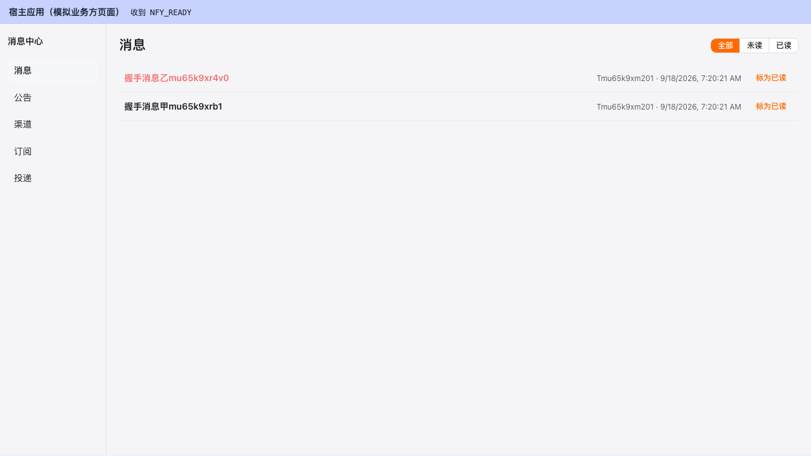

**L8-02-1-消息页**

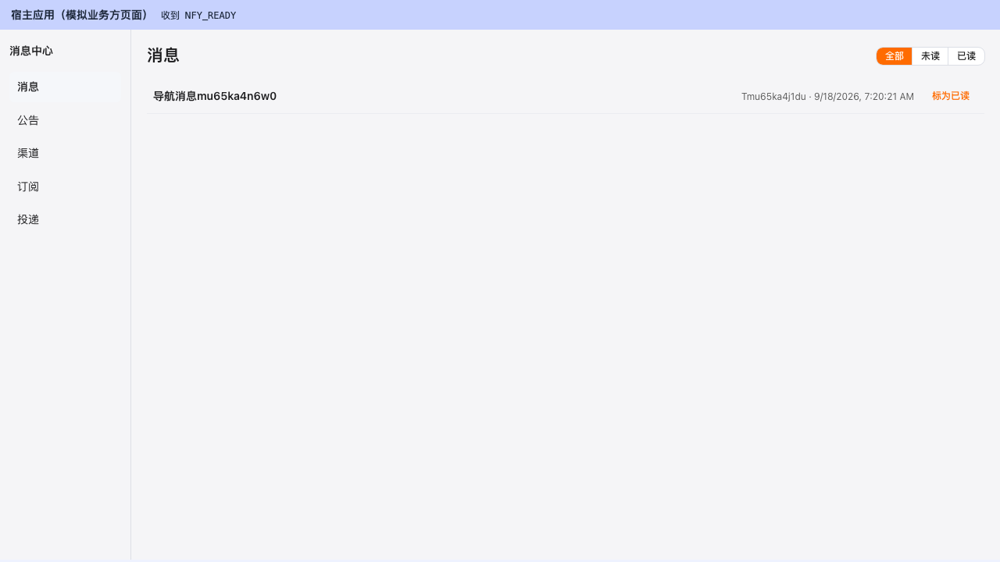

**L8-02-2-公告页**

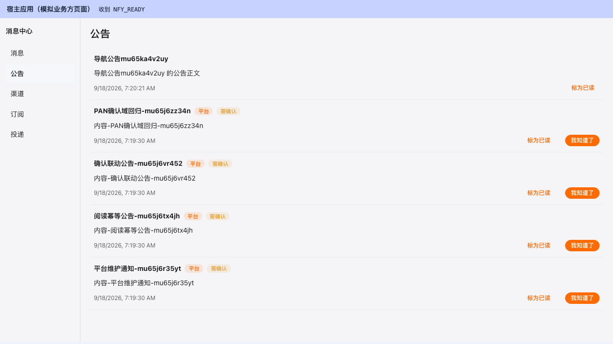

**L8-02-3-渠道页**

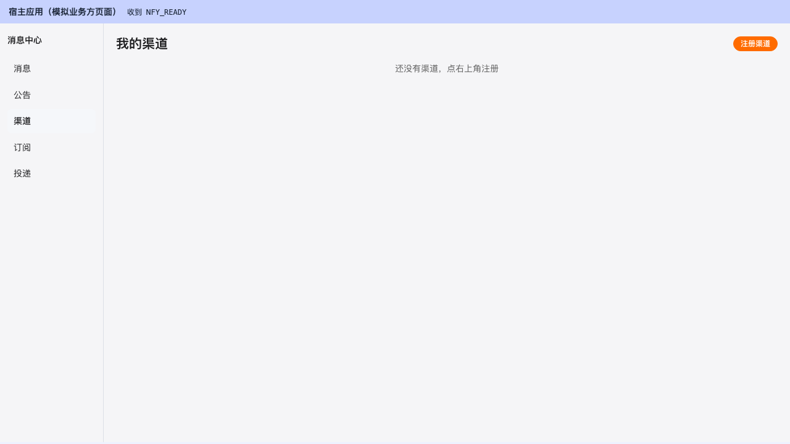

**L8-02-4-订阅页**

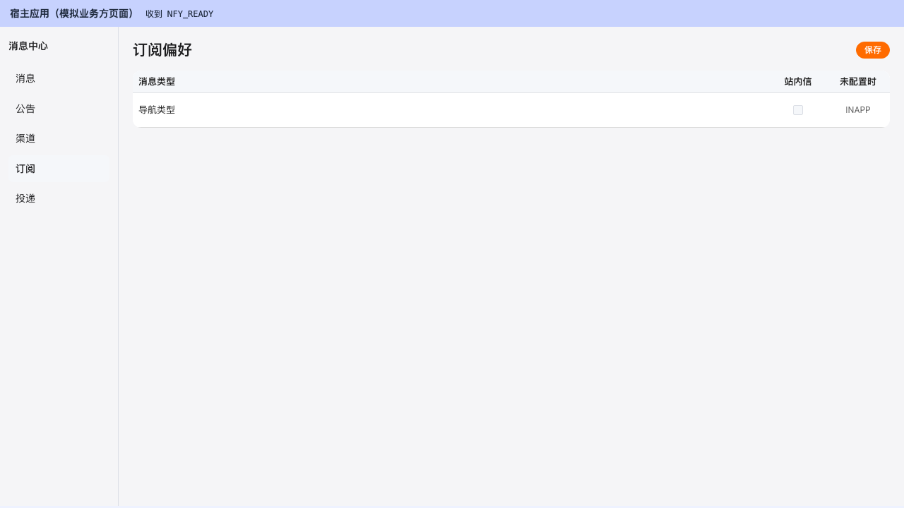

**L8-02-5-投递页**

**L8-03-公告回执操作后**

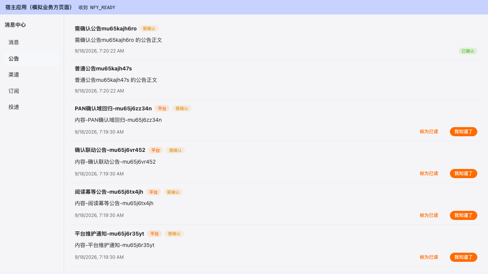

**L8-03-公告页初览**

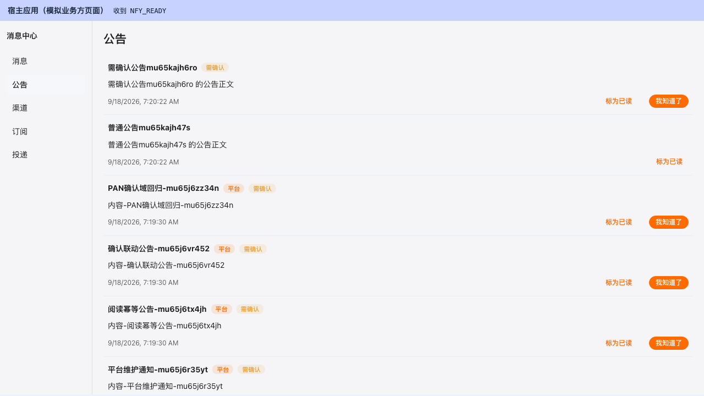

**L8-04-铃铛下拉最近消息**

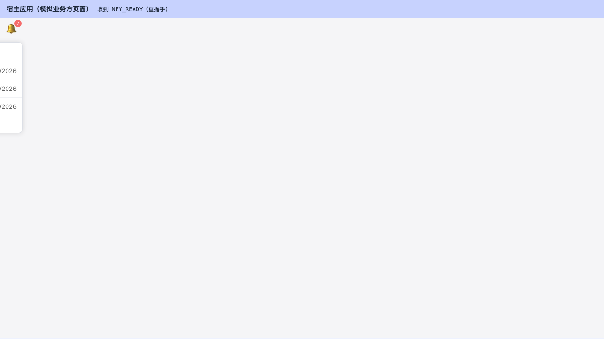

**L8-04-铃铛未读角标**

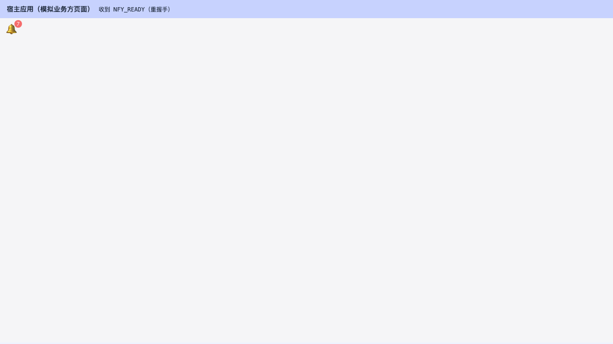

**L8-05-消息已读联动后**

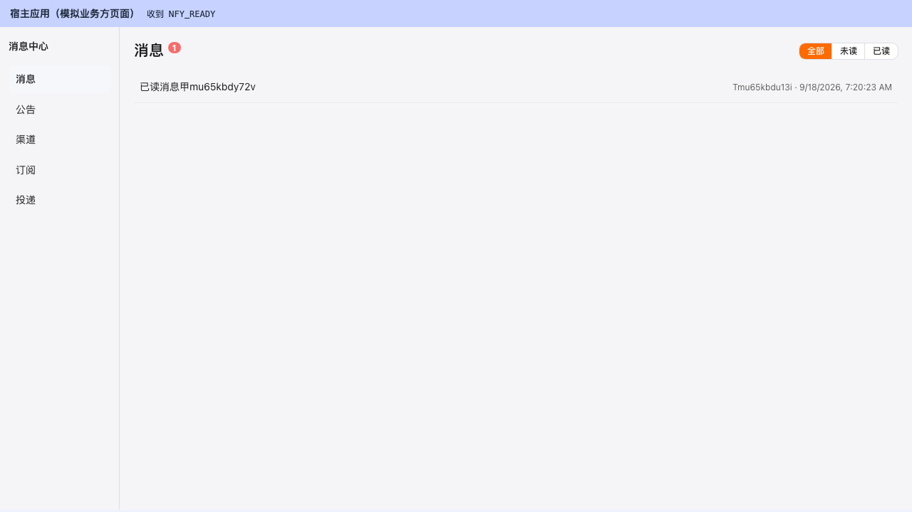

**L8-05-消息未读初览**

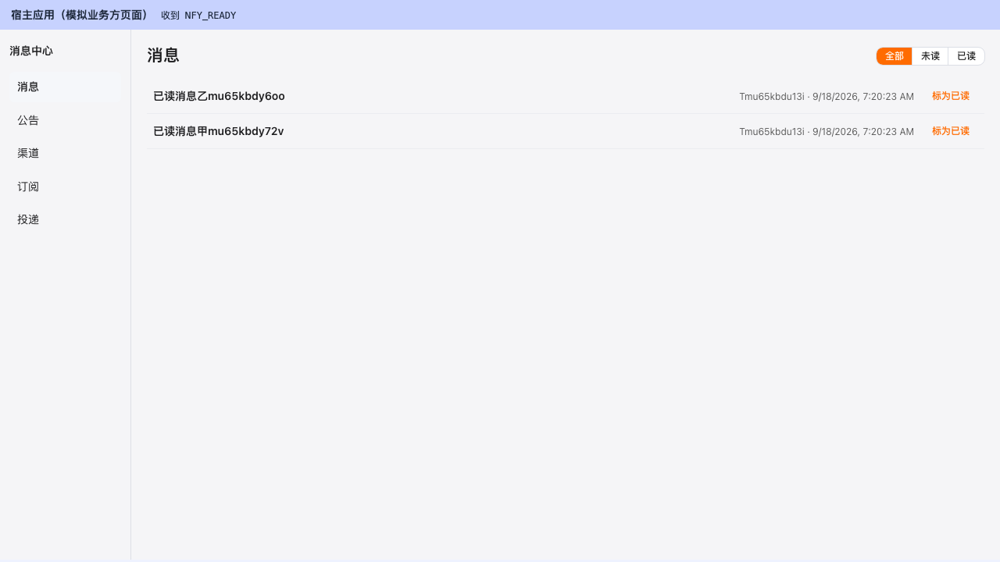

**L8-06-撤回前消息在列**

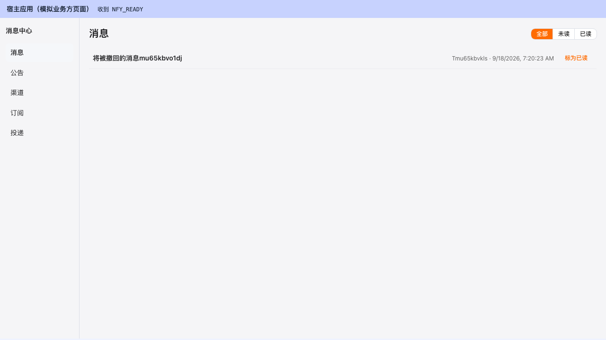

**L8-06-撤回后不再展示**

**L8-07-非白名单origin拒绝**

**L8-08-无效token会话失效重连提示**

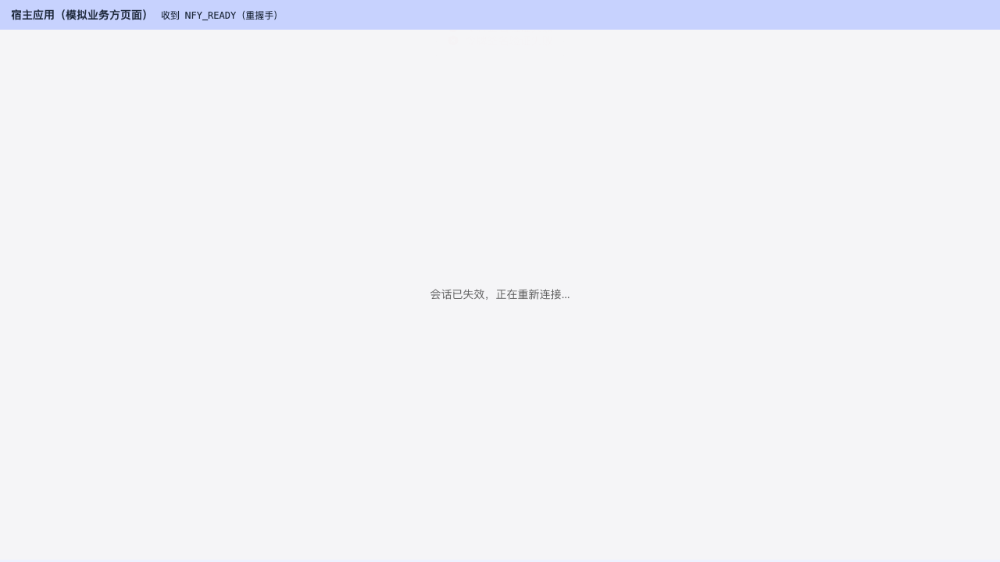

**L8-08-无效token空态呈现**

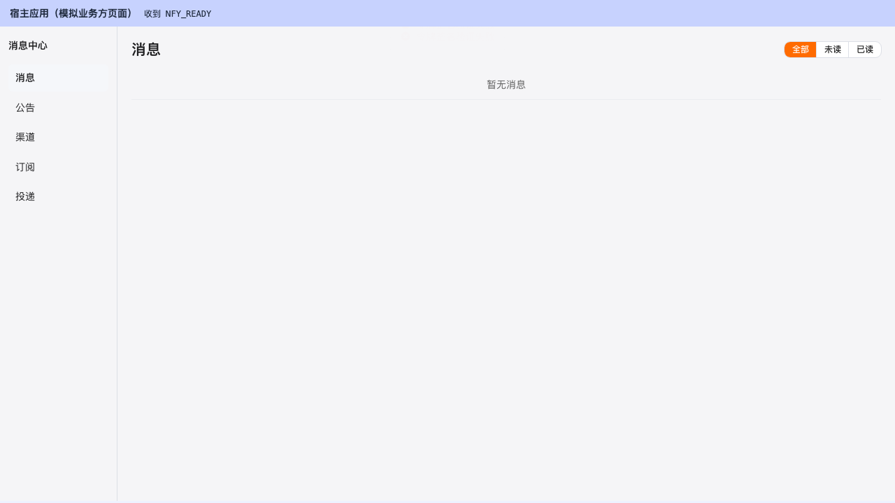

---

## 三、发现与修复意见（前端新发现 4 项；F-1/F-2 已于 2026-09-18 修复并复验）

| # | 级别 | 缺陷 | 状态 |
|---|---|---|---|
| F-1 | **P2** | **消息中心时间全显示「Invalid Date」**：后端框架 Long→String（`created_at:"1789654352932"`），前端 `new Date(item.created_at)` 不解析数字字符串——四页全中招 | ✅ **已修复**：`utils/fwkTime.ts#parseFwkTime` 统一解析（数字字符串→Number，<1e12 按秒级），四页全接；vitest 382/382；修复后截图渲染真实日期 |
| F-2 | **P2** | **无效/过期 token 呈现误导性空态**：`notifyExpired` 全仓无调用方，数据失败静默成「暂无消息」 | ✅ **已修复**：client `onAuthExpired`（401/信封 102xx 段）→ notifyExpired 重握手 + 页面「会话已失效，正在重新连接…」；L8-08 spec 翻转为新行为 |
| F-3 | P3 | 订阅页「站内信恒开」复选框渲染为未勾选（裸 `model-value` 属性传空串） | 未修（P3 待排期）；改 `:model-value="true"` |
| F-4 | P3 | 铃铛下拉面板被嵌入 iframe 必然裁剪（DOM 断言全过，纯视觉） | 未修（P3 待排期）；面板相对 iframe 视口定位或父页浮层承载 |

握手安全语义（L8-07）是本线亮点：白名单外 token **零 API 调用**，内存不收——与 PRD F-EMB-001 一致。

## 四、结论

**L8 通过**（初判有条件通过 → F-1/F-2 已于 2026-09-18 修复，全量 e2e 70/70 复验含 L8-08 新行为；修复后截图见 L8-01/L8-08）。F-3/F-4 为 P3 视觉/呈现项，不阻塞功能。
