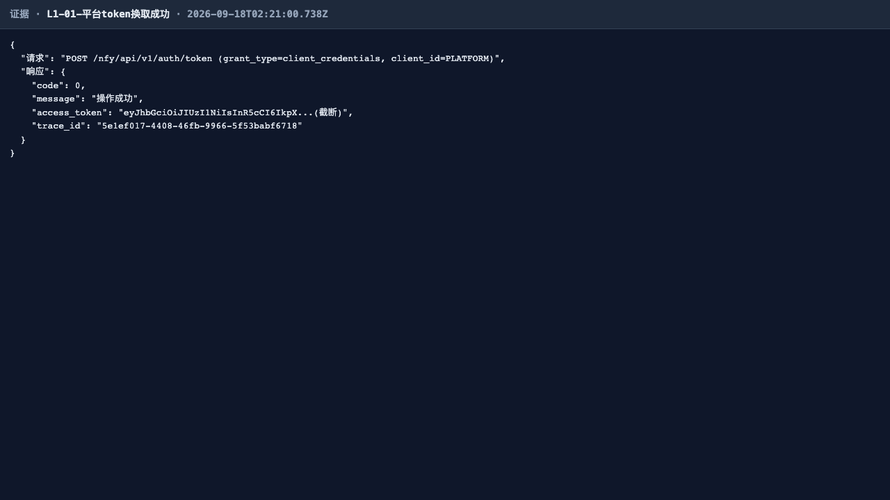
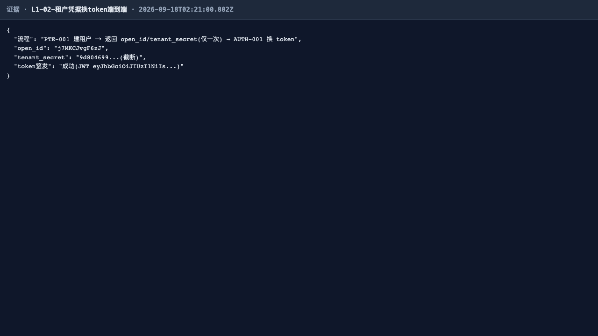
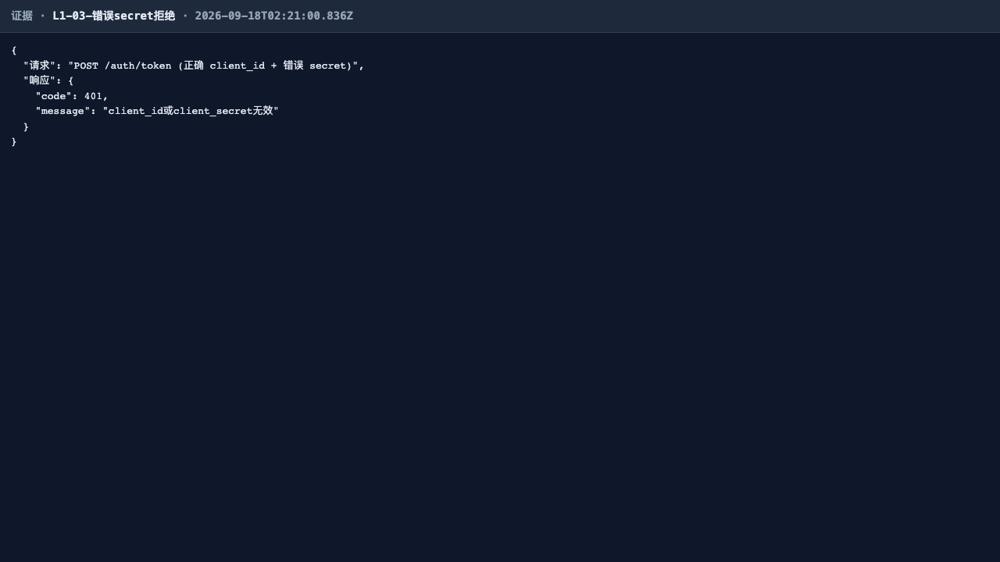
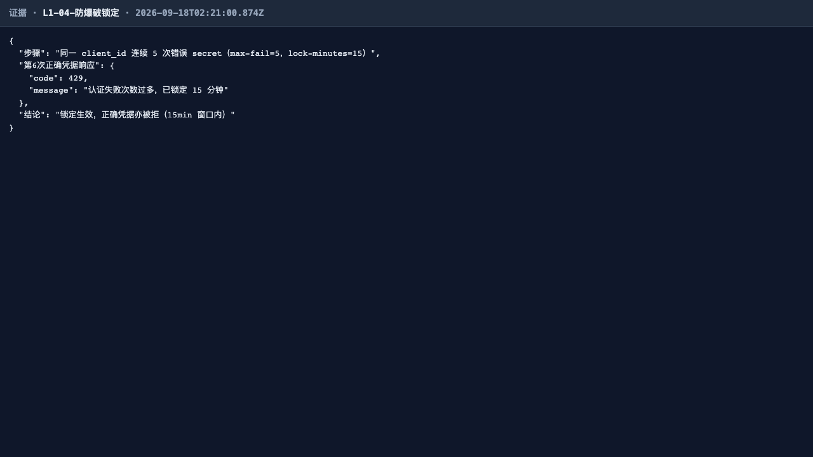
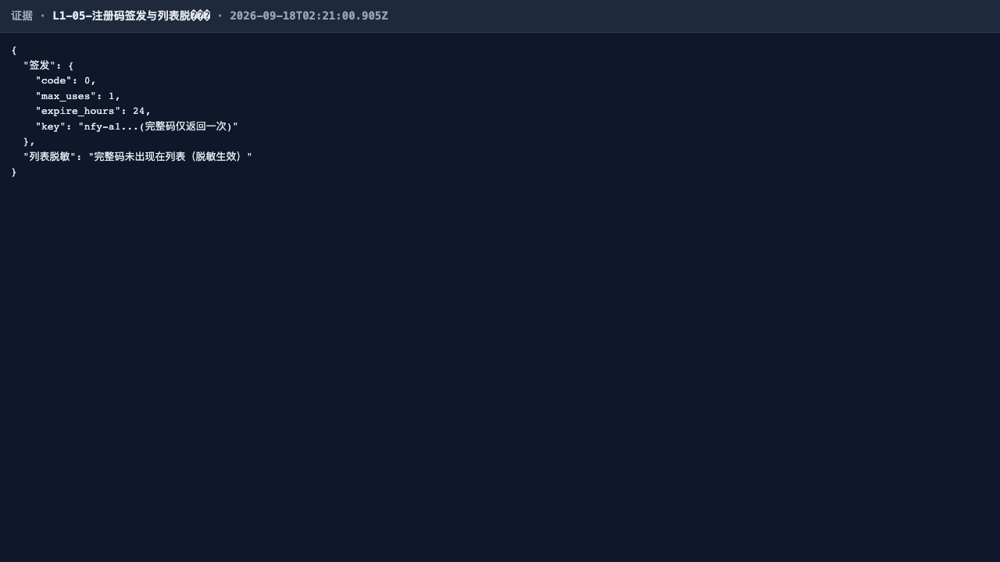
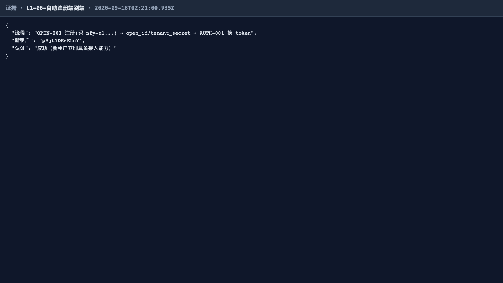
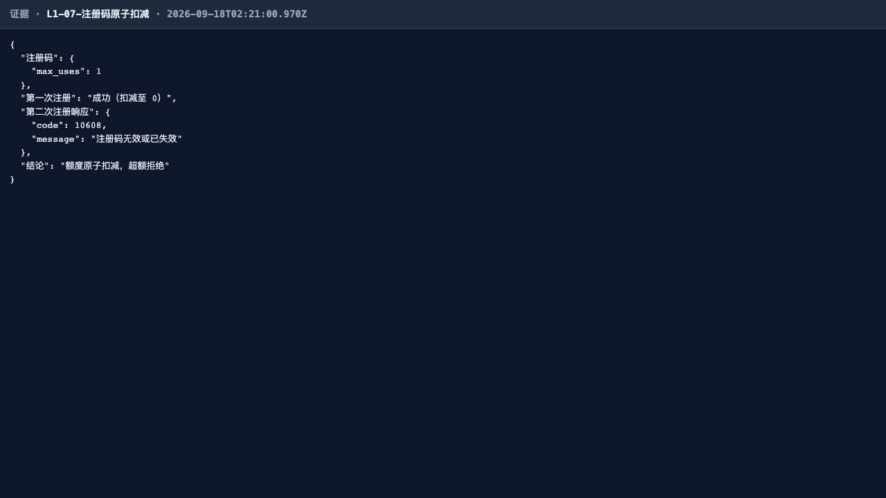
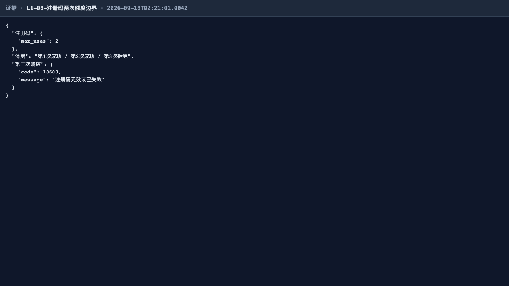

# L1 认证线 · 全量回归测试报告（第 2 轮 2026-09-18）

## 一、范围

- **被测**：notification4j V1.0 认证与开放接入线（AUTH-001 client_credentials 换 token 与防爆破锁定、PRK-001 注册码签发与脱敏、OPEN-001 注册码自助注册与额度原子扣减；IT 侧另覆盖签名面孔 NfySignatureFaceTest、客户端单元 NfyRemoteClientUnitTest / NfyClientStarterTest、审查缺口并发扣减 NfyReviewGapTest）。
- **环境**：共享 E2E 实例 http://localhost:9200（fat jar，出厂等价态：runtime 签名未开启直调全通、签名基础设施在但 patterns 为空）；数据全部 `uniq()` 隔离。
- **证据形态**：**本线产品无 UI 面，证据为 API 证据页截图**（evidence() 将请求/响应/断言渲染为证据页落盘，每用例 1 张关键图，目录 `screenshots/`）。
- **E2E 入口**：`NFY_EVIDENCE_DIR=../docs/test/report/2026-09-18-01/screenshots npx playwright test -c e2e-regression/playwright.config.ts --grep "L1"`，spec 原样重跑（0 改动）。

## 二、结果矩阵

**IT 深回归（后台串跑，取自 it-summary.txt / it-logs/L1.log，2026-09-18 10:18）**

| IT 测试类 | 用例数 | 失败 |
| --- | --- | --- |
| NfyAuthFlowTest | 8 | 0 |
| NfyReviewGapTest（注册码并发扣减） | 5 | 0 |
| NfyRemoteClientUnitTest | 3 | 0 |
| NfyClientStarterTest | 3 | 0 |
| NfySignatureFaceTest | 2 | 0 |
| NfyRegistrationKeyFlowTest | 2 | 0 |
| **合计** | **23** | **0** |

**E2E 全量回归（本轮重跑）**：8 用例 / 8 通过 / 0 失败（757ms，1 worker 串行）

| # | 用例 | 契约 | 结论 |
| --- | --- | --- | --- |
| L1-01 | 平台 client_credentials 换 token 成功 | AUTH-001 | ✅ |
| L1-02 | 新建租户凭据换 token 端到端 | AUTH-001 | ✅ |
| L1-03 | 错误 secret 拒绝（不签发 token） | AUTH-001 | ✅ |
| L1-04 | 防爆破：连错 5 次锁定，正确凭据亦被拒 | AUTH-001 | ✅ |
| L1-05 | 注册码签发 + 列表脱敏（完整码仅一次） | PRK-001 | ✅ |
| L1-06 | 注册码自助注册成功 → 新租户立即可认证 | OPEN-001 | ✅ |
| L1-07 | max_uses=1 消费后二次注册拒绝（原子扣减） | OPEN-001 | ✅ |
| L1-08 | max_uses=2 恰好消费两次、第三次拒绝 | OPEN-001 | ✅ |

## 三、用例与证据

- **L1-01 平台 client_credentials 换 token 成功 — ✅**：POST /nfy/api/v1/auth/token（PLATFORM）返回 code=0 + JWT；证据页含 access_token 截断回显与 trace_id。
  
- **L1-02 新建租户凭据换 token 端到端 — ✅**：PTE-001 建租户 → open_id/tenant_secret（仅一次）→ AUTH-001 换 token 成功，新租户即时具备接入能力。
  
- **L1-03 错误 secret 拒绝 — ✅**：正确 client_id + 错误 secret → 非 0 错误码，data 为空不签发 token。
  
- **L1-04 防爆破锁定 — ✅**：同一 client_id 连错 5 次（max-fail=5）后，第 6 次即使持正确凭据亦被拒（锁定 15min 窗口生效）。
  
- **L1-05 注册码签发 + 列表脱敏 — ✅**：签发返回完整码仅此一次；列表接口全量 JSON 中不含完整码，脱敏生效。
  
- **L1-06 注册码自助注册端到端 — ✅**：OPEN-001 免鉴权注册 → 返回 open_id/tenant_secret → 立即换 token 成功。
  
- **L1-07 max_uses=1 原子扣减 — ✅**：首次注册成功扣减至 0，同码第二次注册被拒。
  
- **L1-08 max_uses=2 额度边界 — ✅**：第 1/2 次注册成功，第 3 次拒绝，额度边界精确。
  

> 本轮 0 失败，无失败证据链图组。L1-05 证据图文件名已由含坏字节的原名规范化为 `L1-05-注册码签发与列表脱敏.png`（仅重命名本轮产物文件，见「四、发现」P3-1）。

## 四、发现与修复意见（不改代码）

1. **P3 · spec 字面量坏字节（卫生问题，非功能缺陷）**：`frontend/e2e-regression/l1-auth.spec.ts` 存在 6 处 U+FFFD 坏字节——L1-05 的 evidence 名称（`'L1-05-注册码签发与列表脱???…'`）与 L1-04 的租户名字面量（数据级，无产物影响）。前者导致本轮产出的证据 PNG 文件名含 U+FFFD（已将本轮文件重命名为干净名，断言与证据内容不受影响）。修复意见：下一轮将两处字面量坏字节改为「脱敏」「租户」等正确汉字（纯字面量修缮，不改用例语义）。

## 五、结论

L1 认证线第 2 轮全量回归**通过**：IT 深回归 23/23（含 NfySignatureFaceTest），E2E 8/8，0 失败。换 token、防爆破锁定、注册码签发/脱敏/原子扣减全链契约稳固，无新增缺陷（1 项 P3 测试资产卫生问题已登记）。
