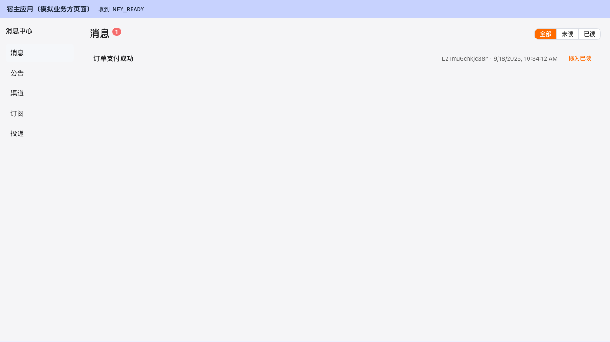
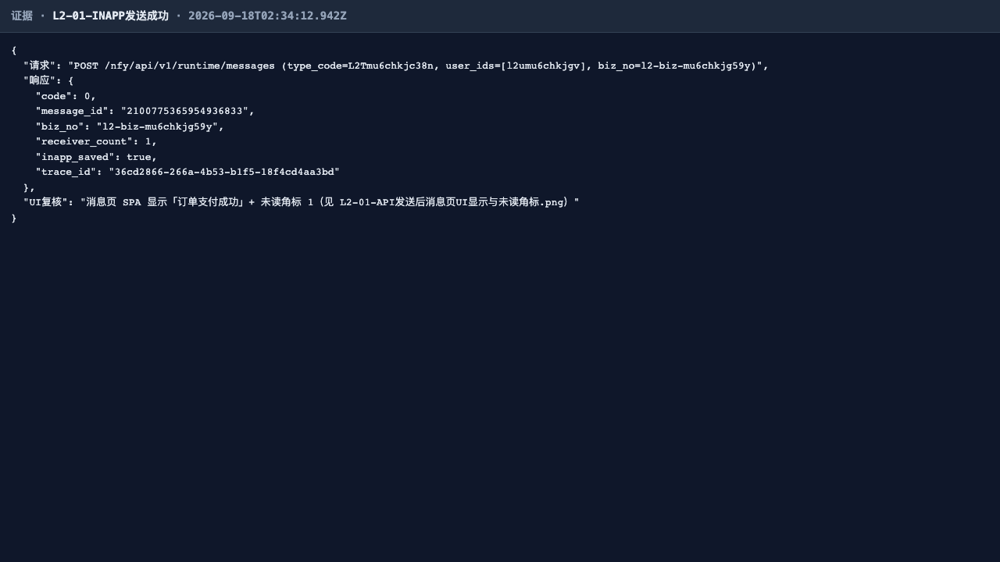
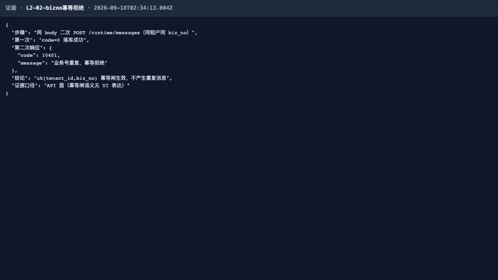
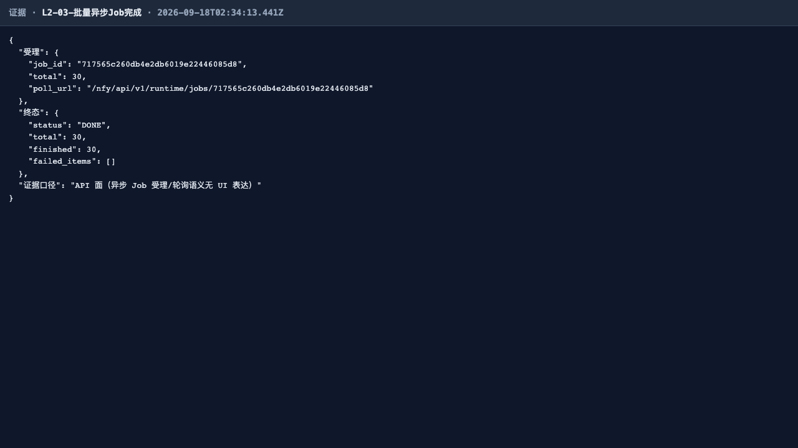
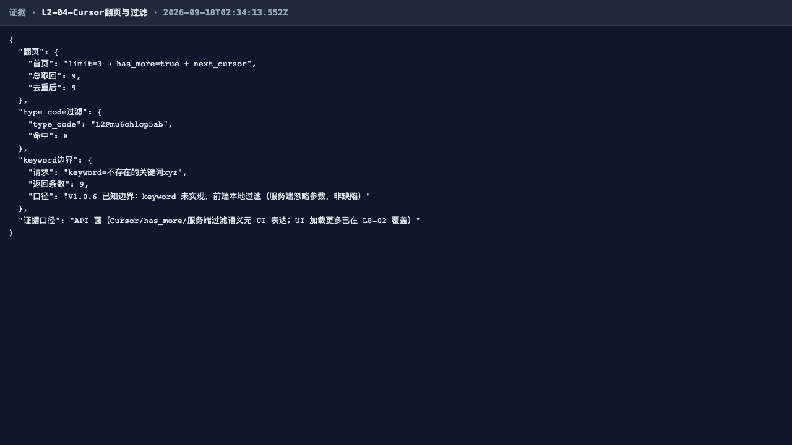
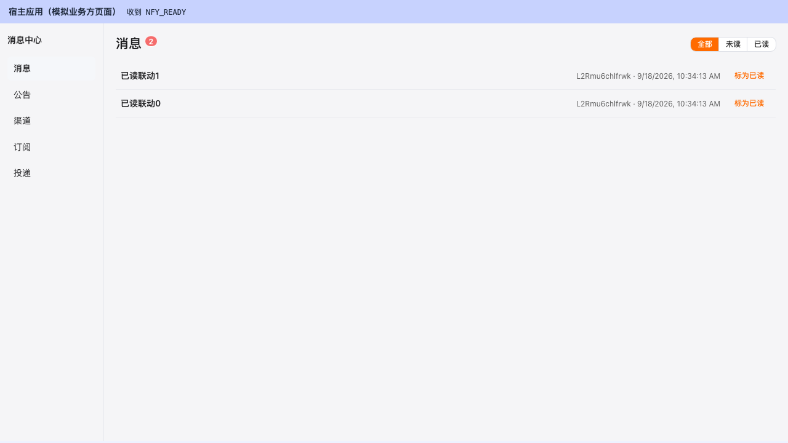
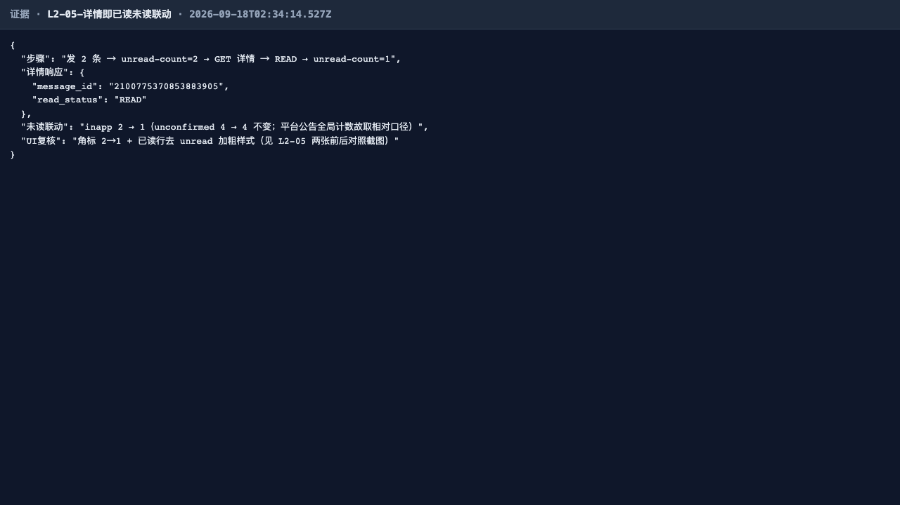
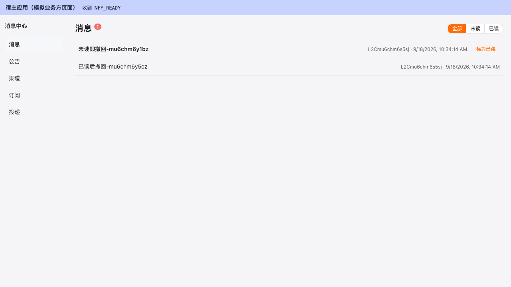
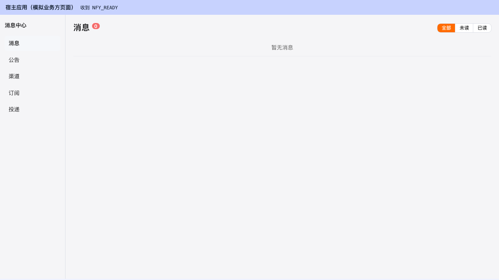
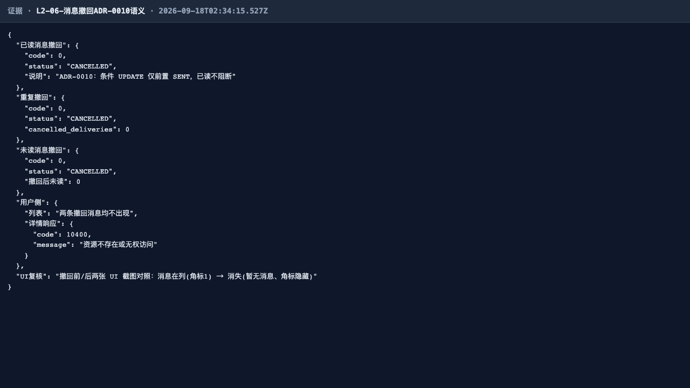

# L2 线 · 全量回归测试报告（第 2 轮 2026-09-18）

## 一、范围

MSG-001（发送 / biz_no 幂等闸 10401）、MSG-002+JOB-001（批量异步 Job）、
MSG-004/005（Cursor 列表 / keyword=V1.0.6 已知边界「前端本地过滤」）、
MSG-005/006/007（详情即已读 + 未读数联动）、MSG-009（撤回，ADR-0010 竞态安全语义）。

第 2 轮证据改版：可 UI 化用例（L2-01/05/06）经宿主握手页 `nfy-host.html`（NFY_READY/NFY_TOKEN 握手）
驱动真实 SPA 断言并截图为关键证据；纯 API 面（L2-02/03/04）保留 evidence() 渲染页并注明「API 面」。
执行环境：被测实例 http://localhost:9200（出厂等价），宿主 3000 由 global-setup 拉起；
每线独立租户 + uniq 隔离；runtime 面 10500 限流用例内等待重试。最终运行 6/6 绿。

## 二、结果矩阵（IT 深回归数字 + E2E 用例表）

| 层 | 载体 | 结果 |
|---|---|---|
| IT 深回归 | NfyMessageFlowTest + NfyBatchSendJobTest + NfyMessageCancelTest + NfyQueryCompletionTest（it-summary.txt 10:20 ALL_DONE） | **21/21 绿（RC=0）** |
| Playwright E2E | l2-messages.spec.ts（6 用例，本线路最终跑 6/6 绿） | **6/6 绿** |

| # | 用例 | 结果 | 证据口径 |
|---|---|---|---|
| L2-01 | MSG-001 INAPP 发送（message_id/biz_no/receiver_count/inapp_saved）+ UI 显示与未读角标 | ✅ | UI 关键图 + API 复核 |
| L2-02 | MSG-001 biz_no 幂等闸：二次发送 10401 | ✅ | API 面 |
| L2-03 | MSG-002/JOB-001 批量异步：job_id→轮询 DONE finished=30 | ✅ | API 面 |
| L2-04 | MSG-004 Cursor 翻页无重复 + type_code 服务端过滤 + keyword 边界 | ✅ | API 面 |
| L2-05 | MSG-006 详情即已读 + MSG-007 未读 2→1 联动（UI 角标/样式前后对照） | ✅ | UI 关键图 + API 复核 |
| L2-06 | MSG-009 撤回（ADR-0010）：已读/未读均可撤、幂等、用户侧三处不可见（UI 撤回前/后两张） | ✅ | UI 关键图 + API 复核 |

## 三、用例与证据

**L2-01 ✅** API 发送 → 消息页真实 SPA 显示该消息 + 未读角标 1 + 未读加粗样式（关键图）。

API 复核：

**L2-02 ✅**（API 面）同租户同 biz_no 二次发送 10401 拒绝，uk 幂等闸生效。

**L2-03 ✅**（API 面）批量提交立即返 job_id + poll_url，轮询至 DONE 且 finished=30。

**L2-04 ✅**（API 面）limit=3 三页取尽 9 条无重复、has_more/next_cursor 同生共死；type_code 服务端过滤仅命中 8 条；keyword 服务端忽略（V1.0.6 已知边界，非缺陷）。

**L2-05 ✅** 详情即已读 → UI 未读角标 2→1、已读行去 unread 加粗样式（前/后对照，后图为关键图）。

API 复核：

**L2-06 ✅** 撤回前两条在列（角标 1、未读行加粗）→ API 撤回（含重复撤回幂等 cancelled_deliveries=0、详情 10400 防探测）→ 撤回后消息消失、空态「暂无消息」（前/后两张，后图为关键图）。

API 复核：

## 四、发现与修复意见（不改代码，仅登记）

1. **【P3 · 前端展示缺陷】消息页未读角标在未读=0 时仍显示「0」而非隐藏。**
   证据：`screenshots/L2-06-撤回后不再展示.png`（列表空态正确，但标题旁角标「0」可见；对照撤回前图角标「1」）。
   根因：fwk4j Long→String 序列化契约下 `unread-count` 的 `unread_count` 到达前端为字符串 `"0"`（真值），
   `frontend/src/views/nfy/MessagesPage.vue` 将其原样赋给 `unread`，模板 `:hidden="!unread"` 恒为 false；
   `frontend/src/api/nfy/index.ts` 的类型声明 `unread_count: number` 与运行时不符（掩盖了问题）。
   修复意见：赋值处归一 `unread.value = Number(res.unread_count)`（该页对 `created_at` 已有 `parseFwkTime` 归一先例），
   或在 nfy client 统一做数字字段归一。未读>0 时角标数值显示正确，故仅 0 值场景受影响，定级 P3。
2. 【取证口径登记】el-badge 有 `el-zoom-in-center` 进场过渡（0.3s 透明度动画），断言后立即截图会截到 opacity≈0 帧——
   第 1 轮 L8-05 证据图中角标不可见即此伪影（非产品缺陷）。本轮 shot() 已加 400ms 过渡落定等待，角标在图中稳定可见。
3. 【边界·与登记一致】MSG-004 `keyword` 服务端未实现（V1.0.6 已登记「前端本地过滤」），实测服务端忽略该参数，非缺陷。
4. 【P3 建议·保留】runtime 面 100 次/min 滑动限流（10500）在共享实例反复回归时会自绊——用例内已做等待重试封装；
   建议后续为测试实例提供限流白名单配置位，便于 CI 频跑。

## 五、结论

**L2 通过。** IT 深回归 21/21（RC=0）+ E2E 6/6 双绿；发送/幂等/批量/Cursor/已读联动/撤回全链路语义与契约一致，
ADR-0010 撤回竞态安全语义在本轮获得 UI 前/后对照证据。唯一登记缺陷为 P3 级「未读 0 角标未隐藏」展示问题，不阻塞。
