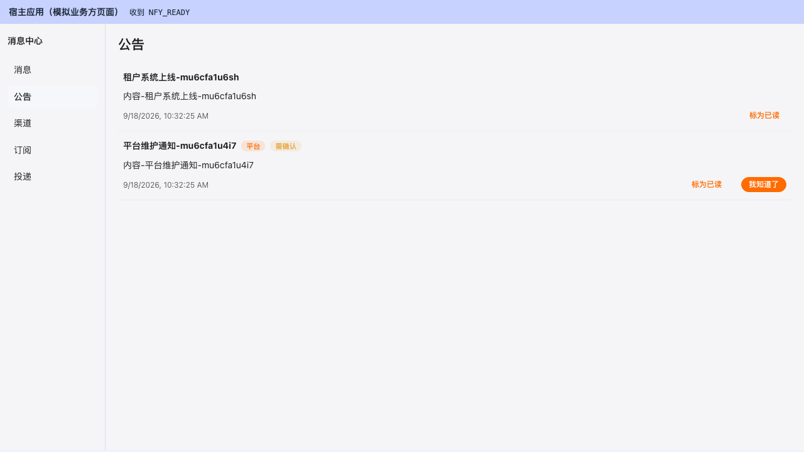
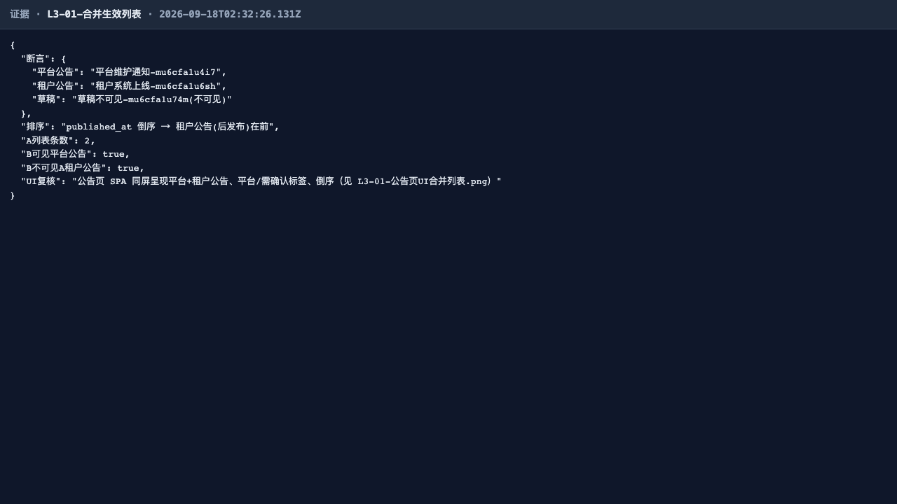
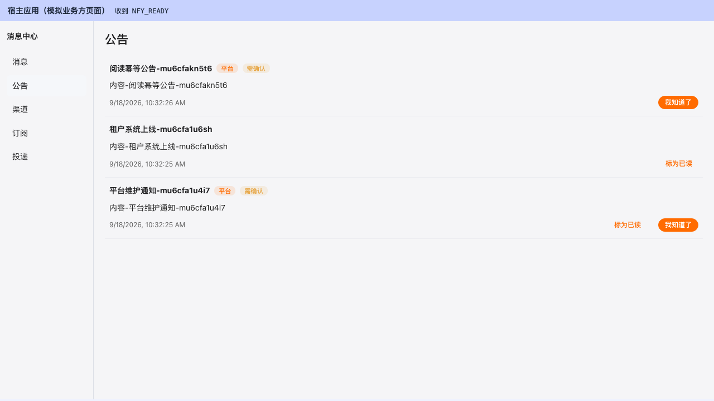
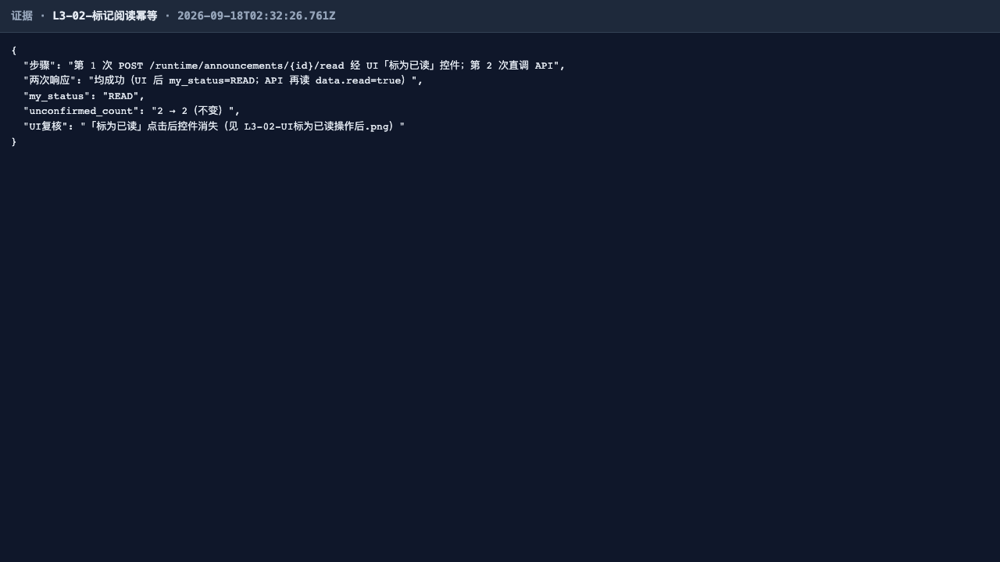
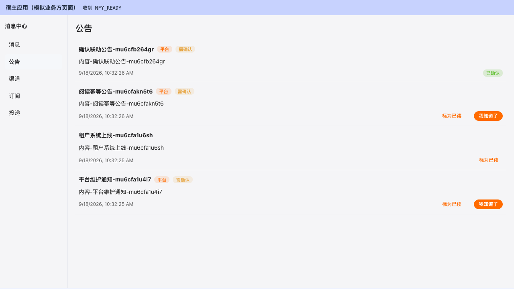
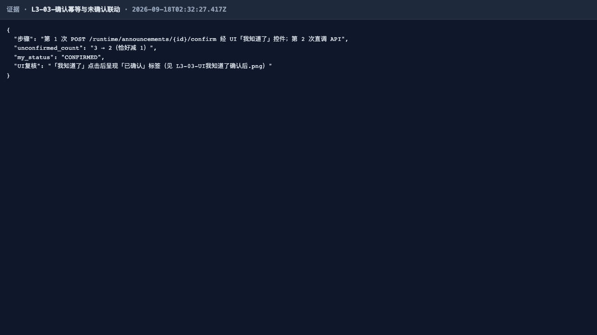
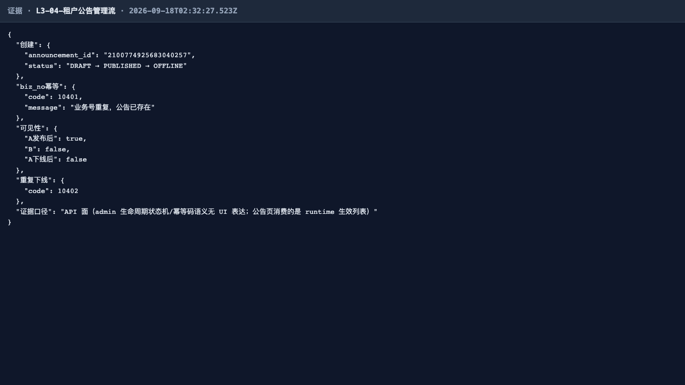
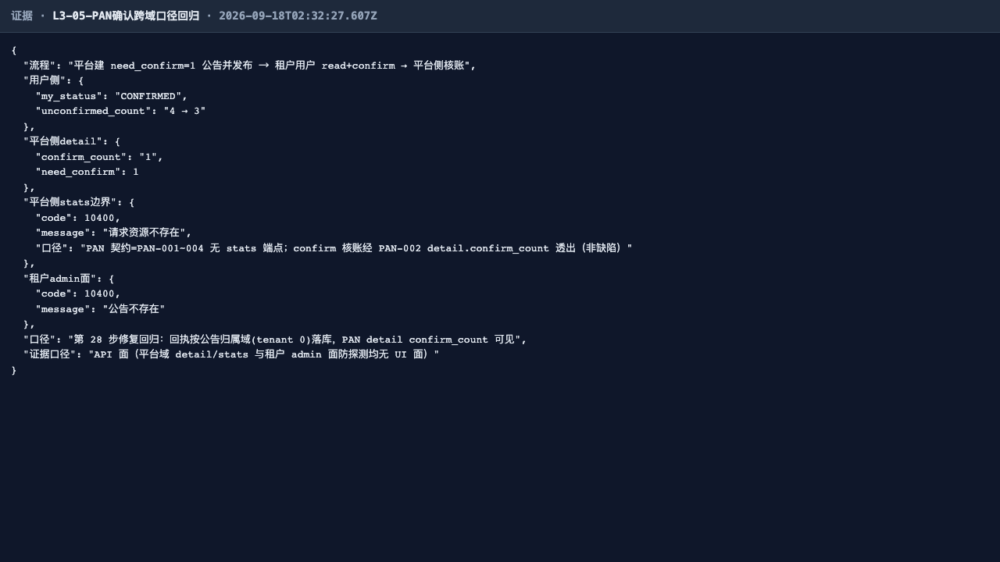
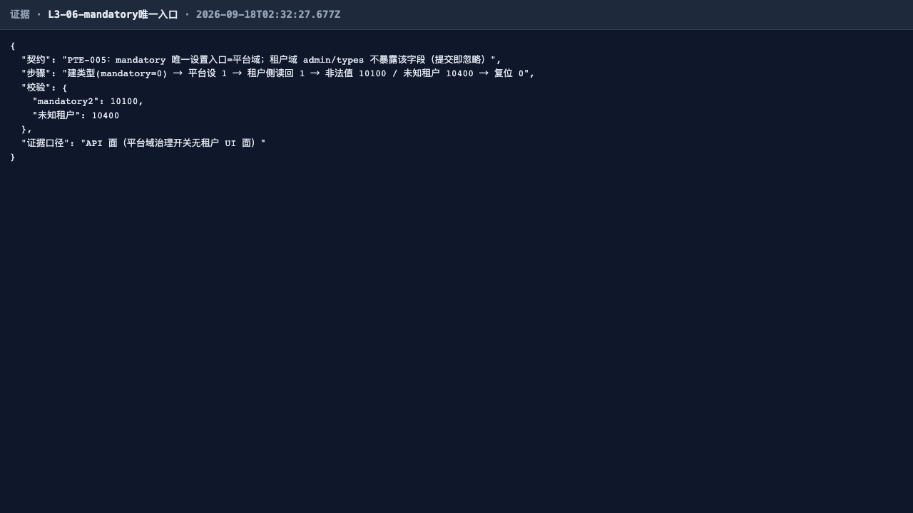

# L3 线 · 全量回归测试报告（第 2 轮 2026-09-18）

## 一、范围

ANN-001~003（平台+租户合并生效列表、阅读/确认幂等回执 + unconfirmed_count 联动）、
AAN-001~005（租户公告管理生命周期）、PAN-001~004（平台公告；第 28 步修复回归：confirm 回执落公告
归属域 → 平台侧 confirm_count 可见）、PTE-005（mandatory 唯一入口=平台域）。

第 2 轮证据改版：可 UI 化用例（L3-01 合并列表 / L3-02 标为已读 / L3-03 我知道了确认）经宿主握手页
`nfy-host.html`（NFY_READY/NFY_TOKEN 握手）驱动真实 SPA 控件操作并截图为关键证据；纯 API 面
（L3-04 管理生命周期 / L3-05 PAN 跨域口径 / L3-06 mandatory）保留 evidence() 渲染页并注明「API 面」。
执行环境：被测实例 http://localhost:9200（出厂等价），宿主 3000；A/B 双租户 + uniq 隔离；
beforeAll 自愈清理本线历史平台公告（tenant 0 生效 20 条配额）；10500 限流用例内等待重试。最终运行 6/6 绿。

## 二、结果矩阵（IT 深回归数字 + E2E 用例表）

| 层 | 载体 | 结果 |
|---|---|---|
| IT 深回归 | NfyAnnouncementFlowTest + NfyAnnouncementAdminTest + NfyPlatformDomainTest（it-summary.txt 10:20 ALL_DONE） | **10/10 绿（RC=0）** |
| Playwright E2E | l3-announcements.spec.ts（6 用例，本线路最终跑 6/6 绿） | **6/6 绿** |

| # | 用例 | 结果 | 证据口径 |
|---|---|---|---|
| L3-01 | ANN-001 平台(tenant 0)+租户合并生效列表、published_at 倒序、草稿不可见、租户隔离 | ✅ | UI 关键图 + API 复核 |
| L3-02 | ANN-002 markRead 两次幂等、my_status→READ、unconfirmed 不因阅读变化 | ✅ | UI 关键图 + API 复核 |
| L3-03 | ANN-003 confirm 两次幂等 + unconfirmed_count 恰减 1 | ✅ | UI 关键图 + API 复核 |
| L3-04 | AAN 管理流 DRAFT→发布→下线；biz_no 10401；跨租户不可见；重复下线 10402 | ✅ | API 面 |
| L3-05 | **PAN 第 28 步修复回归**：confirm 回执落归属域，平台侧 detail confirm_count≥1；越权面 10400 | ✅ | API 面 |
| L3-06 | PTE-005 mandatory 唯一入口：设 1/复位 0、非法 10100、未知租户 10400 | ✅ | API 面 |

## 三、用例与证据

**L3-01 ✅** 公告页真实 SPA 同屏呈现平台公告（「平台」「需确认」标签）+ 租户公告，租户(后发布)在平台公告上方
（UI DOM 位置断言 = published_at 倒序），DRAFT 草稿 UI 不可见（关键图）。

API 复核（含 B 租户只见平台公告）：

**L3-02 ✅** 第 1 次 markRead 经真实 SPA 控件「标为已读」→ 控件消失（关键图）；第 2 次直调 API 仍成功（幂等）；
my_status→READ；unconfirmed_count 全程不变。

API 复核：

**L3-03 ✅** 第 1 次 confirm 经真实 SPA 控件「我知道了」→ 呈现「已确认」状态标签（关键图）；第 2 次直调 API 仍
confirmed=true（幂等，uk 兜底）；unconfirmed_count 恰好 -1、重复确认不重复扣减。

API 复核：

**L3-04 ✅**（API 面）DRAFT→发布→runtime 可见（A 可见/B 不可见）→ 下线即不可见；biz_no 重复创建 10401、
重复下线 10402。

**L3-05 ✅**（API 面）PAN 跨域确认口径：租户用户 confirm 后用户侧 unconfirmed 恰减 1，平台侧 detail
`confirm_count≥1`（第 28 步修复重点回归）；PAN 无 stats 端点（契约口径）、租户 admin 面访问平台公告 10400 防探测。

**L3-06 ✅**（API 面）mandatory 唯一入口=平台域：设 1/复位 0 租户侧可见，非法值 10100、未知租户 10400。

## 四、发现与修复意见（不改代码，仅登记）

**无产品缺陷。** 第 28 步修复的「平台公告 confirm_count 恒 0 跨域双口径」缺陷在本轮端到端复验成立
（L3-05 证据页平台侧 `confirm_count:"1"`）。登记项：

1. 【P3 建议·保留】PAN 契约缺 stats 端点（`GET /nfy/platform/api/v1/announcements/{id}/stats` → 10400），
   confirm 核账仅经 PAN-002 detail.confirm_count 透出。修复意见：后续版本补 PAN stats 端点（与 AAN-005 同构）。
2. 【用例口径说明】L3-02/L3-03 为落实 UI 证据新规，两次幂等回执调整为「第 1 次经 UI 控件 + 第 2 次直调 API」，
   端点幂等语义覆盖不变（UI 控件与 API 走同一 runtime 端点），结论与第 1 轮等价。
3. 【环境·回归纪律·保留】tenant 0「同时生效 20 条」上限（10611）在共享实例反复回归时会自绊——已用例内自愈
   （平台公告 20min 短时效 + beforeAll 仅清理本线自有前缀遗留）。

## 五、结论

**L3 通过。** IT 深回归 10/10（RC=0）+ E2E 6/6 双绿；合并生效、双回执幂等、租户隔离、mandatory 唯一入口语义
全部符合契约；历史 P0 修复点（PAN confirm_count 跨域口径）端到端复验成立，且本轮补齐了公告页真实 UI 证据。
