# L4 渠道与订阅线 · 全量回归测试报告（第 2 轮 2026-09-18）

## 一、范围

- **被测**：渠道与订阅域全量——CHN-001~005（自注册渠道：SSRF 白名单校验 / verify 语义 / patch 改名启停 / 删除+同码防探测）、ACH（公共渠道 scope=TENANT 三重隔离）、SUB-001/002（订阅矩阵三段结构 / PUT 全量替换·幂等 / 强制集「类型语义→实例」校验 / quiet_hours 落库校验）。
- **第 2 轮证据改版**：UI 面用例以**宿主握手页驱动真实 SPA 截图为关键证据**（`http://localhost:3000/nfy-host.html?page=channels|subscriptions`，iframe#nfy + NFY_TOKEN 握手，frameLocator('#nfy') 断言）：L4-01 渠道页出现新渠道（PENDING 徽标）、L4-04 渠道页脱敏目标+ENABLED 徽标、L4-09 订阅页矩阵行回显、L4-10 订阅页强制类型锁定；SSRF/非法参数/越权等**纯 API 面**保留 evidence() 渲染页。
- **环境**：共享 E2E 实例 http://localhost:9200（出厂等价 + 引擎提速参数）；独立租户「L4渠道线」「L4订阅线」+ `uniq()` 隔离；EMAIL 渠道使能走真实 API（注册 → PATCH ENABLED，ND-L5-01 已修复，helpers/pg-fixup 已退役）。
- **E2E 入口**：`NFY_EVIDENCE_DIR=../docs/test/report/2026-09-18-01/screenshots npx playwright test -c e2e-regression/playwright.config.ts --grep "L4"`。

## 二、结果矩阵

**IT 深回归（后台串跑，取自 it-summary.txt / it-logs/L4.log，2026-09-18 10:19）**

| IT 测试类 | 用例数 | 失败 |
| --- | --- | --- |
| NfyChannelFlowTest | 12 | 0 |
| NfyChannelAdminTest | 2 | 0 |
| NfySubscriptionFlowTest | 7 | 0 |
| **合计** | **21** | **0** |

**E2E 全量回归（本轮重跑）**：13 用例 / 13 通过 / 0 失败（1.4s，1 worker 串行）

| # | 用例 | 证据形态 | 结论 |
| --- | --- | --- | --- |
| L4-01 | 自注册成功（PENDING 落库不发验证消息） | **UI 截图** + API 证据页 | ✅ |
| L4-01b | IM 官方域名注册（环境敏感 E-L4-01） | API 证据页 | ✅ |
| L4-02 | SSRF 四联拒绝 10609（明文/内网/非白名单/非443） | API 证据页 | ✅ |
| L4-03 | 非法类型/空 target/非法邮箱/名称超长 → 10100 | API 证据页 | ✅ |
| L4-04 | 列表脱敏（`u***@`）+ verify 10604 + EMAIL 直启 | **UI 截图** + API 证据页 | ✅ |
| L4-05 | patch 改名/启停/非法枚举流转 | API 证据页 | ✅ |
| L4-06 | 删除 + 防探测（删后同码操作 10400） | API 证据页 | ✅ |
| L4-07 | ACH 公共渠道 scope=TENANT 三重隔离 + 管理 | API 证据页 | ✅ |
| L4-08 | SUB-001 矩阵三段 + 平台 PTE-005 强制联动 | API 证据页 | ✅ |
| L4-09 | SUB-002 PUT 全量替换（幂等/INAPP 恒首位/删行） | **UI 截图** + API 证据页 | ✅ |
| L4-10 | 强制集 10606 / 无实例豁免 | **UI 截图** + API 证据页 | ✅ |
| L4-11 | 越权/状态闸 10101 / 10601 / 10400（事务性） | API 证据页 | ✅ |
| L4-12 | quiet_hours 回显/缺省重置/4 类非法 10100 | API 证据页 | ✅ |

## 三、用例与证据

- **L4-01 自注册渠道成功 — ✅**：POST runtime/channels（EMAIL）→ channel_id 签发、状态 PENDING、verify 引导语；**渠道页真实 SPA 列表出现该渠道**——PENDING 蓝色徽标、EMAIL target 脱敏（`s***@e2e.test`）、仅「验证」按钮（无启停/删除，与 PENDING 态操作面契约一致）。
  
  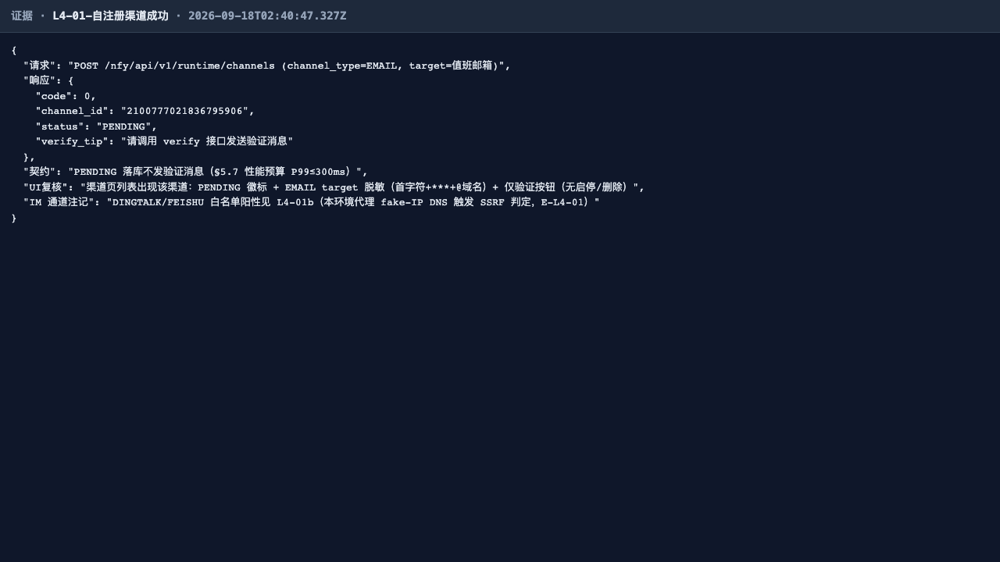
- **L4-01b IM 官方域名注册（E-L4-01，P3 环境） — ✅**：本机代理 fake-IP DNS 将 oapi.dingtalk.com 解析至 198.18.x（⊂SSRF 禁用集）→ 10609；getaddrinfo 同视角复核钉死。**产品判定按契约正确**（解析含内网/保留段即拒绝），生产直连 DNS 不受影响，登记不改。
  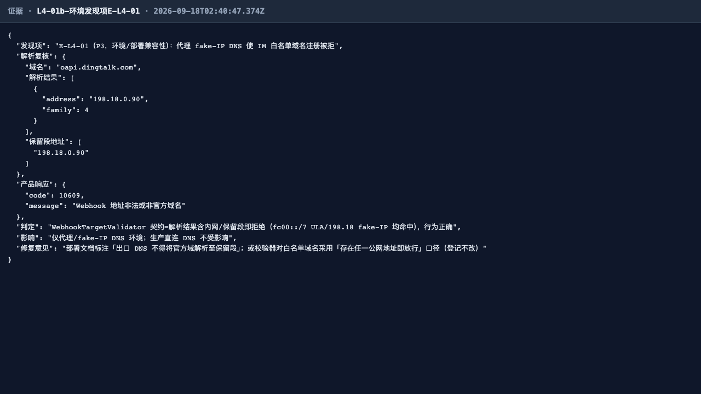
- **L4-02 SSRF 防线（API 面） — ✅**：http 明文 / 内网目标 / 非白名单域 / 白名单域非 443 四联全拒 10609（https + 官方域白名单 + 仅 443 + DNS 逐 IP 禁内网）。
  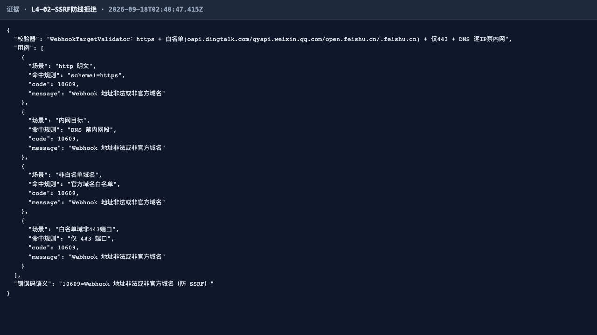
- **L4-03 非法参数（API 面） — ✅**：枚举非法/EMAIL 格式非法=业务校验 10100，空 target/名称超长=@Valid 10100（HTTP 200 信封统一）。
  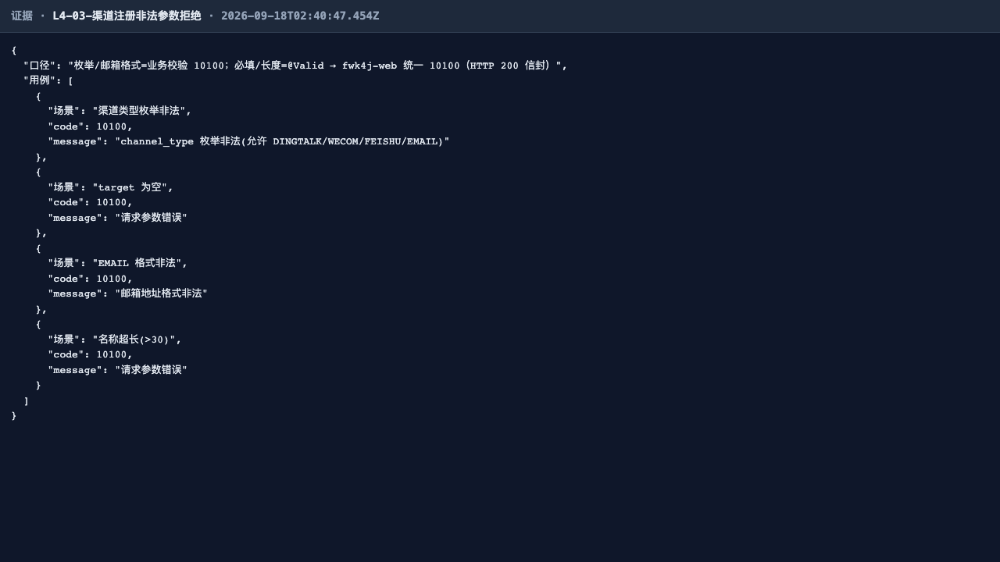
- **L4-04 列表脱敏 + 验证语义 — ✅**：列表 target 脱敏、完整邮箱任何面不可见、fail_count=0；verify 仍 10604（「首次投递时校验」契约不变）保持 PENDING；**PATCH ENABLED 直启成功（ND-L5-01 修复后契约）**；渠道页 UI 复核：ENABLED 绿色徽标 + target 仍脱敏。
  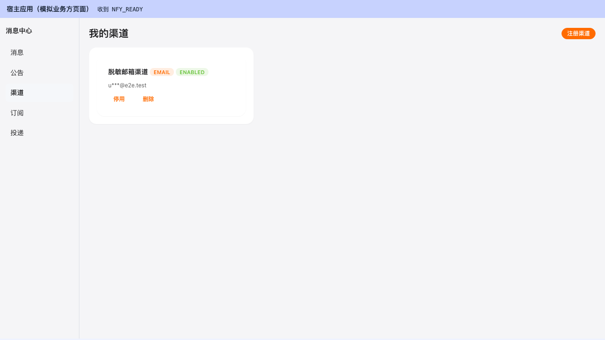
  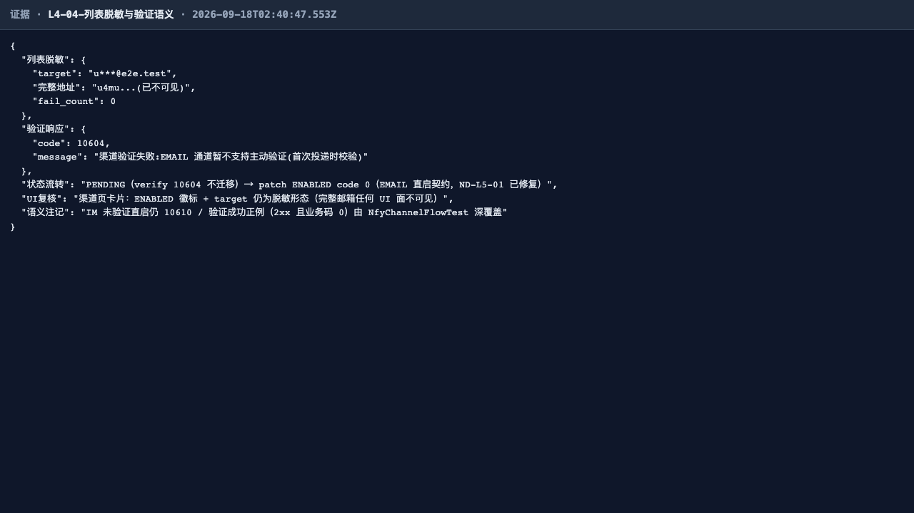
- **L4-05 patch 改名/启停流转（API 面） — ✅**：改名+DISABLED → ENABLED（EMAIL 直启契约）→ PAUSED 10100 → DISABLED，全链流转正确。
  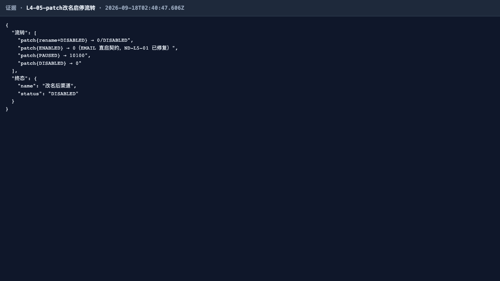
- **L4-06 删除 + 防探测（API 面） — ✅**：delete → 0；二次 delete/verify/跨用户 patch 均恒 10400（同码防探测）；列表不再含已删渠道（逻辑删）。
  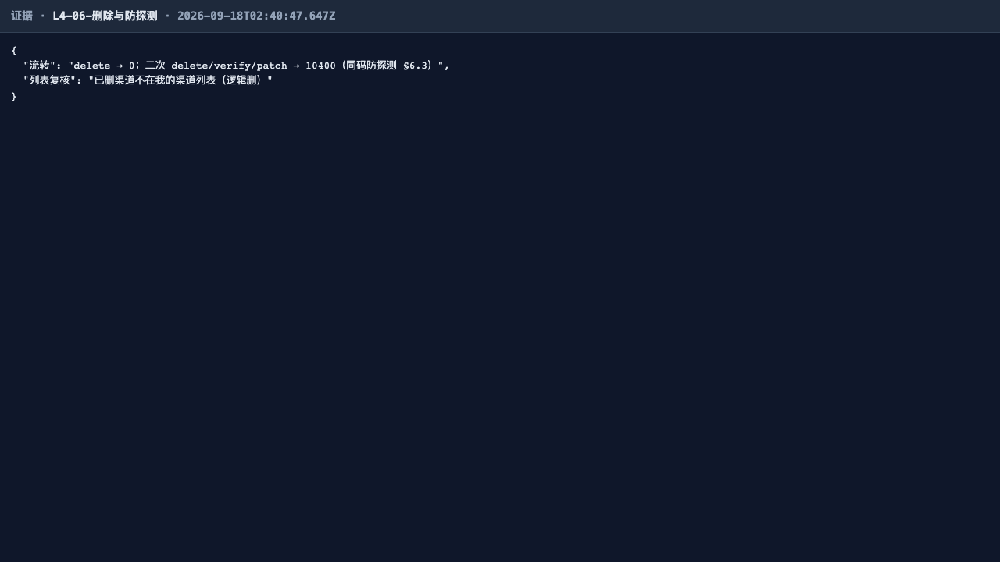
- **L4-07 ACH 公共渠道 scope 隔离（API 面） — ✅**：admin 注册 PENDING 落库；admin 列表可见 / runtime 用户列表不可见 / 邻租户 admin 列表不可见 / 跨租户 verify 10400；patch+delete 管理闭环。
  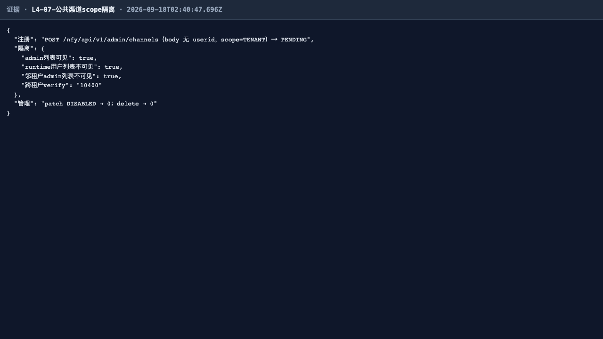
- **L4-08 SUB-001 矩阵三段（API 面） — ✅**：types（含平台 PTE-005 设强制 mandatory=1）/ available_channels（无 ENABLED 实例时仅 INAPP 哨兵）/ items 空，三段契约全对。
  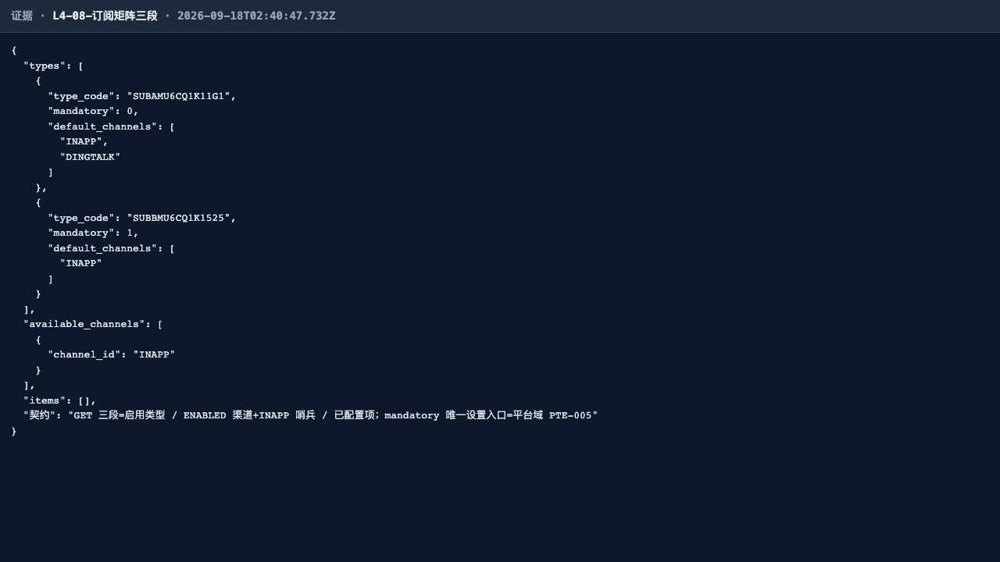
- **L4-09 SUB-002 PUT 全量替换 — ✅**：多类型×多渠道提交 saved_count=2、回读一致、INAPP 服务端补齐恒首位、重复 PUT 幂等、全量替换删 B 行；**订阅页真实 SPA 矩阵行回显**——「类型-PUTA…」行勾选「邮箱渠道」列（列头=渠道实例名 available_channels.name）、「备用邮箱」未勾选、「类型-PUTB…」行全量替换后无任何勾选。
  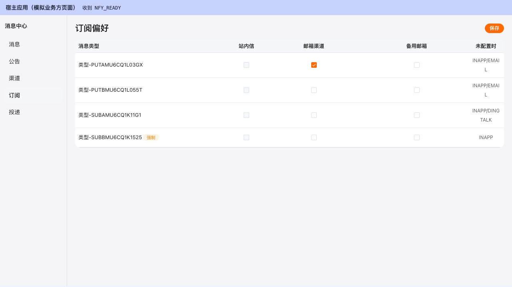
  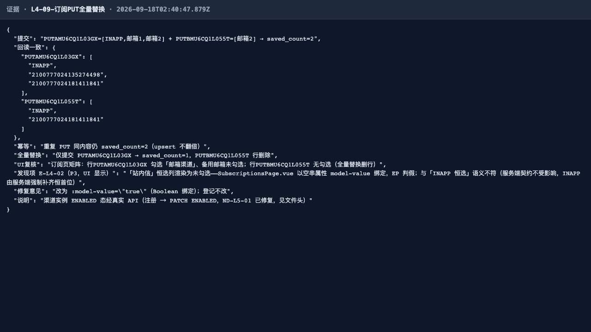
- **L4-10 强制集校验 — ✅**：有实例关最后实例 10606、保留实例 code=0、无实例用户豁免（INAPP 锁定兜底）；**订阅页 UI 复核**——强制类型行「强制」橙色徽标、唯一 EMAIL 实例复选框勾选且禁用（title=强制类型：不能关闭全部站外渠道），UI 层与服务端 10606 双重兜底。
  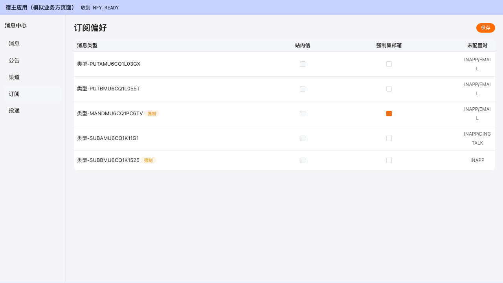
  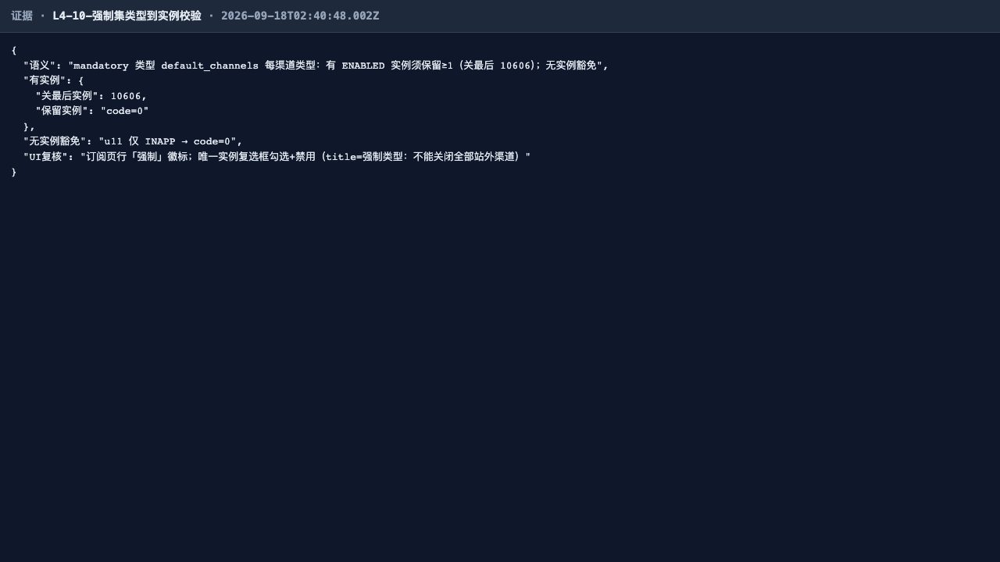
- **L4-11 订阅非法输入（API 面） — ✅**：空 channel_ids 10101 / 未注册类型 10601 / PENDING 渠道 10400 / 同租户他人渠道 10400，全部被拒且无半截落库（items 仍空，事务性）。
  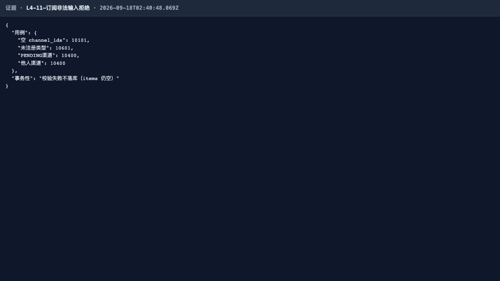
- **L4-12 quiet_hours 落库校验（API 面） — ✅**：保存原样回显、缺省重置（字段消失=未启用）、25:00/abc/start=end/只给 start 四类非法全 10100 且校验失败不落库；推迟发送展开语义由 L5-04 实证。
  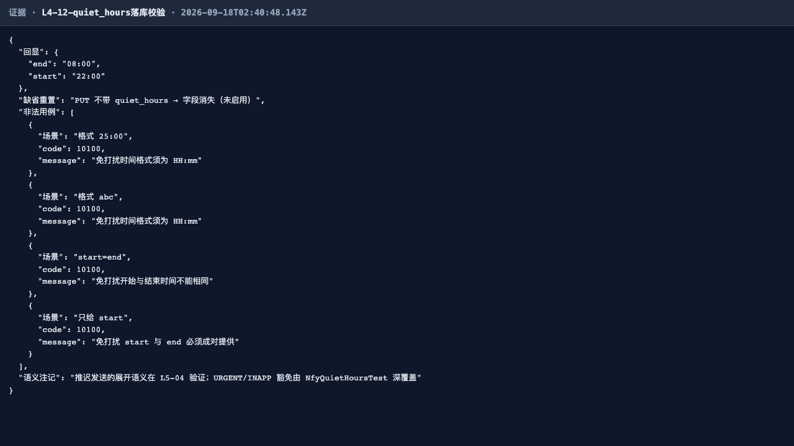

## 四、发现与修复意见（不改代码）

| # | 级别 | 发现 | 修复意见 |
| --- | --- | --- | --- |
| 1 | **P3（UI 显示，本轮新发现 E-L4-02）** | 订阅页「站内信」恒选列**渲染为未勾选**：`SubscriptionsPage.vue` 以空串属性 `model-value disabled` 绑定 `<el-checkbox>`，Element Plus 将空串判假 → 复选框无 is-checked 态，与「INAPP 恒选」语义不符（见 L4-09 UI 图中站内信列空框）。**服务端契约不受影响**：INAPP 由服务端强制补齐恒首位（L4-09 API 断言钉死），保存动作也不会丢 INAPP | 改为 `:model-value="true"`（Boolean 绑定）；登记不改 |
| 2 | P3（环境，既有 E-L4-01） | 本机代理 fake-IP DNS 使 IM 白名单域注册被拒 10609，产品判定按契约正确 | 部署文档标注「出口 DNS 不得将官方域解析至保留段」；证据 L4-01b-*.png |
| 3 | 修复确认 | **ND-L5-01（P1，第 1 轮登记）已修复**：本线 L4-04/05/08/09/10/11 全部以真实 API（注册 → PATCH ENABLED）构造 ENABLED 渠道，pg-fixup 直改库绕行彻底退役 | — |

## 五、结论

**L4 通过。** IT 深回归 21/21 绿 + E2E 13/13 绿；新增真实 SPA 界面证据 4 张（渠道页 ×2、订阅页 ×2），脱敏/状态徽标/矩阵回显/强制锁定等 UI 面语义与 API 契约互相印证；无 P0~P2 缺陷，附带 1 项新发现 P3 UI 显示缺陷（E-L4-02 站内信恒选列未勾选）登记待修。
