# L5 外发引擎线 · 全量回归测试报告（第 2 轮 2026-09-18）

## 一、范围

- **被测**：外发引擎全链（技术方案 §4.3）——send→投递计划（PENDING）→引擎领取（SKIP LOCKED→SENDING）→SPI 投递→SUCCESS 回写；失败退避（实例 2/5/10s）重试≤3 → DEAD（retry_count=4）；渠道连续失败≥5 熔断 DISABLED + 属主站内信（CHANNEL_ALERT）兜底；quiet_hours 计划期「推迟发送非丢弃」（next_retry_at=窗结束）；DLV-001 投递查询（target 脱敏）/ DLV-002 仅 DEAD 可重投；L5-00 = ND-L5-01 修复回归。
- **第 2 轮证据改版**：**投递页是引擎线的天然 UI 证据面**——外发成功链→投递页 SUCCESS 行、失败退避→退避窗内 FAILED 行真实抓拍、DEAD→DEAD 行（重投按钮）、DLV-002→**UI「重投」按钮真实动作 + 行转 SUCCESS（前后图）**、quiet_hours→PENDING 推迟行、熔断→渠道页 DISABLED 徽标 + 消息页属主站内信；全部经宿主握手页（`http://localhost:3000/nfy-host.html`）驱动真实 SPA 截图。next_retry_at 等 UI 暂无列的字段以 API 证据页补位（P3 改进注记见第四节）。
- **环境**：共享 E2E 实例 http://localhost:9200（引擎提速：scan 500ms / backoff 2,5,10s / reaper 1s / rate-limit 600/min / SMTP=localhost:3925）；SMTP sink 于 spec 内自建（helpers/smtp-sink，3925 端口，用毕 afterAll 关闭）；独立租户「L5引擎线」+ `uniq()` 隔离；EMAIL 渠道使能全走真实 API（ND-L5-01 已修复，零绕行）。
- **E2E 入口**：`NFY_EVIDENCE_DIR=../docs/test/report/2026-09-18-01/screenshots npx playwright test -c e2e-regression/playwright.config.ts --grep "L5"`。

## 二、结果矩阵

**IT 深回归（后台串跑，取自 it-summary.txt / it-logs/L5.log，2026-09-18 10:19）**

| IT 测试类 | 用例数 | 失败 |
| --- | --- | --- |
| NfyDeliveryEngineTest | 3 | 0 |
| NfyDeliveryPlanTest | 4 | 0 |
| NfyQuietHoursTest | 8 | 0 |
| **合计** | **15** | **0** |

**E2E 全量回归（本轮重跑）**：7 用例 / 7 通过 / 0 失败（50.2s，含引擎真实退避/死信等待，1 worker 串行）

| # | 用例 | 证据形态 | 结论 |
| --- | --- | --- | --- |
| L5-00 | 修复回归 ND-L5-01：EMAIL 渠道纯 API 通路 ENABLED 可达 | API 证据页 | ✅ |
| L5-01 | 外发成功链：类型默认 EMAIL → 计划 → 引擎 → SMTP 收包 | **UI 截图** + API 证据页 | ✅ |
| L5-02 | 失败重试退避：454×2 → FAILED(1,2) 递进 → 恢复后 SENT | **UI 截图**（退避窗内抓拍）+ API 证据页 | ✅ |
| L5-03 | 持续失败 → DEAD → DLV-002 人工重投成功 | **UI 前后图 ×2** + API 证据页 | ✅ |
| L5-04 | quiet_hours 静默窗内投递推迟（next_retry_at=窗结束） | **UI 截图** + API 证据页 | ✅ |
| L5-05 | 熔断前夜：4 次失败（未达阈值不熔断）→ DEAD | API 证据页 | ✅ |
| L5-06 | 第 5 次失败熔断 DISABLED + 属主站内信 + EMAIL 熔断重启用=重新验证 | **UI 截图 ×2** + API 证据页 | ✅ |

## 三、用例与证据

- **L5-00 ND-L5-01 修复回归（API 面） — ✅**：EMAIL 注册 PENDING → verify 恒 10604（「首次投递时校验」文案契约保留）→ **patch ENABLED code 0（修复点，原恒 10610 死锁）** → 列表复核 ENABLED 真落库。外发链闭合，本线全用例零绕行。
  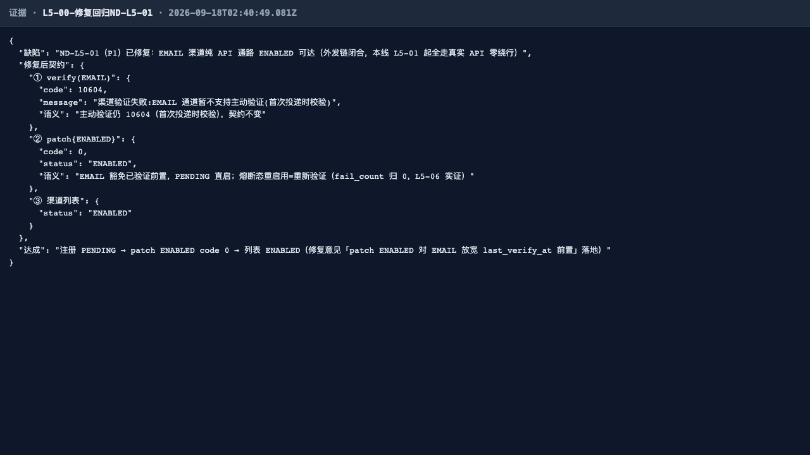
- **L5-01 外发成功链 — ✅**：delivery_planned=1、INAPP 落库不走引擎；引擎 500ms 扫描领取 → SMTP（3925）→ SUCCESS（retry_count=0、sent_at 回填、target 快照脱敏 `u***@`）；sink 收包断言（from=nfy-e2e@test.local / to=渠道 target / Subject 含标题）；**投递页真实 SPA 出现 SUCCESS 绿色徽标行**（biz_no 过滤恰 1 行，EMAIL/u1/重试次数 0/发送时间回显）。
  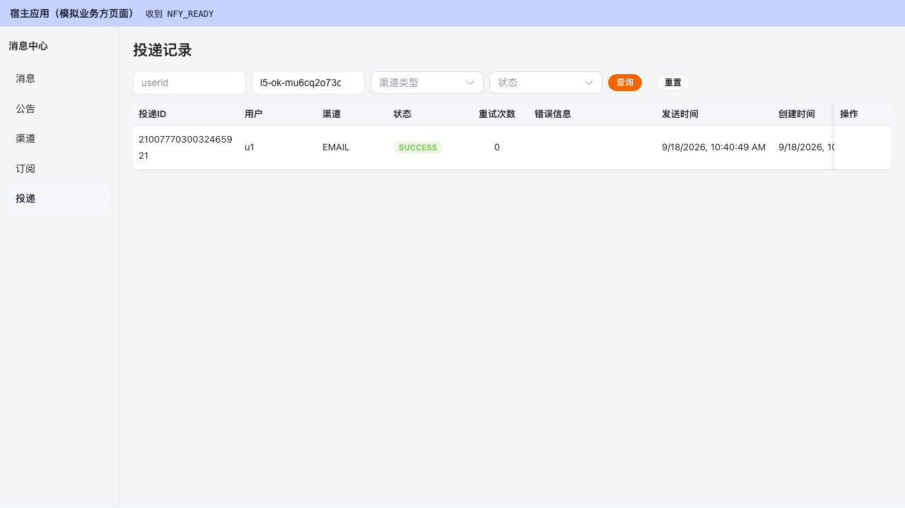
  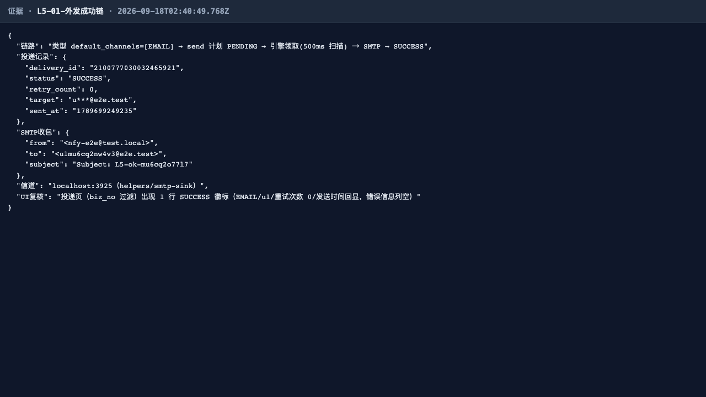
- **L5-02 失败重试退避 — ✅**：sink.failFirst=2（前 2 次 DATA 回 454）→ FAILED(1)→FAILED(2) 递进，退避实测 gap1≈2s / gap2≈5s（配置 2,5,10s），第 3 次尝试恢复 → SUCCESS（retry_count=2、sink 增量收包 1）；**退避窗内真实抓拍投递页 FAILED 橙色徽标行**（重试次数 2 + 错误信息「SMTP 失败: SMTPSendF…」454 留痕）。
  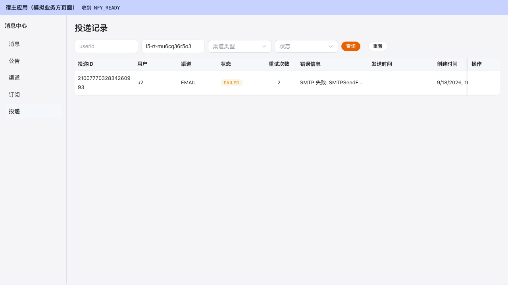
  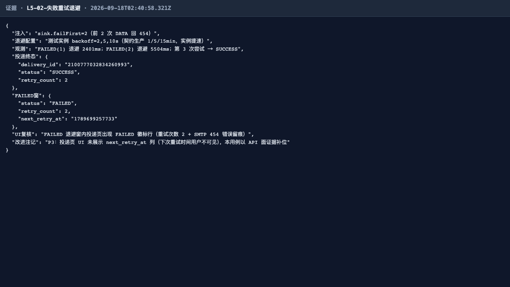
- **L5-03 DEAD 与 DLV-002 人工重投 — ✅**：持续失败 → 退避 2/5/10s 三次 → DEAD（retry_count=4、错误摘要 SMTP 留痕）；非 DEAD 重投 10402、不存在 id 10400；**UI 前图**：DEAD 红色徽标行 + 仅 DEAD 行出现的「重投」按钮 → **UI 真实点击重投**（toast「已重新入队」，POST /admin/deliveries/{id}/retry → PENDING 立即可扫）→ sink 恢复收包 → **UI 后图**：同 biz_no 行转 SUCCESS 绿色徽标（前后图闭环）。
  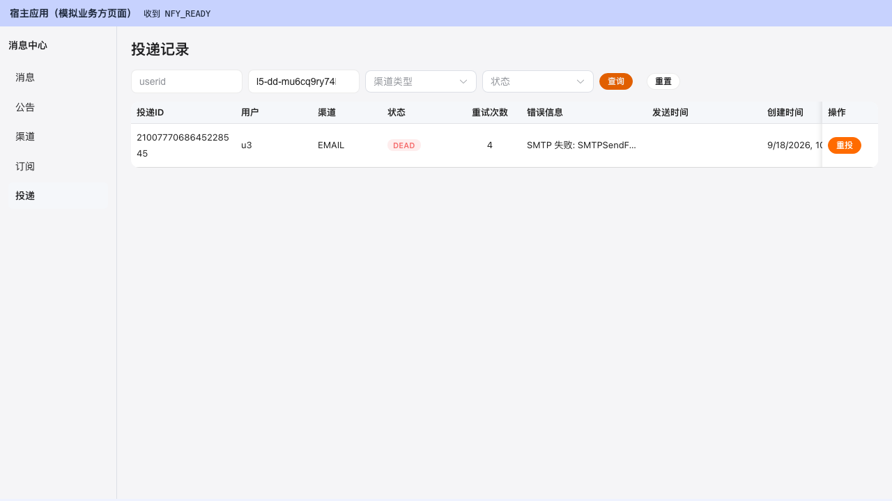
  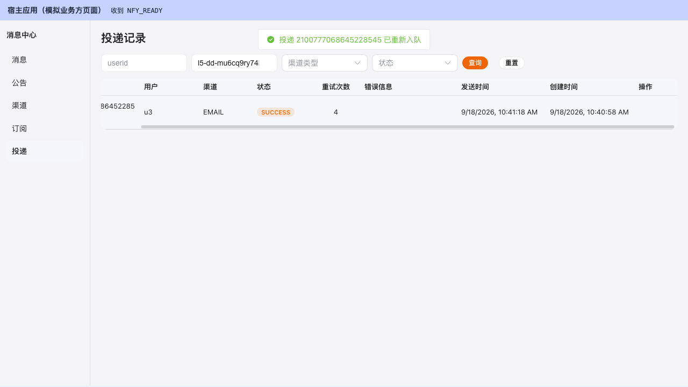
  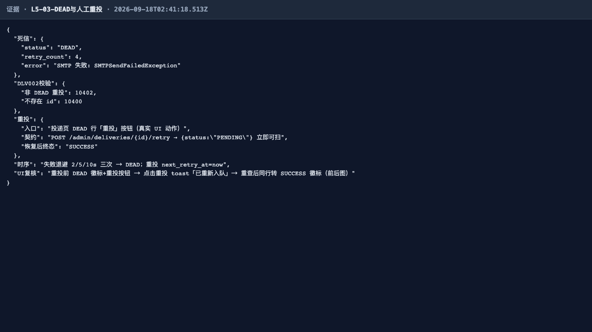
- **L5-04 quiet_hours 推迟 — ✅**：构造覆盖当前时刻的静默窗（start=now-1h、end=now+1h）→ 投递生成但 **PENDING 推迟**，next_retry_at=窗结束（推迟 ≈1h，API 断言 25~130min 区间）、静默窗内不真发（sink 零增量）；**投递页 UI 呈现被推迟的 PENDING 蓝色徽标行**（重试次数 0）；「推迟发送非丢弃」语义（URGENT/INAPP 豁免由 NfyQuietHoursTest 深覆盖）。
  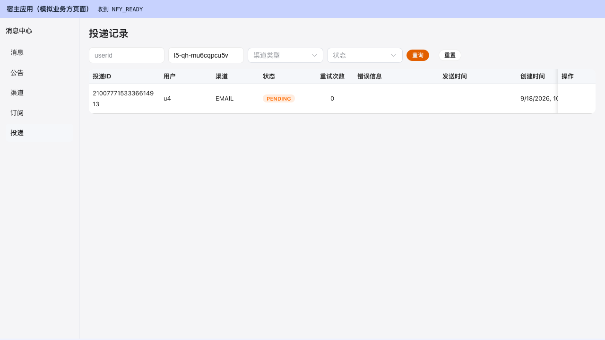
  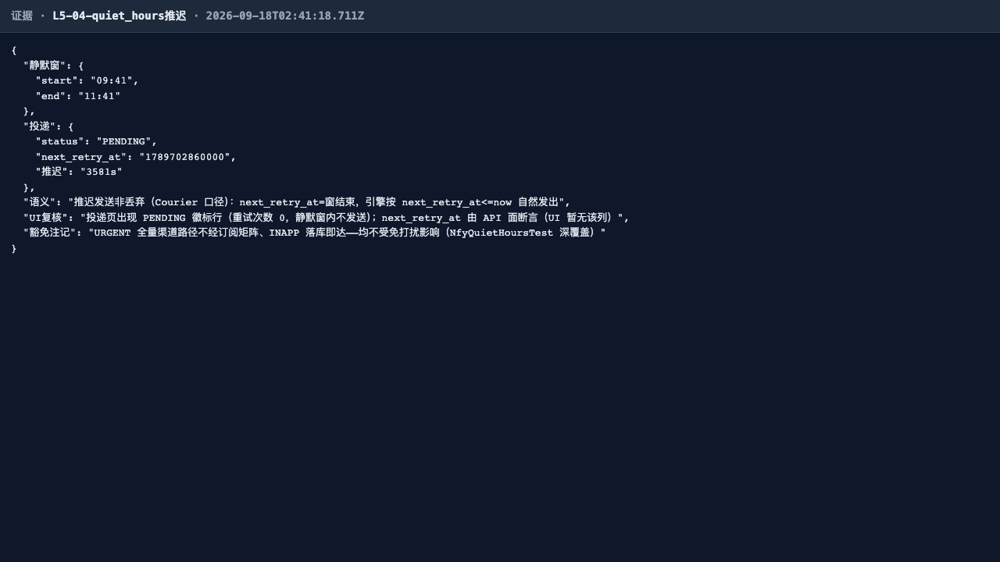
- **L5-05 熔断阈值前不熔断（API 面） — ✅**：4 次失败 → DEAD(retry_count=4) 而渠道 fail_count=4、仍 ENABLED——投递行 retry_count 与渠道 fail_count 两类计数器分离，阈值 5 未达不熔断。
  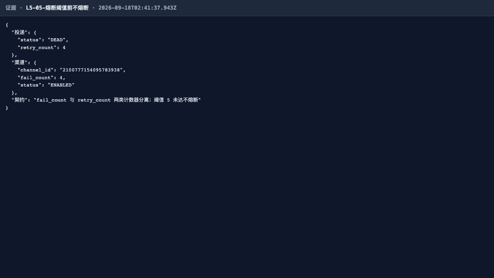
- **L5-06 熔断与属主站内信 — ✅**：DLV-002 重投 DEAD 行 → 第 5 次失败 → fail_count=5 → CAS 熔断 DISABLED；**渠道页真实 SPA「邮箱渠道-u5」卡片 DISABLED 红色徽标（熔断态 UI 可见）**；EMAIL 熔断态显式重新启用=重新验证 → ENABLED 且 fail_count 归 0（ND-L5-01 修复，IM 熔断仍须真实 verify 10610 由 IT 钉死）；**消息页真实 SPA 出现「渠道连续失败已自动停用」CHANNEL_ALERT 站内信（引擎兜底直达 INAPP，UI 可见）**。
  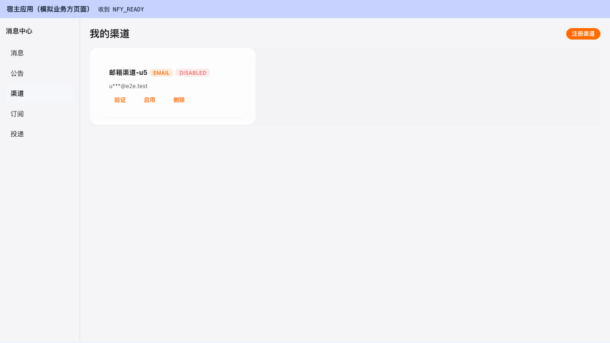
  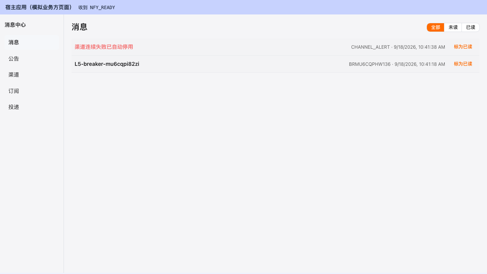
  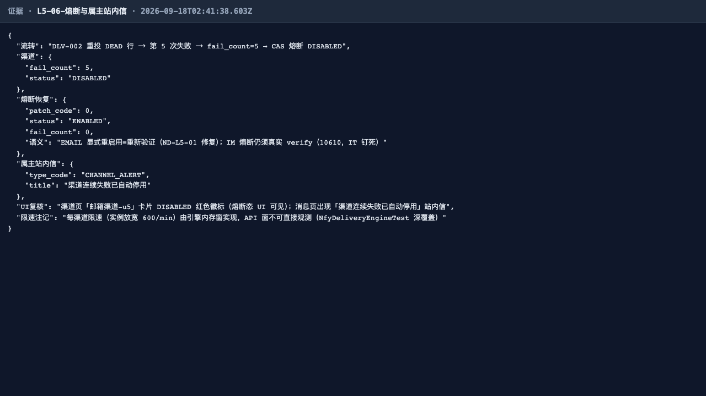

## 四、发现与修复意见（不改代码）

| # | 级别 | 发现 | 修复意见 |
| --- | --- | --- | --- |
| 1 | **P3（UI 改进，本轮新发现 E-L5-02）** | 投递页**未展示 next_retry_at 列**：失败退避（L5-02）与静默窗推迟（L5-04）场景下「下次重试时间」对租户管理员不可见，只能靠 API 查询（本报告以 API 证据页补位） | 投递表增加「下次重试」列（或状态徽标 tooltip 展示 next_retry_at，经 parseFwkTime 归一 Long→String 契约）；登记不改 |
| 2 | 修复确认 | **ND-L5-01（P1，第 1 轮登记）已修复且修复回归钉死**：L5-00 三段断言（verify 契约不变 / PENDING 直启 / 列表 ENABLED）通过；全链 L5-00~06 真实 API 端到端，pg-fixup 绕行彻底退役；「投递成功回写 last_verify_at」随成功链生效 | — |

## 五、结论

**L5 通过。** IT 深回归 15/15 绿 + E2E 7/7 绿；新增真实 SPA 界面证据 7 张（投递页 SUCCESS/FAILED/DEAD/PENDING 行、DLV-002 UI 重投前后图、渠道页熔断徽标、消息页属主站内信），引擎状态机的每个终态与中间态（退避窗、静默窗、熔断态）均获得 UI+API 双面印证；ND-L5-01 修复回归通过；无 P0~P2 缺陷，附带 1 项新发现 P3 UI 改进（E-L5-02 next_retry_at 列）登记待修。
