# L6 平台治理线 · 全量回归测试报告（第 2 轮 2026-09-18）

## 一、范围

- **被测**：notification4j V1.0 平台治理与租户生命周期线（PTE-001 建租户 secret 仅一次 / email 唯一、PTE-002 配置修改与 email 脱敏、PTE-003 reset-secret 双版本宽限、PTE-004 状态机 ACTIVE⇄SUSPENDED→CLOSED 终态、PTE-005 强制订阅平台域唯一入口、PST-001 平台跨租户概览、平台域闸 @PlatformDomain）。
- **环境**：共享 E2E 实例 http://localhost:9200（出厂等价态）；数据 `uniq()` 隔离。
- **证据形态**：**本线产品无 UI 面，证据为 API 证据页截图**（evidence() 渲染证据页，每用例 1 张关键图）。加分项：L6-04 补充 1 张 UI 交叉证据（SUSPEND 租户在宿主握手页嵌入 SPA 的「会话已失效」真实界面）。
- **E2E 入口**：`NFY_EVIDENCE_DIR=../docs/test/report/2026-09-18-01/screenshots npx playwright test -c e2e-regression/playwright.config.ts --grep "L6"`，spec 原样重跑（0 改动）。

## 二、结果矩阵

**IT 深回归（后台串跑，取自 it-summary.txt / it-logs/L6.log，2026-09-18 10:19）**

| IT 测试类 | 用例数 | 失败 |
| --- | --- | --- |
| NfyTenantComplianceTest | 8 | 0 |
| NfyPlatformDomainTest | 4 | 0 |
| NfyPlatformTenantTest | 3 | 0 |
| NfySignatureKeyTest（宽限列） | 2 | 0 |
| **合计** | **17** | **0** |

**E2E 全量回归（本轮重跑）**：10 用例 / 10 通过 / 0 失败（879ms，1 worker 串行；另加分项 UI 交叉证据 1 张）

| # | 用例 | 契约 | 结论 |
| --- | --- | --- | --- |
| L6-01 | 建租户 secret 仅一次 + 无内部数字 id + 可认证 | PTE-001 | ✅ |
| L6-02 | email 唯一约束：重复创建 10401 拒绝 | PTE-001 | ✅ |
| L6-03 | 配置修改 + 详情/列表 email 脱敏 | PTE-002 | ✅ |
| L6-04 | SUSPEND：新认证 401 同码防探测 + 存量 token 双面 10201 | PTE-004 | ✅ |
| L6-05 | RESUME → ACTIVE：认证恢复 | PTE-004 | ✅ |
| L6-06 | reset-secret：新 secret 立即生效 + 旧 secret 24h 宽限 | PTE-003 | ✅（口径注记） |
| L6-07 | CLOSE 终态：再迁移 10402 + 认证不可恢复 + 非法 action 10100 | PTE-004 | ✅ |
| L6-08 | 平台跨租户概览：字段齐全 + 计数单调合理 | PST-001 | ✅ |
| L6-09 | 平台域闸：租户 token 打平台面 403 | 域闸 | ✅ |
| L6-10 | 强制订阅唯一入口：type-mandatory + 参数/租户校验 | PTE-005 | ✅ |

## 三、用例与证据

- **L6-01 建租户 secret 仅一次 — ✅**：响应字段恰为 `open_id`/`tenant_secret`，明文 secret 仅此一次返回，无内部数字 id；新租户立即 code=0 换 token。
  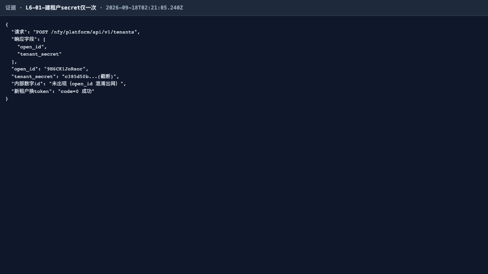
- **L6-02 email 唯一约束 — ✅**：与 L6-01 同邮箱再建 → 10401「邮箱已被使用」，唯一索引真闸。
  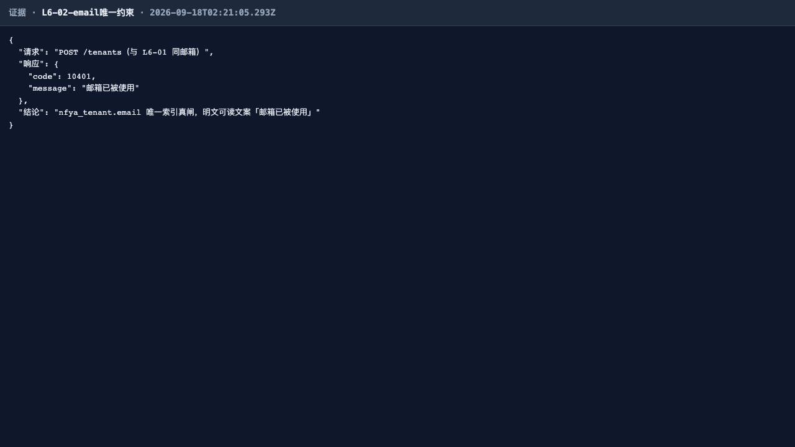
- **L6-03 配置修改与脱敏 — ✅**：PATCH oem.title 回显；详情 email 脱敏为 `首1***尾1@域名`，全程无明文 email；列表含新租户亦脱敏。
  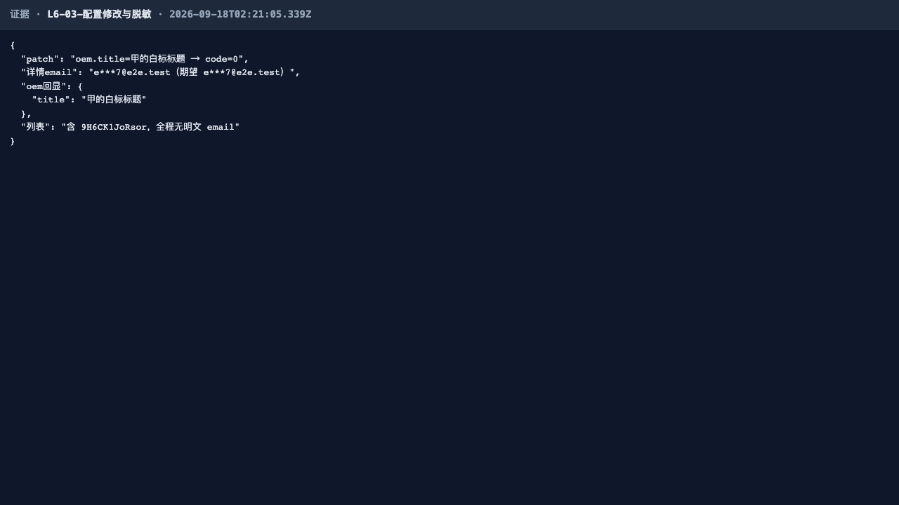
- **L6-04 SUSPEND 阻断 — ✅**：ACTIVE→SUSPENDED 后，正确凭据换 token 亦 401（同码防探测，不泄露停用态）；存量 token 打 admin 面与 runtime 面均 10201（TenantSessionRevoker 即时撤销，双面立即失效）。
  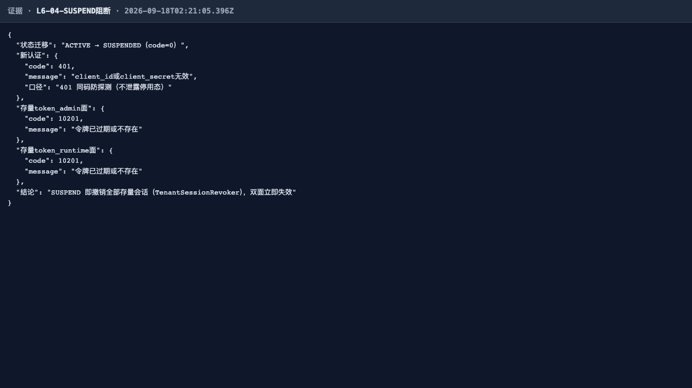
  **UI 交叉证据（本轮加分项）**：SUSPEND 前签发的存量 token 在宿主握手页（localhost:3000，origin 白名单内）加载租户 SPA——数据面信封 10201 → 壳呈现「会话已失效，正在重新连接…」，侧栏与「暂无消息」空态均不渲染（与 L8-08 的 F-2 修复行为一致），平台治理动作在真实界面上即时生效。
  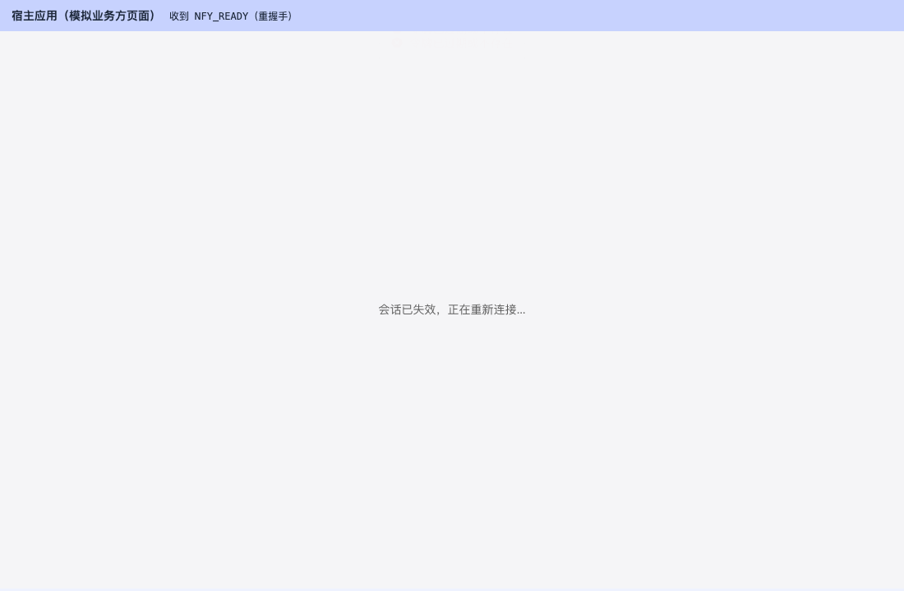
- **L6-05 RESUME 恢复 — ✅**：SUSPENDED→ACTIVE 后原 secret 直接换 token 成功，业务面调用 code=0。
  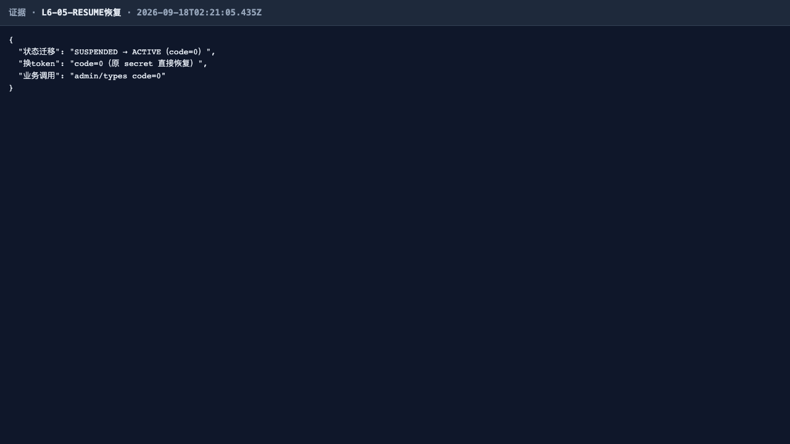
- **L6-06 reset-secret 宽限 — ✅（口径注记）**：reset 后新 secret 立即生效；旧 secret 在 24h 宽限期内仍可换 token。任务书「旧 secret 立即失效」与产品契约 §5.5「双版本宽限过渡」存在口径差异，IT 深回归（NfyPlatformTenantTest）同契约口径，按契约判定通过，差异继续登记（见「四、发现」）。
  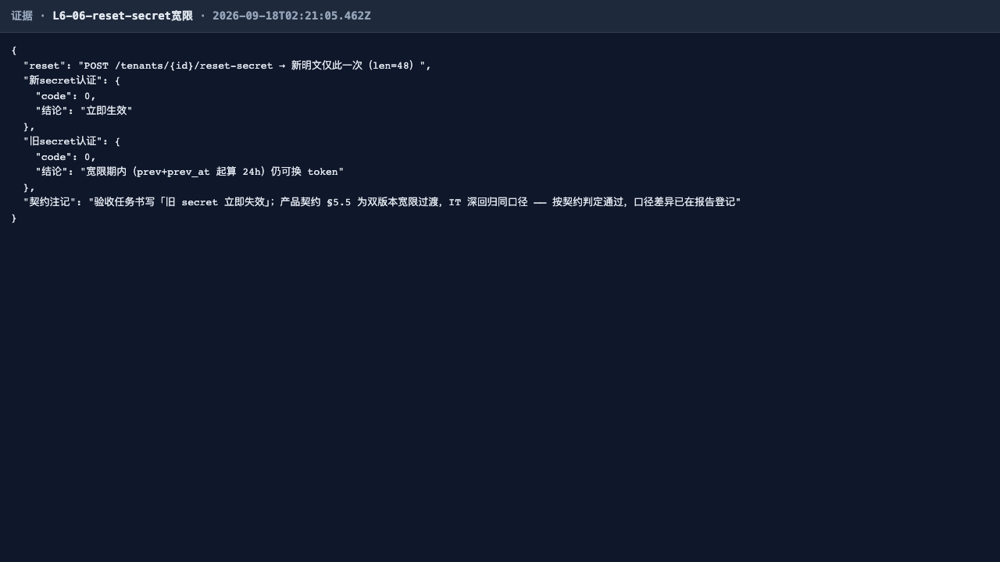
- **L6-07 CLOSE 终态 — ✅**：CLOSED 后再 SUSPEND 10402、认证 401 不可恢复、非法 action 10100——单向状态机终态不可逆。
  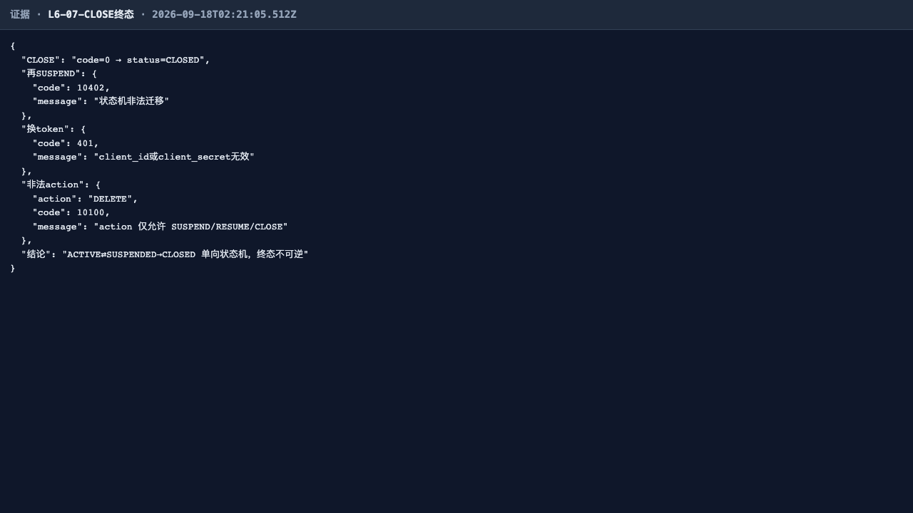
- **L6-08 平台跨租户概览 — ✅**：字段齐全（tenant_count/active_tenants/today_messages/today_deliveries/deliver_success_rate/dead_count/dead_tenants）；建租户后 tenant_count +≥1、发 2 条后 today_messages +≥2；成功率万分比 0~10000 定标。
  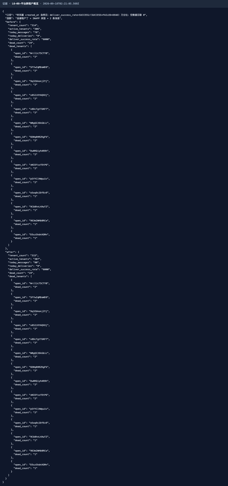
- **L6-09 平台域越权拒绝 — ✅**：租户 token 打租户列表与平台统计均 403，message 明示「平台域」，@PlatformDomain 域闸（tenant_id==0）有效。
  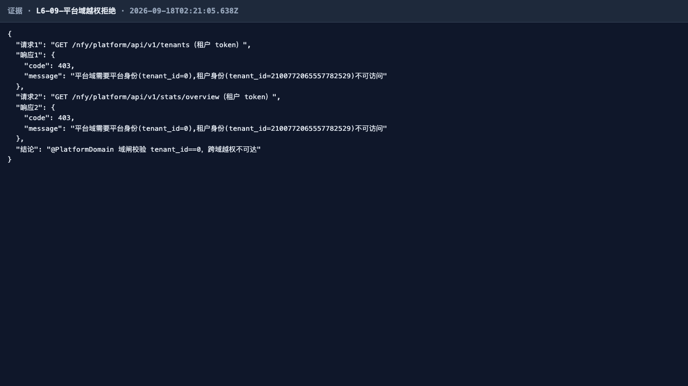
- **L6-10 强制订阅唯一入口 — ✅**：平台域 type-mandatory 设置 mandatory=1 且 admin 列表回显；mandatory=2 非法枚举 10100；未知租户 10400。admin 面不暴露该字段，唯一入口在平台域。
  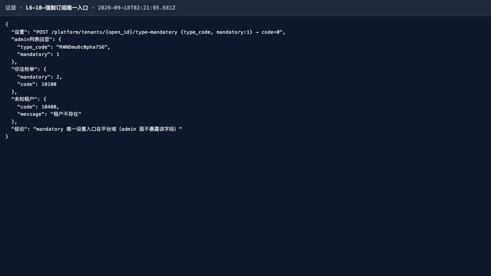

> 本轮 0 失败，无失败证据链图组。

## 四、发现与修复意见（不改代码）

1. **口径登记（沿用第 1 轮，非缺陷）**：PTE-003 reset-secret 后旧 secret 行为——验收任务书写「旧 secret 立即失效」，产品契约 §5.5 为「prev + prev_at 起算 24h 双版本宽限过渡」，IT 深回归与 live 复核均为宽限口径。建议在验收任务书中对齐 §5.5 契约表述，产品代码无需变更。
2. **无新增缺陷**。

## 五、结论

L6 平台治理线第 2 轮全量回归**通过**：IT 深回归 17/17，E2E 10/10，0 失败；SUSPEND 即时撤销会话经 UI 交叉证据印证（SPA 真实呈现「会话已失效」）。租户生命周期状态机、脱敏、域闸与强制订阅唯一入口契约全部稳固。
