# L7 Admin 线 · 全量回归测试报告（第 2 轮 2026-09-18）

## 一、范围

- **被测**：notification4j V1.0 Admin 运营治理线（TYP-001/002 类型管理、TYP→MSG 发送链路、ACH-001 公共渠道注册与 SSRF 白名单/枚举/格式拒绝、DLV-001 投递查询租户隔离与过滤契约、SEC-001 签名密钥轮换/prev 宽限/脱敏、STAT-001 租户概览 created_at 时间基与空数据日口径、TPL-001/002/003 模板管理与渲染预览、OPS 健康检查免 token）。
- **环境**：共享 E2E 实例 http://localhost:9200（出厂等价态：runtime 未签名直调全通、签名基础设施在但 patterns 为空）；数据 `uniq()` 隔离。
- **证据形态**：**本线产品无 UI 面，证据为 API 证据页截图**（evidence() 渲染证据页，每用例 1 张关键图）。
- **E2E 入口**：`NFY_EVIDENCE_DIR=../docs/test/report/2026-09-18-01/screenshots npx playwright test -c e2e-regression/playwright.config.ts --grep "L7"`，spec 原样重跑（0 改动）。

## 二、结果矩阵

**IT 深回归（后台串跑，取自 it-summary.txt / it-logs/L7.log，2026-09-18 10:19）**

| IT 测试类 | 用例数 | 失败 |
| --- | --- | --- |
| NfySchemaMigrationTest | 6 | 0 |
| NfyTemplateTest | 2 | 0 |
| NfyOpsHealthTest | 1 | 0 |
| **合计** | **9** | **0** |

**E2E 全量回归（本轮重跑）**：12 用例 / 12 通过 / 0 失败（814ms，1 worker 串行）

| # | 用例 | 契约 | 结论 |
| --- | --- | --- | --- |
| L7-01 | 建类型 default_channels=[INAPP] 落库回显 | TYP-001 | ✅ |
| L7-02 | 更新类型 + 非法枚举 10100 | TYP-002 | ✅ |
| L7-03 | 类型发消息 → 站内信落库/未读/详情即已读 | TYP→MSG | ✅ |
| L7-04 | 注册公共渠道 EMAIL → 列表可见 target 脱敏 | ACH-001 | ✅ |
| L7-05 | 非法 target：枚举 10100 / SSRF 10609 / 邮箱 10100 | ACH | ✅ |
| L7-06 | 投递查询：租户隔离 total + 过滤契约 | DLV-001 | ✅ |
| L7-07 | 密钥轮换：脱敏 → rotate → prev 宽限 → 短 secret 10100 | SEC-001 | ✅ |
| L7-08 | 租户概览：created_at 时间基 + 空数据日成功率 0 | STAT-001 | ✅ |
| L7-09 | 模板 CRUD + code 租户内唯一 10401 | TPL-001/002 | ✅ |
| L7-10 | 渲染预览：全参/渠道覆盖/缺参 10603/未知 10400 | TPL-003 | ✅ |
| L7-11 | 直发路径内容透传（渲染仅 preview）观察项 | TPL 时机 | ✅ |
| L7-12 | OPS 健康检查免 token，db/redis 全 UP | OPS | ✅ |

## 三、用例与证据

- **L7-01 建类型 — ✅**：type_id 为字符串化雪花（Long→字符串防精度丢失）；列表回显 INAPP、mandatory=0（租户域创建恒 0，唯一入口在平台域）、ENABLED。
  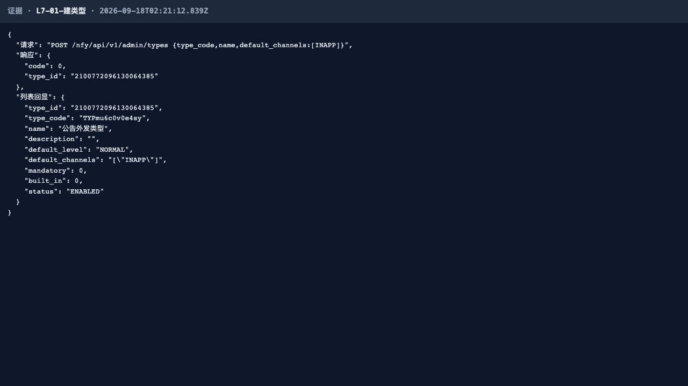
- **L7-02 更新类型 — ✅**：PATCH 改名/default_level 回显成功；default_level=HIGH 枚举外值 10100。
  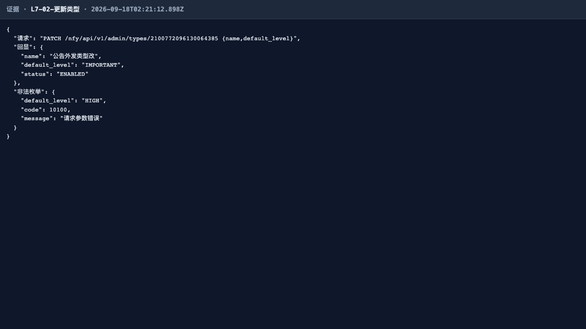
- **L7-03 类型消息链路 — ✅**：inapp_saved=true 同步落库、delivery_planned=0（INAPP 哨兵不产外发行）；uA 未读 1 → 详情即已读（MSG-006）→ 未读归 0。
  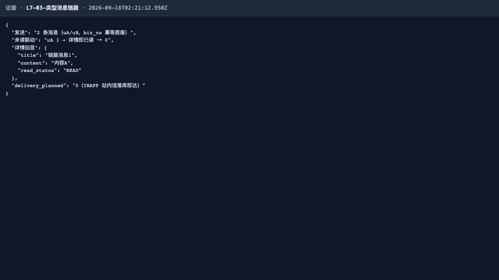
- **L7-04 公共渠道注册 — ✅**：EMAIL 渠道 PENDING（不发验证消息）、列表可见、target 快照脱敏含 ***、fail_count=0。
  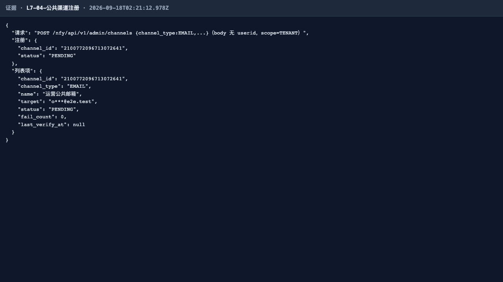
- **L7-05 非法 target 拒绝 — ✅**：channel_type 枚举外 10100；非官方域名 DINGTALK webhook 10609（SSRF 白名单：仅 https+官方域+443+DNS 非内网）；邮箱格式 10100。
  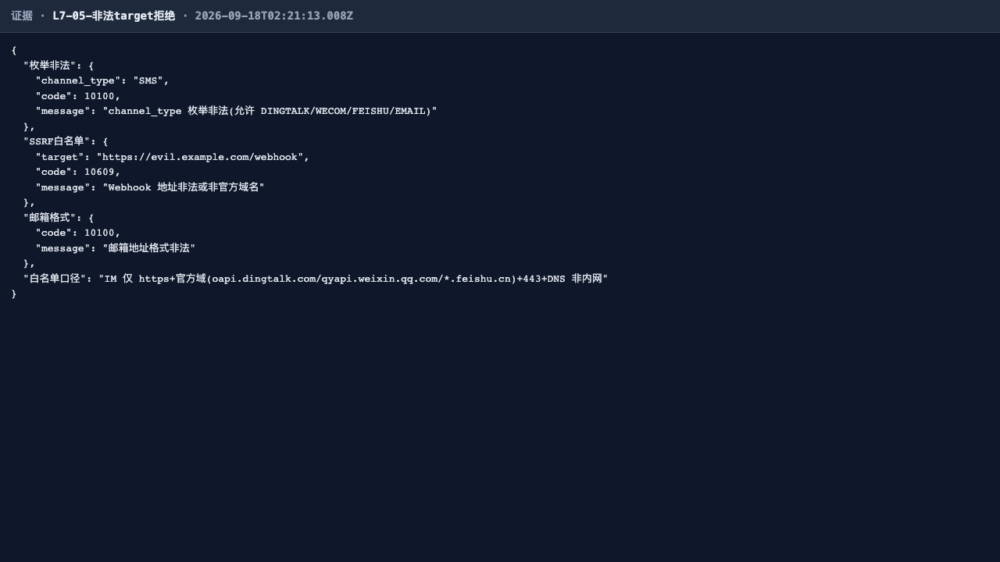
- **L7-06 投递查询契约 — ✅**：本租户 INAPP-only 造数 total=0（跨租户不泄漏）；status/channel_type/biz_no/limit/offset 过滤参数全部接受且空列表不炸。
  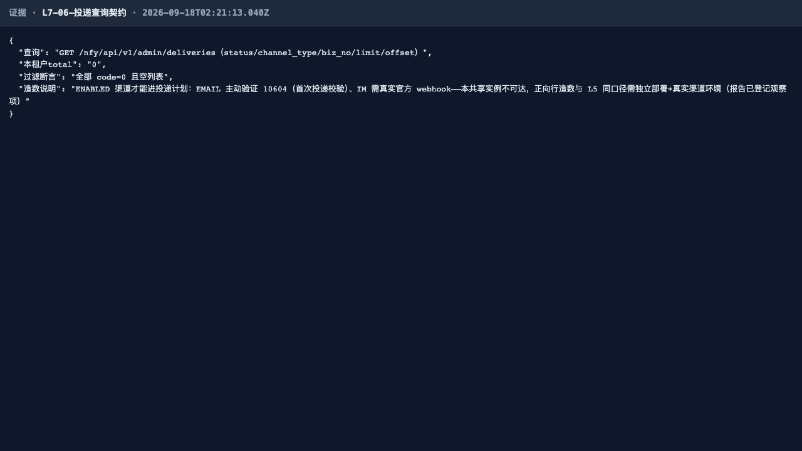
- **L7-07 签名密钥轮换 — ✅**：初始 configured=true、masked 前2+****+后2、无 prev；rotate 后 rotated=true 响应不回显明文、has_prev=true + prev_at 时间戳（24h 宽限窗）、新旧明文均不泄漏；<16 位短 secret 10100；轮换不吊销存量会话（区别于平台面 SUSPEND）。
  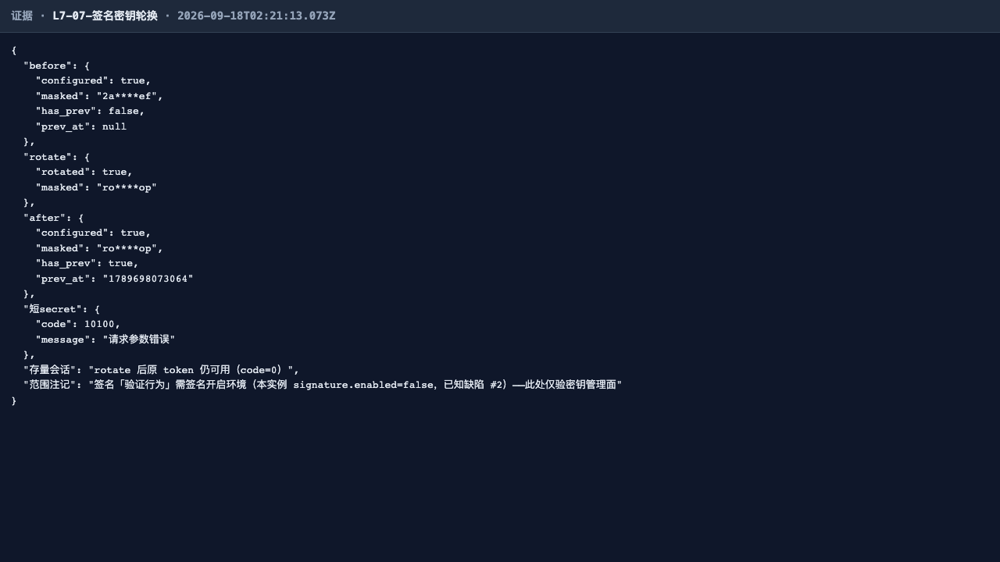
- **L7-08 租户概览统计 — ✅**：today_sent=2（本租户 L7-03 精确计数，租户隔离）、today_delivered=0（INAPP 不走投递）、空数据日 deliver_success_rate='0'（无样本≠全成功）、read_rate_7d=5000（1/2 受众，万分比）、channel_count=0（PENDING 不计）。
  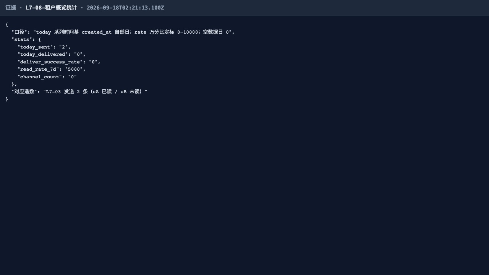
- **L7-09 模板管理 — ✅**：创建/详情（占位符原样回显、渠道覆盖配置回显）/更新/列表全通过；template_code 租户内唯一 10401。
  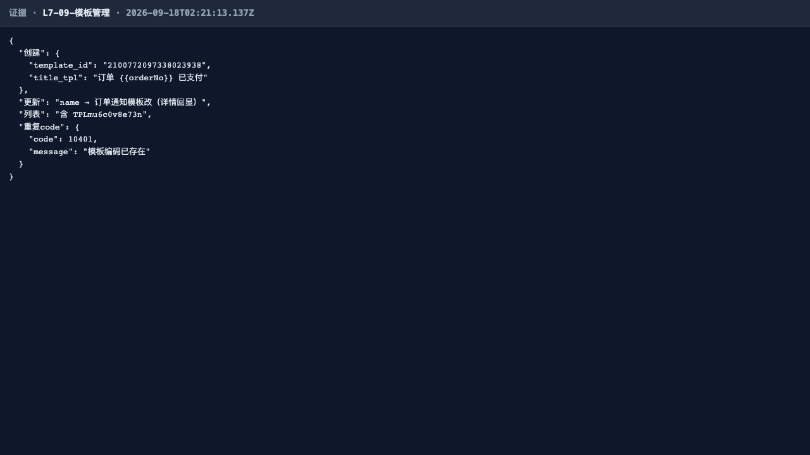
- **L7-10 渲染预览 — ✅**：全参渲染「订单 A123 已支付 / 金额 99 元」、channel_content 按渠道覆盖「钉钉：A123」；缺 amount 10603 且 message 指明缺失参数名；未知模板 10400。
  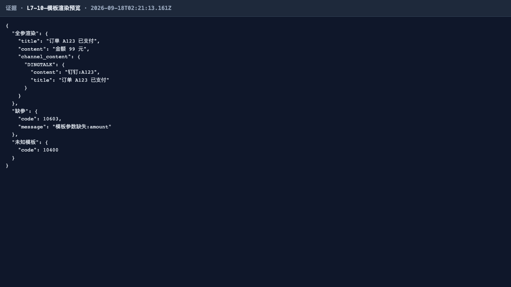
- **L7-11 直发渲染时机观察 — ✅**：直发路径 content 原样透传 `直发内容 {{orderNo}} {{amount}}`（与 L7-10 preview 同参数已渲染形成对照）——渲染仅发生在 preview 端点，模板发送链路（V1.1）未接线，与 NfyTemplateTest 契约一致。
  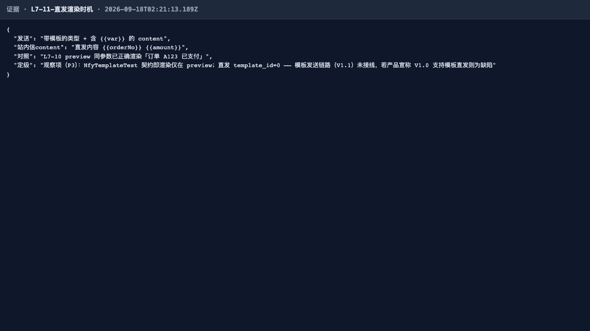
- **L7-12 OPS 健康检查 — ✅**：免 token 可达（exclude-path-patterns 放行），status=UP，db（SELECT 1）/redis（PING）全 UP。
  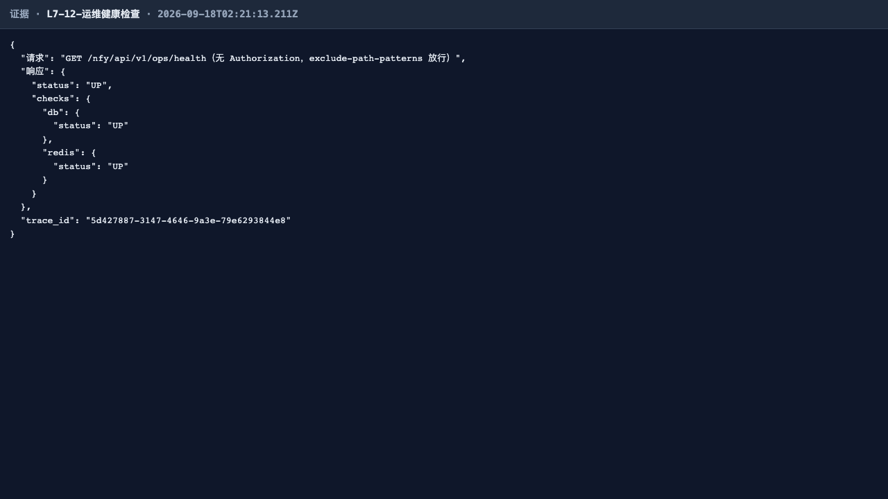

> 本轮 0 失败，无失败证据链图组。

## 四、发现与修复意见（不改代码）

1. **签名验证行为观测口径（沿用登记，非缺陷）**：本轮实例为出厂等价配置——`signature.enabled=true` 且 `path-patterns=[]`（v1.2.2 D-1 修复后出厂语义：SPA 与 S2S 共用 runtime 路径，出厂不对 runtime 强制签名）。因此 L7-07 仅验证密钥管理面（轮换/宽限/脱敏）；签名「验证行为」由 NfySignatureFaceTest（L1 组，enabled+patterns 显式配置）端到端覆盖。S2S 需要防重放时按 app yml 注释加回 patterns 即可，密钥解析已由 NfyTenantSecretProvider 接线。
2. **P3 观察项（沿用登记）**：L7-11 模板直发未接线——直发路径 template_id=0 内容透传，渲染仅 preview。V1.0 契约即如此（NfyTemplateTest 钉死），若产品宣称 V1.0 支持模板直发则升级为缺陷；建议在 V1.1 接线模板发送链路。
3. **观察项（沿用登记）**：L7-06 投递正向行造数需独立部署 + 真实渠道环境（EMAIL 主动验证 10604、IM 需真实官方 webhook，共享实例不可达），本轮仅验证查询契约面。
4. **无新增缺陷**。

## 五、结论

L7 Admin 线第 2 轮全量回归**通过**：IT 深回归 9/9，E2E 12/12，0 失败。类型/渠道/投递查询/密钥轮换/统计口径/模板渲染/健康检查契约全部稳固；沿用登记 1 项 P2 已知配置缺陷（签名未开启）与 2 项观察项，无新增缺陷。
