# L8 前端线 · 全量回归测试报告（第 2 轮 2026-09-18）

## 一、范围

- **被测**：notification4j V1.0 前端消息中心线（全 UI 线）：嵌入握手全链（NFY_READY/NFY_TOKEN、origin 白名单、token 只进内存）、五页导航与 SPA fallback、公告已读/确认回执、铃铛未读角标与最近消息下拉、消息已读联动、撤回展示、非法 origin 拒绝、无效 token 会话失效表现（F-2 修复后行为）。
- **环境**：共享 E2E 实例 http://localhost:9200；宿主握手页 http://localhost:3000/nfy-host.html（origin 白名单内，global-setup 保证在线）；数据 `uniq()` 隔离。
- **证据形态**：UI 截图为绝对主体（真实页面截图 + evidence() API 复核证据页），每用例嵌关键界面图，目录 `screenshots/`。
- **E2E 入口**：`NFY_EVIDENCE_DIR=../docs/test/report/2026-09-18-01/screenshots npx playwright test -c e2e-regression/playwright.config.ts --grep "L8"`，spec 原样重跑（0 改动）。

## 二、结果矩阵

**IT 深回归（后台串跑，取自 it-summary.txt / it-logs/L8.log，2026-09-18 10:19）**

| IT 测试类 | 用例数 | 失败 |
| --- | --- | --- |
| NfySmokeTest | 8 | 0 |
| NfyStaticPageTest | 5 | 0 |
| **合计** | **13** | **0** |

**E2E 全量回归（本轮重跑）**：8 用例 / 8 通过 / 0 失败（5.1s，1 worker 串行）

| # | 用例 | 结论 |
| --- | --- | --- |
| L8-01 | 嵌入握手全链：NFY_TOKEN → 消息列表渲染种子数据 | ✅ |
| L8-02 | 五页导航标志性元素 + SPA fallback | ✅ |
| L8-03 | 公告页展示与已读/确认回执（UI 操作 + API 复核） | ✅ |
| L8-04 | 铃铛未读角标 = unread-count total + 下拉最近消息 | ✅ |
| L8-05 | 消息已读联动：角标递减 + 样式切换 + API 复核 | ✅ |
| L8-06 | 撤回展示：API 撤回 → UI 刷新后不再展示 | ✅ |
| L8-07 | origin 白名单拒绝：非白名单父页投递不被接受 | ✅ |
| L8-08 | 无效 token：会话失效重连提示（F-2 修复后行为） | ✅ |

## 三、用例与证据

- **L8-01 嵌入握手全链 — ✅**：宿主页 postMessage NFY_TOKEN → 壳渲染「消息中心」、种子消息可见、URGENT 等级色标（li.lv-URGENT）；宿主侧 NFY_HOST_STATE 证实 token 已投递且长度一致（仅内存传递，不在 URL/存储）。列表时间戳正常渲染（**F-1 时间回归正常**，见 L8-03/05 图中 `9/18/2026, 10:21 AM` 格式）。
  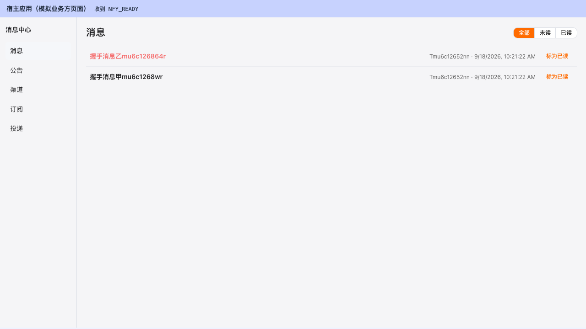
- **L8-02 五页导航 + SPA fallback — ✅**：消息/公告/渠道（空态引导）/订阅（类型行 + 站内信恒开）/投递（筛选器 + 空表格）五页标志性元素全过，SPA 客户端路由高亮正确；`GET /nfy/tenant/app/messages` fallback 200 + text/html + `#app` 挂载点。
  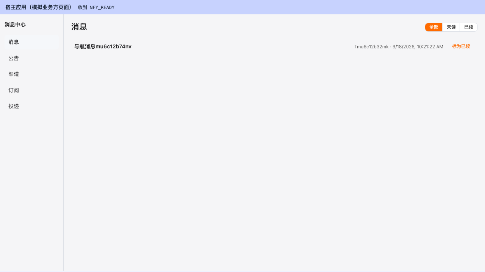
  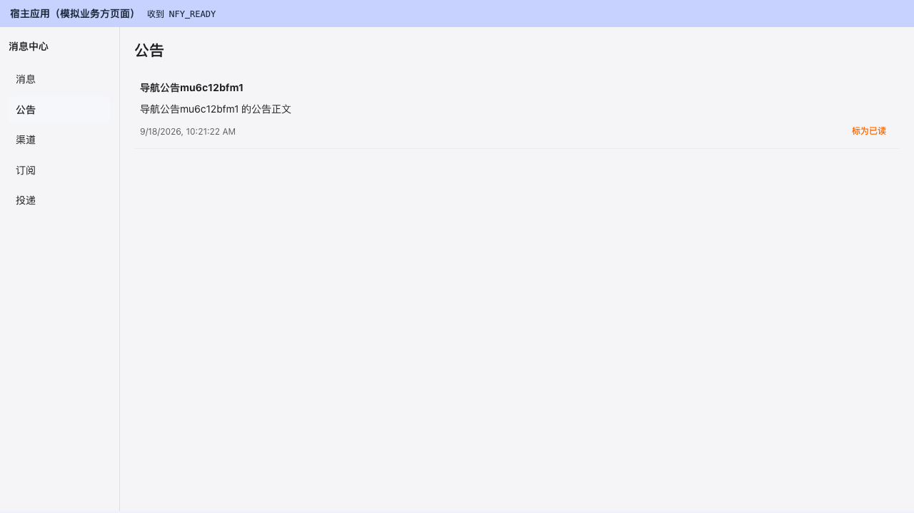
  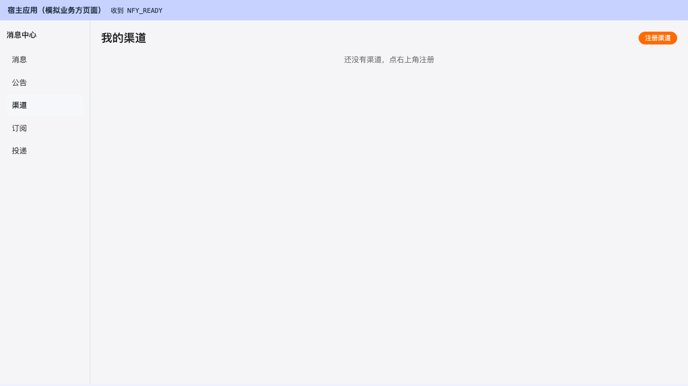
  
  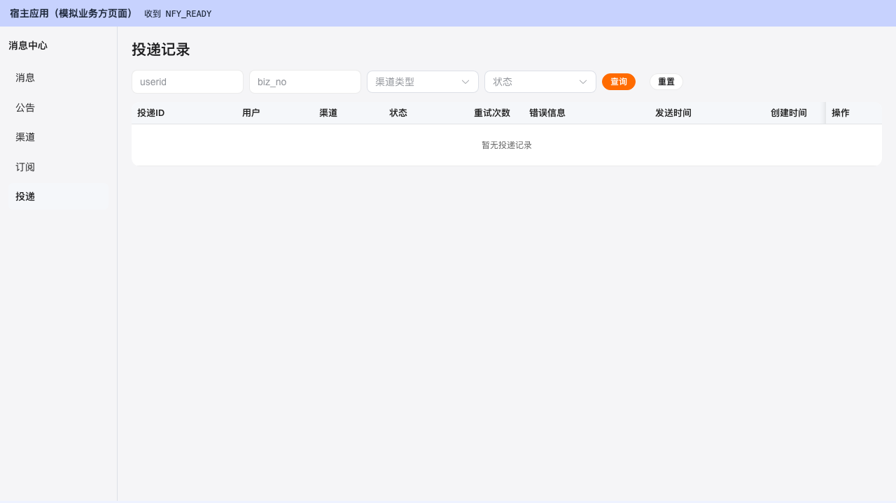
  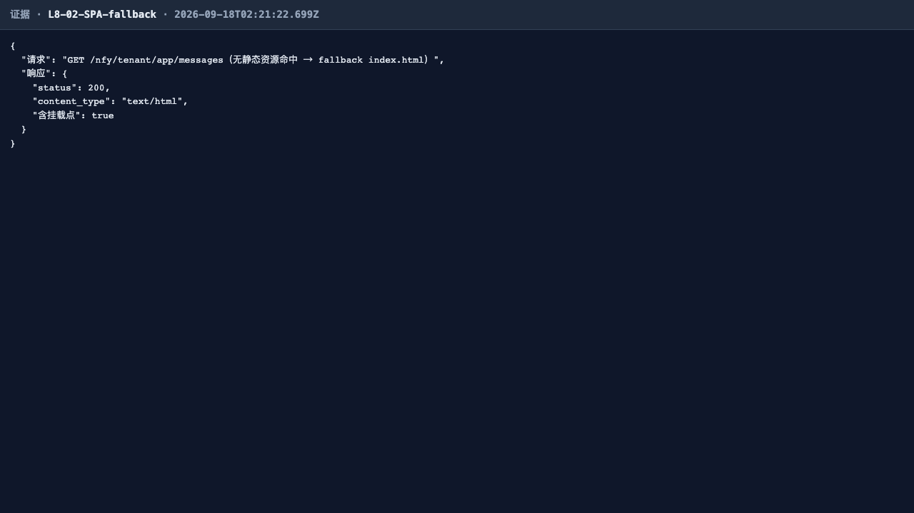
- **L8-03 公告回执 — ✅**：普通公告「标为已读」按钮点击后隐藏、需确认公告「我知道了」→「已确认」；API 复核 my_status=READ/CONFIRMED、stats read_count=1/confirm_count=1。时间渲染正常（**F-1**）。
  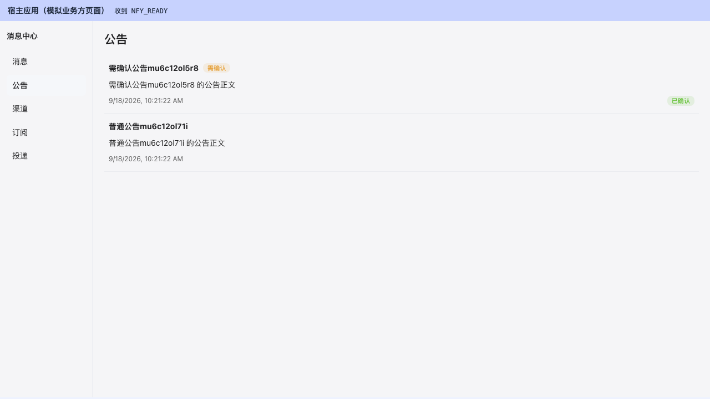
  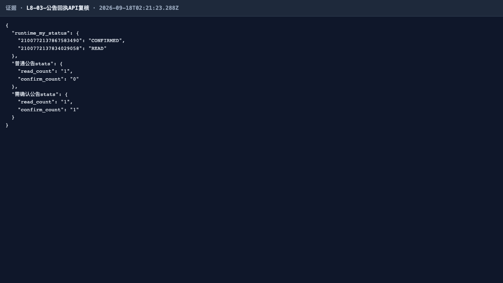
- **L8-04 铃铛未读角标 — ✅**：bell 单页壳经真实宿主页 iframe src 切换嵌入；角标=unread-count total（造数 3 条未读精确计入，并发平台公告动态对齐）；点击展开「最近消息」下拉含全部种子消息与「查看全部」。
  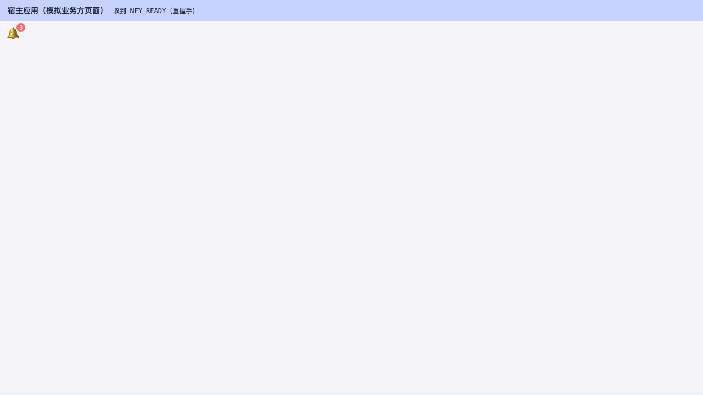
  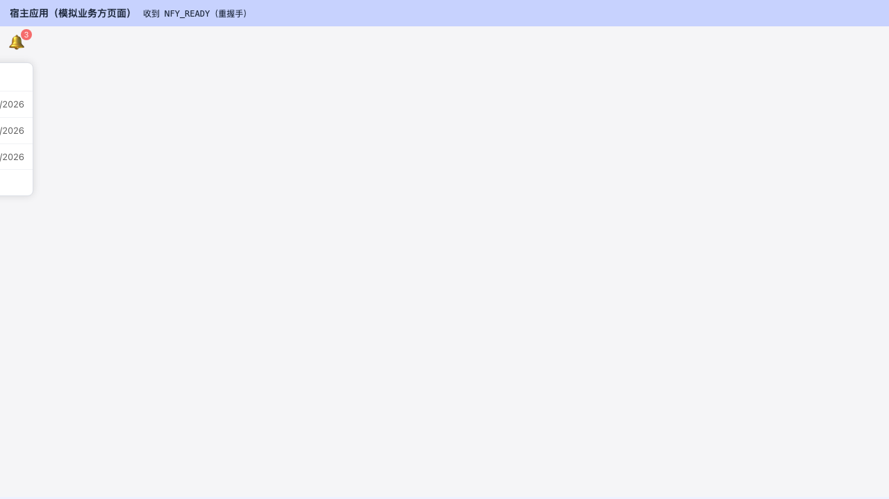
  
- **L8-05 消息已读联动 — ✅**：初始未读角标 2 + 行 unread 加粗；点「标为已读」→ 样式切换 + 角标减为 1 + 已读筛选可见；API 复核 unread=1。角标/时间渲染正常（**F-1**）。
  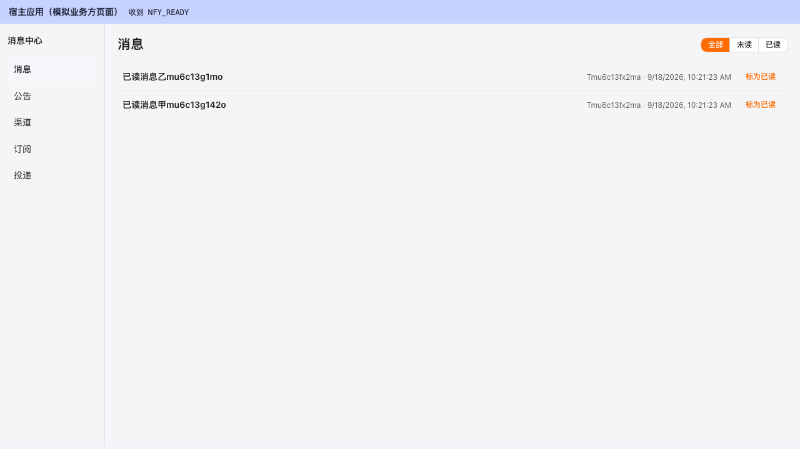
  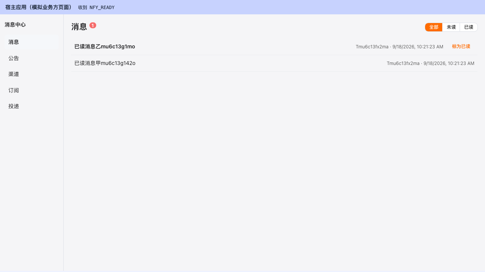
  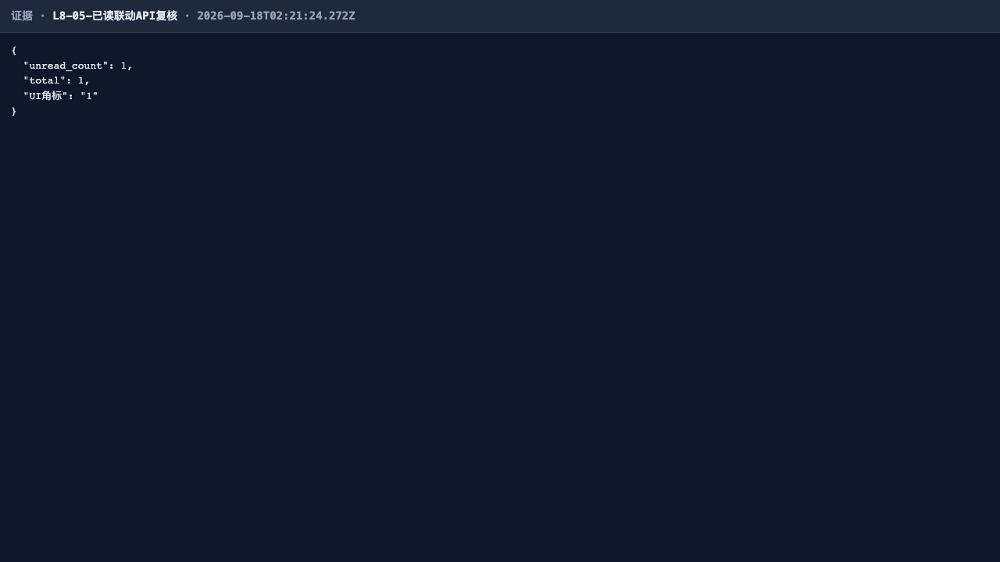
- **L8-06 撤回展示 — ✅**：API cancel（SENT→CANCELLED）后整页重载重握手，消息从 UI 消失且呈「暂无消息」空态；API 列表同步为空。
  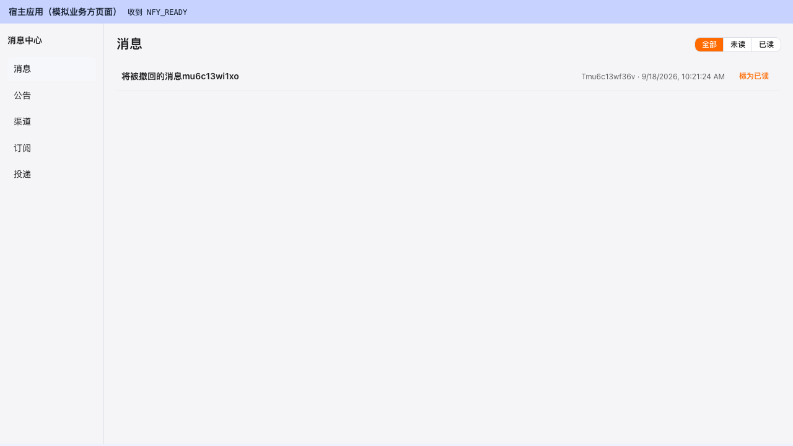
  
  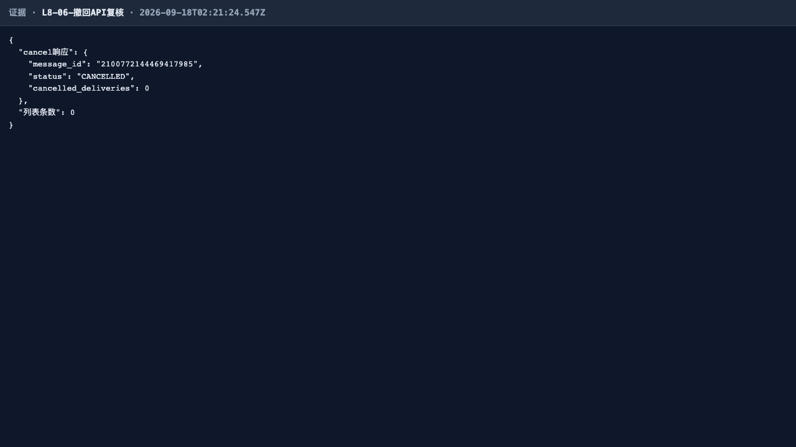
- **L8-07 origin 白名单拒绝 — ✅**：about:blank（null origin，白名单外）父页投递 NFY_TOKEN 被忽略——iframe 重发 NFY_READY ≥3 次（≥1s 仍 waiting）、保持「正在连接…」、壳与侧栏不渲染、**0 次 runtime API 调用**（token 未进内存）。
  
  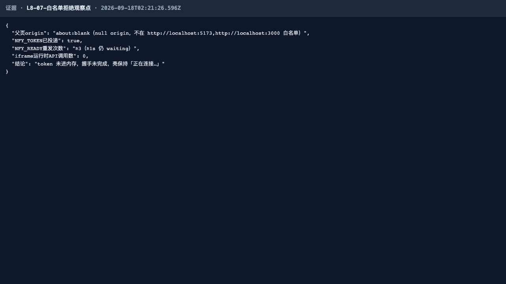
- **L8-08 无效 token 表现（**F-2 修复后行为**） — ✅**：无效 token 信封 HTTP 200 + code=10202（鉴权类，契约 §2.2）；UI 呈现「会话已失效，正在重新连接…」，不再出现误导性「暂无消息」空态，侧栏与数据面不可见。
  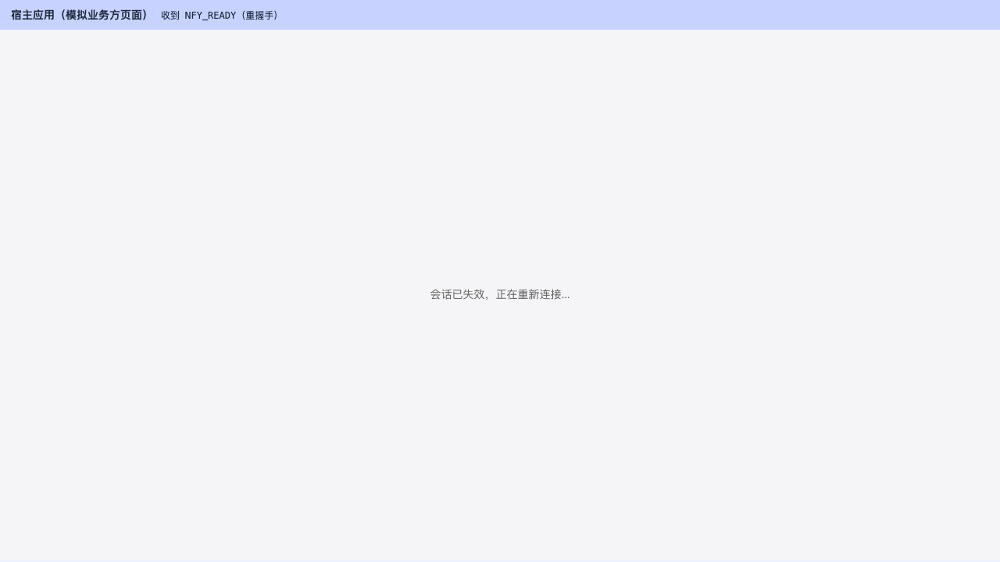
  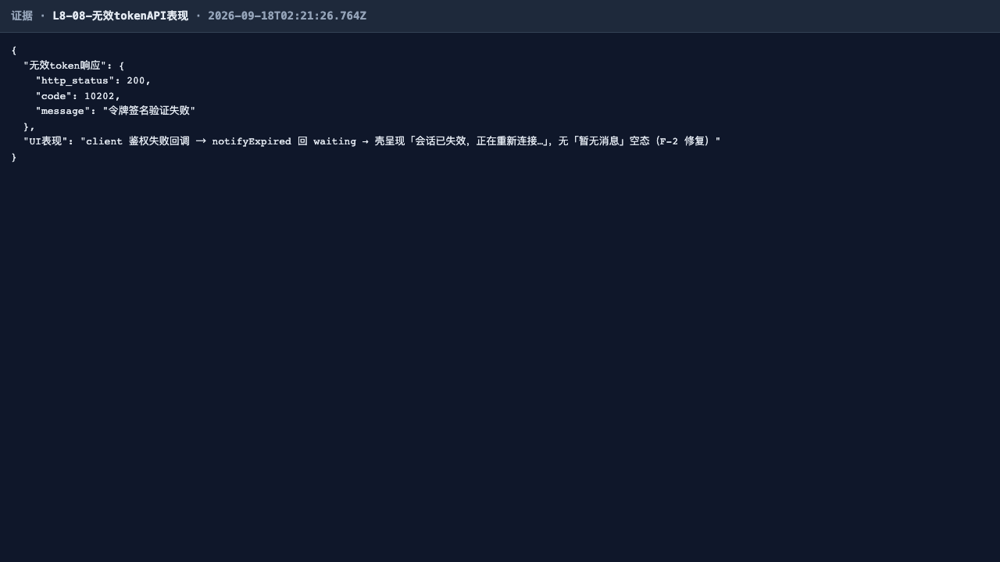

> 本轮 0 失败，无失败证据链图组。F-1（时间渲染）与 F-2（会话失效态）两项历史修复回归正常；L6 线报告另以 SUSPEND 租户的真实 SPA 界面交叉印证了 F-2 行为（见 L6 报告 L6-04 节）。

## 四、发现与修复意见（不改代码）

无。本轮 8/8 全通过，无新增缺陷；两项历史修复（F-1 时间正常渲染、F-2 会话失效重连提示）回归验证通过。

## 五、结论

L8 前端线第 2 轮全量回归**通过**：IT 深回归 13/13，E2E 8/8，0 失败。嵌入握手、origin 白名单、五页导航、回执/角标/已读/撤回联动与无效 token 表现全部符合契约，UI 证据链完整（53 张本轮截图存于 `screenshots/`）。
