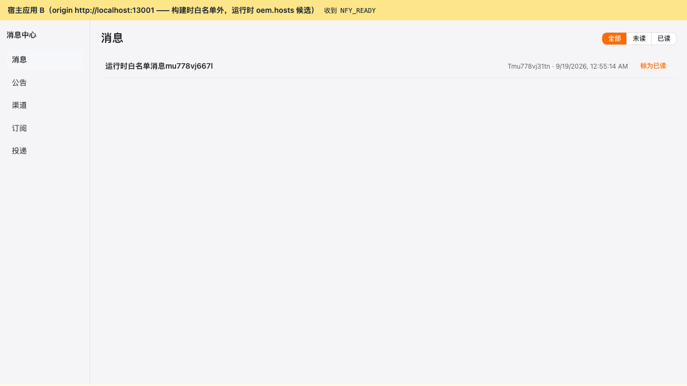
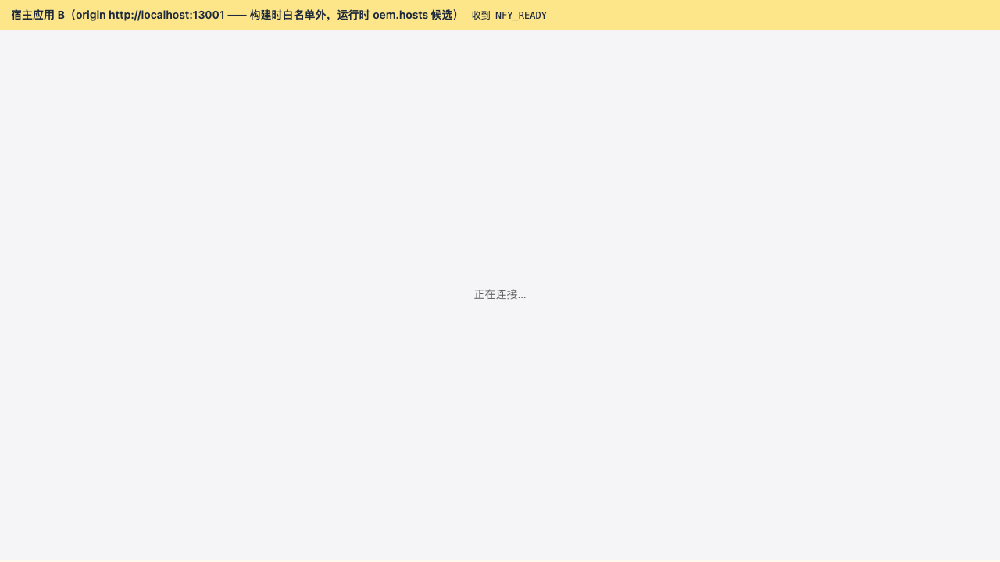
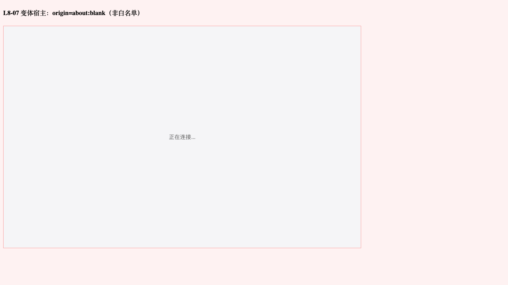
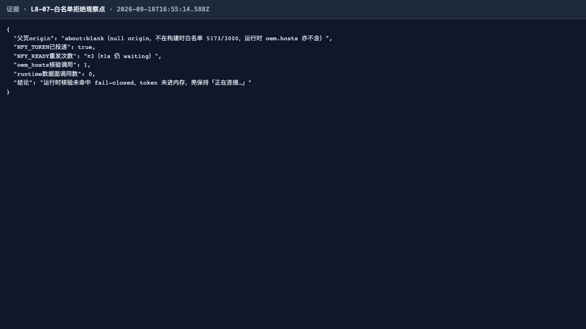
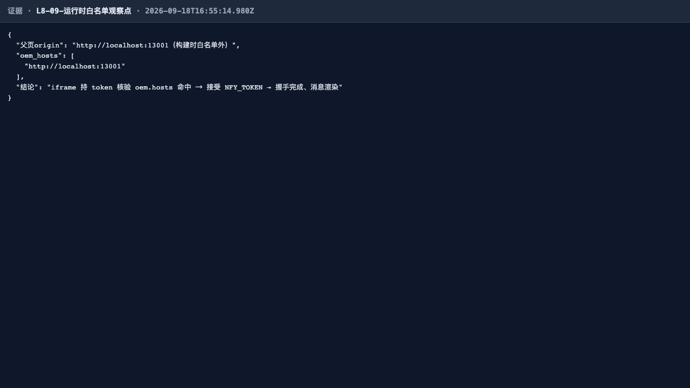
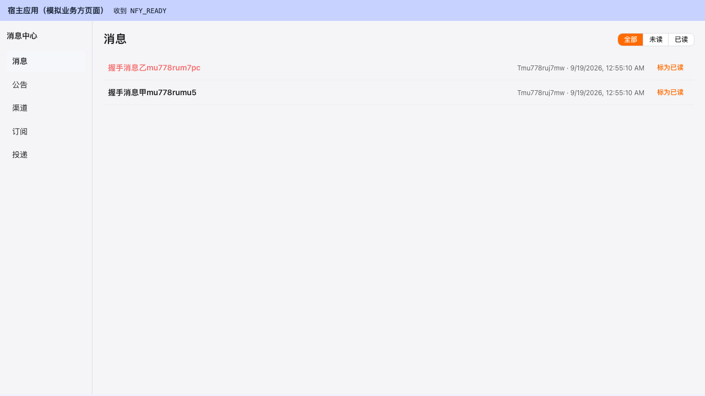
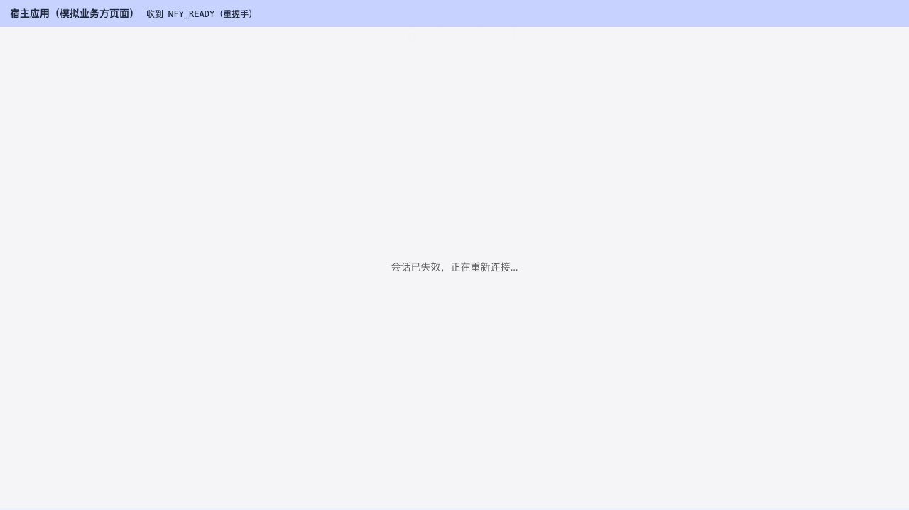

# notification4j 接入摩擦修复轮 · 统一测试报告（第 3 轮）

> 2026-09-19 · 基线 v1.2.2 + 本轮修复（GitHub issue #1/#2/#3 + framework4j v1.5.1→v1.7.1）· 四层全量验证
> **证据规约**：沿用第 2 轮口径——前端界面截图为证据主体，通过=关键图、失败=完整证据链；纯 API 面用渲染证据页并注明。报告位置：`docs/test/report/2026-09-19-01/`，截图全部嵌入文档。
> 上轮基线报告：[2026-09-18-01/统一测试报告.md](../2026-09-18-01/统一测试报告.md)（八线逐线报告沿用，本轮聚焦修复验证）。

## 一、执行摘要

| 层面 | 结论 |
|---|---|
| **E2E（Playwright 八线）** | ✅ **72/72 全绿**（L8 新增 2 用例：运行时白名单命中/未命中） |
| **IT 深回归（Testcontainers）** | ✅ **135/135 全绿**（30 套件；新增 `NfyRuntimeOemTest`×4、`NfyDataPlaneTakeoverTest`×2） |
| **starter 单元测试** | ✅ **411/411**（双 JaCoCo 门槛通过，合并口径行覆盖 **96.66%**，七包 100% 门槛保持） |
| **前端组件单测（vitest）** | ✅ **386/386**（+4 握手运行时白名单用例） |
| **缺陷** | 无新增 P0~P3；历史登记 P3×3 维持（未在本次范围） |

一句话：**3 个接入 issue 全部修复并在四层验证成立；framework4j v1.7.1 升级零适配通过；出厂等价实例单池实证（原生 Druid wrapper 0 / Hikari 0）。**

## 二、修复项验证（本轮重点）

### 2.1 issue #1 —— oem.hosts 白名单补实现（API-OEM-001 + 前端运行时并集）

| 验证点 | 层 | 证据 | 结果 |
|---|---|---|---|
| 端点契约：T 鉴权 / hosts 回显 / 空白项过滤 / 非数组 fail-closed / 租户隔离 / 未认证 102xx | IT | `NfyRuntimeOemTest` 4 用例 | ✅ 4/4 |
| 运行时白名单命中：构建时名单外 origin（13001）+ oem.hosts 含之 → 握手成功、消息渲染 | E2E | 下图 L8-09 | ✅ |
| 运行时白名单未命中：oem.hosts 不含父页 origin → 核验调用已发生、仍 fail-closed 拒绝 | E2E | 下图 L8-10 | ✅ |
| 构建时名单外 + oem.hosts 未配置（about:blank）→ 核验调用 ≥1、runtime 数据面调用 0、拒绝 | E2E | 下图 L8-07（口径升级：原「零 API 调用」改为「数据面零调用 + 白名单核验 ≥1」） | ✅ |
| 握手四路径单测：命中/未命中/失败 null/同 token 在途去重 | vitest | `useEmbedHandshake.test.ts` | ✅ 4/4 |

**L8-09 运行时白名单命中（构建时名单外父页经 oem.hosts 握手成功）**：

**L8-10 运行时白名单未命中（fail-closed 拒绝，核验调用已发生）**：

**L8-07 非白名单 origin 拒绝（核验调用 ≥1、数据面零调用、token 未进内存）**：

**L8-07 API 观察点证据页（oem_hosts 核验调用次数 / 数据面调用数）**：

**L8-09 API 观察点证据页（oem.hosts 下发与平台面配置一致）**：

### 2.2 issue #3 —— 数据面接管（NfyDataPlaneTakeoverFilter）

| 验证点 | 层 | 证据 | 结果 |
|---|---|---|---|
| 裸壳形态（零 spring.datasource.* / 零手工 exclude，纯 framework4j.datasource）可启动 | IT | `NfyDataPlaneTakeoverTest.TAKEOVER_原生装配退场_单池单工厂` | ✅ |
| 单池单工厂：DataSource bean 仅 `defaultDataSource`(Druid)；SqlSessionFactory 仅 `defaultSqlSessionFactory`；无 Hikari；MP 原生 `sqlSessionFactory` 不在场 | IT | 同上 | ✅ |
| 业务链路在 framework4j 池上全通（token 签发 → OEM-001 读） | IT | `TAKEOVER_业务链路在_framework4j_池上全通` | ✅ |
| 出厂等价实例（fat jar，app yml 已删 spring.datasource.* 与 exclude）启动：原生 Druid wrapper 0 / Hikari 0 / Multi-DataSource @Primary 注册 | E2E 全程 | 实例启动日志（`e2e-app.log` 三零口径） | ✅ |
| 既有 29 套件零扰动（redisson veto 激活下全绿） | IT | 本轮 135/135 | ✅ |

### 2.3 issue #2 —— ID 生成器兜底（NfyMybatisPlusSupportAutoConfiguration）

| 验证点 | 层 | 证据 | 结果 |
|---|---|---|---|
| TestApp 刻意不注册 IdentifierGenerator 时插入自动生成雪花 id | IT | `NfyRuntimeOemTest` @BeforeAll 探针断言 / `NfyDataPlaneTakeoverTest` 同款 | ✅ |
| app 壳 config 收编删除后独立部署全链正常 | E2E | 72 用例全绿（全部涉及主键写入） | ✅ |
| 机理澄清（写入报告）：MP 3.5.7 `MybatisSqlSessionFactoryBuilder` 自带 NetUtils 兜底 + framework4j-id `mpIdGenerator` 缺省启用——本 bean 为**确定性装配缝**（三重兜底），并非唯一生效路径 | 源码核对 | `mybatis-plus-core-3.5.7-sources` / framework4j-id v1.7.1 | 已记录（backend/README「ID 生成器兜底」） |

### 2.4 framework4j v1.5.1 → v1.7.1

| 验证点 | 结果 |
|---|---|
| 全量回归零适配通过（411 + 135 + 386 + 72） | ✅ |
| v1.6.0 accesstoken 启动期 fail-fast：现有 app/IT 配置（secretKey≥32、hashSalt、TENANT/PLATFORM policies）全部通过校验 | ✅（启动即证） |
| v1.6.0 web `DataAccessExceptionAdvice` 拆分与 v1.7.1 advice 排序修复：错误码契约无漂移（IT 错误码断言全绿） | ✅ |
| v1.7.0 token 自包含（embed-claims 缺省 true）：校验链路不变（信任源仍 Redis 会话 claims），E2E 全链无感 | ✅ |
| JitPack 对 v1.7.1 tag 的构建与解析（nfy 构建依赖经 JitPack 实拉验证） | ✅ |

### 2.5 握手与嵌入面回归（未受改动影响）

**L8-01 嵌入握手全链（构建时白名单内 3000，回归基线）**：

**L8-08 无效 token 会话失效重连（F-2 行为保持）**：

## 三、四层回归矩阵

| 层 | 规模 | 结果 | 说明 |
|---|---|---|---|
| starter 单元 | 411 | ✅ 411/411 | 双 JaCoCo 门槛：七包 100% + BUNDLE 96.66%（≥96%） |
| 集成回归（IT） | 30 套件 / 135 | ✅ 135/135 | L1 23 · L2 21 · L3 10 · L4 21 · L5 15 · L6 19（+2）· L7 9 · L8 17（+4） |
| 前端组件单测 | 386 | ✅ 386/386 | +4 运行时白名单握手用例 |
| E2E（八线） | 8 spec / 72 | ✅ 72/72 | L8 10（+2）；证据截图 108 张（`screenshots/`） |
| 出厂等价实例 | — | ✅ | 新 jar 单池启动；`/runtime/oem/hosts` 鉴权闸在位（未认证 10200） |

## 四、版本口径

- pom `1.0.0 → 1.3.0`：Maven 坐标与 tag 对齐（解决第 2 轮注册在案的 tag v1.2.2 vs pom 1.0.0 错位）。
- 产物名：`notification4j-app-1.3.0.jar`；JitPack 坐标：`com.github.funcommons.notification4j:notification4j-starter:v1.3.0`。

## 五、遗留登记（维持不变）

| 项 | 级别 | 状态 |
|---|---|---|
| 未读角标 0 不隐藏（Number() 归一） | P3 | 登记未修 |
| 订阅页恒选列渲染（`F-3/E-L4-02`，`:model-value="true"`） | P3 | 登记未修 |
| 投递页缺 next_retry_at 列 | P3 | 登记未修 |
| l1 spec 6 处 U+FFFD 坏字节（测试资产整洁度） | P3 | 登记未修 |
| L6-06 reset-secret 验收口径对齐 | P3 | 登记未修 |
| SMS 渠道（待有网环境） | 规划 | 未启动 |

## 六、执行环境

- 被测实例：`notification4j-app-1.3.0.jar`（出厂等价：framework4j.datasource.enabled=true、无 spring.datasource.*、无 spring.autoconfigure.exclude）+ PG16/Redis7 独立容器（25432/26379）+ 引擎提速参数（scan 500ms / backoff 2,5,10s）+ SMTP sink（localhost:3925）
- 宿主 harness：`http://localhost:3000/nfy-host.html`（构建时白名单内）+ `http://localhost:13001/nfy-host-alt.html`（构建时白名单外，运行时 oem.hosts 核验用）
- framework4j v1.7.1（JitPack 坐标实拉）；Testcontainers PG16+Redis7（IT）
